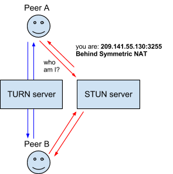

{{DefaultAPISidebar("WebRTC")}}

This article introduces the protocols on top of which the WebRTC API is built.

## ICE

[Interactive Connectivity Establishment (ICE)](https://en.wikipedia.org/wiki/Interactive_Connectivity_Establishment) is a framework to allow your web browser to connect with peers. There are many reasons why a straight up connection from Peer A to Peer B won't work. It needs to bypass firewalls that would prevent opening connections, give you a unique address if like most situations your device doesn't have a public IP address, and relay data through a server if your router doesn't allow you to directly connect with peers. ICE uses STUN and/or TURN servers to accomplish this, as described below.

## STUN

[Session Traversal Utilities for NAT (STUN)](https://en.wikipedia.org/wiki/STUN) is a protocol to discover your public address and determine any restrictions in your router that would prevent a direct connection with a peer.

The client will send a request to a STUN server on the Internet who will reply with the client's public address and whether or not the client is accessible behind the router's NAT.

## NAT

[Network Address Translation (NAT)](https://en.wikipedia.org/wiki/Network_address_translation) is used to give your device a public IP address. A router will have a public IP address and every device connected to the router will have a private IP address. Requests will be translated from the device's private IP to the router's public IP with a unique port. That way you don't need a unique public IP for each device but can still be discovered on the Internet.

Some routers will have restrictions on who can connect to devices on the network. This can mean that even though we have the public IP address found by the STUN server, not anyone can create a connection. In this situation we need to use TURN.

## TURN

Some routers using NAT employ a restriction called 'Symmetric NAT'. This means the router will only accept connections from peers you've previously connected to.

[Traversal Using Relays around NAT (TURN)](https://en.wikipedia.org/wiki/TURN) is meant to bypass the Symmetric NAT restriction by opening a connection with a TURN server and relaying all information through that server. You would create a connection with a TURN server and tell all peers to send packets to the server which will then be forwarded to you. This obviously comes with some overhead so it is only used if there are no other alternatives.

## SDP

[Session Description Protocol (SDP)](https://en.wikipedia.org/wiki/Session_Description_Protocol) is a standard for describing the multimedia content of the connection such as resolution, formats, codecs, encryption, etc. so that both peers can understand each other once the data is transferring. This is, in essence, the metadata describing the content and not the media content itself.

Technically, then, SDP is not truly a protocol, but a data format used to describe connection that shares media between devices.

Documenting SDP is well outside the scope of this documentation; however, there are a few things worth noting here.

### Structure

SDP consists of one or more lines of UTF-8 text, each beginning with a one-character type, followed by an equals sign (`"="`), followed by structured text comprising a value or description, whose format depends on the type. The lines of text that begin with a given letter are generally referred to as "_letter_-lines". For example, lines providing media descriptions have the type `"m"`, so those lines are referred to as "m-lines."

### For more information

To learn more about SDP, see the following useful resources:

- Specification: {{RFC(8866, "SDP: Session Description Protocol")}}
- [IANA registry of SDP parameters](https://www.iana.org/assignments/sip-parameters/sip-parameters.xhtml)

## Multi-party video conferencing

In WebRTC peer-to-peer networks, peers negotiate appropriate video codecs/stream based on device capabilities and network bandwidth.
Each sender then sends ("singlecasts") a single stream containing video information to its peer counterpart.

Video conferencing between multiple parties is more complex because the peers may have different capabilities and network conditions: one particular video stream resolution, rate, and quality, may not suit all recipients, and at the same time it is not efficient or scalable for a sender to generate and send multiple streams to many recipients.

The most common approach to address these issues is to use an intermediary server known as a _Selective Forwarding Unit_ (SFU) or _Selective Forwarding Middlebox_ (SFM).
Senders output video encoded such that the SFM can selectively forward an appropriate video stream for each recipient.
There are two main technologies used by WebRTC for encoding video in this case: simulcast and scalable video coding.

### Simulcast

_Simulcast_ sends multiple simultaneous versions of the same source with different resolutions and bitrates in separate streams.
The SFM forwards the most suitable stream to each recipient based on their network conditions and device capabilities.

The SFM relies on the ability to determine frame dependency relationships, such as between a chain of interframes back to the last keyframe, in order to forward packets and switch simulcast layers without a receiver noticing.

VP8 and VP9 codecs can include frame dependency information in the VP8 payload descriptor and VP9 payload descriptor, respectively.
For the AV1 codec the information is sent in the [Dependency Descriptor (DD) RTP Header Extension](#dependency_descriptor_rtp_header_extension).

Recent browser implementations commonly use the DD header for all codecs, as it is codec-agnostic, which can simplify the SFM implementation.
In addition, because it is a part of the RTP header rather than the payload, it can be used in end-to-end encryption scenarios.

### Scalable video coding

[Scalable Video Coding (SVC)](https://w3c.github.io/webrtc-svc/) encodes a video source in a single stream, with multiple layers that can be selectively decoded to obtain video with particular resolutions, bitrate, or quality.
An SFM can forward a subset of the layers in order to send a stream that is appropriate for each recipient's network and device.

Note that the dependencies are much more complicated than needed to for selecting streams to forward when using simulcast (see the [dependency diagrams](https://w3c.github.io/webrtc-svc/#dependencydiagrams*) in the SVC specification for a "flavor" of the complexity).
The SVC stream consists of a base layer that provides a minimum level of quality, and may include a number of enhancement layers that allow varying frame rates ("temporal scalability"), increased resolution ("spatial scalability"), and the same resolution at different bitrates.
The VP8 codec only supports temporal layers, while VP9 supports both temporal and spatial layers.

VP8 and VP9 codecs can include frame dependency information in the VP8 payload descriptor and VP9 payload descriptor, respectively.
For the AV1 codec the information is sent in the [Dependency Descriptor (DD) RTP Header Extension](#dependency_descriptor_rtp_header_extension).

As for simulcast, recent browser implementations commonly use the DD header for all codecs that support SVC, in order to simply the SFM implementation, and because it supports end-to-end encryption scenarios.

Chrome 111 and later supports SVC.
Firefox does not support SVC at the time of writing (around FF136).

### Dependency Descriptor RTP Header Extension

The [Dependency Descriptor (DD) RTP Header Extension](https://aomediacodec.github.io/av1-rtp-spec/#43-dependency-descriptor-rtp-header-extension), defined in the specification _RTP Payload Format For AV1 (v1.0)_, provides a codec-agnostic, flexible, efficient, and extensible way to describe the relationships between frames in a multi-layered video stream.

These can be used by an SFM to select and forward packets associated with the layers intended for a recipient.
As the header is a true extension it is not part of the payload, and hence is still available to the SFM in end-to-end encryption (E2EE) scenarios.

Chrome and Firefox (136+) support the DD header.

### Codecs supported by WebRTC

This information is provided in [Codecs used by WebRTC](/en-US/docs/Web/Media/Guides/Formats/WebRTC_codecs)
