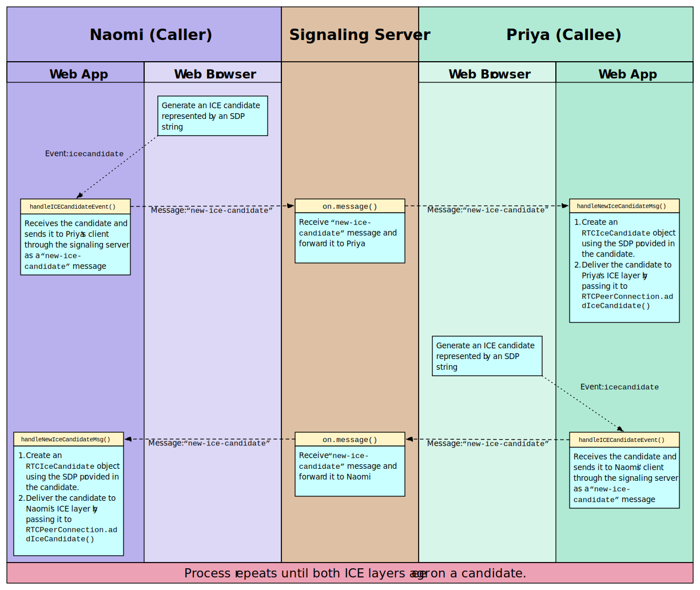

{{WebRTCSidebar}}

[WebRTC](/en-US/docs/Web/API/WebRTC_API) allows real-time, peer-to-peer, media exchange between two devices. A connection is established through a discovery and negotiation process called **signaling**. This tutorial will guide you through building a two-way video-call.

[WebRTC](/en-US/docs/Web/API/WebRTC_API) is a fully peer-to-peer technology for the real-time exchange of audio, video, and data, with one central caveat. A form of discovery and media format negotiation must take place, [as discussed elsewhere](/en-US/docs/Web/API/WebRTC_API/Session_lifetime#establishing_a_connection), in order for two devices on different networks to locate one another. This process is called **signaling** and involves both devices connecting to a third, mutually agreed-upon server. Through this third server, the two devices can locate one another, and exchange negotiation messages.

In this article, we will further enhance the [WebSocket chat](https://webrtc-from-chat.glitch.me/) first created as part of our WebSocket documentation (this article link is forthcoming; it isn't actually online yet) to support opening a two-way video call between users. You can [try out this example on Glitch](https://webrtc-from-chat.glitch.me/), and you can [remix the example](https://glitch.com/edit/#!/remix/webrtc-from-chat) to experiment with it as well. You can also [look at the full project](https://github.com/mdn/samples-server/tree/master/s/webrtc-from-chat) on GitHub.

> **Note:** If you try out the example on Glitch, please note that any changes made to the code will immediately reset any connections. In addition, there is a short timeout period; the Glitch instance is for quick experiments and testing only.

## The signaling server

Establishing a WebRTC connection between two devices requires the use of a **signaling server** to resolve how to connect them over the internet. A signaling server's job is to serve as an intermediary to let two peers find and establish a connection while minimizing exposure of potentially private information as much as possible. How do we create this server and how does the signaling process actually work?

First we need the signaling server itself. WebRTC doesn't specify a transport mechanism for the signaling information. You can use anything you like, from [WebSocket](/en-US/docs/Web/API/WebSockets_API) to {{domxref("XMLHttpRequest")}} to carrier pigeons to exchange the signaling information between the two peers.

It's important to note that the server doesn't need to understand or interpret the signaling data content. Although it's {{Glossary("SDP")}}, even this doesn't matter so much: the content of the message going through the signaling server is, in effect, a black box. What does matter is when the {{Glossary("ICE")}} subsystem instructs you to send signaling data to the other peer, you do so, and the other peer knows how to receive this information and deliver it to its own ICE subsystem. All you have to do is channel the information back and forth. The contents don't matter at all to the signaling server.

### Readying the chat server for signaling

Our [chat server](https://github.com/mdn/samples-server/tree/master/s/websocket-chat) uses the [WebSocket API](/en-US/docs/Web/API/WebSockets_API) to send information as {{Glossary("JSON")}} strings between each client and the server. The server supports several message types to handle tasks, such as registering new users, setting usernames, and sending public chat messages.

To allow the server to support signaling and ICE negotiation, we need to update the code. We'll have to allow directing messages to one specific user instead of broadcasting to all connected users, and ensure unrecognized message types are passed through and delivered, without the server needing to know what they are. This lets us send signaling messages using this same server, instead of needing a separate server.

Let's take a look at changes we need to make to the chat server to support WebRTC signaling. This is in the file [`chatserver.js`](https://github.com/mdn/samples-server/blob/master/s/webrtc-from-chat/chatserver.js).

First up is the addition of the function `sendToOneUser()`. As the name suggests, this sends a stringified JSON message to a particular username.

```js
function sendToOneUser(target, msgString) {
  connectionArray.find((conn) => conn.username === target).send(msgString);
}
```

This function iterates over the list of connected users until it finds one matching the specified username, then sends the message to that user. The parameter `msgString` is a stringified JSON object. We could have made it receive our original message object, but in this example it's more efficient this way. Since the message has already been stringified, we can send it with no further processing. Each entry in `connectionArray` is a {{domxref("WebSocket")}} object, so we can just call its {{domxref("WebSocket.send", "send()")}} method directly.

Our original chat demo didn't support sending messages to a specific user. The next task is to update the main WebSocket message handler to support doing so. This involves a change near the end of the `"connection"` message handler:

```js
if (sendToClients) {
  const msgString = JSON.stringify(msg);

  if (msg.target && msg.target.length !== 0) {
    sendToOneUser(msg.target, msgString);
  } else {
    for (const connection of connectionArray) {
      connection.send(msgString);
    }
  }
}
```

This code now looks at the pending message to see if it has a `target` property. If that property is present, it specifies the username of the client to which the message is to be sent, and we call `sendToOneUser()` to send the message to them. Otherwise, the message is broadcast to all users by iterating over the connection list, sending the message to each user.

As the existing code allows the sending of arbitrary message types, no additional changes are required. Our clients can now send messages of unknown types to any specific user, letting them send signaling messages back and forth as desired.

That's all we need to change on the server side of the equation. Now let's consider the signaling protocol we will implement.

### Designing the signaling protocol

Now that we've built a mechanism for exchanging messages, we need a protocol defining how those messages will look. This can be done in a number of ways; what's demonstrated here is just one possible way to structure signaling messages.

This example's server uses stringified JSON objects to communicate with its clients. This means our signaling messages will be in JSON format, with contents which specify what kind of messages they are as well as any additional information needed in order to handle the messages properly.

#### Exchanging session descriptions

When starting the signaling process, an **offer** is created by the user initiating the call. This offer includes a session description, in {{Glossary("SDP")}} format, and needs to be delivered to the receiving user, which we'll call the **callee**. The callee responds to the offer with an **answer** message, also containing an SDP description. Our signaling server will use WebSocket to transmit offer messages with the type `"video-offer"`, and answer messages with the type `"video-answer"`. These messages have the following fields:

- `type`
  - : The message type; either `"video-offer"` or `"video-answer"`.
- `name`
  - : The sender's username.
- `target`
  - : The username of the person to receive the description (if the caller is sending the message, this specifies the callee, and vice-versa).
- `sdp`
  - : The SDP (Session Description Protocol) string describing the local end of the connection from the perspective of the sender (or the remote end of the connection from the receiver's point of view).

At this point, the two participants know which [codecs](/en-US/docs/Web/Media/Formats/WebRTC_codecs) and [codec parameters](/en-US/docs/Web/Media/Formats/codecs_parameter) are to be used for this call. They still don't know how to transmit the media data itself though. This is where {{Glossary('ICE', 'Interactive Connectivity Establishment (ICE)')}} comes in.

### Exchanging ICE candidates

Two peers need to exchange ICE candidates to negotiate the actual connection between them. Every ICE candidate describes a method that the sending peer is able to use to communicate. Each peer sends candidates in the order they're discovered, and keeps sending candidates until it runs out of suggestions, even if media has already started streaming.

An {{domxref("RTCPeerConnection.icecandidate_event", "icecandidate")}} event is sent to the {{domxref("RTCPeerConnection")}} to complete the process of adding a local description using `pc.setLocalDescription(offer)`.

Once the two peers agree upon a mutually-compatible candidate, that candidate's SDP is used by each peer to construct and open a connection, through which media then begins to flow. If they later agree on a better (usually higher-performance) candidate, the stream may change formats as needed.

Though not currently supported, a candidate received after media is already flowing could theoretically also be used to downgrade to a lower-bandwidth connection if needed.

Each ICE candidate is sent to the other peer by sending a JSON message of type `"new-ice-candidate"` over the signaling server to the remote peer. Each candidate message include these fields:

- `type`
  - : The message type: `"new-ice-candidate"`.
- `target`
  - : The username of the person with whom negotiation is underway; the server will direct the message to this user only.
- `candidate`
  - : The SDP candidate string, describing the proposed connection method. You typically don't need to look at the contents of this string. All your code needs to do is route it through to the remote peer using the signaling server.

Each ICE message suggests a communication protocol (TCP or UDP), IP address, port number, connection type (for example, whether the specified IP is the peer itself or a relay server), along with other information needed to link the two computers together. This includes NAT or other networking complexity.

> **Note:** The important thing to note is this: the only thing your code is responsible for during ICE negotiation is accepting outgoing candidates from the ICE layer and sending them across the signaling connection to the other peer when your {{domxref("RTCPeerConnection.icecandidate_event", "onicecandidate")}} handler is executed, and receiving ICE candidate messages from the signaling server (when the `"new-ice-candidate"` message is received) and delivering them to your ICE layer by calling {{domxref("RTCPeerConnection.addIceCandidate()")}}. That's it.
>
> The contents of the SDP are irrelevant to you in essentially all cases. Avoid the temptation to try to make it more complicated than that until you really know what you're doing. That way lies madness.

All your signaling server now needs to do is send the messages it's asked to. Your workflow may also demand login/authentication functionality, but such details will vary.

> **Note:** The {{domxref("RTCPeerConnection.icecandidate_event", "onicecandidate")}} Event and {{domxref("RTCPeerConnection.createAnswer", "createAnswer()")}} Promise are both async calls which are handled separately. Be sure that your signaling does not change order! For example {{domxref("RTCPeerConnection.addIceCandidate", "addIceCandidate()")}} with the server's ice candidates must be called after setting the answer with {{domxref("RTCPeerConnection.setRemoteDescription", "setRemoteDescription()")}}.

### Signaling transaction flow

The signaling process involves this exchange of messages between two peers using an intermediary, the signaling server. The exact process will vary, of course, but in general there are a few key points at which signaling messages get handled:

The signaling process involves this exchange of messages among a number of points:

- Each user's client running within a web browser
- Each user's web browser
- The signaling server
- The web server hosting the chat service

Imagine that Naomi and Priya are engaged in a discussion using the chat software, and Naomi decides to open a video call between the two. Here's the expected sequence of events:

[](/en-US/docs/Web/API/WebRTC_API/Signaling_and_video_calling/webrtc_-_signaling_diagram.svg)

We'll see this detailed more over the course of this article.

### ICE candidate exchange process

When each peer's ICE layer begins to send candidates, it enters into an exchange among the various points in the chain that looks like this:

[](webrtc_-_ice_candidate_exchange.svg)

Each side sends candidates to the other as it receives them from their local ICE layer; there is no taking turns or batching of candidates. As soon as the two peers agree upon one candidate that they can both use to exchange the media, media begins to flow. Each peer continues to send candidates until it runs out of options, even after the media has already begun to flow. This is done in hopes of identifying even better options than the one initially selected.

If conditions change (for example, the network connection deteriorates), one or both peers might suggest switching to a lower-bandwidth media resolution, or to an alternative codec. That triggers a new exchange of candidates, after which another media format and/or codec change may take place. In the guide [Codecs used by WebRTC](/en-US/docs/Web/Media/Formats/WebRTC_codecs) you can learn more about the codecs which WebRTC requires browsers to support, which additional codecs are supported by which browsers, and how to choose the best codecs to use.

Optionally, see {{RFC(8445, "Interactive Connectivity Establishment")}}, [section 2.3 ("Negotiating Candidate Pairs and Concluding ICE")](https://datatracker.ietf.org/doc/html/rfc5245#section-2.3) if you want greater understanding of how this process is completed inside the ICE layer. You should note that candidates are exchanged and media starts to flow as soon as the ICE layer is satisfied. This is all taken care of behind the scenes. Our role is to send the candidates, back and forth, through the signaling server.

## The client application

The core to any signaling process is its message handling. It's not necessary to use WebSockets for signaling, but it is a common solution. You should, of course, select a mechanism for exchanging signaling information that is appropriate for your application.

Let's update the chat client to support video calling.

### Updating the HTML

The HTML for our client needs a location for video to be presented. This requires video elements, and a button to hang up the call:

```html
<div class="flexChild" id="camera-container">
  <div class="camera-box">
    <video id="received_video" autoplay></video>
    <video id="local_video" autoplay muted></video>
    <button id="hangup-button" onclick="hangUpCall();" disabled>
      Hang Up
    </button>
  </div>
</div>
```

The page structure defined here is using {{HTMLElement("div")}} elements, giving us full control over the page layout by enabling the use of CSS. We'll skip layout detail in this guide, but [take a look at the CSS](https://github.com/mdn/samples-server/blob/master/s/webrtc-from-chat/chat.css) on GitHub to see how we handled it. Take note of the two {{HTMLElement("video")}} elements, one for your self-view, one for the connection, and the {{HTMLElement("button")}} element.

The `<video>` element with the `id` "`received_video`" will present video received from the connected user. We specify the `autoplay` attribute, ensuring once the video starts arriving, it immediately plays. This removes any need to explicitly handle playback in our code. The "`local_video`" `<video>` element presents a preview of the user's camera; specifying the `muted` attribute, as we don't need to hear local audio in this preview panel.

Finally, the "`hangup-button`" {{HTMLElement("button")}}, to disconnect from a call, is defined and configured to start disabled (setting this as our default for when no call is connected) and apply the function `hangUpCall()` on click. This function's role is to close the call, and send a signalling server notification to the other peer, requesting it also close.

### The JavaScript code

We'll divide this code into functional areas to more easily describe how it works. The main body of this code is found in the `connect()` function: it opens up a {{domxref("WebSocket")}} server on port 6503, and establishes a handler to receive messages in JSON object format. This code generally handles text chat messages as it did previously.

#### Sending messages to the signaling server

Throughout our code, we call `sendToServer()` in order to send messages to the signaling server. This function uses the [WebSocket](/en-US/docs/Web/API/WebSockets_API) connection to do its work:

```js
function sendToServer(msg) {
  const msgJSON = JSON.stringify(msg);

  connection.send(msgJSON);
}
```

The message object passed into this function is converted into a JSON string by calling {{jsxref("JSON.stringify()")}}, then we call the WebSocket connection's {{domxref("WebSocket.send", "send()")}} function to transmit the message to the server.

#### UI to start a call

The code which handles the `"userlist"` message calls `handleUserlistMsg()`. Here we set up the handler for each connected user in the user list displayed to the left of the chat panel. This function receives a message object whose `users` property is an array of strings specifying the user names of every connected user.

```js
function handleUserlistMsg(msg) {
  const listElem = document.querySelector(".userlistbox");

  while (listElem.firstChild) {
    listElem.removeChild(listElem.firstChild);
  }

  msg.users.forEach((username) => {
    const item = document.createElement("li");
    item.appendChild(document.createTextNode(username));
    item.addEventListener("click", invite, false);

    listElem.appendChild(item);
  });
}
```

After getting a reference to the {{HTMLElement("ul")}} which contains the list of user names into the variable `listElem`, we empty the list by removing each of its child elements.

> **Note:** Obviously, it would be more efficient to update the list by adding and removing individual users instead of rebuilding the whole list every time it changes, but this is good enough for the purposes of this example.

Then we iterate over the array of user names using {{jsxref("Array.forEach", "forEach()")}}. For each name, we create a new {{HTMLElement("li")}} element, then create a new text node containing the user name using {{domxref("Document.createTextNode", "createTextNode()")}}. That text node is added as a child of the `<li>` element. Next, we set a handler for the {{domxref("Element/click_event", "click")}} event on the list item, that clicking on a user name calls our `invite()` method, which we'll look at in the next section.

Finally, we append the new item to the `<ul>` that contains all of the user names.

#### Starting a call

When the user clicks on a username they want to call, the `invite()` function is invoked as the event handler for that {{domxref("Element/click_event", "click")}} event:

```js
const mediaConstraints = {
  audio: true, // We want an audio track
  video: true // And we want a video track
};

function invite(evt) {
  if (myPeerConnection) {
    alert("You can't start a call because you already have one open!");
  } else {
    const clickedUsername = evt.target.textContent;

    if (clickedUsername === myUsername) {
      alert("I'm afraid I can't let you talk to yourself. That would be weird.");
      return;
    }

    targetUsername = clickedUsername;
    createPeerConnection();

    navigator.mediaDevices.getUserMedia(mediaConstraints)
      .then((localStream) => {
        document.getElementById("local_video").srcObject = localStream;
        localStream.getTracks().forEach((track) => myPeerConnection.addTrack(track, localStream));
      })
      .catch(handleGetUserMediaError);
  }
}
```

This begins with a basic sanity check: is the user already connected? If there's already a {{domxref("RTCPeerConnection")}}, they obviously can't make a call. Then the name of the user that was clicked upon is obtained from the event target's {{domxref("Node.textContent", "textContent")}} property, and we check to be sure that it's not the same user that's trying to start the call.

Then we copy the name of the user we're calling into the variable `targetUsername` and call `createPeerConnection()`, a function which will create and do basic configuration of the {{domxref("RTCPeerConnection")}}.

Once the `RTCPeerConnection` has been created, we request access to the user's camera and microphone by calling {{domxref("MediaDevices.getUserMedia()")}}, which is exposed to us through the {{domxref("MediaDevices.getUserMedia")}} property. When this succeeds, fulfilling the returned promise, our `then` handler is executed. It receives, as input, a {{domxref("MediaStream")}} object representing the stream with audio from the user's microphone and video from their webcam.

> **Note:** We could restrict the set of permitted media inputs to a specific device or set of devices by calling {{domxref("MediaDevices.enumerateDevices", "navigator.mediaDevices.enumerateDevices()")}} to get a list of devices, filtering the resulting list based on our desired criteria, then using the selected devices' {{domxref("MediaTrackConstraints.deviceId", "deviceId")}} values in the `deviceId` field of the `mediaConstraints` object passed into `getUserMedia()`. In practice, this is rarely if ever necessary, since most of that work is done for you by `getUserMedia()`.

We attach the incoming stream to the local preview {{HTMLElement("video")}} element by setting the element's {{domxref("HTMLMediaElement.srcObject", "srcObject")}} property. Since the element is configured to automatically play incoming video, the stream begins playing in our local preview box.

We then iterate over the tracks in the stream, calling {{domxref("RTCPeerConnection.addTrack", "addTrack()")}} to add each track to the `RTCPeerConnection`. Even though the connection is not fully established yet, you can begin sending data when you feel it's appropriate to do so. Media received before the ICE negotiation is completed may be used to help ICE decide upon the best connectivity approach to take, thus aiding in the negotiation process.

Note that for native apps, such as a phone application, you should not begin sending until the connection has been accepted at both ends, at a minimum, to avoid inadvertently sending video and/or audio data when the user isn't prepared for it.

As soon as media is attached to the `RTCPeerConnection`, a {{domxref("RTCPeerConnection.negotiationneeded_event", "negotiationneeded")}} event is triggered at the connection, so that ICE negotiation can be started.

If an error occurs while trying to get the local media stream, our catch clause calls `handleGetUserMediaError()`, which displays an appropriate error to the user as required.

#### Handling getUserMedia() errors

If the promise returned by `getUserMedia()` concludes in a failure, our `handleGetUserMediaError()` function performs.

```js
function handleGetUserMediaError(e) {
  switch(e.name) {
    case "NotFoundError":
      alert("Unable to open your call because no camera and/or microphone" +
            "were found.");
      break;
    case "SecurityError":
    case "PermissionDeniedError":
      // Do nothing; this is the same as the user canceling the call.
      break;
    default:
      alert(`Error opening your camera and/or microphone: ${e.message}`);
      break;
  }

  closeVideoCall();
}
```

An error message is displayed in all cases but one. In this example, we ignore `"SecurityError"` and `"PermissionDeniedError"` results, treating refusal to grant permission to use the media hardware the same as the user canceling the call.

Regardless of why an attempt to get the stream fails, we call our `closeVideoCall()` function to shut down the {{domxref("RTCPeerConnection")}}, and release any resources already allocated by the process of attempting the call. This code is designed to safely handle partially-started calls.

#### Creating the peer connection

The `createPeerConnection()` function is used by both the caller and the callee to construct their {{domxref("RTCPeerConnection")}} objects, their respective ends of the WebRTC connection. It's invoked by `invite()` when the caller tries to start a call, and by `handleVideoOfferMsg()` when the callee receives an offer message from the caller.

```js
function createPeerConnection() {
  myPeerConnection = new RTCPeerConnection({
      iceServers: [     // Information about ICE servers - Use your own!
        {
          urls: "stun:stun.stunprotocol.org"
        }
      ]
  });

  myPeerConnection.onicecandidate = handleICECandidateEvent;
  myPeerConnection.ontrack = handleTrackEvent;
  myPeerConnection.onnegotiationneeded = handleNegotiationNeededEvent;
  myPeerConnection.onremovetrack = handleRemoveTrackEvent;
  myPeerConnection.oniceconnectionstatechange = handleICEConnectionStateChangeEvent;
  myPeerConnection.onicegatheringstatechange = handleICEGatheringStateChangeEvent;
  myPeerConnection.onsignalingstatechange = handleSignalingStateChangeEvent;
}
```

When using the {{domxref("RTCPeerConnection.RTCPeerConnection", "RTCPeerConnection()")}} constructor, we will specify an object providing configuration parameters for the connection. We use only one of these in this example: `iceServers`. This is an array of objects describing STUN and/or TURN servers for the {{Glossary("ICE")}} layer to use when attempting to establish a route between the caller and the callee. These servers are used to determine the best route and protocols to use when communicating between the peers, even if they're behind a firewall or using {{Glossary("NAT")}}.

> **Note:** You should always use STUN/TURN servers which you own, or which you have specific authorization to use. This example is using a known public STUN server but abusing these is bad form.

Each object in `iceServers` contains at least a `urls` field providing URLs at which the specified server can be reached. It may also provide `username` and `credential` values to allow authentication to take place, if needed.

After creating the {{domxref("RTCPeerConnection")}}, we set up handlers for the events that matter to us.

The first three of these event handlers are required; you have to handle them to do anything involving streamed media with WebRTC. The rest aren't strictly required but can be useful, and we'll explore them. There are a few other events available that we're not using in this example, as well. Here's a summary of each of the event handlers we will be implementing:

- {{domxref("RTCPeerConnection.icecandidate_event", "onicecandidate")}}
  - : The local ICE layer calls your {{domxref("RTCPeerConnection.icecandidate_event", "icecandidate")}} event handler, when it needs you to transmit an ICE candidate to the other peer, through your signaling server. See [Sending ICE candidates](#sending_ice_candidates) for more information and to see the code for this example.
- {{domxref("RTCPeerConnection.track_event", "ontrack")}}
  - : This handler for the {{domxref("RTCPeerConnection.track_event", "track")}} event is called by the local WebRTC layer when a track is added to the connection. This lets you connect the incoming media to an element to display it, for example. See [Receiving new streams](#receiving_new_streams) for details.
- {{domxref("RTCPeerConnection.negotiationneeded_event", "onnegotiationneeded")}}
  - : This function is called whenever the WebRTC infrastructure needs you to start the session negotiation process anew. Its job is to create and send an offer, to the callee, asking it to connect with us. See [Starting negotiation](#starting_negotiation) to see how we handle this.
- {{domxref("RTCPeerConnection.removetrack_event", "onremovetrack")}}
  - : This counterpart to `ontrack` is called to handle the {{domxref("MediaStream/removetrack_event", "removetrack")}} event; it's sent to the `RTCPeerConnection` when the remote peer removes a track from the media being sent. See [Handling the removal of tracks](#handling_the_removal_of_tracks).
- {{domxref("RTCPeerConnection.iceconnectionstatechange_event", "oniceconnectionstatechange")}}
  - : The {{domxref("RTCPeerConnection.iceconnectionstatechange_event", "iceconnectionstatechange")}} event is sent by the ICE layer to let you know about changes to the state of the ICE connection. This can help you know when the connection has failed, or been lost. We'll look at the code for this example in [ICE connection state](#ice_connection_state) below.
- {{domxref("RTCPeerConnection.icegatheringstatechange_event", "onicegatheringstatechange")}}
  - : The ICE layer sends you the {{domxref("RTCPeerConnection.icegatheringstatechange_event", "icegatheringstatechange")}} event, when the ICE agent's process of collecting candidates shifts, from one state to another (such as starting to gather candidates or completing negotiation). See [ICE gathering state](#ice_gathering_state) below.
- {{domxref("RTCPeerConnection.signalingstatechange_event", "onsignalingstatechange")}}
  - : The WebRTC infrastructure sends you the {{domxref("RTCPeerConnection.signalingstatechange_event", "signalingstatechange")}} message when the state of the signaling process changes (or if the connection to the signaling server changes). See [Signaling state](#signaling_state) to see our code.

#### Starting negotiation

Once the caller has created its {{domxref("RTCPeerConnection")}}, created a media stream, and added its tracks to the connection as shown in [Starting a call](#starting_a_call), the browser will deliver a {{domxref("RTCPeerConnection.negotiationneeded_event", "negotiationneeded")}} event to the {{domxref("RTCPeerConnection")}} to indicate that it's ready to begin negotiation with the other peer. Here's our code for handling the {{domxref("RTCPeerConnection.negotiationneeded_event", "negotiationneeded")}} event:

```js
function handleNegotiationNeededEvent() {
  myPeerConnection.createOffer()
    .then((offer) => myPeerConnection.setLocalDescription(offer))
    .then(() => {
      sendToServer({
        name: myUsername,
        target: targetUsername,
        type: "video-offer",
        sdp: myPeerConnection.localDescription
      });
    })
    .catch(reportError);
}
```

To start the negotiation process, we need to create and send an SDP offer to the peer we want to connect to. This offer includes a list of supported configurations for the connection, including information about the media stream we've added to the connection locally (that is, the video we want to send to the other end of the call), and any ICE candidates gathered by the ICE layer already. We create this offer by calling {{domxref("RTCPeerConnection.createOffer", "myPeerConnection.createOffer()")}}.

When `createOffer()` succeeds (fulfilling the promise), we pass the created offer information into {{domxref("RTCPeerConnection.setLocalDescription", "myPeerConnection.setLocalDescription()")}}, which configures the connection and media configuration state for the caller's end of the connection.

> **Note:** Technically speaking, the string returned by `createOffer()` is an {{RFC(3264)}} offer.

We know the description is valid, and has been set, when the promise returned by `setLocalDescription()` is fulfilled. This is when we send our offer to the other peer by creating a new `"video-offer"` message containing the local description (now the same as the offer), then sending it through our signaling server to the callee. The offer has the following members:

- `type`
  - : The message type: `"video-offer"`.
- `name`
  - : The caller's username.
- `target`
  - : The name of the user we wish to call.
- `sdp`
  - : The SDP string describing the offer.

If an error occurs, either in the initial `createOffer()` or in any of the fulfillment handlers that follow, an error is reported by invoking our `reportError()` function.

Once `setLocalDescription()`'s fulfillment handler has run, the ICE agent begins sending {{domxref("RTCPeerConnection.icecandidate_event", "icecandidate")}} events to the {{domxref("RTCPeerConnection")}}, one for each potential configuration it discovers. Our handler for the `icecandidate` event is responsible for transmitting the candidates to the other peer.

#### Session negotiation

Now that we've started negotiation with the other peer and have transmitted an offer, let's look at what happens on the callee's side of the connection for a while. The callee receives the offer and calls `handleVideoOfferMsg()` function to process it. Let's see how the callee handles the `"video-offer"` message.

##### Handling the invitation

When the offer arrives, the callee's `handleVideoOfferMsg()` function is called with the `"video-offer"` message that was received. This function needs to do two things. First, it needs to create its own {{domxref("RTCPeerConnection")}} and add the tracks containing the audio and video from its microphone and webcam to that. Second, it needs to process the received offer, constructing and sending its answer.

```js
function handleVideoOfferMsg(msg) {
  let localStream = null;

  targetUsername = msg.name;
  createPeerConnection();

  const desc = new RTCSessionDescription(msg.sdp);

  myPeerConnection.setRemoteDescription(desc)
    .then(() => navigator.mediaDevices.getUserMedia(mediaConstraints))
    .then((stream) => {
      localStream = stream;
      document.getElementById("local_video").srcObject = localStream;

      localStream.getTracks().forEach((track) => myPeerConnection.addTrack(track, localStream));
    })
    .then(() => myPeerConnection.createAnswer())
    .then((answer) => myPeerConnection.setLocalDescription(answer))
    .then(() => {
      const msg = {
        name: myUsername,
        target: targetUsername,
        type: "video-answer",
        sdp: myPeerConnection.localDescription
      };

      sendToServer(msg);
    })
    .catch(handleGetUserMediaError);
}
```

This code is very similar to what we did in the `invite()` function back in [Starting a call](#starting_a_call). It starts by creating and configuring an {{domxref("RTCPeerConnection")}} using our `createPeerConnection()` function. Then it takes the SDP offer from the received `"video-offer"` message and uses it to create a new {{domxref("RTCSessionDescription")}} object representing the caller's session description.

That session description is then passed into {{domxref("RTCPeerConnection.setRemoteDescription", "myPeerConnection.setRemoteDescription()")}}. This establishes the received offer as the description of the remote (caller's) end of the connection. If this is successful, the promise fulfillment handler (in the `then()` clause) starts the process of getting access to the callee's camera and microphone using {{domxref("MediaDevices.getUserMedia", "getUserMedia()")}}, adding the tracks to the connection, and so forth, as we saw previously in `invite()`.

Once the answer has been created using {{domxref("RTCPeerConnection.createAnswer", "myPeerConnection.createAnswer()")}}, the description of the local end of the connection is set to the answer's SDP by calling {{domxref("RTCPeerConnection.setLocalDescription", "myPeerConnection.setLocalDescription()")}}, then the answer is transmitted through the signaling server to the caller to let them know what the answer is.

Any errors are caught and passed to `handleGetUserMediaError()`, described in [Handling getUserMedia() errors](#handling_getusermedia_errors).

> **Note:** As is the case with the caller, once the `setLocalDescription()` fulfillment handler has run, the browser begins firing {{domxref("RTCPeerConnection.icecandidate_event", "icecandidate")}} events that the callee must handle, one for each candidate that needs to be transmitted to the remote peer.

##### Sending ICE candidates

The ICE negotiation process involves each peer sending candidates to the other, repeatedly, until it runs out of potential ways it can support the `RTCPeerConnection`'s media transport needs. Since ICE doesn't know about your signaling server, your code handles transmission of each candidate in your handler for the {{domxref("RTCPeerConnection.icecandidate_event", "icecandidate")}} event.

Your {{domxref("RTCPeerConnection.icecandidate_event", "onicecandidate")}} handler receives an event whose `candidate` property is the SDP describing the candidate (or is `null` to indicate that the ICE layer has run out of potential configurations to suggest). The contents of `candidate` are what you need to transmit using your signaling server. Here's our example's implementation:

```js
function handleICECandidateEvent(event) {
  if (event.candidate) {
    sendToServer({
      type: "new-ice-candidate",
      target: targetUsername,
      candidate: event.candidate
    });
  }
}
```

This builds an object containing the candidate, then sends it to the other peer using the `sendToServer()` function previously described in [Sending messages to the signaling server](#sending_messages_to_the_signaling_server). The message's properties are:

- `type`
  - : The message type: `"new-ice-candidate"`.
- `target`
  - : The username the ICE candidate needs to be delivered to. This lets the signaling server route the message.
- `candidate`
  - : The SDP representing the candidate the ICE layer wants to transmit to the other peer.

The format of this message (as is the case with everything you do when handling signaling) is entirely up to you, depending on your needs; you can provide other information as required.

> **Note:** It's important to keep in mind that the {{domxref("RTCPeerConnection.icecandidate_event", "icecandidate")}} event is **not** sent when ICE candidates arrive from the other end of the call. Instead, they're sent by your own end of the call so that you can take on the job of transmitting the data over whatever channel you choose. This can be confusing when you're new to WebRTC.

##### Receiving ICE candidates

The signaling server delivers each ICE candidate to the destination peer using whatever method it chooses; in our example this is as JSON objects, with a `type` property containing the string `"new-ice-candidate"`. Our `handleNewICECandidateMsg()` function is called by our main [WebSocket](/en-US/docs/Web/API/WebSockets_API) incoming message code to handle these messages:

```js
function handleNewICECandidateMsg(msg) {
  const candidate = new RTCIceCandidate(msg.candidate);

  myPeerConnection.addIceCandidate(candidate)
    .catch(reportError);
}
```

This function constructs an {{domxref("RTCIceCandidate")}} object by passing the received SDP into its constructor, then delivers the candidate to the ICE layer by passing it into {{domxref("RTCPeerConnection.addIceCandidate", "myPeerConnection.addIceCandidate()")}}. This hands the fresh ICE candidate to the local ICE layer, and finally, our role in the process of handling this candidate is complete.

Each peer sends to the other peer a candidate for each possible transport configuration that it believes might be viable for the media being exchanged. At some point, the two peers agree that a given candidate is a good choice and they open the connection and begin to share media. It's important to note, however, that ICE negotiation does _not_ stop once media is flowing. Instead, candidates may still keep being exchanged after the conversation has begun, either while trying to find a better connection method, or because they were already in transport when the peers successfully established their connection.

In addition, if something happens to cause a change in the streaming scenario, negotiation will begin again, with the {{domxref("RTCPeerConnection.negotiationneeded_event", "negotiationneeded")}} event being sent to the {{domxref("RTCPeerConnection")}}, and the entire process starts again as described before. This can happen in a variety of situations, including:

- Changes in the network status, such as a bandwidth change, transitioning from Wi-Fi to cellular connectivity, or the like.
- Switching between the front and rear cameras on a phone.
- A change to the configuration of the stream, such as its resolution or frame rate.

##### Receiving new streams

When new tracks are added to the `RTCPeerConnection`— either by calling its {{domxref("RTCPeerConnection.addTrack", "addTrack()")}} method or because of renegotiation of the stream's format—a {{domxref("RTCPeerConnection.track_event", "track")}} event is set to the `RTCPeerConnection` for each track added to the connection. Making use of newly added media requires implementing a handler for the `track` event. A common need is to attach the incoming media to an appropriate HTML element. In our example, we add the track's stream to the {{HTMLElement("video")}} element that displays the incoming video:

```js
function handleTrackEvent(event) {
  document.getElementById("received_video").srcObject = event.streams[0];
  document.getElementById("hangup-button").disabled = false;
}
```

The incoming stream is attached to the `"received_video"` {{HTMLElement("video")}} element, and the "Hang Up" {{HTMLElement("button")}} element is enabled so the user can hang up the call.

Once this code has completed, finally the video being sent by the other peer is displayed in the local browser window!

##### Handling the removal of tracks

Your code receives a {{domxref("MediaStream/removetrack_event", "removetrack")}} event when the remote peer removes a track from the connection by calling {{domxref("RTCPeerConnection.removeTrack()")}}. Our handler for `"removetrack"` is:

```js
function handleRemoveTrackEvent(event) {
  const stream = document.getElementById("received_video").srcObject;
  const trackList = stream.getTracks();

  if (trackList.length === 0) {
    closeVideoCall();
  }
}
```

This code fetches the incoming video {{domxref("MediaStream")}} from the `"received_video"` {{HTMLElement("video")}} element's {{htmlattrxref("srcObject", "video")}} attribute, then calls the stream's {{domxref("MediaStream.getTracks", "getTracks()")}} method to get an array of the stream's tracks.

If the array's length is zero, meaning there are no tracks left in the stream, we end the call by calling `closeVideoCall()`. This cleanly restores our app to a state in which it's ready to start or receive another call. See [Ending the call](#ending_the_call) to learn how `closeVideoCall()` works.

#### Ending the call

There are many reasons why calls may end. A call might have completed, with one or both sides having hung up. Perhaps a network failure has occurred, or one user might have quit their browser, or had a system crash. In any case, all good things must come to an end.

##### Hanging up

When the user clicks the "Hang Up" button to end the call, the `hangUpCall()` function is called:

```js
function hangUpCall() {
  closeVideoCall();
  sendToServer({
    name: myUsername,
    target: targetUsername,
    type: "hang-up"
  });
}
```

`hangUpCall()` executes `closeVideoCall()` to shut down and reset the connection and release resources. It then builds a `"hang-up"` message and sends it to the other end of the call to tell the other peer to neatly shut itself down.

##### Ending the call

The `closeVideoCall()` function, shown below, is responsible for stopping the streams, cleaning up, and disposing of the {{domxref("RTCPeerConnection")}} object:

```js
function closeVideoCall() {
  const remoteVideo = document.getElementById("received_video");
  const localVideo = document.getElementById("local_video");

  if (myPeerConnection) {
    myPeerConnection.ontrack = null;
    myPeerConnection.onremovetrack = null;
    myPeerConnection.onremovestream = null;
    myPeerConnection.onicecandidate = null;
    myPeerConnection.oniceconnectionstatechange = null;
    myPeerConnection.onsignalingstatechange = null;
    myPeerConnection.onicegatheringstatechange = null;
    myPeerConnection.onnegotiationneeded = null;

    if (remoteVideo.srcObject) {
      remoteVideo.srcObject.getTracks().forEach((track) => track.stop());
    }

    if (localVideo.srcObject) {
      localVideo.srcObject.getTracks().forEach((track) => track.stop());
    }

    myPeerConnection.close();
    myPeerConnection = null;
  }

  remoteVideo.removeAttribute("src");
  remoteVideo.removeAttribute("srcObject");
  localVideo.removeAttribute("src");
  remoteVideo.removeAttribute("srcObject");

  document.getElementById("hangup-button").disabled = true;
  targetUsername = null;
}
```

After pulling references to the two {{HTMLElement("video")}} elements, we check if a WebRTC connection exists; if it does, we proceed to disconnect and close the call:

1. All of the event handlers are removed. This prevents stray event handlers from being triggered while the connection is in the process of closing, potentially causing errors.
2. For both remote and local video streams, we iterate over each track, calling the {{domxref("MediaStreamTrack.stop()")}} method to close each one.
3. Close the {{domxref("RTCPeerConnection")}} by calling {{domxref("RTCPeerConnection.close", "myPeerConnection.close()")}}.
4. Set `myPeerConnection` to `null`, ensuring our code learns there's no ongoing call; this is useful when the user clicks a name in the user list.

Then for both the incoming and outgoing {{HTMLElement("video")}} elements, we remove their {{htmlattrxref("src", "video")}} and {{htmlattrxref("srcObject", "video")}} attributes using their {{domxref("Element.removeAttribute", "removeAttribute()")}} methods. This completes the disassociation of the streams from the video elements.

Finally, we set the {{domxref("HTMLElement.disabled", "disabled")}} property to `true` on the "Hang Up" button, making it unclickable while there is no call underway; then we set `targetUsername` to `null` since we're no longer talking to anyone. This allows the user to call another user, or to receive an incoming call.

#### Dealing with state changes

There are a number of additional events you can set listeners for which notifying your code of a variety of state changes. We use three of them: {{domxref("RTCPeerConnection.iceconnectionstatechange_event", "iceconnectionstatechange")}}, {{domxref("RTCPeerConnection.icegatheringstatechange_event", "icegatheringstatechange")}}, and {{domxref("RTCPeerConnection.signalingstatechange_event", "signalingstatechange")}}.

##### ICE connection state

{{domxref("RTCPeerConnection.iceconnectionstatechange_event", "iceconnectionstatechange")}} events are sent to the {{domxref("RTCPeerConnection")}} by the ICE layer when the connection state changes (such as when the call is terminated from the other end).

```js
function handleICEConnectionStateChangeEvent(event) {
  switch(myPeerConnection.iceConnectionState) {
    case "closed":
    case "failed":
      closeVideoCall();
      break;
  }
}
```

Here, we apply our `closeVideoCall()` function when the ICE connection state changes to `"closed"` or `"failed"`. This handles shutting down our end of the connection so that we're ready start or accept a call once again.

> **Note:** We don't watch the `disconnected` signaling state here as it can indicate temporary issues and may go back to a `connected` state after some time. Watching it would close the video call on any temporary network issue.

##### ICE signaling state

Similarly, we watch for {{domxref("RTCPeerConnection.signalingstatechange_event", "signalingstatechange")}} events. If the signaling state changes to `closed`, we likewise close the call out.

```js
function handleSignalingStateChangeEvent(event) {
  switch(myPeerConnection.signalingState) {
    case "closed":
      closeVideoCall();
      break;
  }
};
```

> **Note:** The `closed` signaling state has been deprecated in favor of the `closed` {{domxref("RTCPeerConnection.iceConnectionState", "iceConnectionState")}}. We are watching for it here to add a bit of backward compatibility.

##### ICE gathering state

{{domxref("RTCPeerConnection.icegatheringstatechange_event", "icegatheringstatechange")}} events are used to let you know when the ICE candidate gathering process state changes. Our example doesn't use this for anything, but it can be useful to watch these events for debugging purposes, as well as to detect when candidate collection has finished.

```js
function handleICEGatheringStateChangeEvent(event) {
  // Our sample just logs information to console here,
  // but you can do whatever you need.
}
```

## Next steps

You can now [try out this example on Glitch](https://webrtc-from-chat.glitch.me/) to see it in action. Open the Web console on both devices and look at the logged output—although you don't see it in the code as shown above, the code on the server (and on [GitHub](https://github.com/mdn/samples-server/tree/master/s/webrtc-from-chat)) has a lot of console output so you can see the signaling and connection processes at work.

Another obvious improvement would be to add a "ringing" feature, so that instead of just asking the user for permission to use the camera and microphone, a "User X is calling. Would you like to answer?" prompt appears first.

## See also

- [WebRTC API](/en-US/docs/Web/API/WebRTC_API)
- [Web media technologies](/en-US/docs/Web/Media)
- [Guide to media types and formats on the web](/en-US/docs/Web/Media/Formats)
- [Media Capture and Streams API](/en-US/docs/Web/API/Media_Streams_API)
- [Media Capabilities API](/en-US/docs/Web/API/Media_Capabilities_API)
- [MediaStream Recording API](/en-US/docs/Web/API/MediaStream_Recording_API)
- The [Perfect Negotiation](/en-US/docs/Web/API/WebRTC_API/Perfect_negotiation) pattern
