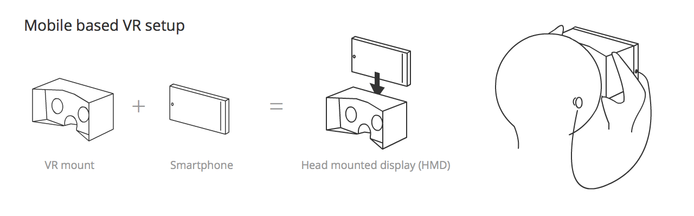
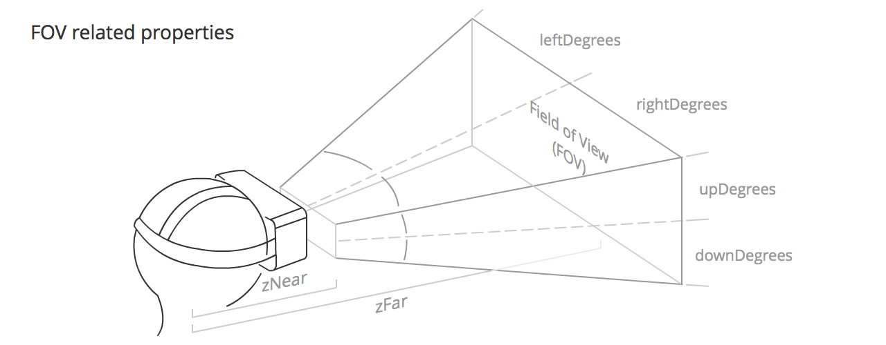
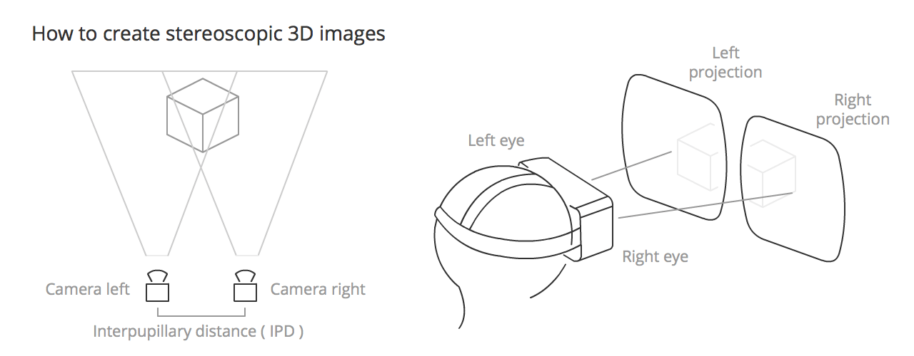

{{DefaultAPISidebar("WebVR API")}}{{deprecated_header}}

> [!NOTE]
> WebVR API is replaced by [WebXR API](/en-US/docs/Web/API/WebXR_Device_API). WebVR was never ratified as a standard, was implemented and enabled by default in very few browsers and supported a small number of devices.

This article discusses some of the concepts and theory behind virtual reality (VR). If you are a newcomer to the area, it is worthwhile getting an understanding of these topics before you start diving into code.

## The history of VR

Virtual reality is nothing new — the concept goes way further back than the Oculus Rift Kickstarter campaign of 2012. People have been experimenting with it for decades.

In 1939 the [View-Master device](https://en.wikipedia.org/wiki/View-Master) was created, allowing people to see 3D pictures. The device displayed images stored on cardboard disks containing stereoscopic 3D pairs of small color photographs. After years of development the military got interested in using such technology, and Project Headsight was born in 1961 — this involved a helmet incorporating a video screen with a head-tracking system.

There were various experiments conducted over the next few decades, but it wasn't restricted to science labs and battlefields anymore. Eventually pop culture took over with movie directors showing their visions of virtual reality. Movies like Tron (1982) and The Matrix (1999) were created, where people could transfer themselves into a whole new cyber world or were trapped in one without even knowing, accepting it as the real world.

The first VR gaming attempts were big and expensive — in 1991 Virtuality Group created a VR-ready arcade machine with goggles and ported popular titles like Pac-Man to virtual reality. Sega introduced their VR glasses at the Consumer Electronics Show in 1993. Companies were experimenting, but the market and consumers weren't convinced — we had to wait until 2012 to see a real example of a successful VR project.

### VR in recent times

So what's new? Virtual Reality hardware needs to deliver high-precision, low-latency data to deliver an acceptable user experience; computers running VR applications need to be powerful enough to handle all this information. It has not been until recently that such accuracy and power has been available at an affordable cost, if at all. Early VR prototypes cost tens of thousands of dollars, whereas more recent headsets such as the [HTC VIVE](https://www.vive.com/uk/) and [Meta Quest](https://www.meta.com/quest/quest-3/) are available for hundreds of dollars, and cheaper solutions are available — mobile device-based solutions like [Google Cardboard](https://arvr.google.com/cardboard/).

On the software side, Valve has created [SteamVR](https://store.steampowered.com/search/?category1=993) software, which is compatible with the VIVE and other solutions, and serves to provide access to software, such as a usable VR UI.

The technology itself is here, and the more expensive headsets will only get cheaper over time so more people can experience virtual reality on their own in the future.

### Input devices

Handling input for virtual reality applications is an interesting topic — it's a totally new experience for which dedicated user interfaces have to be designed. There are various approaches right now from classic keyboard and mouse, to new ones like Leap Motion and the VIVE controllers. It's a matter of trial and error to see what works in given situations and what inputs fit best for your type of game.

## VR Hardware setup

There are two main types of setup, mobile or computer-connected. Their minimum hardware set ups are as follows:

- Mobile: A Head-mounted display (HMD) is created using a smartphone — which acts as the VR display — mounted in a VR mount such as Google Cardboard, which contains the required lenses to provide stereoscopic vision of what is projected on the mobile screen.
- Computer-connected: A VR setup is connected to your computer — this consists of a Head Mounted Display (HMD) containing a high resolution landscape-oriented screen onto which the visuals for both the left and right eye are displayed, which also includes a lens for each eye to promote separation of the left and right eye scene (stereoscopic vision.) The setup also includes a separate position sensor that works out the position/orientation/velocity/acceleration of your head and constantly passes that information the computer. 

> [!NOTE]
> Computer-connected systems sometimes don't include a position sensor, but they usually do.

Other hardware that complements the VR experience includes:

- **A hand recognition sensor**: A sensor that tracks the position and movement of your hand, allowing it to become an interesting controller, and an object in VR gameworlds. The most advanced to date is the [Leap Motion](https://www.ultraleap.com/), which works with the computer (connected to the Oculus Rift) and can also work connected to a mobile device (the latter is in an experimental phase.)
- **A gamepad**: We can configure an XBox controller or similar to work as a keyboard in the browser — this offers further possibilities of interaction with a VR webpage. There are some gamepads that work with a mobile setup but these are connected via Bluetooth so don't work with WebVR.
- **An eye tracking sensor (experimental)**: The FOVE project is the first headset that reads subtle eye movements.
- **A facial expression tracker (experimental)**: Researchers at the University of Southern California and Facebook's Oculus division have been testing new ways of tracking facial expressions and transferring them to a virtual character.
- **A more complex positional sensor system**: As an example, the HTC VIVE features two position sensors that sit in opposite corners of a space, mapping it all out and allowing VR experiences to be enjoyed in spaces of up to 5m x 5m.

## Position and orientation, velocity and acceleration

As mentioned above, the position sensor detects information concerning the HMD and constantly outputs it, allowing you to continually update a scene according to head movement, rotation, etc. But what exactly is the information?

The output information falls into four categories:

1. Position — The position of the HMD along three axes in a 3D coordinate space. x is to the left and right, y is up and down, and z is towards and away from the position sensor. In WebVR, the x, y, and z coordinates are represented by the array contained in {{domxref("VRPose.position")}}.
2. Orientation — The rotation of the HMD around three axes in a 3D coordinate space. Pitch is rotation around the x axis, yaw is rotation around the y axis, and roll is rotation around the z axis. In WebVR, the pitch, yaw, and roll are represented by the first three elements of the array contained in {{domxref("VRPose.orientation")}}.
3. Velocity — There are two types of velocity to consider in VR:

   - Linear — The speed along any one of the axes that the HMD is traveling. This information can be accessed using {{domxref("VRPose.linearVelocity")}}.
   - Angular — The speed at which the HMD is rotating around any one of the axes. This information can be accessed using {{domxref("VRPose.angularVelocity")}}.

4. Acceleration — There are two types of acceleration to consider in VR:

   - Linear — The acceleration of travel along any one of the axes that the HMD is traveling. This information can be accessed using {{domxref("VRPose.linearAcceleration")}}.
   - Angular — The acceleration of rotation of the HMD around any one of the axes. This information can be accessed using {{domxref("VRPose.angularAcceleration")}}.

## Field of view

The field of view (FOV) is the area that each of the user's eyes can reasonably be expected to see. It roughly takes the form of a pyramid shape, laid down on one side, with the apex inside the user's head, and the rest of the pyramid emanating from the user's eye. Each eye has its own FOV, one slightly overlapping the other.

The FOV is defined by the following values:

- {{domxref("VRFieldOfView.upDegrees")}}: The number of degrees upwards that the field of view extends in.
- {{domxref("VRFieldOfView.rightDegrees")}}: The number of degrees to the right that the field of view extends in.
- {{domxref("VRFieldOfView.downDegrees")}}: The number of degrees downwards that the field of view extends in.
- {{domxref("VRFieldOfView.leftDegrees")}}: The number of degrees to the left that the field of view extends in.
- zNear, defined by {{domxref("VRDisplay.depthNear")}}: The distance from the middle of the user's head to the start of the visible FOV.
- zFar, defined by {{domxref("VRDisplay.depthFar")}}: The distance from the middle of the user's head to the end of the visible FOV.

The default values for these properties will differ slightly by VR hardware, although they tend to be around 53° up and down, and 47° left and right, with zNear and zFar coming in at around 0.1m and 10000m respectively.

> [!NOTE]
> The user can potentially see all the way around them, which is a brand new concept for apps and games. Try to give people a reason to look around and see what's behind them — make them reach out and find things that are not visible at the very beginning. Describe what's behind their backs.

## Concepts for VR apps

This section discusses concepts to be aware of when developing VR apps that you've probably not had to consider before when developing regular apps for mobile or desktop.

### Stereoscopic vision

Stereoscopic vision is the normal vision humans and (most) animals have — the perception of two slightly differing images (one from each eye) as a single image. This results in depth perception, helping us to see the world in glorious 3D. To recreate this in VR apps, you need to render two very slightly different views side by side, which will be taken in by the left and right eyes when the user is using the HMD.

### Head tracking

The primary technology used to make you feel present in a 360º scene, thanks to the gyroscope, accelerometer, and magnetometer (compass) included in the HMD.
It has primary relevance because it makes our eyes believe we are in front of a spherical screen, giving users realistic immersion inside the app canvas.

### Eye strain

A term commonly used in VR because it is a major handicap of using an HMD — we are constantly fooling the eye with what we are showing in the app canvas, and this leads to the eyes doing a lot more work than they normally would, so using VR apps for any extended period of time can lead to eye strain.

To minimize this unwanted effect, we need to:

- Avoid focusing on different depths (e.g. avoid using a lot of particles with different depths.)
- Avoid eye convergence (e.g. if you have an object that comes towards the camera your eyes will follow and converge on it.)
- Use darker backgrounds with more subdued colors where possible; a bright screen will make the eyes more tired.
- Avoid rapid brightness changes.
- Avoid presenting the user with large amounts of text to read. You should also be careful with the distance between the eyes/camera and the text to read. 0.5m is uncomfortable, whereas at more than 2m the stereo effect starts to break down, so somewhere in between is advisable.
- Be careful with the distance between objects and the camera in general. Oculus recommends 0.75m as a minimum distance of focus.
- Use a pointer if the user needs to interact with an object in the scene — this will help them point to it correctly with less effort.

In general, the path of least visual effort will give the user a less tiring experience.

### Motion sickness

If developers do not take utmost care, VR apps can actually cause their users to feel sick. This effect is produced when the stimuli their eyes are receiving is not what the body expects to receive.

To avoid bringing on motion sickness in our users (or at least minimize the effects), we need to:

- Always maintain head tracking (this is the most important of all, especially if it occurs in middle of the experience.)
- Use constant velocity; avoid acceleration or deceleration camera movements (use linear acceleration, and avoid easing if you can.)
- Keep the frame rate up (less than 30fps is uncomfortable.)
- Avoid sharp and/or unexpected camera rotations.
- Add fixed points of reference for fixed objects (otherwise the user will believe they are on the move.)
- Do not use Depth of Field or Motion Blur post processing because you do not know where the eyes will focus.
- Avoid brightness changes (use low frequency textures or fog effects to create smooth lighting transitions).

Overall your eyes should not send signals to the brain that cause reflex actions in other parts of the body.

### Latency

Latency is the time between the physical head movement and the visual display reaching the user's eyes from the screen of an HMD being updated. This is one of the most critical factors in providing a realistic experience. Humans can detect very small delays — we need to keep the latency below 20 milliseconds if they are to be imperceptible (for example a 60Hz monitor has a 16 ms response.)

The Oculus Rift headset has a latency of 20 ms or less, but with mobile device-based setups it will depend heavily on the smartphone CPU power and other capabilities.

### Frame rate (Frames per second / FPS)

Based on the Wikipedia definition, frame rate is the frequency at which an imaging device produces unique consecutive images, called frames. A rate of 60fps is an acceptable rate for a smooth user experience, but depending on the performance of the machine the app is running on, or the complexity of the content you want to show, it can drastically lower. Less than 30fps is generally considered jittery, and annoying to the user.

One of the most difficult tasks is to maintain a constant and high frame rate value, so we must optimize our code to make it as efficient as possible. It is preferable to have a decent frame rate that doesn't constantly or suddenly change; for this you need to as few necessary objects moving into the scene as possible and (in the case of WebGL) try to reduce draw calls.

### Interpupillary distance (IPD)

Based on the Wikipedia definition, IPD is the distance between the centers of the pupils of the two eyes. IPD is critical for the design of binocular viewing systems, where both eye pupils need to be positioned within the exit pupils of the viewing system.

Interpupillary distance (IPD) can be calculated using {{domxref("VREyeParameters.offset")}} in WebVR, which is equal to half the IPD.

This value is returned by the HMD and its value may be around 60 to 70 mm; in the case of some HMDs like Oculus Rift's, you can set your own IPD. Normally we don't change this value but you can play with it to change the scale of the entire scene. For example, if your IPD is set to 6000 mm, the user would view the scene like a giant looking at a Lilliputian world.

### Degrees of Freedom (DoF)

DoF refers to the movement of a rigid body inside space. There is no uniformity in creating acronyms for this term — we can find references to 3DoF in the context of sensors that detect only rotational head tracking, and 6DoF when an input allows us to control position and orientation simultaneously. We even sometimes find 9DoF references when the hardware contains three sensors like gyroscope, accelerometer and magnetometer, but the results of the 3 x 3DoF values will actually return a 6 degrees of freedom tracking.

DoF is directly related to the tracking of the user's head movement.

### Cone of focus

Although our field of view is much larger (approximately 180º), we need to be aware that only in a small portion of that field can you perceive symbols (the center 60º) or read text (the center 10º). If you do not have an eye tracking sensor we assume that the center of the screen is where the user is focusing their eyes.

This limitation is important to consider when deciding where to place visuals on the app canvas — too far toward the edge of the cone of focus can lead to eye strain much more quickly.

### 3D Positional Audio

3D positional audio refers to a group of effects that manipulate audio to simulate how it would sound in a three dimensional space.

This directly related to the [Web Audio API](/en-US/docs/Web/API/Web_Audio_API), which allows us to place sounds on objects we have in the canvas or launch audio depending on the part of the scene the user is traveling towards or looking at.
