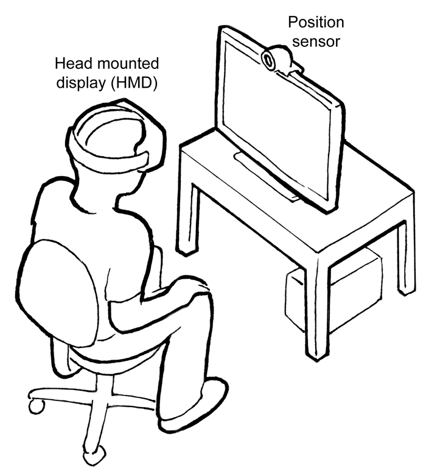

{{DefaultAPISidebar("WebVR API")}}{{Deprecated_Header}}{{Non-standard_header}}

> **Note:** WebVR API is replaced by [WebXR API](/en-US/docs/Web/API/WebXR_Device_API). WebVR was never ratified as a standard, was implemented and enabled by default in very few browsers and supported a small number of devices.

WebVR provides support for exposing virtual reality devices — for example, head-mounted displays like the Oculus Rift or HTC Vive — to web apps, enabling developers to translate position and movement information from the display into movement around a 3D scene. This has numerous, interesting applications, from virtual product tours and interactive training apps to immersive first-person games.

## Concepts and usage

Any VR devices attached to your computer will be returned by the {{DOMxRef("Navigator.getVRDisplays()")}} method; each one will be represented by a {{DOMxRef("VRDisplay")}} object.



{{DOMxRef("VRDisplay")}} is the central interface in the WebVR API — via its properties and methods you can access functionality to:

- Retrieve useful information to allow us to identify the display, what capabilities it has, controllers associated with it, and more.
- Retrieve {{DOMxRef("VRFrameData", "frame data")}} for each frame of content you want to present in a display, and submit those frames for display at a consistent rate.
- Start and stop presenting to the display.

A typical (simple) WebVR app would work like so:

1. {{DOMxRef("Navigator.getVRDisplays()")}} is used to get a reference to your VR display.
2. {{DOMxRef("VRDisplay.requestPresent()")}} is used to start presenting to the VR display.
3. WebVR's dedicated {{DOMxRef("VRDisplay.requestAnimationFrame()")}} method is used to run the app's rendering loop at the correct refresh rate for the display.
4. Inside the rendering loop, you grab the data required to display the current frame ({{DOMxRef("VRDisplay.getFrameData()")}}), draw the displayed scene twice — once for the view in each eye, then submit the rendered view to the display to show to the user ({{DOMxRef("VRDisplay.submitFrame()")}}).

In addition, WebVR 1.1 adds a number of events on the {{DOMxRef("Window")}} object to allow JavaScript to respond to changes to the status of the display.

> **Note:** You can find a lot more out about how the API works in our [Using the WebVR API](/en-US/docs/Web/API/WebVR_API/Using_the_WebVR_API) and [WebVR Concepts](/en-US/docs/Web/API/WebVR_API/Concepts) articles.

### API availability

The WebVR API, which was never ratified as a web standard, has been deprecated in favor of the [WebXR API](/en-US/docs/Web/API/WebXR_Device_API), which is well on track toward finishing the standardization process. As such, you should try to update existing code to use the newer API instead. Generally the transition should be fairly painless.

Additionally, on some devices and/or browsers, WebVR requires that the page be loaded using a secure context, over an HTTPS connection. If the page is not fully secure, the WebVR methods and functions will not be available. You can easily test for this by checking to see if the {{domxref("Navigator")}} method {{domxref("Navigator.getVRDisplays", "getVRDisplays()")}} is `NULL`:

```js
if (!navigator.getVRDisplays) {
  console.error("WebVR is not available");
} else {
  /* Use WebVR */
}
```

### Using controllers: Combining WebVR with the Gamepad API

Many WebVR hardware setups feature controllers that go along with the headset. These can be used in WebVR apps via the [Gamepad API](/en-US/docs/Web/API/Gamepad_API), and specifically the [Gamepad Extensions API](/en-US/docs/Web/API/Gamepad_API#experimental_gamepad_extensions) that adds API features for accessing [controller pose](/en-US/docs/Web/API/GamepadPose), [haptic actuators](/en-US/docs/Web/API/GamepadHapticActuator), and more.

> **Note:** Our [Using VR controllers with WebVR](/en-US/docs/Web/API/WebVR_API/Using_VR_controllers_with_WebVR) article explains the basics of how to use VR controllers with WebVR apps.

## WebVR interfaces

- {{DOMxRef("VRDisplay")}}
  - : Represents any VR device supported by this API. It includes generic information such as device IDs and descriptions, as well as methods for starting to present a VR scene, retrieving eye parameters and display capabilities, and other important functionality.
- {{DOMxRef("VRDisplayCapabilities")}}
  - : Describes the capabilities of a {{DOMxRef("VRDisplay")}} — its features can be used to perform VR device capability tests, for example can it return position information.
- {{DOMxRef("VRDisplayEvent")}}
  - : Represents the event object of WebVR-related events (see the [window object extensions](#window) listed below).
- {{DOMxRef("VRFrameData")}}
  - : Represents all the information needed to render a single frame of a VR scene; constructed by {{DOMxRef("VRDisplay.getFrameData()")}}.
- {{DOMxRef("VRPose")}}
  - : Represents the position state at a given timestamp (which includes orientation, position, velocity, and acceleration).
- {{DOMxRef("VREyeParameters")}}
  - : Provides access to all the information required to correctly render a scene for each given eye, including field of view information.
- {{DOMxRef("VRFieldOfView")}}
  - : Represents a field of view defined by 4 different degree values describing the view from a center point.
- {{DOMxRef("VRLayerInit")}}
  - : Represents a layer to be presented in a {{DOMxRef("VRDisplay")}}.
- {{DOMxRef("VRStageParameters")}}
  - : Represents the values describing the stage area for devices that support room-scale experiences.

### Extensions to other interfaces

The WebVR API extends the following APIs, adding the listed features.

#### Gamepad

- {{DOMxRef("Gamepad.displayId")}} {{ReadOnlyInline}}
  - : _Returns the {{DOMxRef("VRDisplay.displayId")}} of the associated {{DOMxRef("VRDisplay")}} — the `VRDisplay` that the gamepad is controlling the displayed scene of._

#### Navigator

- {{DOMxRef("Navigator.activeVRDisplays")}} {{ReadOnlyInline}}
  - : Returns an array containing every {{DOMxRef("VRDisplay")}} object that is currently presenting ({{DOMxRef("VRDisplay.ispresenting")}} is `true`).
- {{DOMxRef("Navigator.getVRDisplays()")}}
  - : Returns a promise that resolves to an array of {{DOMxRef("VRDisplay")}} objects representing any available VR displays connected to the computer.

#### Window events

- {{DOMxRef("Window.vrdisplaypresentchange_event", "vrdisplaypresentchange")}}
  - : Fired when the presenting state of a VR display changes — i.e. goes from presenting to not presenting or vice versa.
- {{DOMxRef("Window.vrdisplayconnect_event", "vrdisplayconnect")}}
  - : Fired when a compatible VR display has been connected to the computer.
- {{DOMxRef("Window.vrdisplaydisconnect_event", "vrdisplaydisconnect")}}
  - : Fired when a compatible VR display has been disconnected from the computer.
- {{DOMxRef("Window.vrdisplayactivate_event", "vrdisplayactivate")}}
  - : Fired when a display is able to be presented to.
- {{DOMxRef("Window.vrdisplaydeactivate_event", "vrdisplaydeactivate")}}
  - : Fired when a display can no longer be presented to.
- {{DOMxRef("Window.vrdisplayblur_event", "vrdisplayblur")}}
  - : Fired when presentation to a display has been paused for some reason by the browser, OS, or VR hardware.
- {{DOMxRef("Window.vrdisplayfocus_event", "vrdisplayfocus")}}
  - : Fired when presentation to a display has resumed after being blurred.

## Examples

You can find a number of examples at these locations:

- [webvr-tests](https://github.com/mdn/webvr-tests) — very simple examples to accompany the MDN WebVR documentation.
- [Carmel starter kit](https://github.com/facebookarchive/Carmel-Starter-Kit) — nice simple, well-commented examples that go along with Carmel, Facebook's WebVR browser.
- [WebVR.info samples](https://webvr.info/samples/) — slightly more in-depth examples plus source code
- [WebVR.rocks Firefox demos](https://webvr.rocks/firefox#demos) — showcase examples
- [A-Frame homepage](https://aframe.io/) — examples showing A-Frame usage

## Specifications

This API was specified in the old [WebVR API](https://immersive-web.github.io/webvr/spec/1.1/) that has been superseded by the [WebXR Device API](https://immersive-web.github.io/webxr/). It is no longer on track to becoming a standard.

Until all browsers have implemented the new [WebXR APIs](/en-US/docs/Web/API/WebXR_Device_API/Fundamentals), it is recommended to rely on frameworks, like [A-Frame](https://aframe.io/), [Babylon.js](https://www.babylonjs.com/), or [Three.js](https://threejs.org/), or a [polyfill](https://github.com/immersive-web/webxr-polyfill), to develop WebXR applications that will work across all browsers [\[1\]](https://developer.oculus.com/documentation/web/port-vr-xr/).

## Browser compatibility

{{Compat}}

## See also

- [vr.mozilla.org](https://mixedreality.mozilla.org/) — The main Mozilla landing pad for WebVR, with demos, utilities, and other information.
- [A-Frame](https://aframe.io/) — Open source web framework for building VR experiences.
- [webvr.info](https://webvr.info) — Up-to-date information about WebVR, browser setup, and community.
- [threejs-vr-boilerplate](https://github.com/MozillaReality/vr-web-examples/tree/master/threejs-vr-boilerplate) — A useful starter template for writing WebVR apps into.
- [Web VR polyfill](https://github.com/immersive-web/webvr-polyfill) — JavaScript implementation of WebVR.
- [Supermedium](https://www.supermedium.com) — A pure WebVR browser to easily access the best WebVR content.
- [WebVR Directory](https://webvr.directory/) — List of quality WebVR sites.
