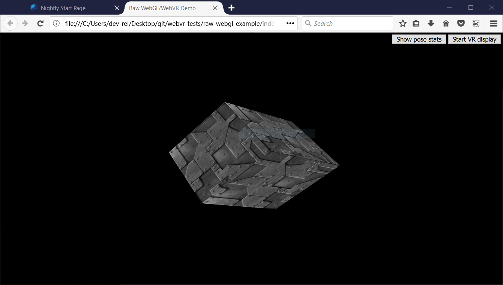
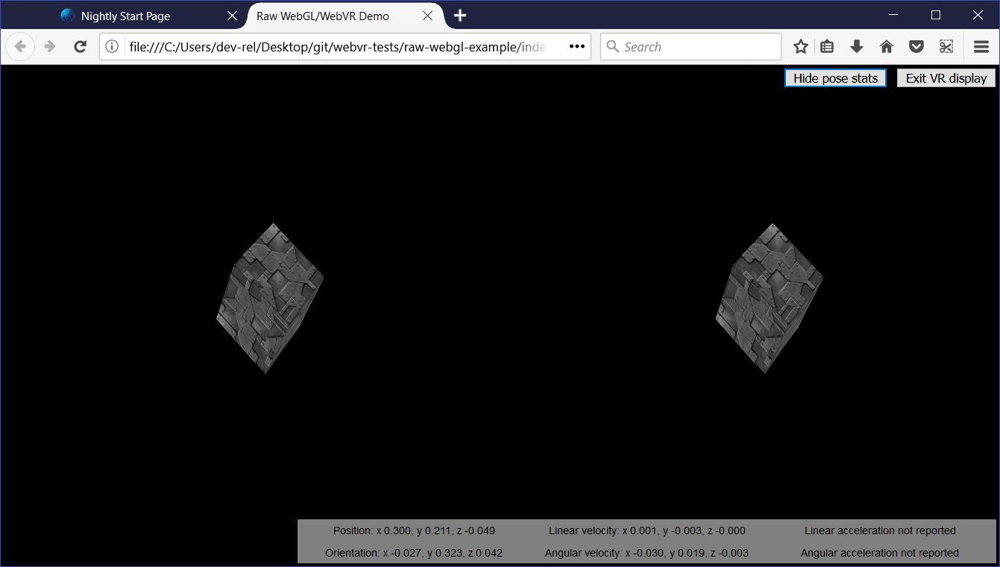

{{APIRef("WebVR API")}}{{deprecated_header}}

> **Note:** WebVR API is replaced by [WebXR API](/en-US/docs/Web/API/WebXR_Device_API). WebVR was never ratified as a standard, was implemented and enabled by default in very few browsers and supported a small number of devices.

The WebVR API is a fantastic addition to the web developer's toolkit, allowing WebGL scenes to be presented in virtual reality displays such as the Oculus Rift and HTC Vive. But how do you get started with developing VR apps for the Web? This article will guide you through the basics.

## Getting started

To get started, you need:

- Supporting VR hardware.

  - The cheapest option is to use a mobile device, supporting browser, and device mount (e.g. Google Cardboard). This won't be quite as good an experience as dedicated hardware, but you won't need to purchase a powerful computer or dedicated VR display.
  - Dedicated hardware can be costly, but it does provide a better experience. The most WebVR-compatible hardware at the moment is the HTC VIVE, and The Oculus Rift. The front page of [webvr.info](https://webvr.info/) has some further useful information about available hardware, and what browser support them.

- A computer powerful enough to handle rendering/displaying of VR scenes using your dedicated VR Hardware, if required. To give you an idea of what you need, look at the relevant guide for the VR you are purchasing (e.g. [VIVE READY Computers](https://www.vive.com/us/ready/)).
- A supporting browser installed — the latest [Firefox Nightly](https://www.mozilla.org/en-US/firefox/channel/desktop/) or [Chrome](https://www.google.com/chrome/index.html) are your best options right now, on desktop or mobile.

Once you have everything assembled, you can test to see whether your setup works with WebVR by going to our [simple A-Frame demo](https://mdn.github.io/webvr-tests/webvr/aframe-demo/), and seeing whether the scene renders and whether you can enter VR display mode by pressing the button at the bottom right.

[A-Frame](https://aframe.io/) is by far the best option if you want to create a WebVR-compatible 3D scene quickly, without needing to understand a bunch of new JavaScript code. It doesn't however teach you how the raw WebVR API works, and this is what we'll get on to next.

## Introducing our demo

To illustrate how the WebVR API works, we'll study our raw-webgl-example, which looks a bit like this:



> **Note:** You can find the [source code of our demo](https://github.com/mdn/webvr-tests/tree/main/webvr/raw-webgl-example) on GitHub, and [view it live](https://mdn.github.io/webvr-tests/webvr/raw-webgl-example/) also.

> **Note:** If WebVR isn't working in your browser, you might need to make sure it is running through your graphics card. For example for NVIDIA cards, if you've got the NVIDIA control panel set up successfully, there will be a context menu option available — right click on Firefox, then choose _Run with graphics processor > High-performance NVIDIA processor_.

Our demo features the holy grail of WebGL demos — a rotating 3D cube. We've implemented this using raw [WebGL API](/en-US/docs/Web/API/WebGL_API) code. We won't be teaching any basic JavaScript or WebGL, just the WebVR parts.

Our demo also features:

- A button to start (and stop) our scene from being presented in the VR display.
- A button to show (and hide) VR pose data, i.e. the position and orientation of the headset, updated in real time.

When you look through the source code of [our demo's main JavaScript file](https://github.com/mdn/webvr-tests/blob/main/webvr/raw-webgl-example/webgl-demo.js), you can easily find the WebVR-specific parts by searching for the string "WebVR" in preceding comments.

> **Note:** To find out more about basic JavaScript and WebGL, consult our [JavaScript learning material](/en-US/docs/Learn/JavaScript), and our [WebGL Tutorial](/en-US/docs/Web/API/WebGL_API/Tutorial).

## How does it work?

At this point, let's look at how the WebVR parts of the code work.

A typical (simple) WebVR app works like this:

1. {{domxref("Navigator.getVRDisplays()")}} is used to get a reference to your VR display.
2. {{domxref("VRDisplay.requestPresent()")}} is used to start presenting to the VR display.
3. WebVR's dedicated {{domxref("VRDisplay.requestAnimationFrame()")}} method is used to run the app's rendering loop at the correct refresh rate for the display.
4. Inside the rendering loop, you grab the data required to display the current frame ({{domxref("VRDisplay.getFrameData()")}}), draw the displayed scene twice — once for the view in each eye — then submit the rendered view to the display to show to the user via ({{domxref("VRDisplay.submitFrame()")}}).

In the below sections we'll look at our raw-webgl-demo in detail, and see where exactly the above features are used.

### Starting with some variables

The first WebVR-related code you'll meet is this following block:

```js
// WebVR variables

const frameData = new VRFrameData();
let vrDisplay;
const btn = document.querySelector(".stop-start");
let normalSceneFrame;
let vrSceneFrame;

const poseStatsBtn = document.querySelector(".pose-stats");
const poseStatsSection = document.querySelector("section");
poseStatsSection.style.visibility = "hidden"; // hide it initially

const posStats = document.querySelector(".pos");
const orientStats = document.querySelector(".orient");
const linVelStats = document.querySelector(".lin-vel");
const linAccStats = document.querySelector(".lin-acc");
const angVelStats = document.querySelector(".ang-vel");
const angAccStats = document.querySelector(".ang-acc");
let poseStatsDisplayed = false;
```

Let's briefly explain these:

- `frameData` contains a {{domxref("VRFrameData")}} object, created using the {{domxref("VRFrameData.VRFrameData", "VRFrameData()")}} constructor. This is initially empty, but will later contain the data required to render each frame to show in the VR display, updated constantly as the rendering loop runs.
- `vrDisplay` starts uninitialized, but will later on hold a reference to our VR headset ({{domxref("VRDisplay")}} — the central control object of the API).
- `btn` and `poseStatsBtn` hold references to the two buttons we are using to control our app.
- `normalSceneFrame` and `vrSceneFrame` start uninitialized, but later on will hold references to {{domxref("Window.requestAnimationFrame()")}} and {{domxref("VRDisplay.requestAnimationFrame()")}} calls — these will initiate the running of a normal rendering loop, and a special WebVR rendering loop; we'll explain the difference between these two later on.
- The other variables store references to different parts of the VR pose data display box, which you can see in the bottom right-hand corner of the UI.

### Getting a reference to our VR display

One of the major functions inside our code is `start()` — we run this function when the body has finished loading:

```js
// start
//
// Called when the body has loaded is created to get the ball rolling.

document.body.onload = start;
```

To begin with, `start()` retrieves a WebGL context to use to render 3D graphics into the {{htmlelement("canvas")}} element in [our HTML](https://github.com/mdn/webvr-tests/blob/main/webvr/raw-webgl-example/index.html). We then check whether the `gl` context is available — if so, we run a number of functions to set up the scene for display.

```js
function start() {
  canvas = document.getElementById("glcanvas");

  initWebGL(canvas);      // Initialize the GL context

  // WebGL setup code here
```

Next, we start the process of actually rendering the scene onto the canvas, by setting the canvas to fill the entire browser viewport, and running the rendering loop (`drawScene()`) for the first time. This is the non-WebVR — normal — rendering loop.

```js
// draw the scene normally, without WebVR - for those who don't have it and want to see the scene in their browser

canvas.width = window.innerWidth;
canvas.height = window.innerHeight;
drawScene();
```

Now onto our first WebVR-specific code. First of all, we check to see if {{domxref("Navigator.getVRDisplays")}} exists — this is the entry point into the API, and therefore good basic feature detection for WebVR. You'll see at the end of the block (inside the `else` clause) that if this doesn't exist, we log a message to indicate that WebVR 1.1 isn't supported by the browser.

```js
  // WebVR: Check to see if WebVR is supported
  if (navigator.getVRDisplays) {
    console.log('WebVR 1.1 supported');
```

Inside our `if () { }` block, we run the {{domxref("Navigator.getVRDisplays()")}} function. This returns a promise, which is fulfilled with an array containing all the VR display devices connected to the computer. If none are connected, the array will be empty.

```js
    // Then get the displays attached to the computer
    navigator.getVRDisplays().then((displays) => {
```

Inside the promise `then()` block, we check whether the array length is more than 0; if so, we set the value of our `vrDisplay` variable to the 0 index item inside the array. `vrDisplay` now contains a {{domxref("VRDisplay")}} object representing our connected display!

```js
      // If a display is available, use it to present the scene
      if (displays.length > 0) {
        vrDisplay = displays[0];
        console.log('Display found');
```

> **Note:** It is unlikely that you'll have multiple VR displays connected to your computer, and this is just a simple demo, so this will do for now.

### Starting and stopping the VR presentation

Now we have a {{domxref("VRDisplay")}} object, we can use it do a number of things. The next thing we want to do is wire up functionality to start and stop presentation of the WebGL content to the display.

Continuing on with the previous code block, we now add an event listener to our start/stop button (`btn`) — when this button is clicked we want to check whether we are presenting to the display already (we do this in a fairly dumb fashion, by checking what the button [`textContent`](/en-US/docs/Web/API/Node/textContent) contains).

If the display is not already presenting, we use the {{domxref("VRDisplay.requestPresent()")}} method to request that the browser start presenting content to the display. This takes as a parameter an array of the {{domxref("VRLayerInit")}} objects representing the layers you want to present in the display.

Since the maximum number of layers you can display is currently 1, and the only required object member is the {{domxref("VRLayerInit.source")}} property (which is a reference to the {{htmlelement("canvas")}} you want to present in that layer; the other parameters are given sensible defaults — see {{domxref("VRLayerInit.leftBounds", "leftBounds")}} and {{domxref("VRLayerInit.rightBounds", "rightBounds")}})), the parameter is \[{ source: canvas }].

`requestPresent()` returns a promise that is fulfilled when the presentation begins successfully.

```js
        // Starting the presentation when the button is clicked: It can only be called in response to a user gesture
        btn.addEventListener('click', () => {
          if (btn.textContent === 'Start VR display') {
            vrDisplay.requestPresent([{ source: canvas }]).then(() => {
              console.log('Presenting to WebVR display');
```

With our presentation request successful, we now want to start setting up to render content to present to the VRDisplay. First of all we set the canvas to the same size as the VR display area. We do this by getting the {{domxref("VREyeParameters")}} for both eyes using {{domxref("VRDisplay.getEyeParameters()")}}.

We then do some simple math to calculate the total width of the VRDisplay rendering area based on the eye {{domxref("VREyeParameters.renderWidth")}} and {{domxref("VREyeParameters.renderHeight")}}.

```js
// Set the canvas size to the size of the vrDisplay viewport

const leftEye = vrDisplay.getEyeParameters("left");
const rightEye = vrDisplay.getEyeParameters("right");

canvas.width = Math.max(leftEye.renderWidth, rightEye.renderWidth) * 2;
canvas.height = Math.max(leftEye.renderHeight, rightEye.renderHeight);
```

Next, we {{domxref("Window.cancelAnimationFrame()", "cancel the animation loop")}} previously set in motion by the {{domxref("Window.requestAnimationFrame()")}} call inside the `drawScene()` function, and instead invoke `drawVRScene()`. This function renders the same scene as before, but with some special WebVR magic going on. The loop inside here is maintained by WebVR's special {{domxref("VRDisplay.requestAnimationFrame")}} method.

```js
// stop the normal presentation, and start the vr presentation
window.cancelAnimationFrame(normalSceneFrame);
drawVRScene();
```

Finally, we update the button text so that the next time it is pressed, it will stop presentation to the VR display.

```js
              btn.textContent = 'Exit VR display';
            });
```

To stop the VR presentation when the button is subsequently pressed, we call {{domxref("VRDisplay.exitPresent()")}}. We also reverse the button's text content, and swap over the `requestAnimationFrame` calls. You can see here that we are using {{domxref("VRDisplay.cancelAnimationFrame")}} to stop the VR rendering loop, and starting the normal rendering loop off again by calling `drawScene()`.

```js
          } else {
            vrDisplay.exitPresent();
            console.log('Stopped presenting to WebVR display');

            btn.textContent = 'Start VR display';

            // Stop the VR presentation, and start the normal presentation
            vrDisplay.cancelAnimationFrame(vrSceneFrame);
            drawScene();
          }
        });
      }
    });
  } else {
    console.log('WebVR API not supported by this browser.');
  }
}
```

Once the presentation starts, you'll be able to see the stereoscopic view displayed in the browser:



You'll learn below how the stereoscopic view is actually produced.

### Why does WebVR have its own requestAnimationFrame()?

This is a good question. The reason is that for smooth rendering inside the VR display, you need to render the content at the display's native refresh rate, not that of the computer. VR display refresh rates are greater than PC refresh rates, typically up to 90fps. The rate will be differ from the computer's core refresh rate.

Note that when the VR display is not presenting, {{domxref("VRDisplay.requestAnimationFrame")}} runs identically to {{domxref("Window.requestAnimationFrame")}}, so if you wanted, you could just use a single rendering loop, rather than the two we are using in our app. We have used two because we wanted to do slightly different things depending on whether the VR display is presenting or not, and keep things separated for ease of comprehension.

### Rendering and display

At this point, we've seen all the code required to access the VR hardware, request that we present our scene to the hardware, and start running the rending loop. Let's now look at the code for the rendering loop, and explain how the WebVR-specific parts of it work.

First of all, we begin the definition of our rendering loop function — `drawVRScene()`. The first thing we do inside here is make a call to {{domxref("VRDisplay.requestAnimationFrame()")}} to keep the loop running after it has been called once (this occurred earlier on in our code when we started presenting to the VR display). This call is set as the value of the global `vrSceneFrame` variable, so we can cancel the loop with a call to {{domxref("VRDisplay.cancelAnimationFrame()")}} once we exit VR presenting.

```js
function drawVRScene() {
  // WebVR: Request the next frame of the animation
  vrSceneFrame = vrDisplay.requestAnimationFrame(drawVRScene);
```

Next, we call {{domxref("VRDisplay.getFrameData()")}}, passing it the name of the variable that we want to use to contain the frame data. We initialized this earlier on — `frameData`. After the call completes, this variable will contain the data need to render the next frame to the VR device, packaged up as a {{domxref("VRFrameData")}} object. This contains things like projection and view matrices for rendering the scene correctly for the left and right eye view, and the current {{domxref("VRPose")}} object, which contains data on the VR display such as orientation, position, etc.

This has to be called on every frame so the rendered view is always up-to-date.

```js
// Populate frameData with the data of the next frame to display
vrDisplay.getFrameData(frameData);
```

Now we retrieve the current {{domxref("VRPose")}} from the {{domxref("VRFrameData.pose")}} property, store the position and orientation for use later on, and send the current pose to the pose stats box for display, if the `poseStatsDisplayed` variable is set to true.

```js
// You can get the position, orientation, etc. of the display from the current frame's pose

const curFramePose = frameData.pose;
const curPos = curFramePose.position;
const curOrient = curFramePose.orientation;
if (poseStatsDisplayed) {
  displayPoseStats(curFramePose);
}
```

We now clear the canvas before we start drawing on it, so that the next frame is clearly seen, and we don't also see previous rendered frames:

```js
// Clear the canvas before we start drawing on it.

gl.clear(gl.COLOR_BUFFER_BIT | gl.DEPTH_BUFFER_BIT);
```

We now render the view for both the left and right eyes. First of all we need to create projection and view locations for use in the rendering. These are {{domxref("WebGLUniformLocation")}} objects, created using the {{domxref("WebGLRenderingContext.getUniformLocation()")}} method, passing it the shader program's identifier and an identifying name as parameters.

```js
// WebVR: Create the required projection and view matrix locations needed
// for passing into the uniformMatrix4fv methods below

const projectionMatrixLocation = gl.getUniformLocation(
  shaderProgram,
  "projMatrix",
);
const viewMatrixLocation = gl.getUniformLocation(shaderProgram, "viewMatrix");
```

The next rendering step involves:

- Specifying the viewport size for the left eye, using {{domxref("WebGLRenderingContext.viewport")}} — this is logically the first half of the canvas width, and the full canvas height.
- Specifying the view and projection matrix values to use to render the left eye — this is done using the {{domxref("WebGLRenderingContext.uniformMatrix", "WebGLRenderingContext.uniformMatrix4fv")}} method, which is passed the location values we retrieved above, and the left matrices obtained from the {{domxref("VRFrameData")}} object.
- Running the `drawGeometry()` function, which renders the actual scene — because of what we specified in the previous two steps, we will render it for the left eye only.

```js
// WebVR: Render the left eye's view to the left half of the canvas
gl.viewport(0, 0, canvas.width * 0.5, canvas.height);
gl.uniformMatrix4fv(
  projectionMatrixLocation,
  false,
  frameData.leftProjectionMatrix,
);
gl.uniformMatrix4fv(viewMatrixLocation, false, frameData.leftViewMatrix);
drawGeometry();
```

We now do exactly the same thing, but for the right eye:

```js
// WebVR: Render the right eye's view to the right half of the canvas
gl.viewport(canvas.width * 0.5, 0, canvas.width * 0.5, canvas.height);
gl.uniformMatrix4fv(
  projectionMatrixLocation,
  false,
  frameData.rightProjectionMatrix,
);
gl.uniformMatrix4fv(viewMatrixLocation, false, frameData.rightViewMatrix);
drawGeometry();
```

Next we define our `drawGeometry()` function. Most of this is just general WebGL code required to draw our 3D cube. You'll see some WebVR-specific parts in the `mvTranslate()` and `mvRotate()` function calls — these pass matrices into the WebGL program that define the translation and rotation of the cube for the current frame

You'll see that we are modifying these values by the position (`curPos`) and orientation (`curOrient`) of the VR display we got from the {{domxref("VRPose")}} object. The result is that, for example, as you move or rotate your head left, the x position value (`curPos[0]`) and y rotation value (`[curOrient[1]`) are added to the x translation value, meaning that the cube will move to the right, as you'd expect when you are looking at something and then move/turn your head left.

This is a quick and dirty way to use VR pose data, but it illustrates the basic principle.

```js
function drawGeometry() {
  // Establish the perspective with which we want to view the
  // scene. Our field of view is 45 degrees, with a width/height
  // ratio of 640:480, and we only want to see objects between 0.1 units
  // and 100 units away from the camera.
  perspectiveMatrix = makePerspective(45, 640.0 / 480.0, 0.1, 100.0);

  // Set the drawing position to the "identity" point, which is
  // the center of the scene.
  loadIdentity();

  // Now move the drawing position a bit to where we want to start
  // drawing the cube.
  mvTranslate([
    0.0 - curPos[0] * 25 + curOrient[1] * 25,
    5.0 - curPos[1] * 25 - curOrient[0] * 25,
    -15.0 - curPos[2] * 25,
  ]);

  // Save the current matrix, then rotate before we draw.
  mvPushMatrix();
  mvRotate(cubeRotation, [0.25, 0, 0.25 - curOrient[2] * 0.5]);

  // Draw the cube by binding the array buffer to the cube's vertices
  // array, setting attributes, and pushing it to GL.
  gl.bindBuffer(gl.ARRAY_BUFFER, cubeVerticesBuffer);
  gl.vertexAttribPointer(vertexPositionAttribute, 3, gl.FLOAT, false, 0, 0);

  // Set the texture coordinates attribute for the vertices.
  gl.bindBuffer(gl.ARRAY_BUFFER, cubeVerticesTextureCoordBuffer);
  gl.vertexAttribPointer(textureCoordAttribute, 2, gl.FLOAT, false, 0, 0);

  // Specify the texture to map onto the faces.
  gl.activeTexture(gl.TEXTURE0);
  gl.bindTexture(gl.TEXTURE_2D, cubeTexture);
  gl.uniform1i(gl.getUniformLocation(shaderProgram, "uSampler"), 0);

  // Draw the cube.
  gl.bindBuffer(gl.ELEMENT_ARRAY_BUFFER, cubeVerticesIndexBuffer);
  setMatrixUniforms();
  gl.drawElements(gl.TRIANGLES, 36, gl.UNSIGNED_SHORT, 0);

  // Restore the original matrix
  mvPopMatrix();
}
```

The next bit of the code has nothing to do with WebVR — it just updates the rotation of the cube on each frame:

```js
// Update the rotation for the next draw, if it's time to do so.
let currentTime = new Date().getTime();
if (lastCubeUpdateTime) {
  const delta = currentTime - lastCubeUpdateTime;

  cubeRotation += (30 * delta) / 1000.0;
}
lastCubeUpdateTime = currentTime;
```

The last part of the rendering loop involves us calling {{domxref("VRDisplay.submitFrame()")}} — now all the work has been done and we've rendered the display on the {{htmlelement("canvas")}}, this method then submits the frame to the VR display so it is displayed on there as well.

```js
  // WebVR: Indicate that we are ready to present the rendered frame to the VR display
  vrDisplay.submitFrame();
}
```

### Displaying the pose (position, orientation, etc.) data

In this section we'll discuss the `displayPoseStats()` function, which displays our updated pose data on each frame. The function is fairly simple.

First of all, we store the six different property values obtainable from the {{domxref("VRPose")}} object in their own variables — each one is a {{jsxref("Float32Array")}}.

```js
function displayPoseStats(pose) {
  const pos = pose.position;
  const orient = pose.orientation;
  const linVel = pose.linearVelocity;
  const linAcc = pose.linearAcceleration;
  const angVel = pose.angularVelocity;
  const angAcc = pose.angularAcceleration;
```

We then write out the data into the information box, updating it on every frame. We've clamped each value to three decimal places using [`toFixed()`](/en-US/docs/Web/JavaScript/Reference/Global_Objects/Number/toFixed), as the values are hard to read otherwise.

You should note that we've used a conditional expression to detect whether the linear acceleration and angular acceleration arrays are successfully returned before we display the data. These values are not reported by most VR hardware as yet, so the code would throw an error if we did not do this (the arrays return `null` if they are not successfully reported).

```js
  posStats.textContent = `Position: ` +
    `x ${pos[0].toFixed(3)}, ` +
    `y ${pos[1].toFixed(3)}, ` +
    `z ${pos[2].toFixed(3)}`;
  orientStats.textContent = `Orientation: ` +
    `x ${orient[0].toFixed(3)}, ` +
    `y ${orient[1].toFixed(3)}, ` +
    `z ${orient[2].toFixed(3)}`;
  linVelStats.textContent = `Linear velocity: ` +
    `x ${linVel[0].toFixed(3)}, ` +
    `y ${linVel[1].toFixed(3)}, ` +
    `z ${linVel[2].toFixed(3)}`;
  angVelStats.textContent = `Angular velocity: ` +
    `x ${angVel[0].toFixed(3)}, ` +
    `y ${angVel[1].toFixed(3)}, ` +
    `z ${angVel[2].toFixed(3)}`;

  if (linAcc) {
    linAccStats.textContent = `Linear acceleration: ` +
      `x ${linAcc[0].toFixed(3)}, ` +
      `y ${linAcc[1].toFixed(3)}, ` +
      `z ${linAcc[2].toFixed(3)}`;
  } else {
    linAccStats.textContent = 'Linear acceleration not reported';
  }

  if (angAcc) {
    angAccStats.textContent = `Angular acceleration: ` +
    `x ${angAcc[0].toFixed(3)}, ` +
    `y ${angAcc[1].toFixed(3)}, ` +
    `z ${angAcc[2].toFixed(3)}`;
  } else {
    angAccStats.textContent = 'Angular acceleration not reported';
  }
}
```

## WebVR events

The WebVR spec features a number of events that are fired, allowing our app code to react to changes in the state of the VR display (see [Window events](/en-US/docs/Web/API/WebVR_API#window_events)). For example:

- {{domxref("Window/vrdisplaypresentchange_event", "vrdisplaypresentchange")}} — Fires when the presenting state of a VR display changes — i.e. goes from presenting to not presenting, or vice versa.
- {{domxref("Window.vrdisplayconnect_event", "vrdisplayconnect")}} — Fires when a compatible VR display has been connected to the computer.
- {{domxref("Window.vrdisplaydisconnect_event", "vrdisplaydisconnect")}} — Fires when a compatible VR display has been disconnected from the computer.

To demonstrate how they work, our simple demo includes the following example:

```js
window.addEventListener("vrdisplaypresentchange", (e) => {
  console.log(
    `Display ${e.display.displayId} presentation has changed. Reason given: ${e.reason}.`,
  );
});
```

As you can see, the {{domxref("VRDisplayEvent", "event object")}} provides two useful properties — {{domxref("VRDisplayEvent.display")}}, which contains a reference to the {{domxref("VRDisplay")}} the event was fired in response to, and {{domxref("VRDisplayEvent.reason")}}, which contains a human-readable reason why the event was fired.

This is a very useful event; you could use it to handle cases where the display gets disconnected unexpectedly, stopping errors from being thrown and making sure the user is aware of the situation. In Google's Webvr.info presentation demo, the event is used to run an [`onVRPresentChange()` function](https://github.com/toji/webvr.info/blob/master/samples/03-vr-presentation.html#L174), which updates the UI controls as appropriate and resizes the canvas.

## Summary

This article has given you the very basics of how to create a simple WebVR 1.1 app, to help you get started.
