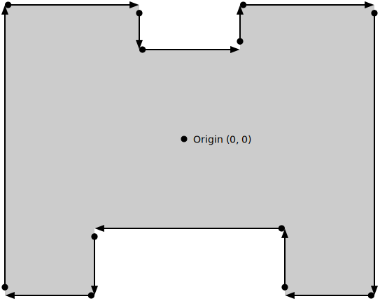

{{DefaultAPISidebar("WebXR Device API")}}

Among the various reference spaces available in the WebXR set of APIs, the **`bounded-floor` reference space** is somewhat unique. Not only is it represented by a unique subclass, {{domxref("XRBoundedReferenceSpace")}}, but it's the only one which restricts movement based not upon virtual restrictions but upon limitations imposed by the real world. This article examines bounded reference spaces as represented by `XRBoundedReferenceSpace`, describing what they are and how they're used.

There are many uses for bounded reference spaces, including projects such as virtual paint studios or 3D construction, modeling, or sculpting systems; training simulations or lesson scenarios; dance or other performance-based games; or the preview of 3D objects in the real world using augmented reality.

## Introduction

A bounded reference space is one which represents an XR environment in which the user is able to move around physically in the real world while being tracked by the XR hardware, with their movements being then transposed into the simulation. The boundaries established by the bounded reference space, then, represent the edges of the safely passable, tracked space in the user's real-world environment that are available for their movement while in the simulation.

### Requirements

Because a bounded reference space establishes a limited area in which the user can move, it naturally imposes a limit on how large the simulated environment can be. It's difficult (and would probably be fairly confusing) to create a virtual world that's larger than the physical space available to the user if you're mapping their real-world movement into the virtual environment. Imagine how uncomfortable it would feel if you moved 100 meters each time you took a step!

The requirements, then, for a bounded reference space are:

- XR hardware that can track the user's movement in the real world, such as a camera-based system.
- A physical space with enough room to move around safely.

### Basics

The reference space type of all bounded reference spaces is `bounded-floor`. This is the only type of bounded reference space currently available; in all others, if you need boundaries, you will have to manage them yourself.

Because `bounded-floor` is a floor-bound reference space, the user starts out on the floor of the space, which is sensible given the real-world implications otherwise. Therefore, the bounded reference space's origin always places the Y=0 plane at floor level. The boundary is then defined using an array of 2D coordinates, specifying only the X and Z components since Y is always 0. These points go around the room in a clockwise direction.

Note that if the underlying platform defines a fixed room-scale origin and boundary, it may initialize any uninitialized values to match that predefined information; this is not unexpected behavior for users of these platforms.

The space inside the boundary is then the user's safe movement area, within which they are tracked and their movements replicated into the virtual world. Although the user's XR system may provide automated detection and protection against exiting the safe area, it is always good practice to handle this yourself, watching for collisions between the user's position and the boundary of the world, and providing guidance to move back toward the origin point, or at least to stay inside the safe zone.

XR hardware that does not have an inherent boundary defined may or may not support the bounded reference space. If it does, it likely has a system in place to allow the user to specify or select the boundaries to apply if a bounded space is to be used. However, it's entirely possible that the device will decline to support bounded spaces at all, so you should be prepared to fall back to some other type of reference space.

## Understanding boundaries

As mentioned previously, the boundary is defined as an array of points located at floor level, each defining a corner of the boundary area, going around the origin in a clockwise manner. This is demonstrated in the diagram below.



This diagram defines the boundaries of room with the origin in the center, as required, and a set of 12 points representing the vertices of the available physical space. There are two cut-out areas in the room, possibly representing a couch, sofa, or bench behind the user and a stand or table on which the computer or other hardware is located. As this suggests, the safe area is not required to be convex, but may have any number of indentations or extrusions, as long as it's a contiguous shape,

Note that the coordinates of the origin here, (0, 0), are indicative of the fact that the boundaries are defined at floor level and are essentially a 2D shape on the floor, like an invisible fence used to keep pets from getting away from home. The full coordinates here would be (0, 0, 0).

This boundary is maintained in the {{domxref("XRBoundedReferenceSpace")}} in the {{domxref("XRBoundedReferenceSpace")}} property {{domxref("XRBoundedReferenceSpace.boundsGeometry", "boundsGeometry")}}. This property contains an array of {{domxref("DOMPointReadOnly")}} objects, each of which defines one of the points making up the space's border, moving around the room in clockwise order. Each vertex in the array has a `y` coordinate of 0 since the entire boundary is defined at floor level, extending upward to the ceiling or indefinitely. Each point's `w` is always 1 as well.

The interior of the bounded area is always considered to be on the _right side_ of the boundary. By listing the points in clockwise order, the boundary is placed inside the defined shape. If the points are listed counterclockwise it would suggest that the safe area lies _outside_ the boundary, probably with undesirable results.

You should consider including proactive checks for the user approaching the boundary. This is useful both for their safety (in case the boundary represents a physical obstacle of some nature) and to avoid possible conditions in which the accuracy is reduced near the boundaries. It's also useful because the user may be engrossed in gameplay or other activity, not realize they're approaching the boundary, and could become confused or distressed if they wander out of tracking range (especially if doing so causes them to lose a game).

The easiest solution is to just treat the each boundary segment as if it were an object to hit test against. As the user grows close to the boundary, you might warn them by displaying a message, flashing a warning indicator, playing an audio warning, or the like. And if the user actually collides with the boundary, don't let them continue past it.

## Creating a bounded reference space

Before creating a project that relies on bounded reference spaces, it's important to keep in mind that not all XR devices are capable of creating them. By their very nature, bounded reference spaces have special hardware requirements, since they need to allow for the user to physically move around in space while their movements are tracked. In this section, we'll look at how to safely create a session that will work whether bounded spaces are supported or not.

### Safely creating a bounded-preferred space

Before actually attempting to create a bounded reference space, you need to create a session that supports them. Since not all hardware supports bounded reference spaces, you should made sure to support bounded reference spaces as an option rather than as a required feature unless you have special knowledge of the environment in which your code will run. You can create a session that supports a `bounded-floor` reference space if available by using code such as the following:

```js
async function onActivateXRButton(event) {
  if (!xrSession) {
    navigator.xr
      .requestSession("immersive-vr", {
        requiredFeatures: ["local-floor"],
        optionalFeatures: ["bounded-floor"],
      })
      .then((session) => {
        xrSession = session;
        startSessionAnimation();
      });
  }
}
```

This function, called when the user clicks on a button to start the XR experience, works as usual, exiting at once if a session is already in place, then requesting a new session using `immersive-vr` mode. The options specified when requesting the session indicate that at a minimum, the session must be compatible with the `local-floor` reference space, but that it would be nice if the `bounded-floor` space were supported as well.

Once the session has been created, our `startSessionAnimation()` function can try to establish a `bounded-floor` reference space, and if it fails to do so it can then fall back to requesting a `local-floor` reference space instead (in which we will have to handle boundaries ourselves).

This way, our session will start up regardless of whether or not the user's platform is able to provide bounded reference spaces.

### Creating the reference space

Requesting support for `bounded-floor` when calling the {{domxref("XRSystem")}} method {{domxref("XRSystem.requestSession", "requestSession()")}} isn't enough to get a bounded space. You need to ask for one when you call {{domxref("XRSession.requestReferenceSpace", "requestReferenceSpace()")}} as well. That means you need to change the code that calls `requestReferenceSpace()` to ask for a bounded reference space, then if that fails fall back to your backup choice, like this:

```js
let xrSession = null;
let xrReferenceSpace = null;
let spaceType = null;

function onSessionStarted(session) {
  xrSession = session;

  spaceType = "bounded-floor";
  xrSession
    .requestReferenceSpace(spaceType)
    .then(onRefSpaceCreated)
    .catch(() => {
      spaceType = "local-floor";
      xrSession
        .requestReferenceSpace(spaceType)
        .then(onRefSpaceCreated)
        .catch(handleError);
    });
}

function onRefSpaceCreated(refSpace) {
  xrSession.updateRenderState({
    baseLayer: new XRWebGLLayer(xrSession, gl),
  });

  // Now set up matrices, create a secondary reference space to
  // transform the viewer's pose, and so forth.

  xrSession.requestAnimationFrame(onDrawFrame);
}
```

If you compare this code to the code used in examples using unbounded reference spaces, you'll confirm that, indeed, the biggest difference is the reference space type `bounded-floor`.

The code begins by trying to get a `bounded-floor` reference space, but if that fails, it requests a `local-floor` space. In either case, successfully getting a reference space passes the new space into the function `onRefSpaceCreated()`. If neither type of space can be created, an error handler is called (`handleError()`).

In either case, once a reference space has been created, it's handed off to a function called `onRefSpaceCreated()`, which takes over the process of setting up the space for use.

It's important, however, to keep in mind that while a `local-floor` space provides a floor-relative space and is always available for immersive sessions, it also has significant differences from `bounded-floor`, so you need to be prepared to handle these differences. This is why the code snippet above records the reference space being used in the variable `spaceType`. The most obvious difference is that `local-floor` spaces don't provide boundaries, and are primarily meant to be used in situations where the user stays in one place for the duration of the session.

If upon attempting to create a `local-floor` reference space, the user's XR device doesn't have built-in support for determining floor level, the WebXR layer will still create a `local-floor` space. However, the floor level will be simulated by choosing and emulating the floor level and shifting the view upward by a fixed amount in order to ensure that the scene's contents render in the right place.

Keep in mind that by default, the viewer's position is placed _immediately_ above the floor, like a camera lying on the ground. If you wish to simulate a human's perspective on the scene, you probably want to move the viewpoint upward by a distance that approximates human eye level by transforming it by providing an appropriate transform matrix to the {{domxref("XRReferenceSpace")}} method {{domxref("XRReferenceSpace.requestOffsetReferenceSpace", "requestOffsetReferenceSpace()")}}.

This would change the `onRefSpaceCreated()` method from the above snippet to:

```js
function onRefSpaceCreated(refSpace) {
  xrSession.updateRenderState({
    baseLayer: new XRWebGLLayer(xrSession, gl),
  });

  let startPosition = vec3.fromValues(0, 1.5, 0);
  const startOrientation = vec3.fromValues(0, 0, 1.0);
  xrReferenceSpace = xrReferenceSpace.getOffsetReferenceSpace(
    new XRRigidTransform(startPosition, startOrientation),
  );

  xrSession.requestAnimationFrame(onDrawFrame);
}
```

In this code, executed after the reference space has been created, we create an {{domxref("XRRigidTransform")}} representing the transform that will move the viewpoint upward by 1.5 meters. This approximates human height, though it assumes we've previously transformed the coordinate system so that the value of each coordinate is no longer constrained to -1 to 1, while maintaining the definition that a value of 1 represents one meter).

The new transform is passed into `requestOffsetReferenceFrame()` to obtain a reference frame which maps the coordinates between the base coordinate system and that of the rendered image. The new reference space replaces the original one. Finally, drawing begins by calling the {{domxref("XRSession")}} method {{domxref("XRSession.requestAnimationFrame", "requestAnimationFrame()")}}.

## See also

- [WebXR Device API](/en-US/docs/Web/API/WebXR_Device_API)
- [Geometry and reference spaces](/en-US/docs/Web/API/WebXR_Device_API/Geometry)
- [Spatial tracking in WebXR](/en-US/docs/Web/API/WebXR_Device_API/Spatial_tracking)
- [Movement, orientation, and motion](/en-US/docs/Web/API/WebXR_Device_API/Movement_and_motion)
- [Inputs and input sources](/en-US/docs/Web/API/WebXR_Device_API/Inputs)
- [Supporting gamepads in WebXR applications](/en-US/docs/Web/API/WebXR_Device_API/Gamepads)
