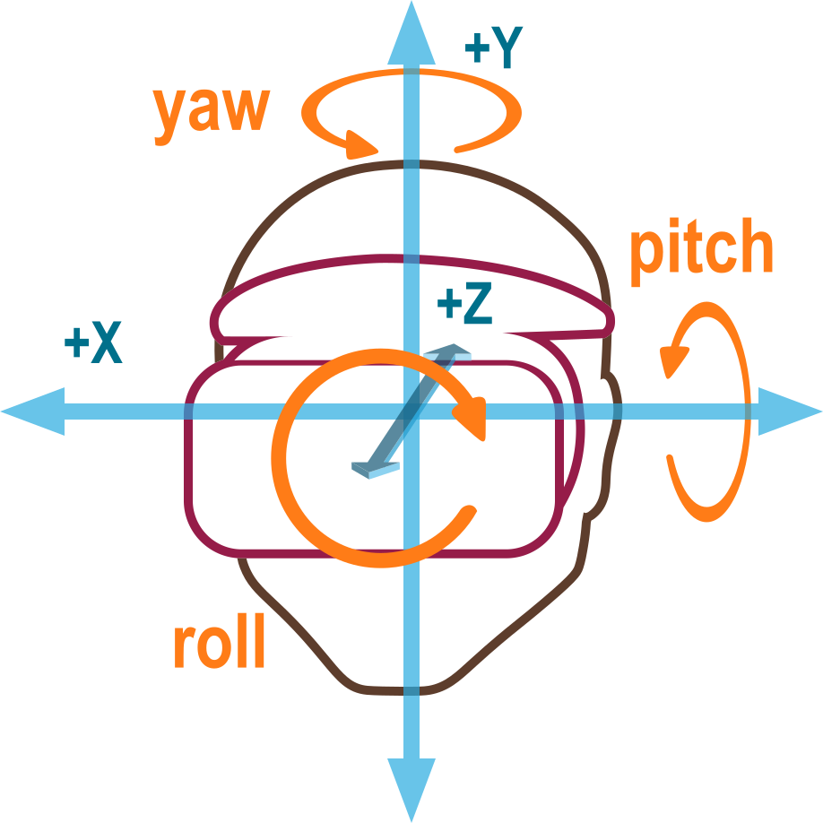
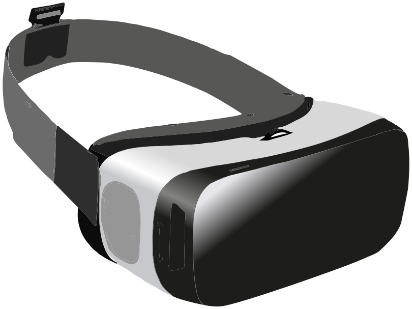

{{DefaultAPISidebar("WebXR Device API")}}

WebXR, with the [WebXR Device API](/en-US/docs/Web/API/WebXR_Device_API) at its core, provides the functionality needed to bring both augmented and virtual reality (AR and VR) to the web. Together, these technologies are referred to as **mixed reality (MR)** or **cross reality (XR)**. Mixed reality is a large and complex subject, with much to learn and many other APIs to bring together to create an engaging experience for users.

This guide provides an overview of what WebXR is and how it works, as well as the preliminary foundation needed to start developing augmented and virtual reality experiences for the web.

## What WebXR is and isn't

WebXR is an API for web content and apps to use to interface with mixed reality hardware such as VR headsets and glasses with integrated augmented reality features. This includes both managing the process of rendering the views needed to simulate the 3D experience and the ability to sense the movement of the headset (or other motion-sensing gear) and provide the needed data to update the imagery shown to the user.

WebXR additionally provides support for accepting inputs from control devices such as handheld VR controllers or specialized mixed reality gamepads.

*WebXR is not a rendering technology and does not provide features for managing 3D data or rendering it to the display.* This is an important fact to keep in mind. While WebXR manages the timing, scheduling, and the various points of view relevant when drawing the scene, it does *not* know how to load and manage models, nor how to render and texture them, and so forth. That part is entirely up to you. Fortunately, WebGL and the various WebGL-based frameworks and libraries are available to make it much easier to deal with all of that.

### How is WebXR different from WebVR?

WebVR was considered an experimental API designed to help specification writers determine the best approaches for creating a virtual reality API on the Web. Browser implementors added WebVR support to browsers, allowing web developers to experiment. But soon it became clear that to finish an API for virtual reality on the web, it would make more sense to start a new specification than to try to "fix" WebVR.

That led to the birth of WebXR. The fundamental difference is that WebXR supports not only virtual reality, but also augmented reality, which blends virtual objects with the user's ambient environment.

Another key difference is that WebXR has integrated support for the advanced [input controllers](/en-US/docs/Web/API/WebXR_Device_API/Inputs) that are used with most mixed reality headsets, while WebVR relied on the [Gamepad API](/en-US/docs/Web/API/Gamepad_API) to support the controllers. In WebXR, the primary select and squeeze actions are directly supported using events, while other controls are available through a special WebXR-specific implementation of the {{domxref("Gamepad")}} object.

## Basic concepts

Before getting into too much detail, let's consider some basic concepts that you need to know before you learn how to develop XR code.

### Field of view

The term **field of view** (**FOV**) is one which applies to any visual technology, from old film cameras to modern digital video cameras, including the cameras in computers and mobile devices.

#### What is field of view?

The field of view is the extent to which you are able to see the environment. The width of the field of view, specified in either degrees or radians, is measured as the angle defining the arc from the far left edge of your field of view to the far right edge.

A human eye is able to take in a FOV of around 135°. Assuming a person has two healthy eyes, the total field of view ends up being about 200° to 220° wide. Why is the FOV wider with two eyes, but not double the single-eye FOV? It's because the two eyes' FOVs overlap a lot. That overlap gives us depth perception, which is around 115° wide. Outside the overlap area, our vision falls back to monocular.

The drawing shown here demonstrates the concept of FOV: blue wedge for the left eye, red wedge for the right eye. The light brown overlapping area is where the viewer has binocular vision and can perceive depth. If you look carefully, you'll see that each eye sees the die slightly differently, and the combined view blends the two into a 3D shape.

Generally, applications only define and manage the horizontal FOV. For more details, see {{SectionOnPage("/en-US/docs/Web/API/WebXR_Device_API/Rendering", "The optics of 3D")}}.

#### Field of view and mixed reality devices

To achieve a wide enough field of view that the user's eyes are tricked into believing that the virtual world completely surrounds them, the FOV needs to at least approach the width of the binocular vision area. Basic headsets typically start around 90° or so, while the best headsets generally have a field of view of around 150°. Because the FOV is a matter of the size of the lenses and how close they are to the user's eyes, there are limitations on how wide the FOV can get without installing lenses into the user's eyeballs.

A wide FOV can substantially improve the user's sense of immersion. However, increasing the FOV can also increase the weight and cost of the headset.

### Degrees of freedom

The term **degrees of freedom** is an indication of how much freedom of movement the user has within the virtual world. This is directly related to how many types of movement the WebXR hardware configuration is capable of recognizing and reproducing into the virtual scene.

**Figure: Diagram showing the movements possible with 3 degree of freedom hardware: yaw, roll, and pitch.**

#### Freedom of rotational movement

The first three degrees of freedom are **rotational**. The rotational degrees of freedom are:

- Pitch: looking up and down
- Yaw: looking left and right
- Roll: tilting left and right

In all of these cases, the viewer remains in the same location in space while pivoting on one or more of the three axes to alter the direction in which they're looking. A system with two degrees of freedom can sense when the user looks left and right or up and down, but can't report any other kind of movement.

A typical baseline headset offers three degrees of freedom, recognizing rotation around all three axes. This is often referred to by the shorthand **3DoF**.

#### Freedom of translational movement

The other three degrees of freedom are translational, providing the ability to sense movement through space: forward and backward, left and right, up and down. Support for all six degrees of freedom is referred to as **6DoF**.

Some more advanced headsets provide at least minimal support for translational movement detection, but to capture more substantial movement through the space, external sensors are usually required, such as cameras (either using visible light or infrared).

### WebXR session modes

WebXR offers support for both augmented reality (AR) and virtual reality (VR) sessions, using the same API. Which type of session you want to create is specified when creating the session. This is done by specifying the appropriate session mode string for the kind of session you want to create.

#### Virtual reality

In a VR environment, the entire image is digitally created by your app or site, from foreground objects all the way to the background or skybox. Your frame drawing code will have to redraw every pixel of each view during each frame in order to avoid the potential of artifacts being left behind. Some platforms may provide previously-cleared frames to you, while others may optimize performance by not erasing the framebuffers in order to avoid having to touch each pixel twice per frame.

There are two VR session modes available in WebXR: **inline** and **immersive**. The former, specified by the session mode string `inline`, presents the rendered scene within the context of a document in a web browser, and doesn't require special XR hardware to view. The immersive session mode is indicated using the session mode `immersive-vr`. This session mode requires an XR device such as a headset, and replaces the entire world with the rendered scene using the displays shown to each of the user's eyes.

#### Augmented reality

In augmented reality (AR), the user sees the imagery you render presented on top of the physical, real-world environment around them. Because AR is always an immersive experience, in which the scene is the entire world around the user (rather than being enclosed in a box on a screen), the only AR session mode is `immersive-ar`.

There are two basic types of AR device:

- Devices which use cameras to capture the world in front of the user, render the WebXR content atop that image, then display the image on a screen. These devices include phones, which show the resulting scene on the device's screen in a 2D presentation, as well as goggles that use a pair of cameras, one for each eye, to capture the scene in stereo in order to retain the world's depth, with the WebXR scene then rendered for each eye with that eye's captured background in place.
- Devices which use transparent glasses to allow the user to see the world, while overlaying the rendered image atop the scene. The user is, thus, directly viewing the real world instead of a series of digital photos of it.

Both types of device should be capable of also presenting VR sessions. WebXR doesn't generally care which type of device you're using, and the rendering process is almost exactly the same as for VR, except you don't erase the background or skybox before rendering each frame.

## Types of WebXR hardware

The simplest XR presentation involves rendering the scene directly to the user's screen, either in the context of a web document, or in full screen mode. This is most common when the user either doesn't have a dedicated XR device, or when the user is viewing the AR or VR app on a phone or other handheld device.

Simpler and lower-priced XR devices typically use an integrated computer or connect to a smartphone, essentially using the mobile CPU and GPU to run apps, render images, and display them to the user. Higher-powered solutions typically offload application execution and graphics processing to an external device such as a desktop computer, and are either tethered to the computer using a cable or use a wireless network to receive the imagery to display to the user.

### Headsets

Most immersive VR experiences take place using goggles or a headset of some kind. A VR headset is worn on the head, with a strap that goes behind the head to fasten it in place, and one or two displays whose screens are focused into the eyes using lenses. By presenting a slightly different image to each eye, the illusion of depth is created, giving the user a simulated 3D experience.

The vast majority of headsets use a single display whose frame is divided in half, with one half focused onto each of the user's eyes. For example, if a headset uses a 2560x1440 screen, with the left half being used for the left eye's view and the right half for the right eye's view, the framebuffer is used like this:

The simplest headsets have no integrated sensors, and focus each half of the screen into the corresponding eye. A common example of this is [Google Cardboard](https://arvr.google.com/cardboard/), a type of headset first created by Google which can be cheaply created using cardboard or other inexpensive materials. These devices often work by snapping your phone into the headset so that its screen and onboard graphics processor can be used to render and display the XR scene.

More advanced headsets have integrated displays and are strapped to the head using an elastic or strap or a strap with Velcro closure.  These headsets may include integrated speakers and microphone, and/or connectors to attach external ones. Additionally, these headsets may have various sensors for detecting when the headset moves through space. The types and number of sensors included will determine how many [degrees of freedom](#degrees_of_freedom) the user has.

### Goggles and glasses

XR goggles are similar to headsets in that they involve the placing of graphics display surfaces in front of the eyes in order to render the views of a scene needed to simulate the depth of the simulated scene.

The difference is that the goggles pass through the real world, overlaying the rendered image on top of the user's physical environment. This is done without digitally reproducing the world, as would be necessary with a full headset. Instead, the display surface is transparent, and if not displaying anything is essentially identical to wearing regular eyeglasses. When objects are drawn, they are drawn onto the goggles' lenses, either partially or completely blocking the physical environment from being seen through the obscured portion of the lens.

### CAVEs

A **Cave Automated Virtual Environment** (**CAVE**) is an immersive VR environment in which the scene is projected or otherwise displayed on the walls (as well as possibly the ceiling and/or floor), thus completely surrounding the user with the simulation and allowing them to be immersed in the scene. The user wears 3D glasses that both add the 3D effect to the projected image, but provide a means for the system to render foreground objects into the world.

The user's activity may be monitored using motion sensors that are worn or held by the user, or, increasingly commonly, using infrared cameras that detect the user's movements. Speakers placed around the chamber provide immersive sound as well.

These are not common among everyday users; they're mostly either experimental, used for demonstration purposes, or used by larger organizations. One drawback is that the CAVE can't simulate anything closer than the wall.

## Important health and safety reminders

Because the entire act of creating a virtual 3D world is, in essence, a trick which takes advantage of our understanding of how eyes collect light and how the brain interprets the collected data, it is important to keep in mind that as such, software designers and developers have a responsibility to be even more careful than usual to ensure that the results are correct.

### Virtual reality sickness

**[Virtual reality sickness](https://en.wikipedia.org/wiki/Virtual_reality_sickness)** is a condition in which a person experiencing virtual reality feels discomfort, disorientation, or even serious nausea during and sometimes for a short time after the experience.

There are a number of theories surrounding exactly what about virtual reality causes some people to feel uncomfortable or sick, most of which focusing on the idea that even subtle differences between what the brain thinks should be happening and what is being seen can cause these symptoms.

Defects, misalignments, or distortion can confuse the eyes and the brain, resulting in anything from aching eyes or headache to in some cases vertigo, dizziness, or potentially severe nausea. It's also important to be alert for anything you may display that may have the potential to trigger seizures, given the all-encompassing nature of a headset; the user may not be able to quickly look away from the imagery you're presenting if it's causing distress.

### Physical risks

Another potential issue with immersive virtual reality is the user colliding with physical obstacles if they're moving around their room while wearing a headset. Unless they're in a safe environment, it's important to provide cues to restrict their movement, such as by simulating a space that is known to be safe within their physical environment.

If the user's headset is tethered to a device, it's a good idea to try to ensure that the user isn't prompted or tempted to move in such a way that they pull or yank on the headset cord, which could not only cause injury, but could cause significant damage to the user's headset or device (whether it's a phone or a computer).

If you have any content that may be of risk to any users, you should provide a warning message. Likewise, it's worth reminding users to remain seated if possible, and to be cautious about moving around while wearing a headset if the experience is fully-immersive virtual reality. It's always better to be safe than sorry!

## The role of frameworks

Because 3D graphics—and mixed reality in particular—involve a lot of often intricate math, data management, and other complex tasks, it's unlikely that you'll directly use WebGL to render your scene in most cases. Instead, you'll probably do most of your work making use of one of the frameworks or libraries that are built atop WebGL to make it more convenient to use.

A particular benefit to using a framework rather than directly using the WebGL API is that libraries tend to implement virtual camera functionality. OpenGL (and thus WebGL by extension) does not directly offer a camera view, using a library that simulates one on your behalf can make your job much, much easier, especially when building code that allows free movement through your virtual world.

Since [WebGL](/en-US/docs/Web/API/WebGL_API) is used for rendering the 3D world into the WebXR session, you should first be familiar with WebGL's general usage, and with the basics of 3D graphics in general.

### General-purpose 3D frameworks

These frameworks are good for general-purpose programming as well as for game development when you want to do the logic yourself. They're designed for creating and animating 3D scenes regardless of context.

- [A-Frame](https://aframe.io/) (specifically designed for creating WebXR-based apps)
- [Babylon.js](https://www.babylonjs.com/)
- [Three.js](https://threejs.org/)

### Game toolkits

The game toolkits are designed for game developers and often include gaming-specific features such as physics models, input control systems, asset management, 3D sound playback, and the like.

- [PlayCanvas](https://playcanvas.com/)

## Next steps

With these basic facts in hand, you're ready to take those next steps into the world of mixed reality. The following articles can help.

- [WebXR application life cycle](/en-US/docs/Web/API/WebXR_Device_API/Lifecycle)
- [Starting up and shutting down a WebXR session](/en-US/docs/Web/API/WebXR_Device_API/Startup_and_shutdown)
- [Movement, orientation, and motion: A WebXR example](/en-US/docs/Web/API/WebXR_Device_API/Movement_and_motion)
