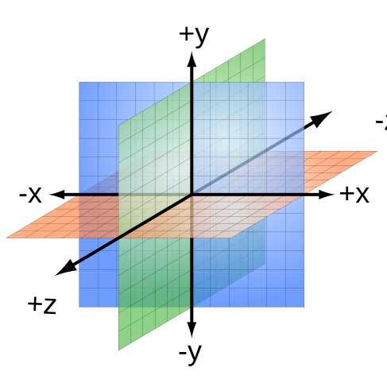

{{DefaultAPISidebar("WebXR Device API")}}

At a fundamental level, rendering of scenes for [WebXR](/en-US/docs/Web/API/WebXR_Device_API) presentation in either augmented reality or virtual reality contexts is performed using [WebGL](/en-US/docs/Web/API/WebGL_API), so the two APIs share much of the same design language. However, in order to provide the ability to present scenes in true 3D using XR headsets and other such equipment, WebXR has additional concepts that must be understood.

In this article, we introduce the ways in which WebXR expands upon the geometry of WebGL, and how the positions and orientations of objects—both physical and virtual—are described in relation to one another using spaces and, in particular, reference spaces.

The article [Spatial tracking in WebXR](/en-US/docs/Web/API/WebXR_Device_API/Spatial_tracking) builds upon the information provided here to cover how the physical position and orientation of the user's head, as well as potentially other parts of their body such as the hands, are mapped into the digital world, as well as how the relative positions of both physical and virtual objects are tracked as they move around, so that the scene can be properly rendered and composited.

## Fundamentals of 3D geometry

While we'll examine here the required math operations used to compute the positions, orientations, and movement of objects in virtual space—plus the need to integrate the human viewer of the scene into the mix—a thorough introduction to geometry and the use of matrices and vectors to manage 3D representations of a scene is well beyond the scope of what can be accomplished in this article. You can learn more about the individual operations in [Matrix math for the web](/en-US/docs/Web/API/WebGL_API/Matrix_math_for_the_web).

### Units

Before discussing the details of the geometry of the 3D space used by WebXR, it's first useful to understand the units of measure that are applied to the 3D world.

#### Lengths and distances

WebGL measures all distances and lengths in **meters**. WebXR inherits this standard, as well as the fact that the world is a cube two meters wide, two meters tall, and two meters deep. Each of the three axes has a minimum value of -1.0 and a maximum of 1.0, with the center of the cube located at (0, 0, 0).


This eight cubic meter space encompasses the entire universe for the purposes of your code. Everything you draw must have its coordinates mapped to fit into this space, either explicitly within your code, or by using a transform to adjust the coordinates of all vertices. The most efficient way, of course, is to design your objects and code to use the same coordinate system as WebGL does.

The WebGL coordinates and lengths are transformed automatically at render time to the size of the viewport in which the scene is being rendered.

#### Angles

Angles are specified using **[radians](https://en.wikipedia.org/wiki/Radians)**. To convert degrees to radians, multiply the value in degrees by `π/180`. The following code snippet shows two simple functions, `degreesToRadians()` and `radiansToDegrees()`, which convert back and forth between the two units for measuring angles.

```js
const RADIANS_PER_DEGREE = Math.PI / 180.0;

let degreesToRadians = (deg) => deg * RADIANS_PER_DEGREE;
let radiansToDegrees = (rad) => rad / RADIANS_PER_DEGREE;
```

#### Times and durations

> **Note:** For security reasons, `DOMHighResTimeStamp` usually introduces a
> small amount of imprecision to the clock in order to prevent it from being used in [fingerprinting](/en-US/docs/Web/Privacy#fingerprinting) and timing-based
> attacks.

All times and durations in WebXR are measured using the {{domxref("DOMHighResTimeStamp")}} type, which is a double-precision floating-point value specifying the time in milliseconds relative to the starting time. Since the value is a floating-point number, it may be accurate to well better than the millisecond level, depending on the platform and hardware.

Time is primarily used to determine the amount of time that's elapsed since the scene's previous animation frame was drawn. As such the time is typically in alignment with the refresh rate of the display, or some fraction thereof if the frame rate needs to be constrained due to performance issues. This means that the time will usually step in 1/60th of a second intervals, assuming a 60 FPS frame rate. Doing the math, we find that this means that each frame will ideally be rendered 16.6667 milliseconds apart.

### Geometry operations with matrices

We offer a [guide to matrix mathematics as it pertains to 3D geometry](/en-US/docs/Web/API/WebGL_API/Matrix_math_for_the_web), including how matrices are used for the three primary transforms that need to be performed when rendering 3D scenes:

- **[Translation](/en-US/docs/Web/API/WebGL_API/Matrix_math_for_the_web#translation_matrix)** is the use of a matrix to shift the position of a point through the virtual space. This motion can be along any of the object's axes, or any combination of them.
- **[Rotation](/en-US/docs/Web/API/WebGL_API/Matrix_math_for_the_web#rotation_matrix)** is the application of a matrix that rotates a point around the origin of the object's coordinate system.
- **[Scaling](/en-US/docs/Web/API/WebGL_API/Matrix_math_for_the_web#scale_matrix)** is the use of a matrix to alter the size of an object.

Note that when we say that a transform applies to a point, it also, by extension, can be applied to a _collection_ of points. Since an object is represented by some number of polygons made up of a number of points in space, applying the same transform to every point that makes up the object will apply that same transform to the entire object overall. Transforms can also be applied to vectors, since vectors are described using a coordinate value to define the direction and magnitude of the vector.

## On the origins of spaces

A complete XR-enhanced scene—whether virtual or augmented—is a composite of anywhere from one to potentially dozens of frames of reference. Each object within the scene that needs to directly exchange position and orientation data with the WebXR system needs to be able to report that information in a way that can be understood and adapted as needed to be comprehensible by other objects within the scene.

In augmented reality (AR), this is because of the need to insert virtual objects into the real world, not only placing them correctly but also ensuring that they don't seem to wander around on their own as the user's perspective shifts. In virtual reality (VR), it's all about creating a sense of space in which the user's movements are precisely matched by the imagery presented on the virtual display, to prevent disjoints and disconnects that could cause discomfort or worse.

Thus it's all about creating a sense of space. From the perspective of an XR developer, designing the stage is the part that matters most to your users. Like an architect or a set designer, you have the power to create moods and experiences through a physical environment. How you structure that space will both depend on and influence how users can interact and explore it.

> **Note:** A space will typically have foreground, mid-distance, and background elements. The right balance can create a unique presence and guide your user. The foreground includes objects and interfaces that you can interact with directly. The mid-distance includes objects you can interact with to some extent, or can approach in order to examine and engage with more closely. The background, on the other hand, is usually largely or entirely non-interactive, at least until and unless the user is able to approach it, bringing it into the mid-distance or foreground range.

In WebXR, the fundamental concept of a **space**—as in, a coordinate space in which a scene takes place—is represented by an instance of {{domxref("XRSpace")}}. The space is used to make determinations about the relative positions and motion of objects and other entities (such as light sources and cameras) within the user's environment.

As mentioned earlier, any given 3D point consists of three components, each identifying the distance from the center of the space along one of the three axes.

This is the **native origin** of the space, corresponding to a specific physical location in the user's environment. Each space has its own native origin, which is tracked by the XR device's tracking system. This may be different from the **effective origin**, which is the origin point for the space's local coordinate system.

The directionality of the coordinate system can be seen in the following diagram:



An {{domxref("XRRigidTransform")}} called the **origin offset** is used to transform points from the space's own effective coordinate system to the XR device's native coordinate system. The origin offset is initially an identity transform, since typically the two origins are aligned when the space is first established. However, as changes in alignment accumulate over time the origin offset may change to compensate.

The position of a point in space relative to the origin is determined by determining its distance along each of the three spatial axes shown in the diagram above. The space's origin is the point (0, 0, 0), at the center of the space and at the zero position along each axis. Specifically, under the initial starting conditions, with the default orientation of the viewer upon the space:

- The **x-axis** extends horizontally from left to right away from the origin, with the _x_ coordinate of +1.0 being located at the right edge of the world. Negative values of _x_ extend toward the left from the origin, reaching a value of -1.0 at the left edge of the space.
- The **y-axis** is positive extending upward from the origin toward the top of the screen, reaching +1.0 at the top of the world space. Values of _y_ less than 0 are found below the origin, extending toward the bottom of the screen and reaching -1.0 at the bottom of the world's space.
- The **z-axis** extends from the origin outward from the screen, reaching +1.0 at the closest point to the user in that direction. Negative values of _z_ extend away from the user further into the screen, with the farthest away point in the world having a _z_ of -1.0.

Every object is, at the simplest level, a set of polygons defined by points in 3D space and an offset transform, indicating how to move and rotate the object to position it at the desired point in space. If the offset transform is an identity matrix, the object is located at the origin point.

To be useful for spatial tracking and scene geometry, though, you need to be able to correlate the XR device's perceived position with the space's coordinate system. That's where reference spaces come in.

## Reference spaces

Because of the variety of XR hardware available, coming in a wide variety of form factors from many developers, it's impractical and non-scalable to expect developers to have to directly communicate with the tracking technology being used. Instead, the [WebXR Device API](/en-US/docs/Web/API/WebXR_Device_API) is designed to have developers plan their users' experiences and request an appropriate reference space that best represents those needs. This is done by asking the {{Glossary("user agent")}} for an **{{domxref("XRReferenceSpace")}}** matching those needs.

An `XRReferenceSpace` object acts as a means to adapt one coordinate system reference frame to another. After putting on a headset, consider the virtual world around you to have a coordinate system in which your position is (0, 0, 0)—that is, you're at the center of everything. Doesn't that feel empowering? Forward, directly in front of your headset, is the -Z axis, with +Z behind you. X is positive to your right and negative to your left. Y is negative as you go downward and positive as you go upward. This indicates the position of the headset in space at the start of your use of the XR system, with the origin (0, 0, 0) being positioned basically at the bridge of your nose. This space is the **world space**.

Next, consider the XR controller you have in your left hand. It has the ability to report movement and its orientation, but it doesn't know anything about the position of the headset or, more crucially, its coordinate system. But the controller still needs a way to report its position to your app. Thus, it has its own coordinate system. This is a reference space which is provided to your app when input events occur. This reference space internally knows how to map the coordinates of the controller to the headset's coordinates, so WebXR can translate coordinates back and forth for you.

Once created, an `XRReferenceSpace` guarantees a certain level of support for motion and orientation tracking, and provides a mechanism for obtaining an {{domxref("XRViewerPose")}} from which you can get a matrix which represents the position and facing direction of the space relative to the world space, if the space represents a viewer such as the user's headset, an observer's headset, or a virtual camera.

All of this is the browser's responsibility to handle, providing consistent behavior regardless of how capable each of the underlying reference spaces are. No matter how powerful or simple the individual XR device is, code written using WebXR will still work, within the limitations of the available hardware.

Regardless of the type of reference space you choose, its type is {{domxref("XRReferenceSpace")}} or is a type derived from `XRReferenceSpace`. The currently available reference space types, are shown below.

- `bounded-floor`
  - : An {{domxref("XRBoundedReferenceSpace")}} similar to the `local` type, except the user is not expected to move outside a predetermined boundary, given by the {{domxref("XRBoundedReferenceSpace.boundsGeometry", "boundsGeometry")}} in the returned object.
- `local`
  - : An {{domxref("XRReferenceSpace")}} tracking space whose native origin is located near the viewer's position at the time the session was created. The exact position depends on the underlying platform and implementation. The user isn't expected to move much if at all beyond their starting position, and tracking is optimized for this use case. For devices with six degrees of freedom (6DoF) tracking, the `local` reference space tries to keep the origin stable relative to the environment.
- `local-floor`
  - : An {{domxref("XRReferenceSpace")}} similar to the `local` type, except the starting position is placed in a safe location for the viewer to stand, where the value of the y axis is 0 at floor level. If that floor level isn't known, the {{Glossary("user agent")}} will estimate the floor level. If the estimated floor level is non-zero, the browser is expected to round it such a way as to avoid fingerprinting (likely to the nearest centimeter).
- `unbounded`
  - : An {{domxref("XRReferenceSpace")}} tracking space which allows the user total freedom of movement, possibly over extremely long distances from their origin point. The viewer isn't tracked at all; tracking is optimized for stability around the user's current position, so the native origin may drift as needed to accommodate that need.
- `viewer`
  - : An {{domxref("XRReferenceSpace")}} tracking space whose native origin tracks the viewer's position and orientation. This is used for environments in which the user can physically move around, and is supported by all instances of {{domxref("XRSession")}}, both immersive and inline, though it's most useful for inline sessions. It's particularly useful when determining the distance between the viewer and an input, or when working with offset spaces. Otherwise, typically, one of the other reference space types will be used more often.

The remainder of this guide explores how to select the right reference space for your app's needs.

## Defining spatial relationships with reference spaces

There are a number of commonly used ways to reference the positions and orientations of objects relative to their environment, as well as to constrain the environment itself. To that end, WebXR defines a set of standard spaces, called **reference spaces**, each of which supports a different technique for correlating its local space's reference frame coordinate system to the coordinate system of the space in which it exists.

However, regardless of which type of reference space is being used, you can use the same functions to convert coordinates from space to parent space.

### Selecting the reference space type

Straight off, let's state the simplest step in the process of deciding which reference type to use: the reference spaces you're most likely to use are `local`, `local-floor`, `unbounded`, or `bounded-floor`.

#### Floor level reference spaces

The reference space types with `-floor` in their names work just like the corresponding non-floor spaces, except that they attempt to automatically ensure that the viewer is positioned in a safe place at or near (but always above) ground level. This is the plane at which the `y` coordinate is always 0, unless a floor is otherwise established. These space types are _not_ viable if the rooms have uneven floors or floors whose height above ground level vary, since they don't support the avatar's vertical position changing.

#### The primary reference space types

The `viewer` reference space corresponds to the viewer's position in space; it's used by the {{domxref("XRViewerPose")}} returned by the {{domxref("XRFrame")}} method {{domxref("XRFrame.getViewerPose", "getViewerPose()")}}. It's not typically used directly otherwise. The only real exception is that you are likely to use the `viewer` reference space when performing the XR scene inline within web content.

The `local` reference space is typically used to describe a relatively small area, such as a single room. It is not only always available when using an immersive session mode (`immersive-vr` or `immersive-ar`), but is always included among the optional features when requesting a new session; thus, every session created by {{domxref("XRSystem.requestSession", "navigator.xr.requestSession()")}} supports the `local` reference space type.

To represent a large area—potentially involving multiple rooms or beyond—you can use the `unbounded` reference space type, which specifies no constraints on the viewer's movement. If you wish to prevent the user from moving into certain areas, you must handle that yourself.

The `bounded-floor` reference space type doesn't have a corresponding one that isn't floor-bound. If the user's XR hardware permits them to move about their real-world space, and you are able to do so, it may be useful to use a `bounded-floor` reference space, which lets you specifically define the boundaries of the area in which passage is allowed and safe. See the article [Using bounded reference spaces](/en-US/docs/Web/API/WebXR_Device_API/Bounded_reference_spaces) to learn more about the use of bounded reference spaces.

By using a reference space to describe the position and orientation of objects, WebXR is able to standardize the form of the data you use to describe these things, regardless of the underlying XR hardware. The reference space's configuration is then able to provide you with the view matrices and object poses needed to correctly render the contents of the space.

### Establishing the reference space

The topmost space—the one obtained by calling the {{domxref("XRSession")}} method {{domxref("XRSession.requestReferenceSpace", "requestReferenceSpace()")}}—describes the coordinate system used for the overall world space. Everything is fundamentally tied to this coordinate system, which represents the relationship between the user's equipment's position and the virtual world.

While you can use WebXR for everything from augmenting the world with annotations to 360° video playback to scientific simulations to virtual reality training systems or anything else you can imagine, let's take a 3D video game as an example of a typical WebXR application. Consider the model of a player's avatar standing in the game world's space. You position that avatar relative to the world space, using the coordinate system defined by the world's reference space.

To move the player to a new position, you could rewrite all of its coordinates or manually apply a transform each time they move, but there's an easier way, thanks to reference spaces and their ability to be created relative to one another. Create an {{domxref("XRRigidTransform")}} object representing the new position and orientation of the player's avatar, then create a new reference space to represent the avatar's point of view at the new position using the {{domxref("XRReferenceSpace")}} method {{domxref("XRReferenceSpace.getOffsetReferenceSpace", "getOffsetReferenceSpace()")}}. This comes in especially handy when implementing support for using non-XR devices such as keyboards or mice to move the player's avatar through the world.

{{EmbedYouTube("nVSlQkSSQeQ")}}

With the newly-created reference space, the avatar can remain at the same coordinates yet appear in the world to be located at (and be see the world from the perspective of) its new location. For a more detailed look at how to use reference spaces to manage the player's viewpoint, see the article

In the case of our game avatar example, it's rare for an avatar (or any other moving creature or machine) to be a simple blob sliding around the world. They usually have additional form, as well as internal movement, such as moving legs, arms that swing as they walk, a head that turns or bobs, weapons that move around, and so forth. Bring these to life using standard WebGL techniques and a positioning matrix or {{domxref("XRRigidTransform")}} to shift the objects to the correct position relative to the effective origin.

### Device limitations on reference spaces

Some XR devices can't be made to support a given experience, despite the efforts the API goes to in order to make up for any missing capabilities. For example, there's no way for a basic headset such as a GearVR device to be made to work in an app that requires support for allowing the user to walk around the environment by tracking their real-world movements.

To support progressive enhancement—and thus broaden the availability of your app or site—you should choose a reference space that offers the lowest amount of functionality needed, or provide a fallback mechanism that detects failed attempts to obtain reference spaces and tries again with a less powerful alternative.

The compatibility issues that arise may be as fundamental as being unable to support `immersive-ar` mode (augmented reality sessions) on a VR-only headset, or may involve a request for one or more required options which cannot be met when attempting to create the XR session.

XR sessions are created using the {{domxref("XRSystem.requestSession", "navigator.xr.requestSession()")}} method. One of its optional parameters is an object which you can use to specify required and/or optional features that the session must (or should ideally) support. Currently, the only supported options are strings identifying the standard reference spaces. Using these, you can ensure before your code even runs that you have access to a WebXR session that can support the reference space type you require or prefer.

> **Note:** At this time, the reference space to use or to prefer is the only option available when creating an {{domxref("XRSession")}}. In the future, it's likely that more options will become available.

## Positioning and orienting objects

All spatial (position, orientation, and movement) information exchanged between your app and the WebXR API is expressed in relation to a specific space at the time the frame is being rendered. Any further position and orientation management is between you and WebGL, though you do make use of the origin offset from the reference space in order to position the objects correctly in the 3D world.

When it's time to render an animation frame, the callback function specified when you called the WebXR session's {{domxref("XRSession")}} object's {{domxref("XRSession.requestAnimationFrame", "requestAnimationFrame()")}} method is invoked. The callback receives as one of its parameters a timestamp indicating the time at which the frame takes place, and should perform all rendering for the corresponding animation frame.

As the callback is repeatedly called with increasing time values, the callback generates a sequence of frames which are presented using the XR hardware, thereby showing a 3D scene to the user.

You can learn more about the animation process in the article [Rendering and the WebXR frame animation callback](/en-US/docs/Web/API/WebXR_Device_API/Rendering).

For an example and a more detailed, code-level explanation of how to position, orient, and move objects in virtual space, see the article [Movement, orientation, and motion](/en-US/docs/Web/API/WebXR_Device_API/Movement_and_motion).

## See also

- [WebXR Device API](/en-US/docs/Web/API/WebXR_Device_API)
- [WebGL: 2D and 3D rendering for the web](/en-US/docs/Web/API/WebGL_API)
- [Matrix math for the web](/en-US/docs/Web/API/WebGL_API/Matrix_math_for_the_web)
