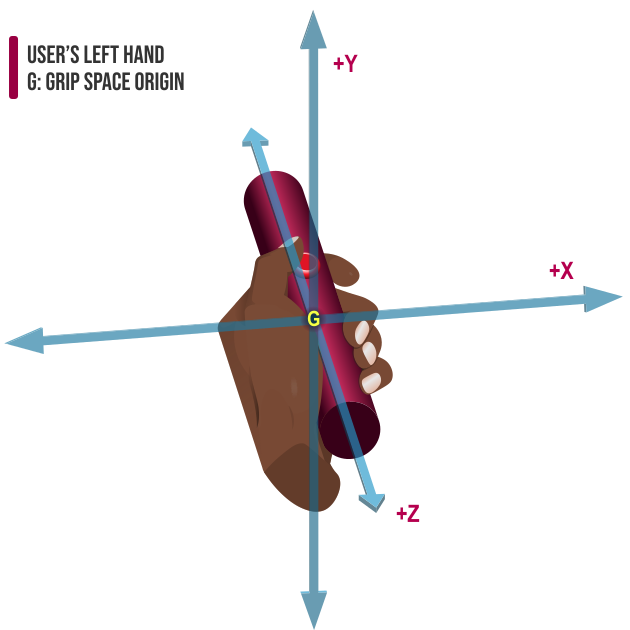
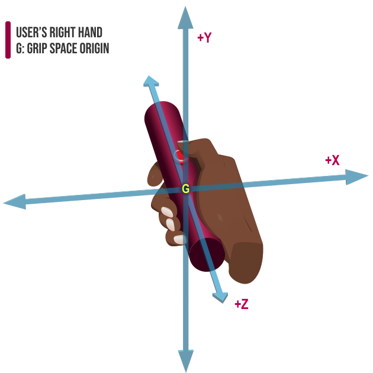
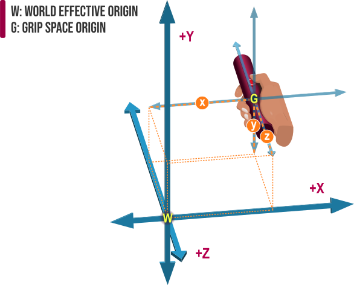
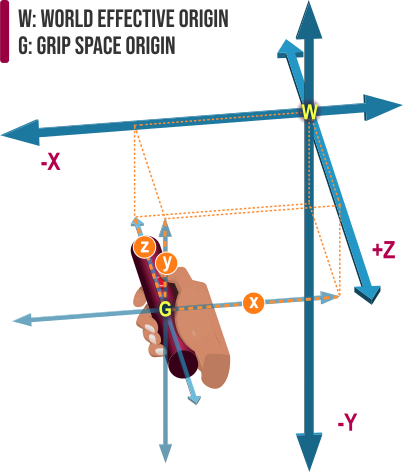

{{APIRef("WebXR Device API")}}{{SecureContext_Header}}

A full WebXR experience isn't just about showing the user a wholly virtual scene or augmenting reality by adding to or altering the world around them. In order to make an experience that's fulfilling and engaging, the user needs to be able to interact with it. To that end, WebXR provides support for a variety of kinds of input devices.

In this guide, we'll look at how to use WebXR's input device management features to determine what input sources are available and how to then monitor those sources for inputs in order to handle user interactivity with your virtual or augmented environment.

## Inputs in WebXR

Fundamentally, inputs in WebXR fall into two basic categories: targeting and actions. Targeting is the specification of a point in space by the user's input. This may involve the user tapping on a spot on the screen, tracking their eyes, or the use of a joystick or motion-sensing controller to move a cursor.

Actions include both selection actions, such as clicking on a button, and squeeze actions, such as pulling a trigger or tightening your grip while wearing haptic gloves.

By combining these two types of input with the changing of viewing position and/or orientation through the headset or other mechanisms, you can create an interactive simulated environment.

### Input device types

WebXR supports a variety of different types of devices to handle targeting and action inputs. These devices include but aren't limited to:

- Screen taps (particularly but not necessarily only on phones or tablets) can be used to simultaneously perform both targeting and selection.
- Motion-sensing controllers, which use accelerometers, magnetometers, and other sensors for motion tracking and targeting and may additionally include any number of buttons, joysticks, thumbpads, touchpads, force sensors, and so on to provide additional input sources for both targeting and selection.
- Squeezable triggers or glove grip pads to provide squeeze actions.
- Voice commands using speech recognition.
- Spatially-tracked articulated hands, such as [wired gloves](https://en.wikipedia.org/wiki/Wired_glove) can provide both targeting and squeeze actions, as well as selection if outfitted with buttons or other sources of selection actions.
- Single-button click devices.
- Gaze tracking (following the movements of the eye to choose targets).

### Input sources

Each source of WebXR input data is represented by an {{domxref("XRInputSource")}} object which describes the input source and its current state. The information for each input source includes which hand it's held in (if applicable), what targeting method it uses, {{domxref("XRSpace")}}s that can be used to draw the targeting ray and to find the targeted object or location as well as to draw objects in the user's hands, and profile strings specifying the preferred way to represent the controller in the user's viewing area as well as how the input operates.

The fundamental capabilities of an input source are:

- Targeting
  - : Monitoring directional controls (either a motion-sensing pointer or a joystick or trackpad, for example) to aim in a direction, possibly at a target, though targeting is left to you to implement yourself. See [Facing and targeting](#facing_and_targeting) for further information.
- Selecting
  - : Using the main "select" button or other input on the controller to choose the targeted direction (or the object at which it points), or to otherwise engage an action. For details on the primary action, see [Primary action](#primary_action).
- Squeezing
  - : Squeezing the controller or a mechanism on the controller to engage a secondary action. The section [Primary squeeze action](#primary_squeeze_action) describes this in more detail.

Any additional capabilities a WebXR controller may have are accessed through the input source's {{domxref("XRInputSource.gamepad", "gamepad")}} object. This object provides access to all of the buttons, axes, trackpads, and so forth that may be a part of the controller. See [Advanced controllers using the gamepad object](#advanced_controllers_using_the_gamepad_object) to learn how to use these controllers.

### Properties of input sources

Each individual `XRInputSource` has a set of properties that describe the input's available axes and buttons, which hand the user's holding it in, and how the input source is used to handle targeting within the 3D space.

#### Handedness

**Handedness**, indicated by the `XRInputSource` property {{domxref("XRInputSource.handedness", "handedness")}}, is a string which indicates which of the viewer's hands the controller is in: `left` or `right`. It can also be set to `none` if the controller isn't hand-held, or if it's unknown which hand the controller is in.

Handedness can be used for various things, including selecting an appropriate mesh to use to represent the controller in the view and to help present it in the correct hand if drawing hands on the display. It can also be useful if your app uses the notion of "main hand" and "off hand" for determining the functionality of a controller; in a game, for example, the main hand controller may be the player's weapon while the off hand controller might be used to control the positioning of a shield.

#### Targeting ray mode

The targeting ray mode is a string found in the {{domxref("XRInputSource.targetRayMode", "targetRayMode")}} property. It describes the technique used to determine the targeting ray and how it should be shown to the user if presented visually.

When the targeting ray mode is `gaze`, the ray's origin is at the viewer and aims in the direction the user is facing. This gaze input method is fairly simple, and doesn't need any special controls, as it will be based on the facing direction reported by the headset or whatever device is used to determine what direction the viewer's face is pointing in. The target ray should extend outward from between the eyes in a direction perpendicular to the viewer's face.

More flexible is the `tracked-pointer` mode, in which the ray's origin is at a handheld controller or hand tracking system's origin and extends outward in the direction in which the controller is pointing. The ray extends outward in a direction defined by whatever platform and controller are being used, if that's defined; otherwise, the ray extends in the same direction the user is pointing in with their index finger, if it were currently outstretched.

The third and final target ray mode is most commonly found on mobile devices like smartphones and tablets. The `screen` mode indicates that the target ray is determined based on the user interacting with the WebXR context by engaging with the screen in some way—most likely by the viewer tapping the screen or dragging the target ray around with their fingers.

#### Target ray space

The {{domxref("XRSpace")}} used to describe the position and orientation of the target ray is found in the {{domxref("XRInputSource.targetRaySpace", "targetRaySpace")}} property. This space's native origin is located at the point from which the target ray is emitted (such as the front tip of the controller, or the end of a gun barrel if the controller is being rendered as a gun, for example), and the space's orientation vector extends outward along the path of the target ray.

You can easily obtain the target ray corresponding to the `targetRaySpace` from within the drawing handler for a given frame using {{domxref("XRFrame")}}'s {{domxref("XRFrame.getPose", "getPose()")}} method. The returned {{domxref("XRPose")}}'s {{domxref("XRPose.transform", "transform")}} is the transform corresponding to the target ray. Thus, for an input controller `primaryInput`:

```js
let targetRayPose = frame.getPose(primaryInput.targetRaySpace,
                       viewerRefSpace);
let targetRayOrigin = targetRayPose.transform.position;
let targetRayVector = targetRayPose.transform.orientation;
```

With this, you now have the point from which the targeting ray is emitted (`targetRayOrigin`) and the direction in which it's pointing (`targetRayVector`), given in the viewer's reference space (`viewerRefSpace`). That's everything you need to be able to draw the targeting ray, determine what's being pointed at, do hit testing, and so forth.

#### Grip space

The input source's {{domxref("XRInputSource.gripSpace", "gripSpace")}} property is an `XRSpace` you can use to render objects so they appear to be held in the viewer's hand.

**Figure: The coordinate system for the left hand's grip space.**

**Figure: The coordinate system for the right hand's grip space.**


The grip space's native origin, located around the center of the player's fist, is (0, 0, 0) within the input source's local coordinate system, while the {{domxref("XRSpace")}} specified by `gripSpace` can be used at any time to convert coordinates or vectors from the input source's space into world coordinates (or vice-versa).

This means that if you use a 3D model to represent your controller, your player's avatar's hands, or anything else representative of the controller's position in space, the `gripSpace` can be used as the transform matrix that correctly positions and orients the object's model for rendering. To do this, it's necessary to use the transform to convert the grip space to the world coordinate system used by WebGL for rendering purposes.

**Figure: Mapping the grip space to the world coordinate system. The distances _x_, _y_, and _z_ together make up the world coordinates (_x_, _y_, z) corresponding to the origin of the grip space _G_.**


In the diagram above, we see the grip space, whose origin is located at _G_, at the midpoint of the user's grip on the controller, which is pointing directly away from the user, parallel to the _z_ axis. Relative to the origin of the world space, _W_, the grip space's origin is located _x_ units to the right, _y_ units above, and _z_ units farther away. Given the directionality of the axes, the coordinates of the grip space can be expressed in world coordinates as (_x_, _y_, -_z_); _z_ is negative since the grip space is farther away along the _z_ axis, and is thus in the negative direction.

If the controller were instead positioned to the left of and closer to the user than the world space origin (or possibly behind the user, if the user is located at the origin, although that's an uncomfortable way to hold a controller), the coordinates would have a negative value for _x_, but a positive value for _z_. The value of _y_ would still be positive unless the controller was moved below the world space origin.

This is shown in the diagram below, in which the controller is located down and to the left of the world space's origin, with the controller also moved to be closer to us than the origin. As a result, the values of _x_ and _y_ are both negative, while _z_ is positive.

**Figure Mapping a grip space to the world origin when the controller is positioned below and to the left of the world origin, and closer to us than the world origin is.**


#### Gamepad record

Each input source has a {{domxref("XRInputSource.gamepad", "gamepad")}} property which, if not `NULL`, is a {{domxref("Gamepad")}} object describing the various controls and widgets available on the controller. If the input device only has the primary movement sensors, a squeeze control, and a button, it may not have a `Gamepad` record. If, however, the `gamepad` is present, you can use it to identify and poll the buttons and axes available on the controller.

While the `Gamepad` record is defined by the [Gamepad API](/en-US/docs/Web/API/Gamepad_API) specification, it's not actually managed by the Gamepad API, and doesn't function exactly the same way. See [Advanced controllers using the gamepad object](#advanced_controllers_using_the_gamepad_object) for more detailed information.

#### Profile strings

Each input source can have zero or more **input profile name** strings, found in the array {{domxref("XRInputSource.profiles", "profiles")}}, each of which describes a preferred visual representation of the input source within the 3D world as well as how the input source functions. The use of these profiles is briefly described under [Input profiles](#input_profiles) below.

### Transient input sources

Some devices may create **transient input sources** to be used in tandem with an action which doesn't really come from that device, but is being presented as if it is. For example, if an XR device provides a mode in which the mouse is used to simulate events on the device, a new {{domxref("XRInputSource")}} object might be created to represent the simulated input source for the duration of handling the action.

This is necessary because of the separation that's maintained between standard input devices and XR input sources. An artificial source is used to represent the external source for the duration of each [transient action](#transient_actions).

## Managing input sources

When multiple input sources are available, you need to be able to obtain information about each one, including its position and orientation, its targeting ray (if applicable to your needs), and details that can help you decide how to present the input source visually, if at all. You also need to be able to determine which input source to use for what activities; for example, if the user has two controllers, which one will be tracked for manipulating UI elements, or will both?

To manage input sources, then, you need to be able to enumerate input sources, examine profile information about each input source, and decide how to use each input controller.

### Enumerating input sources

The WebXR session represented by the {{domxref("XRSession")}} object has an {{domxref("XRSession.inputSources", "inputSources")}} property which is a _live_ list of the WebXR input devices currently connected to the XR system.

```js
let inputSourceList = xrSession.inputSources;
```

Due to the fact that the contents of the {{domxref("XRInputSource")}} objects representing each input source in the list are read-only, changes to these inputs are made by the WebXR system by deleting the source's record and adding a new one to replace it. An {{domxref("XRSession.inputsourceschange_event", "inputsourceschange")}} event is sent to your `XRSession` whenever one or more of the input sources change, or when an input source is added to or removed from the list.

For example, if you need to keep up with which controller is held in each of the player's hands, you might do something like this:

```js
let inputSourceList = NULL;
let leftHandSource = NULL;
let rightHandSource = NULL;

xrSession.addEventListener("inputsourceschange", (event) => {
  inputSourceList = event.session.inputSources;

  inputSourceList.forEach((source) => {
    switch(source) {
      case "left":
        leftHandSource = source;
        break;
      case "right":
       rightHandSource = source;
       break;
    }
  });
});
```

The `inputsourceschange` event is also fired once when the session's creation callback first completes execution, so you can use it to fetch the input source list as soon as it's available at startup time. The event is delivered as an {{domxref("XRInputSourcesChangeEvent")}}, which includes three properties of interest:

- {{domxref("XRInputSourcesChangeEvent.session", "session")}}
  - : The `XRSession` for which the input sources have changed.
- {{domxref("XRInputSourcesChangeEvent.added", "added")}}
  - : An array of zero or more {{domxref("XRInputSource")}} objects indicating the input sources that have been newly added to the XR system.
- {{domxref("XRInputSourcesChangeEvent.removed", "removed")}}
  - : An array of zero or more {{domxref("XRInputSource")}} objects indicating any input sources that have been removed from the XR system.

### Identifying the input's profile

Each input source has a {{domxref("XRInputSource.profiles", "profiles")}} property, which contains a live list of the WebXR input profiles which apply to the input source, in order of specificity from most-specific to least.

In order to do anything meaningful involving scanning of profiles beyond basic identification of features, you may need to import the JSON profile database from the [WebXR Input Profiles Registry](https://github.com/immersive-web/webxr-input-profiles/tree/master/packages/registry).

See [Input profiles](#input_profiles) for more specific details on working with input profiles.

### Choosing the primary controller

In order to avoid having problems introduced by multiple controllers trying to inadvertently manipulate the UI at the same time, your app may need to have a "primary" controller. Not only would this controller then take the responsibility of clicking through the user interface of your app, but it would also be considered the "main hand," while other controllers would then be off-hand or additional controllers.

> **Note:** This doesn't mean your app _needs_ to decide upon a primary controller. But if it does, these strategies may help.

There are a few ways you can decide upon a primary controller. We'll look at three.

#### Handedness

The most direct way to decide which controller is primary is to have a user-definable "Handedness" preference that the user sets to indicate which of their hands is dominant. You would then look at each input source and find one matching this, if available, falling back to another controller if no controller is in that hand.

```js
const primaryInputSource =
  xrSession.inputSources.find((src) => src.handedness === user.handedness) ??
  xrSession.inputSources[0];
```

This snippet of code starts by assuming that the first input source is the primary, but then looks for one whose {{domxref("XRInputSource.handedness", "handedness")}} matches the one specified in the `user` object. If it matches, that input source is selected as the primary.

#### First-used

Another option is to use the first input the user triggers the select action on. The code below starts by assuming the first input source is the primary, then establishes a handler for the {{domxref("XRSession.select_event", "select")}} event that records the event's source as the primary input source. Then the `select` event handler is replaced with the function `realSelectHandler()`, which will be used for handling all future `select` events. Then we pass the event through to `realSelectHandler()` to allow the event to be processed as normal.

```js
let primaryInputSource = xrSession.inputSources[0];

xrSession.onselect = (event) => {
  primaryInputSource = event.inputSource;
  xrSession.onselect = realSelectHandler;
  return realSelectHandler(event);
};
```

The effect is that we set the primary input source the first time a `select` event is received, regardless of which input source it comes from, handle the event as normal from there, and from then on handle the events as usual without any further worries about which input source is primary.

#### User-selected

The most complex way to determine a primary input source is highly flexible but can require a great deal of work to implement. In this scenario, you iterate over the list of input sources and their profiles to gather information about each input source, then present a user interface describing each input, allowing the user to assign uses to each of them. Doing this well could be a big job, but it might be useful for complex apps that may involve several user inputs.

Much of the information you need in order to implement this can be found in the section on [Input profiles](#input_profiles), below. Details are beyond the scope of this article, however.

## Input profiles

As mentioned above, each input source has a list of input profile names that correspond to a set of information describing that input source and how it can be used. Those names are found in the input source's {{domxref("XRInputSource.profiles", "profiles")}} property, and the official registry of these profile strings is maintained in the [WebXR Input Profiles Registry](https://github.com/immersive-web/webxr-input-profiles) on GitHub.

For example, the `generic-trigger-squeeze-touchpad` profile name can be used to locate the following JSON profile data by locating the `profileId` field that has the value `generic-trigger-squeeze-touchpad`.

```json
{
    "profileId": "generic-trigger-squeeze-touchpad",
    "fallbackProfileIds": [],
    "layouts" : {
        "left-right-none" : {
            "selectComponentId": "xr-standard-trigger",
            "components": {
                "xr-standard-trigger": { "type": "trigger" },
                "xr-standard-squeeze": { "type": "squeeze" },
                "xr-standard-touchpad": { "type": "touchpad" }
            },
            "gamepad": {
                "mapping": "xr-standard",
                "buttons": [
                    "xr-standard-trigger",
                    "xr-standard-squeeze",
                    "xr-standard-touchpad"
                ],
                "axes":[
                    { "componentId": "xr-standard-touchpad", "axis": "x-axis"},
                    { "componentId": "xr-standard-touchpad", "axis": "y-axis"}
                ]
            }
        }
    }
}
```

This is a controller which regardless of which hand it's in (and even if it's not currently associated with a specific hand) has three components: a standard trigger, a standard squeeze input, and a touchpad. According to the `selectComponentId` property, the `xr-standard-trigger` component is the one used to perform a primary action.

Additionally, the `gamepad` object maps those inputs to the gamepad, assigning the trigger, squeeze, and touchpad tap to the input source's button list and the touchpad's "axes" to the axis list.

The list in `profiles` is in order of reverse specificity; that is, the most precise description is first, and the least precise description is last. The first entry in the list is typically indicative of the precise model of the controller, or of a model with which the controller is compatible.

For example, entry 0 in `profiles` for an Oculus Touch controller is `oculus-touch`. The next entry is `generic-trigger-squeeze-thumbstick`, indicating a generic device with a trigger, a squeeze control, and a thumbstick. While the Oculus Touch controller actually has a thumbpad rather than a thumbstick, the overall description is "close enough" that the details within the profile matching the name will let the controller be interpreted usefully.

## Actions

In WebXR, an **action** is a special type of event that's triggered by the user activating a special button on the controller. Any additional buttons (as well as things like axis controllers—joysticks, for example—and the like) are managed solely through the {{domxref("XRInputSource")}} property {{domxref("XRInputSource.gamepad", "gamepad")}}. See [Advanced controllers using the gamepad object](#advanced_controllers_using_the_gamepad_object) below for further details on supporting these extra controls and buttons.

The **primary action** is the action that is triggered when the user engages the main control element that serves a special purpose. There are currently two types of primary action:

- The **primary action** is the action which is activated when the user activates the primary or "select" input on their controller. This input may be a button, trigger, trackpad tap or click, a voice command, or special hand gesture, or possibly some other form of input. For example, on a hand controller with a trackpad that can be clicked on, a trigger control, as well as back and "menu" buttons, clicking the trackpad is likely to be the primary action. Some controllers might have a button labeled "select." On a gamepad-style controller, the "A" button is likely to be the primary action.
- The **primary squeeze action** is the action which is engaged when the user squeezes the controller. This "squeezing" may be detected by literally using a pressure sensor in the controller, or may be simulated using a trigger, hand gesture, or other mechanism. For example, if the input controller is a haptic glove, it might report that the primary squeeze action has occurred when the user makes and clenches their fist.

While a given input source can have only one primary action and one primary squeeze action, there may be more than one control on the input device configured to trigger each primary action. For example, the user might have their controller set up so that both tapping and clicking the trackpad generate a primary action.

These types of input actions are described in more detail below.

### Primary action

Each input source should define a **primary action**. A primary action (which will sometimes be shortened to "select action") is a platform-specific action which responds to the user manipulating it by delivering, in order, the events {{domxref("XRSession.selectstart_event", "selectstart")}}, {{domxref("XRSession.select_event", "select")}}, and {{domxref("XRSession.selectend_event", "selectend")}}. Each of these events is of type {{domxref("XRInputSourceEvent")}}.

> **Note:** If an input source doesn't have a primary action, the input source is considered to be an **auxiliary input source**.

When the user points a device along a target ray in your 3D space and then triggers a select action, the following events are sent to the active {{domxref("XRSession")}}:

1. A {{domxref("XRSession.selectstart_event", "selectstart")}} event, indicating that the user has performed the activity that begins the primary action. This may be a gesture, pressing a button, or the like.
2. If the primary action ends successfully (for example, due to the user releasing the button or trigger), rather than because of an error, the {{domxref("XRSession.select_event", "select")}} event is sent.
3. After the `select` event is sent _or_ if the controller on which the action is being performed is disconnected or otherwise becomes unavailable, the {{domxref("XRSession.selectend_event", "selectend")}} event is sent.

Generally speaking, the `selectstart` and `selectend` events tell you when you might want to display something to the user indicating that the primary action is going on. This might be drawing a controller with the activated button in a new color, or showing the targeted object being grabbed and moved around, starting when `selectstart` arrives and stopping when `selectend` is received.

The `select` event, on the other hand, is the event that tells your code that the user has completed the action they want to complete. This might be as simple as throwing an object or pulling the trigger of a gun in a game, or as involved as placing an object that they were dragging around the world back down again in a new location.

If your primary action is a simple trigger action and you don't need to animate anything while the trigger is engaged, you can ignore the `selectstart` and `selectend` events and act on the `select` event.

```js
xrSession.addEventListener("select", (event) => {
  let inputSource = event.inputSource;
  let frame = event.frame;

  /* handle the event */
});
```

Some actions may send these events very quickly, one after the other. The time that elapses between these events depends on both the hardware apparatus that causes the action as well as the software drivers that interpret the hardware action and turn it into a series of events. Do not presume these events will happen with any particular amount of time between them.

For example, if the hardware that causes the primary action to occur is a button, you would receive `selectstart` when the user presses the button, then `select` and `selectend` when the user releases it.

There are a number of examples showing how to handle `select` events throughout the documentation, such as in the section on [Targeting and the targeting ray](#targeting_and_the_targeting_ray) elsewhere in this article.

### Primary squeeze action

A **primary squeeze action** is a platform-specific action which sends the {{domxref("XRSession")}} {{domxref("XRSession.squeezestart_event", "squeezestart")}}, {{domxref("XRSession.squeezeend_event", "squeezeend")}}, and {{domxref("XRSession.squeeze_event", "squeeze")}} events. This is typically generated by the user squeezing the controller, making a hand gesture that mimes grabbing something, or using (squeezing) a trigger.

The sequence of events is identical to those sent by the primary action, save for the name of each event:

1. An {{domxref("XRSession.squeezestart_event", "squeezestart")}} event is sent to the {{domxref("XRSession")}}, indicating that the user has begun a squeeze action.
2. If the primary squeeze action ends successfully, the session is sent a {{domxref("XRSession.squeeze_event", "squeeze")}} event.
3. Then, a {{domxref("XRSession.squeezeend_event", "squeezeend")}} event is sent to indicate that the squeeze action is no longer underway. This is sent whether the squeeze action succeeded or not.

Two common uses for the primary squeeze action are to grasp and/or pick up objects in the 3D world and to squeeze a trigger to fire a weapon in a game or simulation.

#### Example

This sample code shows a set of squeeze event handlers that implement these events to manage picking up and holding objects from the scene. The code presumes the existence of an `avatar` object representing the character, as used in several other examples on this page, as well as the `pickUpObject()` and `dropObject()` functions, which handle transferring an object from the world to a particular hand and releasing an object from the hand and placing it back into the world.

##### Picking up an object: handling squeezestart events

```js
xrSession.addEventListener("squeezestart", (event) => {
  const targetRaySpace = event.inputSource.targetRaySpace;
  const hand = event.inputSource.handedness;

  let targetRayPose = event.frame.getPose(targetRaySpace, viewerRefSpace);
  if (!targetRayPose) {
    return;
  }

  let targetRayTransform = targetRayPose.transform;
  let targetObject = findTargetObject(targetRayTransform);

  if (targetObject) {
    if (avatar.heldObject[hand]) {
      dropObject(hand);
    }
    pickUpObject(targetObject, hand);
  }
});
```

The {{domxref("XRSession.squeezestart_event", "squeezestart")}} event is handled by getting those pose and transform as usual, and getting the input source's {{domxref("XRInputSource.handedness", "handedness")}} into the local constant `hand`. We'll use that to map the hand to the object held in that hand.

The code then identifies the targeted object, then, if an object is found along the targeting ray, picks it up. Picking up an object involves first looking to see if the hand represented by dropping any object already being held in the hand represented by `avatar.heldObject[hand]`. If an object is already held in that hand, it's dropped by calling the `dropObject()` function.

Then `pickUpObject()` is called, specifying the targeted object as the object to remove from the scene and place into the specified `hand`. `pickUpObject()` also records the original position of the object so it can be returned to that spot if the squeeze is canceled or aborted.

##### Dropping the object: the squeeze event handler

The {{domxref("XRSession.squeeze_event", "squeeze")}} event is received when the user ends the squeeze action by releasing their grip. In this example, we interpret that as releasing the currently-held object, dropping it into the scene at the targeted location.

This code presumes the existence of additional functions `findTargetPosition()`, which follows the target ray until it collides with something, then returns the coordinates at which the collision occurred, and `putObject()`, which places the object held in the specified `hand` at the given position, removing it from the hand.

```js
xrSession.addEventListener("squeeze", (event) => {
  const targetRaySpace = event.inputSource.targetRaySpace;
  const hand = event.inputSource.handedness;

  let targetRayPose = event.frame.getPose(targetRaySpace, viewerRefSpace);
  if (!targetRayPose) {
    return;
  }

  let targetRayTransform = targetRayPose.transform;
  let targetPosition = findTargetPosition(targetRayTransform);

  if (targetPosition) {
    if (avatar.heldObject[hand]) {
      putObject(hand, targetPosition);
      avatar.heldObject[hand] = null;
    }
  }
});
```

As in the `squeezestart` handler, this begins by collecting information needed about the event, including the hand that's dropping an object and the target ray's transform. The target ray transform is passed into the presumed `findTargetPosition()` function to get the coordinates at which to position the dropped object.

With the position in hand, we can then drop the object by calling the `putObject()` function, which takes as its inputs the `hand` and the destination position. This function's job is to remove the object from the specified hand and add it back to the scene, with its position set to place it atop the coordinates returned by `findTargetPosition()`.

##### Canceling the squeeze in the squeezeend handler

The {{domxref("XRSession.squeezeend_event", "squeezeend")}} event is received after the squeeze is complete, even if it fails. We handle it by returning the currently-held object to where it was when it was picked up.

```js
xrSession.addEventListener("squeezeend", (event) => {
  const targetRaySpace = event.inputSource.targetRaySpace;
  const hand = event.inputSource.handedness;

  if (avatar.heldObject[hand]) {
    returnObject(hand);
    avatar.heldObject[hand] = null;
  }
});
```

Here, the `returnObject()` function is assumed to be one which knows how to return the object held in the specified `hand` to its initial position, as it was recorded by `pickUpObject()` in the `squeezestart` event handler.

Here, the `returnObject()` function is assumed to be one which knows how to return the object held in the specified `hand` to its initial position, as it was recorded by `pickUpObject()` in the `squeezestart` event handler.

### Transient actions

If an XR device uses the mouse to simulate a controller when in the `inline` mode, the approximate sequence of things takes place:

1. The user presses the mouse button while inside the {{HTMLElement("canvas")}} presenting the WebXR scene.
2. The mouse event is captured by the XR device's driver.
3. The device creates a new `XRInputSource` to represent the simulated XR input source. The {{domxref("XRInputSource.targetRayMode", "targetRayMode")}} is set to `screen`, and the other information is filled out as appropriate. This new input source is temporarily added to the list that's returned by the {{domxref("XRSession")}} property {{domxref("XRSession.inputSources", "inputSources")}}.
4. The browser delivers {{domxref("HTMLElement/pointerdown_event", "pointerdown")}} events corresponding to the action.
5. A primary action is generated and sent to the app in the form of a {{domxref("XRSession.selectstart_event", "selectstart")}} event, with its source set to the new `XRInputSource`. Or, if the mouse is being used as an off-hand or secondary controller, an auxiliary action is sent instead.
6. When the user releases the mouse button, the {{domxref("XRSession.select_event", "select")}} event is sent to the `XRSession`, then the DOM receives a {{domxref("Element.click_event", "click")}} event. The session then receives the {{domxref("XRSession.selectend_event", "selectend")}} event indicating the completion of the action.
7. When the action is completed, the browser deletes the transient input source, and any appropriate {{domxref("HTMLElement/pointerup_event", "pointerup")}} events are sent.

Thus, the transient input source is indeed transient—it exists only for the duration of handling the input and will as such not be listed in the input source list.

## Facing and targeting

**Facing** is the direction in which the viewer is looking. This isn't provided using an input source. Instead, it's obtained using the {{domxref("XRPose")}} obtained from the current animation frame's {{domxref("XRFrame.getViewerPose()")}} method. The rotation component of the viewer pose's transform matrix is the viewer's facing direction.

You can learn more about how to use this the viewer pose to determine the facing direction in the article [Viewpoints and viewers](/en-US/docs/Web/API/WebXR_Device_API/Cameras).

**Targeting** is the act of the user pointing in a particular direction using an input source. The input source's {{domxref("XRInputSource.targetRaySpace", "targetRaySpace")}} is an {{domxref("XRSpace")}} (and actually probably an {{domxref("XRReferenceSpace")}}) which can be used to determine the orientation of the target ray relative to the viewer's facing direction.

This may or may not involve actually pointing at a particular object within the 3D world; you have to determine this yourself using hit testing—that is, checking to see if the target ray intersects with any objects in your scene.

### Targeting and the targeting ray

The targeting ray, which is a ray whose origin is located at the origin of the targeting ray space and points in the direction that the user is pointing the controller device. The targeting ray is defined using an {{domxref("XRSpace")}} whose origin is located at the targeting ray's source (typically the outward-facing end of the controller or its representation in the 3D world), and whose orientation has -Z extending outward from the controller in the same direction as the {{domxref("XRInputSource")}}'s {{domxref("XRInputSource.gripSpace", "gripSpace")}}.

This space is found in the input source's {{domxref("XRInputSource.targetRaySpace", "targetRaySpace")}} property. It can be used to determine the direction the controller is pointing and to determine the origin and orientation of the target ray. That can be accomplished by doing something like the following example, which implements a {{domxref("XRSession.select_event", "select")}} event handler that needs this information. As usual, this code is assuming the use of [glMatrix](https://glmatrix.net/) to perform the matrix and vector math:

```js
xrSession.addEventListener("select", (event) => {
  const targetRaySpace = event.inputSource.targetRaySpace;

  let targetRayPose = event.frame.getPose(targetRaySpace, viewerRefSpace);
  if (!targetRayPose) {
    return;
  }

  let targetRayTransform = targetRayPose.transform;
  let targetObject = findTargetObject(targetRayTransform);

  if (targetObject) {
    /* do stuff with the targeted object */
  }
});
```

This obtains the origin of the targeting ray in the vector `targetSourcePoint` and the ray's orientation in the {{Glossary("quaternion")}} `targetDirection`. With either the

This starts by fetching the target ray's space into the local constant `targetRaySpace`. This is in turn used when calling the {{domxref("XRFrame")}} method {{domxref("XRFrame.getPose", "getPose()")}} to create an {{domxref("XRPose")}} object representing the position and orientation of the target ray in the viewer's reference space, `viewerRefSpace`. If this is `null`, the event handler returns without doing anything further.

The target ray's transform is obtained from the pose's {{domxref("XRPose.transform", "transform")}} property and stored in the local `targetRayTransform`. This is in turn used (in this case through a function called `findTargetObject()`) to find the first object the ray intersects with. If the targeting ray does intersect with an object in the scene, we can do whatever we need to with it.

If you need to peel out the actual position of the target ray's origin and the ray's directionality, you can do so like this:

```js
const targetRayOrigin = vec3.create();
const targetRayDirection = quat.create();
mat4.getTranslation(targetRayOrigin, viewerRefSpace);
mat4.getRotation(targetRayDirection, viewerRefSpace);
```

To determine what object is targeted, follow the targeting ray until it intersects an object. This process is called **hit testing** or **collision detection**. The approach you take to hit testing depends very much on the specific needs of your app. The first question is: are you detecting collisions with virtual objects or terrain, real-world objects or terrain, or both?

In any case, to identify the targeted object, you need to determine if the ray specified by the {{domxref("XRInputSource")}} property {{domxref("XRInputSource.targetRaySpace", "targetRaySpace")}} intersects any objects in the scene, whether they're virtual or real-world.

See [Targeting and hit detection](/en-US/docs/Web/API/WebXR_Device_API/Targeting) for a more detailed look at what's involved.

### Presenting hand-held objects

An input source's {{domxref("XRInputSource.gripSpace", "gripSpace")}} property identifies an {{domxref("XRSpace")}} describing the origin and orientation to use when rendering an object so that it appears to be held in the same hand as its input source. This space is intended to be used when drawing a model of the handheld WebXR input controller represented by the object {{domxref("XRInputSource")}}, but can just as well be used to draw any object, such as a ball, a tool, or a weapon. We covered the [grip space](#grip_space) above, but let's see how it can be used to draw objects representative of the hand or in the hand.

Since the origin of the grip space is located at the center of the hand's grip, you can use it as a starting point for rendering your object. Apply any needed offset transform to shift the origin to the start point for rendering your object as you apply any rotation needed to orient your model correctly to align with the grip space's orientation.

## Advanced controllers using the gamepad object

An {{domxref("XRInputSource")}} has a {{domxref("XRInputSource.gamepad", "gamepad")}} property whose value, if not `null`, is a {{domxref("Gamepad")}} object which provides access to gamepad-style buttons, axis controllers (such as joysticks or thumbpads), and so forth. This may include the same buttons that trigger the standard {{domxref("XRInputSource")}} actions, but may include any number of additional buttons and controls.

> **Note:** While `Gamepad` is defined by the [Gamepad API](/en-US/docs/Web/API/Gamepad_API), it is not managed by the Gamepad API, so you must not attempt to use any Gamepad API methods with it. The object type is reused as a convenience.

If the value of `gamepad` is `null`, the input source doesn't define any controls using the `Gamepad` record, either because it doesn't support it or because it doesn't have any added controls on it.

This `gamepad` object is not only used to obtain access to specialty buttons, trackpads, and so forth, but also provides a way to more directly access and monitor the controls that serve as the primary select and squeeze inputs, since these are included in its {{domxref("Gamepad.buttons", "buttons")}} list.

Because this use of the `Gamepad` interface is a convenience rather than a true application of the Gamepad API, there are several differences between how it's used with WebXR and how it's used in Gamepad API applications. The most notable—but not the only—difference is that WebXR adds the `xr-standard` gamepad mapping, see the {{domxref("XRInputSource.gamepad")}} property for additional differences. This gamepad mapping defines how the controls on a typical one-hand handheld VR controller are mapped to gamepad controls.

## Incorporating input from non-WebXR sources

Sometimes, you need to have a way to let the user provide input using controllers which are external to WebXR.  Most commonly, these inputs are from keyboards and mice, but you could also use non-XR gamepad devices, network inputs, or other sources of data to simulate user controls. While WebXR offers no support for directly interfacing these input devices with the XR scene, you can collect the input data yourself and apply it yourself.

Assuming inputs are used to control an avatar within the simulation, which is the most common use case, WebXR inputs are used to affect the avatar in the following ways, using data collected from the non-XR input device:

- Position
  - : The avatar's position is changed by applying a {{Glossary("delta")}} to the previously known position, then replacing the avatar's reference space with a new one whose transform reflects the new position.
- Orientation
  - : The avatar's orientation or facing direction is changed by applying a delta to its rotation around the three axes, updating its orientation vector, then recomputing its reference space.
- Action
  - : The avatar performs an action, such as using an object or weapon, jumping, or any other activity not related to basic movement and rotation.

Some inputs are instead used to control the application rather than the avatar. For example, a button might open an options menu used to configure the application. While that menu is open, inputs that would otherwise control the avatar might be instead applied to controlling the menu's interface.

### Using keyboard and mouse events

Capturing input from the keyboard and mouse is done just like it is in any web application. Set up handlers for the events that you need to handle in order to obtain the inputs you want. It's what you do with those inputs that's interesting.

Imagine an `avatar` object which we'll use to track information about the avatar and its worldview. We want the player to be able to use the <kbd>W</kbd>, <kbd>A</kbd>, <kbd>S</kbd>, and <kbd>D</kbd> keys to move forward, left, backward, and right. Because we are managing the avatar's position as defined by the keyboard and mouse in addition to anything the XR hardware might be doing, we need to maintain that information separately and apply it as a transform before rendering the avatar (or the world from the avatar's point of view).

To accomplish that, we include in the `avatar` object a `posDelta` property, of type {{domxref("DOMPoint")}}, which includes the offsets to apply to all three axes in order to adjust the avatar's position (the viewer pose's reference space's origin) to include movement and rotation from the keyboard and mouse.

The corresponding code for keyboard input might look something like this:

```js
document.addEventListener("keydown", (event) => {
  switch(event.key) {
    case "a":
    case "A":
      avatar.posDelta.x -= ACCEL_X;
      break;
    case "d":
    case "D":
      avatar.posDelta.x += ACCEL_X;
      break;
    case "w":
    case "W":
      avatar.posDelta.y += ACCEL_Y;
      break;
    case "s":
    case "S":
      avatar.posDelta.y -= ACCEL_Y;
      break;
    default:
      break;
  }
});
```

This is a simple example, where acceleration is constant and not particularly realistic. You can enhance this greatly by applying some knowledge of physics to have the acceleration change over time based on how long the key is held down and other factors.

### Applying inputs to the scene

Now that we have the deltas that need to be applied to the position and orientation—in our example, in the `posDelta` and `orientDelta` properties of our `avatar` object—we can write code to apply those changes. Since we're already rendering the scene on a schedule, we can just add the code to apply these changes there, along with preparing and drawing the scene.

```js
function drawFrame(time, frame) {
  applyExternalInputs(avatar);
  let pose = frame.getViewerPose(avatar.referenceSpace);

  animationFrameRequest = session.requestAnimationFrame(drawFrame);

  /* draw the frame here */
}
```

The `drawFrame()` function shown here is the callback invoked when it's time to draw the frame, as established by calling the {{domxref("XRSession")}} method {{domxref("XRSession.requestAnimationFrame", "requestAnimationFrame()")}}. It calls a function `applyExternalInputs()` which we'll define momentarily; it takes the `avatar` object and uses its information to update the avatar's reference frame.

After that, everything proceeds as usual, getting the viewer's pose from the updated reference frame, requesting the next frame callback through `requestAnimationFrame()`, and then continuing to set up WebGL and draw the scene. The drawing and other related code can be found in the example [Movement, orientation, and motion](/en-US/docs/Web/API/WebXR_Device_API/Movement_and_motion).

The `applyExternalInputs()` method takes the `avatar` object replaces its `referenceSpace` property with a new reference space that incorporates the updated deltas.

```js
function applyExternalInputs(avatar) {
  if (!avatar.posDelta.x && !avatar.posDelta.y && !avatar.posDelta.z) {
    return;  // Player hasn't moved with keyboard
  }

  let newTransform = new XRRigidTransform(
        { x: avatar.posDelta.x, y: avatar.posDelta.y, z: avatar.posDelta.z }
  );
  avatar.referenceSpace = avatar.referenceSpace.getOffsetReferenceSpace(newTransform);
}
```

## See also

- [Targeting and hit detection](/en-US/docs/Web/API/WebXR_Device_API/Targeting)
- [Geometry and reference spaces in WebXR](/en-US/docs/Web/API/WebXR_Device_API/Geometry)
- [Spatial tracking in WebXR](/en-US/docs/Web/API/WebXR_Device_API/Spatial_tracking)
- [Rendering and the WebXR frame animation callback](/en-US/docs/Web/API/WebXR_Device_API/Rendering)
- [Viewpoints and viewers: Simulating cameras in WebXR](/en-US/docs/Web/API/WebXR_Device_API/Cameras)
- [Movement, orientation, and motion: A WebXR example](/en-US/docs/Web/API/WebXR_Device_API/Movement_and_motion)
