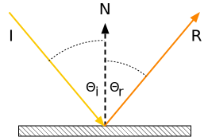
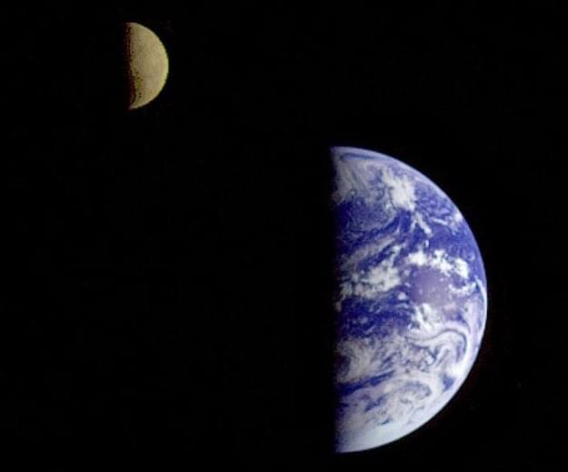

{{DefaultAPISidebar("WebXR Device API")}}

Because the [WebXR Device API](/en-US/docs/Web/API/WebXR_Device_API) relies on other technologies—namely, [WebGL](/en-US/docs/Web/API/WebGL_API) and frameworks based upon it—to perform all rendering, texturing, and lighting of a scene, the same general lighting concepts apply to WebXR settings or scenes as to any other WebGL-generated display.

However, there are issues and details to keep in mind while creating your lighting code, especially for augmented reality (AR) applications. This guide discusses these topics. And while this article provides brief reminders as to how lighting works in general, it is not by any means a tutorial in lighting or a guide to how to create a properly-lit 3D scene.

## Flashback: Simulating lighting in 3D

Although this article isn't a comprehensive guide to lighting a 3D scene, it's useful to provide a brief reminder as to how lighting works in general. Fundamentally, simulating lighting in a virtual scene involves computing how much light from each light source is received by the eye after interacting with and reflecting off of each object in the scene.

### Reflection of light

**Figure: A diagram showing how the angle of reflection corresponds to the angle of incidence.**

Every object we see, we see because the object either emits or reflects light (or both). The incoming light ray—the **incident ray**—arrives at an angle known as the **angle of incidence**. The angle of incidence, Θᵢ, is the angle between the incident ray and the surface's [normal vector](https://en.wikipedia.org/wiki/Normal_vector).

For rough surfaces, light is reflected equally in every direction. However, glossy, mirror-like surfaces reflect most of the light in a direction whose **angle of reflection**, Θᵣ, is equal to the angle of incidence, except it's on the opposite side of the normal vector. The **reflected ray**, then, departs along at that angle off the normal. This is the **[law of reflection](https://en.wikipedia.org/wiki/Law_of_reflection)**. This is the foundation for much of what's involved in shading a scene, and comes into play in terms of how different types of light source behave.

The reflected light ray's color may, of course, be altered in intensity and/or hue due to the light's interaction with the surface, but the angle is always the same.

### Components of a light source

A light source has three major components; each component is in essence a type of light

There are three kinds of light that can affect the color and brightness of objects and their pixels as displayed on the viewer's screen or headset.

#### Ambient light

**Ambient light** is light that doesn't come from a defined source, but is just present throughout the scene. This light reaches every surface in the scene at the same intensity from every direction, and is then reflected equally in every direction. As a result, the effect applied by ambient light is universally equal all through the scene.

**Figure: A sphere with only ambient lighting. Note the total lack of any shading to indicate the depth of the sphere.**

The effect of ambient light is computed by multiplying the intensity of the light source by the reflectance of the surface at the pixel's location. The color and intensity of every pixel in the scene is affected exactly the same way, regardless of where it is in the scene or the direction it's facing. Ambient light is commonly present to prevent shadowed areas from becoming too dark, although it affects the entire scene; however, the amount of ambient light in a scene should be very low.

Because the bouncing and scattering of light can be expensive to compute in real time, especially if multiple light sources are involved, it's common to use ambient lighting to simulate the scattered light caused by all the other light sources in the scene, instead of actually calculating the true effect of light scattering. Care needs to be taken to try to match the ambient light to what would really be the effect of the scene's lighting when doing this, however.

Ambient light can also be used to apply a color tint to a scene; for example, in a game in which the player has a special pair of yellow-tinted glasses, you can add a yellow ambient light.

#### Diffuse light

**Diffuse light** is light which is evenly and directionally emitted from or reflected off a surface. This is the majority of the light we usually see. Diffuse light comes from a particular position or direction and casts shadows. Due to its directionality, the faces of an object facing a diffuse light source will be brighter than the other faces.

**Figure: Saturn's fifth-largest moon, Tethys, bathed in sunlight, coming from the lower left.**

Because the intensity of diffuse light depends on the [angle of incidence](https://en.wikipedia.org/wiki/Angle_of_incidence) (the angle between the vector representing the direction from which the light reaches the surface and the surface's normal vector or the vector perpendicular to the surface), the intensity or brightness of the light reflected by an object varies depending on the surface's orientation relative to the light source.

#### Specular light

**Specular light** is the light that makes up the highlights on reflective objects, such as gems, eyes, shiny cups and plates, and the like. Specular lights tend to appear as bright spots or squares on a surface at the point where a light source strikes the surface most directly.

**Figure: A photo taken by NASA's Cassini spacecraft showing specular reflection of light from a lake of liquid methane on the surface of Saturn's moon Titan.**

Every light source is represented by some combination of ambient, diffuse, and/or specular light. The WebGL shader program takes the color, directionality, brightness, and other factors for each light source and computes the final color of each pixel.

### Types of light source

There are four fundamental types of light source. Each one involves a source of virtual light whose distance from the object being drawn and the directionality of the light waves cause the light source to take on specific characteristics. For the most part, any real-world light source can be simulated using one or more of these light source types.

#### Ambient light sources

An **ambient light source** is a light source describing the level and color of ambient light in a scene. While there may be more than one of these in a scene, you can probably slightly improve performance by combining them into one on your own, since each one will always affect every pixel evenly anyway.

Ambient light sources generally don't correspond to any object within the scene, and have no real-world analogues, either.

#### Directional light sources

A **directional light source** is a light source that comes from a specific direction, but not from a specific source, so its emitted light rays are parallel to one another. In addition, the intensity of the light doesn't change over distance. This means that shadows cast by directional lights are very sharp, with an essentially instant transition between lighted and shadowed.

**Figure: Earth and moon both half-lit by the sun's directional lighting.**

The most common example of a directional light is the sun. While the sun is in actuality a single (large) object, it's very far away, so the rays of light coming from it are essentially parallel. While sunlight does actually fall off in intensity with distance, the rate of change is very low and is only noticed over vast distances, so the rate of intensity change of sunlight doesn't typically matter for rendering a 3D scene.

#### Point light sources

A **point light source** is a light source located at a specific location, radiating outward equally in every direction. Light bulbs, candles, and the like are examples of point light sources. The closer an object is to a point light source, the brighter the light it casts onto that object. The rate at which the brightness of a point light falls off is called **attenuation**, and is a configurable feature of the light source in WebGL and other lighting systems.

Between the law of reflection and the fact that the brightness of the light rays decreases with distance, the light emitted by a point source and reflected back tends to be brightest at the closest point to the light source and dimmer the farther away it is. Even if the surface is flat, the closest point to the light source is the center, with rays becoming increasingly long as the angle away from the normal changes.

#### Spot light sources

A **spot light source** (or **spotlight**) is a light source which is located at a specific position, emitting a cone of light in the direction of its orientation vector. A tapering rate parameter defines how quickly the brightness of the light falls off at the edges of the cone of light, and, as with point lights, an attenuation parameter controls how the light fades over distance.

**Figure: Photo of a spotlight shining upon a stucco wall at night.**

At the edge of the light cone, the light ceases to affect the surface at all.

#### Computational costs of lighting

To be visible, a scene must include lighting of some sort, so all or nearly all scenes will have at least one light source and may have a great many of them. Each light source substantially increases the amount of calculation needed to determine the final color and brightness of each displayed pixel. Performing the shading for each of these light source types is more computationally demanding than the one before it; so ambient light is the least expensive to apply, followed by directional light sources, point lights, and finally spotlights.

Additionally, the more accurate the lighting is designed to be, the more computationally expensive it becomes. Increased shadow detail, volumetric light (that is, lighting that you can see in the air, such as sunbeams or the beams of spotlights in the sky), and other lighting effects can add realism and beauty to your scene, but caution needs to be taken to ensure the scene doesn't overwhelm the GPU.

### Computing the color of a lighted pixel

Although some graphics libraries include support for light source objects and automatically calculate and apply lighting effect for you, WebGL does not. Fortunately, lighting isn't overly difficult to apply in your own vertex and fragment shaders.

For each polygon in the scene, the **vertex shader** program determines the vertices' colors, and then the **fragment shader** generates each pixel in the polygon by combining the appropriate texel from the assigned texture, any color tint or effect, and other visual data. It is at this time that the scene's lighting is considered and applied as appropriate to the pixel before the pixel is stored into the framebuffer.

The color of each pixel in the final, rendered, scene is calculated using some intricate math that factors in things like:

- The color of the **texture element** (the pixel within the texture mapped onto the object; also known as a **texel**) corresponding to the screen pixel, given the object geometry, the viewer position and orientation relative to each polygon, and so forth.
- The viewer position and distance.
- The surface material and reflectivity.
- The concavity or convexity of the surface at the target location.
- The position, color, directionality, and brightness of each light source in the scene.
- The color and brightness of any ambient light in the scene; this is light which is applied equally throughout the scene, with no source and thus no shadows or variation in brightness.
- The effect of light reflected off of other surfaces within the scene; the color, directionality, and brightness of reflected light will affect the color of the pixels the light touches.

You can learn more about how to perform lighting in WebGL in the article [Lighting in WebGL](/en-US/docs/Web/API/WebGL_API/Tutorial/Lighting_in_WebGL).

## Lighting issues for mixed reality content

In addition to the usual issues that you need to contend with while lighting a scene, the VR or AR use case adds additional areas of concern when writing your shaders. In this section, we provide some basic mixed reality lighting guidelines to consider as you construct, render, and light your scene. While some of these are also useful in any other 3D setting, most are specific to virtual reality and, in some cases even more so, to augmented reality.

Since your scene is intended to represent a setting a person or their avatar can exist within, you should try to achieve some degree of consistency and realism in terms of the positioning and presentation of your light sources. Obviously, there are exceptions to this guideline, such as when your scene represents an otherworldly or alien setting, or when your goal is to create an unsettling visual effect.

### Realism in light source placement

When possible, you should try to make your virtual light sources correspond to objects that actually exists. If you have a virtual room that needs overhead lighting, have a model of a ceiling lamp at the location of your light source. There are exceptions, such as the ambient lighting that adds a baseline amount of lighting to your setting, and the sun, which is a directional light (that is, a light source where every light ray is parallel, coming from somewhere in the sky and ending somewhere within your scene).

Try to place light sources in realistic locations for the setting and the mood you're trying to create. A scene intended to feel like a naturally-lit, real-world setting doesn't have studio lighting. It has sunlight, possibly light reflected off of objects or water within the scene, and so forth, but not lamps directed at the faces of objects or people in the scene.

### Realism in player interactions with light

If your light source is located within the scene, you probably should try to ensure the viewer's avatar can't physically intersect with the light source. The results could be strange.

If the viewer's avatar is meant to have physical form, it should have a model, even if the viewer can never see it, so that light interacts with the avatar correctly. Minimally, this means the avatar should cast an appropriate shadow; however, depending on factors such as whether or not the avatar can be seen and the materials, texturing, and other attributes of the its model—including, especially, its reflectivity—the avatar may also need to reflect light, as well as potentially affect the coloration of the light reflected off of it.

### Realism in augmented reality

Augmented reality introduces an additional level of complexity to lighting your objects, since your virtual objects need to exist within a physical world that has its own light sources. As such, you should try to match your lighting to the real world's light sources as much as possible. This is done using a technique known as [Lighting estimation](#lighting_estimation).

Conversely, you should try to avoid having virtual objects that are themselves light sources, unless you're prepared to create code that can cast that lighting onto the real world setting. Casting light onto real-world objects is essentially the opposite of casting shadows. It can be done, but is not as widely implemented.

## Lighting estimation

**Lighting estimation** is a technique used by augmented reality platforms to attempt to match the lighting of the virtual objects in the scene to the lighting of the real world surrounding the viewer. This involves the collection of data that may come from various sensors (including the accelerometer and compass, if available), cameras, and potentially others. Other data is collected using the [Geolocation API](/en-US/docs/Web/API/Geolocation_API), and then all this data is put through algorithms and machine learning engines to generate the estimated lighting information.

At present, WebXR doesn't offer support for lighting estimation. However, a [specification is currently being drafted](https://github.com/immersive-web/lighting-estimation) under the auspices of the W3C. You can learn all about the proposed API and a fair amount about the concept of lighting estimation in the [explainer document](https://github.com/immersive-web/lighting-estimation/blob/main/lighting-estimation-explainer.md) that's included in the specification's GitHub repository.

In essence, lighting estimation collects this information about the light sources and the shape and orientation of the objects in the scene, along with information about the materials they're made of, then returns data you can use to create virtual light source objects that approximately match the real world's lighting.

The specifics of how lighting estimation works, especially in the context of the proposed API, is out of scope for the moment. Once the API has stabilized, we'll update this documentation with the details.

## Security and privacy concerns

There are a number of potential security issues involved with collecting all of this data in order to generate and apply lighting to your virtual objects using real-world data.

Of course, many AR applications make it pretty clear where the user is located. If the user is running an app called _Touring the Louvre_, there's a very good chance the user is located in the [Musée du Louvre](https://www.louvre.fr/en) in Paris, France. But browsers are required to take a number of steps to make it difficult to physically locate the user without their consent.

### Ambient Light Sensor API

The collection of light data using the [Ambient Light Sensor API](/en-US/docs/Web/API/AmbientLightSensor) introduces various potential privacy issues.

- Lighting information can leak to the web information about the user's surroundings and device usage patterns. Such information can be used to enhance user profiling and behavior analysis data.
- If two or more devices access content that uses the same third-party script, that script can be used to correlate lighting information and how it changes over time to attempt to determine a spatial relationship between the devices; this could in theory indicate that the devices are in the same general area, for example.

### How browsers mitigate these issues

In order to help mitigate these risks, browsers are required by the WebXR Lighting Estimation API specification to report lighting information that is fudged somewhat from the true value. There are many ways this could be done.

#### Spherical harmonics precision

Browsers can mitigate the risk of [fingerprinting](/en-US/docs/Glossary/Fingerprinting) by reducing the precision of [spherical harmonics](https://en.wikipedia.org/wiki/Spherical_harmonics). When performing real-time rendering—as is the case with any virtual or augmented reality application—[spherical harmonic lighting](https://en.wikipedia.org/wiki/Spherical_harmonic_lighting) is used to simplify and accelerate the process of generating highly realistic shadows and shading. By altering the accuracy of these functions, the browser makes the data less consistent, and, importantly, makes the data generated by two computers differ, even in the same setting.

#### Decoupling orientation from lighting

In an AR application that uses geolocation to determine orientation and potentially position information, avoiding having that information directly correlate to the state of the lighting is another way browsers can protect users from fingerprinting attacks. By ensuring that the compass direction and the light directionality aren't identical on every device that's near (or claims to be near) the user's location, the ability to find users based on the state of the lighting around them is removed.

When the browser provides details about a very bright, directional light source, that source probably represents the sun. The directionality of this bright light source combined with the time of day can be used to determine the user's geographic location without involving the Geolocation API. By ensuring that the coordinates of the AR scene don't align with compass coordinates, and by reducing the precision of the sun's light angle, the location can no longer be accurately estimated using this technique.

#### Temporal and spatial filtering

Consider an attack that uses a building's automated lighting system to flash the lights on and off quickly in a known pattern. Without proper precautions, the lighting estimation data could be used to detect this pattern and thus determine that a user is in a particular location. This could be done remotely, or it could be performed by an attacker who's located in the same room but wants to determine if the other person is also in the same room.

Another scenario in which lighting estimation can be used to obtain information about the user without permission: if the light sensor is close enough to the user's display to detect lighting changes caused by the contents of the display, an algorithm could be used to determine whether or not the user is watching a particular video—or even to potentially identify which of a number of videos the user is watching.

The Lighting Estimation API specification mandates that all {{Glossary("user agent", "user agents")}} perform temporal and spatial filtering to fuzz the data in a manner that reduces its usefulness for the purpose of locating the user or performing [side-channel attacks](https://en.wikipedia.org/wiki/Side-channel_attack).

## See also

- [WebXR Lighting Estimation API explainer](https://github.com/immersive-web/lighting-estimation/blob/main/lighting-estimation-explainer.md)
- [WebXR Lighting Estimation API Level 1 specification](https://github.com/immersive-web/lighting-estimation)
- [Using shaders to apply color in WebGL](/en-US/docs/Web/API/WebGL_API/Tutorial/Using_shaders_to_apply_color_in_WebGL)
- [Using textures in WebGL](/en-US/docs/Web/API/WebGL_API/Tutorial/Using_textures_in_WebGL)
- [Lighting in WebGL](/en-US/docs/Web/API/WebGL_API/Tutorial/Lighting_in_WebGL)
- [GLSL Shaders](/en-US/docs/Games/Techniques/3D_on_the_web/GLSL_Shaders)
