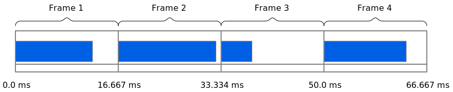
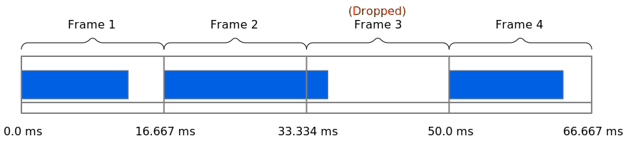

{{DefaultAPISidebar("WebXR Device API")}}

Once your WebXR environment has been set up and an {{domxref("XRSession")}} created to represent an ongoing XR environment session, you need to provide frames of the scene to the XR device for rendering. This article covers the process of driving the frames of the XR scene to the device in the rendering loop, using the {{domxref("XRSession")}} to obtain an {{domxref("XRFrame")}} object representing each frame, which is then used to prepare the framebuffer for delivery to the XR device.

Before you can render the virtual environment, you need to establish a WebXR session by creating an {{domxref("XRSession")}} using the [`navigator.xr.requestSession()`](/en-US/docs/Web/API/XRSystem/requestSession) method; you also need to associate the session with a framebuffer and perform other setup tasks. These setup tasks are described in the article [Starting up and shutting down a WebXR session](/en-US/docs/Web/API/WebXR_Device_API/Startup_and_shutdown).

## Preparing the renderer

Once the XR session has been set up, with the WebGL framebuffer connected and WebGL primed with the data it needs in order to render the scene, you can set up the renderer to start running. This begins with getting the reference space in which you want to draw, with its origin and orientation set at the viewer's starting position and viewing direction. Once that's in hand, you request that the browser call your rendering function the next time it needs a framebuffer to render your scene. This is done by calling the {{domxref("XRSession")}} method {{domxref("XRSession.requestAnimationFrame", "requestAnimationFrame()")}}.

Kicking off the renderer thus looks like this:

```js
let worldRefSpace;

async function runXR(xrSession) {
  worldRefSpace = await xrSession.requestReferenceSpace("local");

  if (worldRefSpace) {
    viewerRefSpace = worldRefSpace.getOffsetReferenceSpace(
      new XRRigidTransform(viewerStartPosition, viewerStartOrientation),
    );
    animationFrameRequestID = xrSession.requestAnimationFrame(myDrawFrame);
  }
}
```

After getting a reference space for the immersive world, this creates an offset reference space representing the position and orientation of the viewer by creating an {{domxref("XRRigidTransform")}} representing that position and orientation, then calling the {{domxref("XRReferenceSpace")}} method {{domxref("XRReferenceSpace.getOffsetReferenceSpace", "getOffsetReferenceSpace()")}}.

Then the first animation frame is scheduled by calling the {{domxref("XRSession")}} method {{domxref("XRSession.requestAnimationFrame", "requestAnimationFrame()")}}, providing a callback function, `myDrawFrame()`, whose job is to render the frame.

Note that this code doesn't have a loop! Instead, the frame rendering code—in this case, a function named `myDrawFrame()`—is responsible for scheduling time to draw another frame by once again calling `requestAnimationFrame()`.

## Refresh rate and frame rate

Assuming you've called the {{domxref("XRSession")}} method {{domxref("XRSession.requestAnimationFrame", "requestAnimationFrame()")}} since the last time the screen refreshed, the browser will call your frame rendering callback every time it's ready to repaint your app or site window. In this context, "repaint" means the process of ensuring that the screen's displayed content matches what the DOM and the elements within are trying to present at the moment.

### Hardware vertical refresh rate

When the browser is ready to refresh the {{HTMLElement("canvas")}} within which your WebXR content is displayed, it calls your frame rendering callback, which uses the specified timestamp and any other relevant data, such as models and textures, as well as application state, to render the scene—as it should appear at the specified time—into the WebGL backbuffer. When your callback returns, the browser transfers that backbuffer to the display or XR device, along with anything else that's changed since the last time the screen was refreshed.

Historically, displays have refreshed 60 times per second. This is due to early displays using the AC electrical grid's current flow waveform, which cycles 60 times per second in the United States (50 in Europe), for timing purposes. This figure goes by a number of different names, but they're all equivalent or nearly so:

- Refresh rate
- Vertical refresh rate
- Vertical blanking rate (VBL)
- Vertical sync rate

There are other similar terms used as well, but regardless of what it's called, the unit of measurement applied is the Hertz, or Hz. A display that refreshes 60 times per second has a 60 Hz refresh rate. That means that the maximum number of frames it can display in a second is 60. No matter how many frames per second you render beyond that, only 60 of them will make it to the screen in the course of a second.

But not all displays run at 60 Hz; nowadays, higher performance displays are beginning to use much higher refresh rates. 120 Hz—or 120 frame per second—displays are increasingly common, for example. The browser always tries to refresh at the same rate as the display, which means that on some computers, your callback will be run a maximum of 60 times per second, while on others it might be called 90 or 120 times per second or even more, depending on the frame rate.

### Time available to render each frame

This makes using the most of the time available between frames critical. If the user's device is using a 60 Hz display, your callback will be called up to 60 times per second, and your goal is to do what you can to ensure that it doesn't get called less often than that. You achieve this by doing as much as is practicable off the main thread and by keeping your frame rendering callback as efficient as possible. The division of time into 60 Hz blocks with each block being used at least in part to render the scene is shown in the diagram below.



This is important because as the computer becomes increasingly busy, it may not be able to accurately call your callback every frame and may have to skip frames. This is called **dropping frames**. This happens when the amount of time it takes to render a frame exceeds the time available between frames, whether because rendering was delayed or because rendering itself took more time than was available.



In the diagram above, frame 3 is dropped because frame 2 did not complete rendering until after frame 3 was due to be painted. The next frame drawn will be frame 4 instead. This is another reason the timestamp passed into your rendering callback is useful. By configuring the scene based on time rather than frame number, you can ensure your rendered frames match what's expected instead of falling behind.

When a frame is dropped, the contents of the affected display area don't change for that pass through the frame loop. For that reason, the occasional dropped frame isn't usually particularly noticeable, but if it starts to happen a lot—especially if several frames are dropped in a very short span of time—it can become jarring or even leave your display unusable.

Fortunately, you can easily compute how much time you're allowed to use between frames as `1/refreshRate` seconds. That is, by dividing 1 by the display's refresh rate. The resulting value is the amount of time available for each frame to be rendered in order to not drop the frame. For example, a 60 Hz display has 1/60th of a second to render a single frame, or 0.0166667 seconds. And if the device's refresh rate is 120 Hz, you only have 0.00883333 seconds to render each frame if you want to avoid dropping frames.

Even if the hardware is actually 120 Hz, though, you can get by with just refreshing 60 times per second anyway, and targeting that is usually a good baseline to follow. 60 FPS is already beyond the point at which most people can easily detect that the animation isn't a series of still images going by really fast. In other words, when in doubt, you can assume that the display is refreshing at 60 Hz. As long as your code is written properly, everything will be fine.

### Renderer performance concerns

Clearly, you have very little time to render your scene each frame. Not only that, but if your renderer itself runs longer than that amount of time, you can cause not just the frame to get dropped, but that time to be wasted entirely, blocking other code from getting to run at all for that frame.

Not only that, but if your rendering crosses the vertical refresh boundary, you can wind up with a **tearing** effect. Tearing occurs when the display hardware starts the next refresh cycle while the previous frame is still being drawn to the screen. As a result, you wind up with the visual effect of the top part of the screen showing the new frame, while the bottom part of the frame shows some combination of the previous frame and possibly even the frame before that one.

Your mission, then, is to keep your code tight and lightweight enough that you don't overrun the time available to you or otherwise cause dropped frames or excessively abuse the main thread.

For these reasons, unless your renderer is fairly small and lightweight, with little to do, you should consider offloading everything you can to a worker so you can be computing the next frame while the browser handles other things. By having your computations and data ready before the frame is actually called for, you can make your site or app render much more efficiently, improving main thread performance and generally making the user experience better.

Fortunately, there are some tricks you can use to further reduce your impact and optimize performance if your rendering needs are particularly heavy. See the [WebXR performance guide](/en-US/docs/Web/API/WebXR_Device_API/Performance) for recommendations and tips that will help you ensure your performance is as good as it can be.

## WebXR frames

Your frame rendering callback function receives as input two parameters: the time to which the frame corresponds, and an {{domxref("XRFrame")}} object describing the state of the scene as of that time.

### The optics of 3D

We have two eyes for a reason: by having two eyes, each inherently sees the world from a slightly different angle. Since they're a known, fixed distance apart, our brains can do basic geometry and trigonometry and figure out the 3D nature of reality from that information. We also make use of perspective, size differences, and even our understanding of how things usually look to figure out the details of that third dimension. These factors, among others, are the source of our [depth perception](https://en.wikipedia.org/wiki/Depth_perception).

To create the illusion of three dimensions when rendering graphics, we need to simulate as many of these factors as we can. The more of these we simulate—and the more accurately we do so—the better we are able to trick the human brain into perceiving our images in 3D. The advantage to XR is that not only can we use the classic monocular techniques to simulate 3D graphics (perspective, size, and simulated parallax), but we can also simulate binocular vision—that is, vision using two eyes—by rendering the scene twice for each frame of animation—once for each eye.

The typical human's [pupillary distance](https://en.wikipedia.org/wiki/Pupillary_distance)—the distance between the centers of the pupils—is between 54 and 74 millimeters (0.054 to 0.074 meters). So if the center of the viewer's head is located at `[0.0, 2.0, 0.0]` (about two meters above ground level at the center of the space horizontally), we first need to render the scene from, say, `[-0.032, 2.0, 0.0]` (32mm to the left of center) and then render it again at `[0.032, 2.0, 0.0]` (32mm right of center.) This way, we place the positions of the viewer's eyes at an average human pupillary distance of 64mm.

That distance (or whatever pupillary distance the XR system is configured to use) is enough to allow our minds to see just enough difference due to retinal disparity (the difference in what each retina sees) and the parallax effect to allow our brains to calculate the distance to and depth of objects, thus enabling us to perceive three dimensions despite our retinas only being 2D surfaces.

This is illustrated in the diagram below, in which we see how each eye perceives a die located directly in front of the viewer. While this diagram exaggerates the effect in some respects for illustrative purposes, the concept is the same. Each eye sees an area whose boundaries make up an arc in front of the eye. Because each eye is offset to one side or the other of the head's centerline, and each eye sees about the same field of view, the result is that each eye sees a slightly different part of the world in front of it, and from a slightly different angle.


The left eye sees the die from a little bit to the left of center, and the right eye sees it from a bit to the right of center. As a result, the left eye sees just a little bit more of the left side of the object and a little bit less of the right, and vice versa. These two images are focused onto the retinas and the resulting signal transmitted over the optic nerves to the brain's visual cortex, located at the back of the occipital lobe.

The brain takes those signals from the left and right eyes and constructs a single, unified, 3D image of the world in the viewer's brain, and that image is what is seen. And because of those differences between what is seen by the left eye versus the right eye, the brain is able to infer a great deal of information about how deep the object is, its size, and more. By combining that inferred depth information with other cues such as perspective, shadows, memories of what these relationships mean, and so forth, we can figure out a great deal about the world around us.

### Frames, poses, views, and framebuffers

Once you have an `XRFrame` representing the state of the scene at a moment in time, you need to determine the positions of objects within the scene relative to the viewer so that you can render them. The viewer's position and orientation relative to a reference space is represented by an {{domxref("XRViewerPose")}} obtained by calling the {{domxref("XRFrame")}} method {{domxref("XRFrame.getViewerPose", "getViewerPose()")}}.

The `XRFrame` doesn't directly keep track of the positions or orientations of the objects in your world. Instead, it offers a way to convert positions and orientations into the scene's coordinate system, and it collects the viewer's position and orientation data from the XR hardware, converts it into the reference space you've configured, and delivers it to your frame rendering code with a timestamp. You use that timestamp and your own data to determine how to render the scene.

After rendering the scene twice—once into the left half of the framebuffer and once into the right half of the framebuffer—the framebuffer is sent to the XR hardware, which displays each half of the framebuffer to the corresponding eye. This is often (but not always) done by drawing the image to a single screen and using lenses to transfer the correct half of that image to each eye.

You can learn more about how 3D is represented by WebXR in [Representing 3D with WebXR](/en-US/docs/Web/API/WebXR_Device_API/Cameras#representing_3d_with_webxr).

## Drawing the scene

When the time comes to prepare the framebuffer so the browser can paint the next frame of your scene, the function you provided to `requestAnimationFrame()` is invoked. It receives as input the time at which the frame being drawn and an {{domxref("XRFrame")}} object providing details about the state of the scene for the frame you need to render.

Ideally, you want this code to be fast enough that it can maintain a 60 FPS frame rate, or as close to that as possible, remembering that there's more going on than just your code in this one function. You need to make sure that the main thread doesn't need to run for more time per frame than the duration of the frame itself.

### A basic renderer

In this version of the WebXR rendering callback, we use a very straightforward approach that works great for relatively simple projects. This pseudocode outlines that process:

```
for each view in the pose's views list:
  get the WebXR GL layer's viewport
  set the WebGL viewport to match
  for each object in the scene
    bindProgram()
    bindVertices()
    bindMatrices()
    bindUniforms()
    bindBuffers()
    bindTextures()
    drawMyObject()
```

Put, this form of renderer is using **view-first order**. Each of the two views making up the XR device's display are rendered back to back, where every object is drawn on one view before rendering the same set of objects on the other view. As a result, there's a good bit of replicated effort, since much of the data needed to draw an object winds up getting sent to the GPU twice per frame. However, it simplifies porting existing WebGL code and is frequently good enough to do the job, so we'll look at this method first.

See [Optimizing by rendering in object-first order](#optimizing_by_rendering_in_object-first_order) for an alternative approach that renders each object twice back-to-back, once for each eye, before moving on to the next object that makes up the scene for that frame; that is, rendering in **object-first order**.

#### Sample rendering callback

Let's take a look at some real code that follows this basic pattern. Since in the example above we gave this function the name `myDrawFrame()`, we'll continue to use that here.

```js
let lastFrameTime = 0;

function myDrawFrame(currentFrameTime, frame) {
  const session = frame.session;
  let viewerPose;

  // Schedule the next frame to be painted when the time comes.

  animationFrameRequestID = session.requestAnimationFrame(myDrawFrame);

  // Get an XRViewerPose representing the position and
  // orientation of the viewer. If successful, render the
  // frame.

  viewerPose = frame.getViewerPose(viewerRefSpace);
  if (viewerPose) {
    const glLayer = session.renderState.baseLayer;
    gl.bindFrameBuffer(gl.FRAMEBUFFER, glLayer.framebuffer);

    // Start by erasing the color and depth framebuffers.

    gl.clearColor(0, 0, 0, 1.0);
    gl.clearDepth(1.0);
    gl.clear(gl.COLOR_BUFFER_BIT | gl.DEPTH_BUFFER_BIT);

    // Compute the time elapsed since the last frame was rendered.
    // Use this value to ensure your animation runs at the exact
    // rate you intend.

    const deltaTime = currentFrameTime - lastFrameTime;
    lastFrameTime = currentFrameTime;

    // Now call the scene rendering code once for each of
    // the session's views.

    for (const view of viewerPose.views) {
      const viewport = glLayer.getViewport(view);
      gl.viewport(viewport.x, viewport.y, viewport.width, viewport.height);
      myDrawSceneIntoView(view, deltaTime);
    }
  }
}
```

The `myDrawFrame()` function grabs the {{domxref("XRSession")}} from the {{domxref("XRFrame")}} object specified by the `frame` parameter, then calls the session's {{domxref("XRSession.requestAnimationFrame", "requestAnimationFrame()")}} method to immediately schedule the rendering of the next frame. This ensures we get into the queue right away, allowing the rest of the time spent in this iteration of the `myDrawFrame()` function to count toward the timing of drawing the next frame.

We then get the {{domxref("XRViewerPose")}} object that describes the viewer's pose—their position and orientation—using the frame's {{domxref("XRFrame.getViewerPose", "getViewerPose()")}} method, passing in the viewer's reference space from the `viewerRefSpace` previously obtained [while setting up the WebXR session](#preparing_the_renderer).

With the viewer's pose in hand, we can then begin to render the frame. The first step is to obtain access to the framebuffer into which the WebXR device wants the frame drawn; this is done by getting the target WebGL layer from the session's {{domxref("XRSession.renderState", "renderState")}} object's {{domxref("XRRenderState.baseLayer", "baseLayer")}} property, then getting the {{domxref("XRWebGLLayer.framebuffer", "framebuffer")}} from that {{domxref("XRWebGLLayer")}} object. We then call [`gl.bindFrameBuffer()`](/en-US/docs/Web/API/WebGLRenderingContext/bindFramebuffer) to bind that framebuffer as the target for all upcoming drawing commands.

The next step is to erase the framebuffer. While you can in theory skip this step—_if and only if your rendering code is guaranteed to write every single pixel in the framebuffer_—it's generally safest to just go ahead and clear it before you begin to draw, unless you need to eke out every ounce of performance you can and know you're touching all the pixels anyway. The background color is set to fully opaque black using [`gl.clearColor()`](/en-US/docs/Web/API/WebGLRenderingContext/clearColor); the clear depth is set to 1.0 by calling [`gl.cleardepth()`](/en-US/docs/Web/API/WebGLRenderingContext/clearDepth), in order to clear all pixels regardless of how far away the object they're part of is; and finally, the frame's pixel and depth buffers are both erased by calling [`gl.clear()`](/en-US/docs/Web/API/WebGLRenderingContext/clear), passing in a bit mask in which both `COLOR_BUFFER_BIT` and `DEPTH_BUFFER_BIT` are set.

Since WebXR uses a single framebuffer for every view, with viewports upon the view being used to separate each eye's viewpoint within the framebuffer, we only need to clear a single framebuffer rather than cleaning it for each eye (or other viewpoints, if any) individually.

Next, the time elapsed since the previous frame was rendered is calculated by subtracting from the current time as specified by the `currentFrameTime` parameter the saved time at which the last frame was rendered, `lastFrameTime`. The result is a {{domxref("DOMHighResTimeStamp")}} value indicating the number of milliseconds that have elapsed since the last frame was rendered. We can use this value while drawing the scene to ensure we move everything the appropriate distance given the true elapsed time, rather than assuming that the callback will be fired at a consistent frame rate. This elapsed time is saved in the variable `deltaTime`, and the value of `lastFrameTime` is replaced with this frame's time, ready to compute the differential for the next frame.

It's now time to actually render the scene for each eye. We iterate over the views within the viewer poses's {{domxref("XRViewerPose.views", "views")}} array. For each of these {{domxref("XRView")}} objects representing an eye's perspective on the scene, we need to begin by limiting drawing to the area of the framebuffer which represents the current eye's visible image.

We begin by preparing WebGL to render the eye's contents by getting the viewport that restricts drawing to the area within the framebuffer that's reserved for the current eye's image by calling the {{domxref("XRWebGLLayer")}} method {{domxref("XRWebGLLayer.getViewport", "getViewport()")}}. We then set the WebGL viewport to match, passing in the X and Y origin of the viewport along with its width and height into [`gl.viewport()`](/en-US/docs/Web/API/WebGLRenderingContext/viewport).

Finally, we call our method `myDrawSceneIntoView()` to actually use WebGL to render the scene. Into this, we pass the {{domxref("XRView")}} representing the eye we're drawing for (in order to perform perspective mapping and the like) and `deltaTime`, so the scene drawing code can accurately represent the elapsed time when determining the positions of objects moving over time.

When the loop that's iterating over the views ends, every image required to represent the scene to the viewer has been rendered, and upon return, the framebuffer makes its way through the GPU and eventually to the XR device's display or displays. Since we called {{domxref("XRSession.requestAnimationFrame", "requestAnimationFrame()")}} at the top of the function, our callback will be invoked once again when it's time to render the next frame of the scene's animation.

#### Drawbacks to this approach

Since it's important to minimize how much time you spend in this function as much as possible, the more time you spend handling state changes, the less time you have to actually draw things. This technique works very well for a small number of objects, but because it has to re-bind all the data for each object twice (once for the left eye, and once for the right), you're spending a lot of time adjusting the state, uploading buffers and textures, and so forth. In the next section, we look at an altered approach that reduces these state changes substantially, providing a potentially much faster rendering approach, especially as your object count goes up.

### Optimizing by rendering in object-first order

An advantage of WebXR's approach of using a single WebGL framebuffer to contain both the left and right eye's views in a single framebuffer makes it possible to substantially improve rendering performance by rearranging the order in which things are done. Instead of setting up the viewport for a given view (such as the left eye), then rendering every object visible to the left eye, one by one, reconfiguring buffers for each object as you go, you can instead render each object twice in a row, once for each eye, thereby only needing to set up the buffers, uniforms, and so forth once for both eyes.

The resulting pseudocode looks like this:

```
for each object in the scene
  bindProgram()
  bindUniforms()
  bindBuffers()
  bindTextures()
  for each view in the pose's views list
    get the XRWebGLLayer's viewport
    set the WebGL viewport to match
    bindVertices()
    bindMatrices()
    drawMyObject()
```

By changing things up in this way, we only bind programs, uniforms, buffers, textures, and potentially other things once per frame instead of twice for each object found in the scene. This reduces overhead by a potentially very large margin.

### Limiting the frame rate

If you need to intentionally cap your frame rate in order to establish a baseline frame rate to try to maintain while allowing more time for other code to run, you can do so by skipping frames intentionally, on a timed basis.

For example, to reduce the frame rate by 50%, just skip every other frame:

```js
let tick = 0;

function drawFrame(time, frame) {
  animationFrameRequestID = frame.session.requestAnimationFrame(drawFrame);

  if (!(tick % 2)) {
    /* Draw the scene */
  }
  tick++;
}
```

This version of the rendering callback maintains a `tick` counter. The frame is only rendered if `tick` is an even number value. This way, only every other frame gets rendered.

You can similarly render every fourth frame using `!(tick % 4)`, and so forth.

### Matching your animation to the elapsed time

The rendering callback receives a `time` parameter for a good reason. This {{domxref("DOMHighResTimeStamp")}} value is a floating-point value indicating the time at which the frame was scheduled for rendering. Because the execution of your callback is not going to happen at precise 1/60th of a second intervals—and, indeed, could happen at other rates if the user's display has a different frame rate—you can't rely on the simple fact that your code is running to assume that it's been 1/60th of a second since the last frame.

For that reason, you need to use the timestamp provided to ensure your animation renders at precisely the desired speed. To do so, the first thing you need to do is to compute the time that has elapsed since the last frame was rendered:

```js
let lastFrameTime = 0;

function drawFrame(time, frame) {
  // schedule next frame, prepare the buffer, etc.

  const deltaTime = (time - lastFrameTime) * 0.001;
  lastFrameTime = time;

  for (const view of pose.views) {
    /* render each view */
  }
}
```

This maintains a global (or an object property) called `lastFrameTime` which contains the previous frame's time of rendering. In this case, since the time values are stored in milliseconds, we multiply by 0.001 to convert the time into seconds. In some cases, this saves time later. In other situations, you need the time in milliseconds, so you wouldn't need to change anything.

With the elapsed time in hand, your rendering code has the means to compute just how much every moving object has moved in the time elapsed. For instance, if an object is rotating, you might apply the rotation like this:

```js
const xDeltaRotation =
  xRotationDegreesPerSecond * RADIANS_PER_DEGREE * deltaTime;
const yDeltaRotation =
  yRotationDegreesPerSecond * RADIANS_PER_DEGREE * deltaTime;
const zDeltaRotation =
  zRotationDegreesPerSecond * RADIANS_PER_DEGREE * deltaTime;
```

This computes the amount by which the object has rotated around each of the three axes since the last time the frame was drawn. Without this, the shape would rotate by the given amount every frame, regardless of the elapsed time. This could cause substantial stutter in many cases.

The same concept applied for objects that are moving rather than rotating:

```js
const xDistanceMoved = xSpeedPerSecond * deltaTime;
const yDistanceMoved = ySpeedPerSecond * deltaTime;
const ZDistanceMoved = zSpeedPerSecond * deltaTime;
```

`xSpeedPerSecond`, `ySpeedPerSecond`, and `zSpeedPerSecond` each contain that axis's component of the object's velocity. In other words, `[xDistanceMoved, yDistanceMoved, zDistanceMoved]` is a vector representing the velocity of the object.

## Additional tasks related to animating the scene

There are, of course, other things that probably need to happen each pass through the renderer. Two of the most common are [handling of user inputs](/en-US/docs/Web/API/WebXR_Device_API/Inputs) and performing updates to the positions of objects (or the viewer) based on known factors, such as those user control states or known animation paths of the objects in the scene.

### Handling user control inputs

There are three methods by which users might provide input while using a WebXR application. First, WebXR supports directly handling inputs from the controllers which are integrated with the XR hardware itself. These input sources may include devices such as hand controllers, optical tracking systems, accelerometers and magnetometers, and other devices of that nature.

The second type of input is a gamepad that's connected through the XR system. This uses interfaces inherited from the [Gamepad API](/en-US/docs/Web/API/Gamepad_API) but you interact with them through WebXR.

The third and final type of input is the traditional non-XR input device such as keyboards, mice, trackpads, touch screens, and non-XR gamepads and joysticks.

Orientation and position information that can be collected from the XR hardware directly is applied automatically. Thus it's the other kinds of input that you need to handle yourself:

- Pointing device target and button presses
- Gamepad inputs
- Non-XR input device inputs

To learn more about how to handle user inputs while presenting a scene using WebXR, see the article [Inputs and input sources](/en-US/docs/Web/API/WebXR_Device_API/Inputs).

### Updating object positions

Most (though not all) scenes include some form of animation, in which things move and react to one another in appropriate ways.

For example, a virtual reality or augmented reality game might have enemy non-player characters being controlled by the computer and moving around the scene. Not only are their locations in the world changing over time, but each NPC likely has body parts or components that are moving in relation to one another. Arms and legs swing as a creature walks, heads bob and turn, hair bounces and sways, torsos expand and contract as the character breathes.

In addition, there may be objects and structures in motion. In a sports game, there may be a ball arcing through the air, its movement needing to be simulated. In racing games there may be cars or other vehicles, with moving parts to animate including the wheels. If there's water in the scene, it needs ripples or waves to look realistic. Parts of structures may be moving, such as doors, walls and floors (for some types of games), and so forth.

Another common source of motion is the player themselves. After interpreting inputs from the controls (both XR-affiliated and otherwise), you need to apply those changes to the scene in order to simulate the user's movement. See the article [Movement, orientation, and motion](/en-US/docs/Web/API/WebXR_Device_API/Movement_and_motion) for details and a thorough example of how this works.

## Next steps

Once you've got your renderer written—or at least got something that works, even if it's not finished—you can begin to deal with the camera and its movement through the scene. This is covered in our article about [viewpoints and viewers](/en-US/docs/Web/API/WebXR_Device_API/Cameras) in WebXR.

## See also

- [Geometry and reference spaces in WebXR](/en-US/docs/Web/API/WebXR_Device_API/Geometry)
- [Spatial tracking in WebXR](/en-US/docs/Web/API/WebXR_Device_API/Spatial_tracking)
- [Viewpoints and viewers: Simulating cameras in WebXR](/en-US/docs/Web/API/WebXR_Device_API/Cameras)
- [Movement, orientation, and motion: A WebXR example](/en-US/docs/Web/API/WebXR_Device_API/Movement_and_motion)
- [WebXR performance guide](/en-US/docs/Web/API/WebXR_Device_API/Performance)
