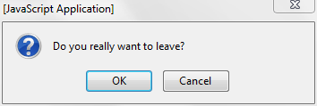

{{ApiRef("Window")}}

`window.confirm()` instructs the browser to display a dialog with an optional message, and to wait until the user either confirms or cancels the dialog.

Under some conditions — for example, when the user switches tabs — the browser may not actually display a dialog, or may not wait for the user to confirm or cancel the dialog.

## Syntax

```js
confirm(message)
```

### Parameters

- `message`
  - : A string you want to display in the confirmation dialog.

### Return value

A boolean indicating whether OK (`true`) or Cancel (`false`) was
selected. If a browser is ignoring in-page dialogs, then the returned value is always
`false`.

## Examples

```js
if (window.confirm("Do you really want to leave?")) {
  window.open("exit.html", "Thanks for Visiting!");
}
```

Produces:



## Notes

Dialog boxes are modal windows — they
prevent the user from accessing the rest of the program's interface until the dialog box
is closed. For this reason, you should not overuse any function that creates a dialog
box (or modal window). Regardless, there are good reasons to [avoid using dialog boxes for confirmation](https://alistapart.com/article/neveruseawarning/).

Alternatively {{HTMLElement("dialog")}} element can be used for confirmations.

## Specifications

{{Specifications}}

## Browser compatibility

{{Compat}}

## See also

- {{HTMLElement("dialog")}} element
- {{domxref("window.alert()")}}
- {{domxref("window.prompt()")}}
