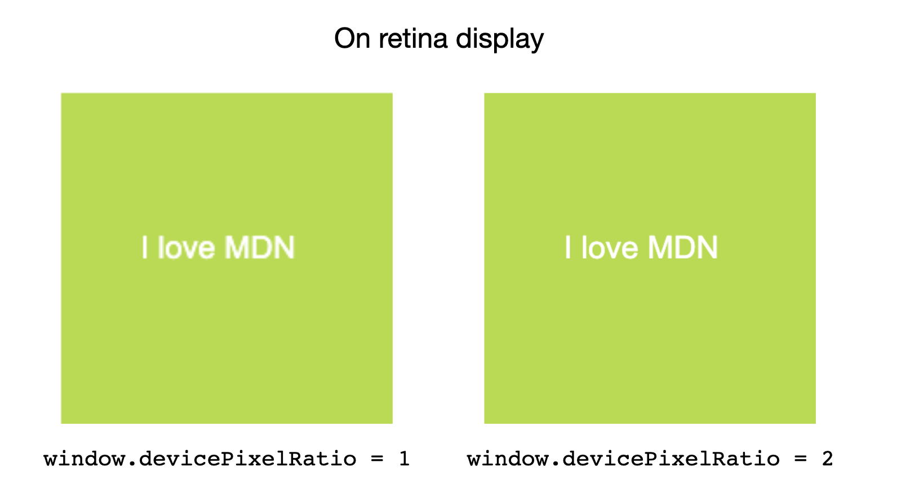

{{APIRef}}

The **`devicePixelRatio`** of {{domxref("Window")}} interface returns the ratio of the resolution in _physical pixels_ to the resolution in _CSS pixels_ for the current display device.

This value could also be interpreted as the ratio of pixel sizes: the size of one _CSS pixel_ to the size of one _physical pixel_.
In simpler terms, this tells the browser how many of the screen's actual pixels should be used to draw a single CSS pixel.

Page zooming affects the value of `devicePixelRatio`. When a page is zoomed in (made larger), the size of a CSS pixel increases, and so the `devicePixelRatio` value increases.
Pinch-zooming does not affect `devicePixelRatio`, because this magnifies the page without changing the size of a CSS pixel.

This is useful when dealing with the difference between rendering on a standard display versus a HiDPI or Retina display, which use more screen pixels to draw the same objects, resulting in a sharper image.

You can use {{domxref("Window.matchMedia", "window.matchMedia()")}} to check if the value of `devicePixelRatio` changes (which can happen, for example, if the user drags the window to a display with a different pixel density).
See [the example below](#monitoring_screen_resolution_or_zoom_level_changes).

## Value

A double-precision floating-point value indicating the ratio of the display's resolution in physical pixels to the resolution in CSS pixels. A value of 1 indicates a classic 96 DPI display, while a value of 2 is expected for HiDPI/Retina displays.

Other values may be returned in the case of unusually low resolution displays or, more often, when a screen has a higher pixel density than double the standard resolution of 96 DPI.
Modern mobile device screens - which offer high display resolutions at small physical sizes - often yield a `devicePixelRatio` value greater than 2.

## Examples

### Correcting resolution in a `<canvas>`

A {{htmlelement("canvas")}} can appear too blurry on retina screens.
Use `window.devicePixelRatio` to determine how much extra pixel density should be added to allow for a sharper image.

#### HTML

```html
<canvas id="canvas"></canvas>
```

#### JavaScript

```js
const canvas = document.getElementById("canvas");
const ctx = canvas.getContext("2d");

// Set display size (css pixels).
const size = 200;
canvas.style.width = `${size}px`;
canvas.style.height = `${size}px`;

// Set actual size in memory (scaled to account for extra pixel density).
const scale = window.devicePixelRatio; // Change to 1 on retina screens to see blurry canvas.
canvas.width = Math.floor(size * scale);
canvas.height = Math.floor(size * scale);

// Normalize coordinate system to use CSS pixels.
ctx.scale(scale, scale);

ctx.fillStyle = "#bada55";
ctx.fillRect(10, 10, 300, 300);
ctx.fillStyle = "#ffffff";
ctx.font = "18px Arial";
ctx.textAlign = "center";
ctx.textBaseline = "middle";

const x = size / 2;
const y = size / 2;

const textString = "I love MDN";
ctx.fillText(textString, x, y);
```



### Monitoring screen resolution or zoom level changes

In this example, we'll set up a media query and watch it to see when the device resolution changes, logging the new resolution.

#### HTML

```html
<div id="container">
  <p>
    This example demonstrates the effect of zooming the page in and out
    (or moving it to a screen with a different scaling factor) on the
    value of the <code>devicePixelRatio</code> property.</p>
    <p>Try it and watch what happens!</p>
  </p>
</div>
<div id="output"></div>
```

#### CSS

```css
body {
  font:
    22px arial,
    sans-serif;
}

#container {
  border: 2px solid #22d;
  margin: 1rem auto;
  padding: 1rem;
  background-color: #a9f;
}
```

#### JavaScript

The string `mqString` is set to a media query which checks to see if the current display resolution matches a specific number of device dots per `px`.

The `media` variable is a {{domxref("MediaQueryList")}} object that's initialized with the media query string. When the result of running `mqString` against the document changes, the `media` object's `change` event fires, and the code logs the new resolution.

Note that every time the resolution changes, the example has to create a new media query, based on the new resolution, and a new `MediaQueryList` instance.

```js
let remove = null;
const output = document.querySelector("#output");

const updatePixelRatio = () => {
  if (remove != null) {
    remove();
  }
  const mqString = `(resolution: ${window.devicePixelRatio}dppx)`;
  const media = matchMedia(mqString);
  media.addEventListener("change", updatePixelRatio);
  remove = () => {
    media.removeEventListener("change", updatePixelRatio);
  };

  output.textContent = `devicePixelRatio: ${window.devicePixelRatio}`;
};

updatePixelRatio();
```

#### Result

To test the example, try zooming the page in and out, and note the difference in the logged value of `devicePixelRatio`.

{{EmbedLiveSample("Monitoring_screen_resolution_or_zoom_level_changes", "100%", 300)}}

## Specifications

{{Specifications}}

## Browser compatibility

{{Compat}}

## See also

- [Media queries](/en-US/docs/Web/CSS/CSS_media_queries)
- [Using media queries](/en-US/docs/Web/CSS/CSS_media_queries/Using_media_queries)
- [CSS `resolution` media query](/en-US/docs/Web/CSS/@media/resolution)
- The {{cssxref("image-resolution")}} property
