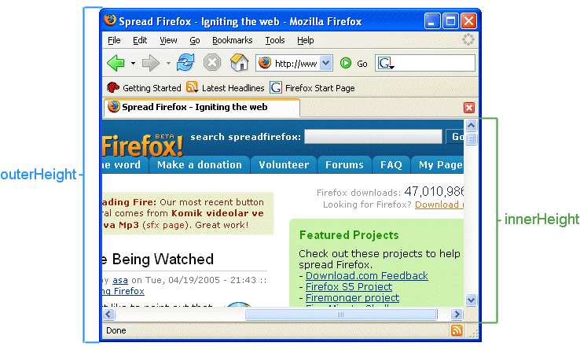

{{APIRef}}

The read-only **`innerHeight`** property of the
{{domxref("Window")}} interface returns the interior height of the window in pixels,
including the height of the horizontal scroll bar, if present.

The value of `innerHeight` is taken from the height of the window's
{{Glossary("layout viewport")}}. The width can be obtained using the
{{domxref("Window.innerWidth", "innerWidth")}} property.

## Value

An integer value indicating the window's layout viewport height in pixels. The property
is read only and has no default value.

To change the height of the window, call one of its resize methods, such as
{{domxref("Window.resizeTo", "resizeTo()")}} or {{domxref("Window.resizeBy", "resizeBy()")}}.

## Usage notes

To obtain the height of the window minus its horizontal scroll bar and any borders, use
the root {{HTMLElement("html")}} element's {{domxref("Element.clientHeight", "clientHeight")}} property instead.

Both `innerHeight` and `innerWidth` are available on any window
or any object that behaves like a window, such as a tab or frame.

## Examples

### Assuming a frameset

```js
console.log(window.innerHeight); // or

console.log(self.innerHeight);
// will log the height of the frame viewport within the frameset

console.log(parent.innerHeight);
// will log the height of the viewport of the closest frameset

console.log(top.innerHeight);
// will log the height of the viewport of the outermost frameset
```

To change the size of a window, see {{domxref("window.resizeBy()")}} and
{{domxref("window.resizeTo()")}}.

To get the outer height of a window, i.e. the height of the whole browser window, see
{{domxref("window.outerHeight")}}.

### Graphical example

The following figure shows the difference between `outerHeight` and
`innerHeight`.



## Demo

### HTML

```html
<p>Resize the browser window to fire the <code>resize</code> event.</p>
<p>Window height: <span id="height"></span></p>
<p>Window width: <span id="width"></span></p>
```

### JavaScript

```js
const heightOutput = document.querySelector("#height");
const widthOutput = document.querySelector("#width");

function updateSize() {
  heightOutput.textContent = window.innerHeight;
  widthOutput.textContent = window.innerWidth;
}

updateSize();
window.addEventListener("resize", updateSize);
```

### Result

{{EmbedLiveSample('Demo')}}

You can also {{LiveSampleLink('Demo', 'view the results of the demo code in a separate page')}}.

## Specifications

{{Specifications}}

## Browser compatibility

{{Compat}}

## See also

- {{domxref("window.innerWidth")}}
- {{domxref("window.outerHeight")}}
- {{domxref("window.outerWidth")}}
