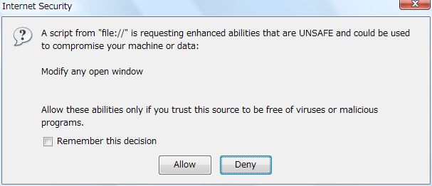

{{APIRef}}

Returns the `personalbar` object, whose visibility can be toggled in the
window.

## Value

A `personalbar` object.

## Notes

When you load the example page above, the browser displays the following dialog: 

To toggle the visibility of these bars, you must either sign your scripts or enable the
appropriate privileges, as in the example above. Also be aware that dynamically updating
the visibility of the various toolbars can change the size of the window rather
dramatically, and may affect the layout of your page.

## Specifications

{{Specifications}}

## Browser compatibility

{{Compat}}

## See also

- {{domxref("window.locationbar")}}, {{domxref("window.menubar")}},
  {{domxref("window.scrollbars")}}, {{domxref("window.statusbar")}},
  {{domxref("window.toolbar")}}
