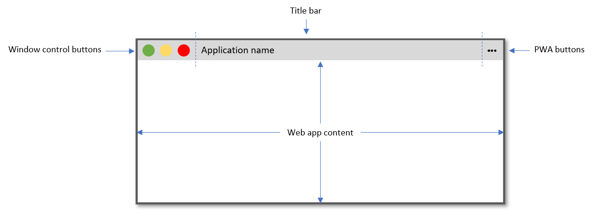
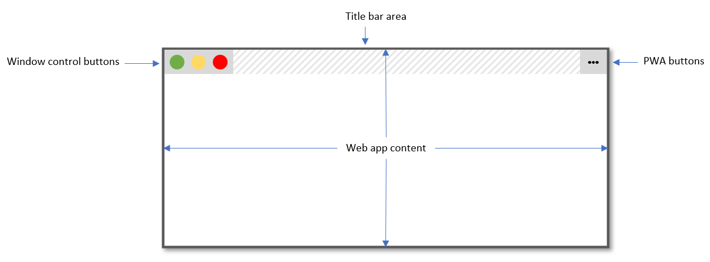

{{DefaultAPISidebar("Window Controls Overlay API")}}{{SeeCompatTable}}

The Window Controls Overlay API gives Progressive Web Apps installed on desktop operating systems the ability to hide the default window title bar and display their own content
over the full surface area of the app window, turning the control buttons (maximize, minimize, and close) into an overlay.

## Opting-in to the feature

Before using this feature, the following conditions must be true:

- The Web App Manifest's [`display_override`](/en-US/docs/Web/Manifest/display_override) member must be set to `window-controls-overlay`.
- The Progressive Web App must be installed on a desktop operating system.

## Main concepts

Progressive Web Apps installed on desktop devices can be displayed in standalone app windows, just like native apps. Here is what an application window looks like:

As seen above, the app window is made of two main areas:

- The title bar area at the top.
- The application content area at the bottom, which displays the HTML content from the PWA.

The title bar area contains the system-critical maximize, minimize, and close buttons (their position may vary across operating systems), the name of the application (which comes from the `<title>` HTML element in the page), and possibly user-agent-specific PWA buttons.

With the Window Controls Overlay feature, Progressive Web Apps can display their web content over the whole app window surface area. Because the window control buttons and user-agent-specific PWA buttons must remain visible, they get turned into an overlay displayed on top of the web content.

The part of the title bar that normally contains the application name is hidden, and the area that it normally occupies becomes available via the Window Controls Overlay API.

PWAs can use the API to position content in this area, and avoid having content hidden behind the control buttons overlay, similar to how web authors can account for the presence of notches on certain mobile devices.

## CSS environment variables

Progressive Web Apps can position their web content in the area that the title bar normally occupies by using the `titlebar-area-x`, `titlebar-area-y`, `titlebar-area-width`, and `titlebar-area-height` CSS environment variables.
See [Using env() to ensure content is not obscured by window control buttons in desktop PWAs](/en-US/docs/Web/CSS/env#using_env_to_ensure_content_is_not_obscured_by_window_control_buttons_in_desktop_pwas).

## Interfaces

- {{domxref("WindowControlsOverlay")}}
  - : Provides information about the visibility and geometry of the title bar and an event to know whenever it changes.

## Specifications

{{Specifications}}

## Browser compatibility

{{Compat}}

## See also

- [Customize the window controls overlay of your PWA's title bar](https://web.dev/window-controls-overlay/)
- [Breaking Out of the Box](https://alistapart.com/article/breaking-out-of-the-box/)
- [Display content in the title bar](https://docs.microsoft.com/en-us/microsoft-edge/progressive-web-apps-chromium/how-to/window-controls-overlay)
