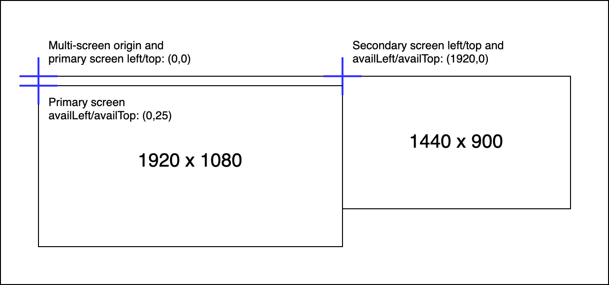
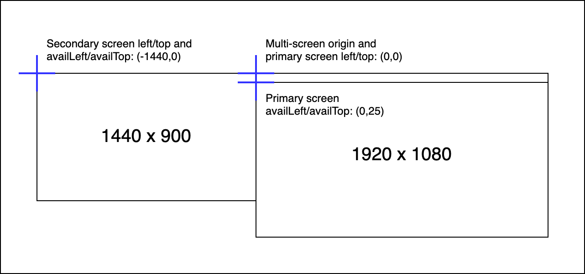

{{SeeCompatTable}}{{DefaultAPISidebar("Window Management API")}}

The **Window Management API** allows you to return detailed information on the displays connected to your device and more easily place windows on specific screens, paving the way towards more effective multi-screen applications.

## Concepts and usage

Historically, we have used {{domxref("Window.open()")}} to manage browser windows related to the current application — opening new windows, resizing and closing existing windows, etc. For example, to open a 400×300 window 50 pixels from the left and top of your screen:

```js
const myWindow = window.open(
  "https://example.com/",
  "myWindow",
  "left=50,top=50,width=400,height=300",
);
```

You can retrieve information about your screen from the {{domxref("Window.screen")}} property, such as how much screen space you have available to place windows in.

However, the above features are limited. `Window.screen` only returns data about the primary screen, and not secondary displays available to a device. To move a window to a secondary display, you could use {{domxref("Window.moveTo()")}}, but you'd have to guess what coordinates to use based on where it is placed in your setup relative to the primary display.

The Window Management API provides more robust, flexible window management. It allows you to query whether your display is extended with multiple screens and return information on each screen separately: windows can then be placed on each screen as desired. It also provides event handlers to allow you to respond to changes in the available screens, new fullscreen functionality to choose which screen to put into fullscreen mode (if any), and permissions functionality to control access to the API.

### Multi-screen origin

The Window Management API introduces the concept of the **multi-screen origin** — this is the (0,0) coordinate of the host operating system (OS)'s virtual screen arrangement, around which all available screens and windows are positioned. The multi-screen origin is commonly, but not always, the top-left corner of the OS primary screen (which can usually be specified by the user via OS settings, and generally contains OS UI features such as the taskbar/icon dock).

On devices with multiple displays, the following are true on Chrome. Firefox behaves in the same way, but not reliably/consistently, whereas Safari generally uses local values relative to the _current_ screen.

- The values of {{domxref("ScreenDetailed.left")}}, {{domxref("ScreenDetailed.top")}}, {{domxref("ScreenDetailed.availLeft")}}, and {{domxref("ScreenDetailed.availTop")}} for each available screen are reported relative to the multi-screen origin.
- The values of {{domxref("Window.screenLeft")}}, {{domxref("Window.screenTop")}}, {{domxref("Window.screenX")}}, {{domxref("Window.screenY")}} for each window are reported relative to the multi-screen origin.
- When using {{domxref("Window.moveTo()")}} and {{domxref("Window.open()")}}, windows are positioned relative to the multi-screen origin.

Say we have an external monitor of resolution 1920 x 1080 set as the primary monitor, and an internal laptop display of resolution 1440 x 900 set as a secondary monitor. Let's also say that the OS UI takes up 25px at the top of the screen, and is only drawn on the primary screen.

If the secondary screen was positioned directly to the right of the primary screen, top screen edges in line:

- The primary screen `left`/`top` values would be (0,0) while its `availLeft`/`availTop` values would be (0,25) — the OS UI thickness is added on.
- The secondary screen `left`/`top` values would be (1920,0) while its `availLeft`/`availTop` values would also be (1920,0) — the OS UI is not drawn on the secondary screen.



However, if the secondary screen was positioned directly to the left of the primary screen, top screen edges in line:

- The primary screen `left`/`top` values would still be (0,0) while its `availLeft`/`availTop` values would be (0,25).
- The secondary screen `left`/`top` values would be (-1440,0) while its `availLeft`/`availTop` values would also be (-1440,0).



## Use cases

The Window Management API is useful in cases such as:

- Multi-window graphics editors and audio processors that may wish to arrange editing tools and panels across different screens.
- Virtual trading desks that want to show market trends in multiple windows and put specific windows of interest in fullscreen mode.
- Slideshow apps that want to show speaker notes on the internal primary screen and the presentation on an external projector.

## How does it work?

The core of the Windows Management API is the {{domxref("Window.getScreenDetails()")}} method, which returns an object containing details of all the screens available to the user's system:

```js
const screenDetails = await window.getScreenDetails();

// Return the number of screens
const noOfScreens = screenDetails.screens.length;
```

When `getScreenDetails()` is invoked, the user will be asked for permission to manage windows on all their displays (the status of this permission can be checked using {{domxref("Permissions.query()")}} to query `window-management`). Provided they grant permission, the resulting {{domxref("ScreenDetails")}} object contains the following properties:

- `screens`

  - : An array of {{domxref("ScreenDetailed")}} objects, each one containing detailed information about a separate screen available to the system (see below). This array is also useful for determining the number of available screens, via `screens.length`.

    > **Note:** `screens` only includes "extended" displays, not those that mirror another display.

- `currentScreen`
  - : A single {{domxref("ScreenDetailed")}} object containing detailed information about the screen that the current browser window is displayed in.

> **Note:** `ScreenDetails` is a live object, meaning that it updates as the available screens change. You can therefore keep querying the same object to get updated values, rather than repeatedly calling `getScreenDetails()`.

> **Note:** You can gate functionality based on whether the user has more than one screen available using the {{domxref("Screen.isExtended", "Window.screen.isExtended")}} property. This returns `true` if the device has multiple screens, and `false` if not.

{{domxref("ScreenDetailed")}} objects inherit the properties of the {{domxref("Screen")}} interface, and contain useful information for placing windows on specific screens. For example:

- `availWidth` and `availHeight`
  - : The width and height of the screen area available for opening windows in. These values are equal to `width` and `height`, minus the width/height of any OS-specific user interface elements drawn on the screen.
- `availLeft` and `availTop`
  - : The top-left coordinate of the screen area available for opening windows in. These values are equal to `left` and `top`, plus the width/height of any OS-specific user interface elements drawn at the top/left of the screen.
- `isPrimary`
  - : A boolean indicating whether this screen is set as the OS primary screen or not.
- `isInternal`
  - : A boolean indicating whether this screen is internal to the device or not.
- `label`
  - : A string providing a descriptive label for the screen, for example "Built-in Retina Display". This is useful for constructing a list of options to display to the user if you want them to choose a screen to display content on.

You'll still need to use {{domxref("Window.open()")}} to open and manage windows, but the above provides you with better information for doing so in a multi-screen environment. For example, a utility function might look like so:

```js
function openWindow(left, top, width, height, url) {
  const windowFeatures = `left=${left},top=${top},width=${width},height=${height}`;
  const windowRef = window.open(
    url,
    "_blank", // needed for it to open in a new window
    windowFeatures,
  );

  // Store a reference to the window in the windowRefs array
  windowRefs.push(windowRef);
}
```

You would then invoke this function and open windows on specific screens like this:

```js
const screen1 = screenDetails.screens[0];
const screen2 = screenDetails.screens[1];
// Windows will be a third the width and the full height of the screen
let windowWidth = Math.floor((screen1.availWidth - 3 * WINDOW_CHROME_X) / 3);
let windowHeight = Math.floor(screen1.availHeight - WINDOW_CHROME_Y);

// Open the reference windows in thirds across the entire height of the primary screen
openWindow(
  screen1.availLeft,
  screen1.availTop,
  windowWidth,
  windowHeight,
  sites[1].url,
);

// ...
```

As shown in an earlier code block, it is a good idea to keep track of the windows you have open, for example using an array. This allows you to, for example, close them all when one window is closed:

```js
function closeAllWindows() {
  // Loop through all window refs and close each one
  windowRefs.forEach((windowRef) => {
    windowRef.close();
  });
  windowRefs = [];
}

// Check whether one of our popup windows has been closed
// If so, close them all

closeMonitor = setInterval(checkWindowClose, 250);

function checkWindowClose() {
  if (windowRefs.some((windowRef) => windowRef.closed)) {
    closeAllWindows();
    clearInterval(closeMonitor);
  }
}
```

> **Note:** In our experiments, the {{domxref("setInterval()")}} polling method shown above seemed to work best for detecting window closure in the case of multiple windows. Using events such as {{domxref("Window.beforeunload_event", "beforeunload")}}, {{domxref("Window.pagehide_event", "pagehide")}}, or {{domxref("Document.visibilitychange_event", "visibilitychange")}} proved unreliable because, when opening multiple windows at the same time, the rapid shift in focus/visibility seemed to fire the handler function prematurely.

> **Note:** One concern with the above example is that it uses constant values to represent the size of the Chrome window UI portions in the calculations — `WINDOW_CHROME_X` and `WINDOW_CHROME_Y` — to get the window size calculations correct. This might not produce entirely correctly-sized windows on other future implementations of the API, or future versions of Chrome that might have a different-sized UI. There currently isn't an easy way to work around this.

### Simple single-window per display case

If you want to open a single window on each available display that is the full width and height of the display, you could use a pattern like this:

```js
// Open a window on each screen of the device
for (const screen of screenDetails.screens) {
  openWindow(
    screen.availLeft,
    screen.availTop,
    screen.availWidth,
    screen.availHeight,
    url,
  );
}
```

### Window management events

The Window Management API provides some useful events for responding to changes in the available screens:

- The `ScreenDetails` {{domxref("ScreenDetails.screenschange_event", "screenschange")}} event
  - : Fired when screens are connected to or disconnected from the system.
- The `ScreenDetails` {{domxref("ScreenDetails.currentscreenchange_event", "currentscreenchange")}} event
  - : Fired when the window's current screen changes in some way.
- The `Screen` {{domxref("Screen.change_event", "change")}} event
  - : Fired on a specific screen when it changes in some way.

So for example, you could use the `screenschange` event to detect when the available screens have changed (perhaps when a screen is plugged in or unplugged), report the change, close all windows, and update window arrangements to suit the new configuration:

```js
screenDetails.addEventListener("screenschange", () => {
  // If the new number of screens is different to the old number of screens, report the difference
  if (screenDetails.screens.length !== noOfScreens) {
    console.log(
      `The screen count changed from ${noOfScreens} to ${screenDetails.screens.length}`,
    );
  }

  // If the windows are open, close them and then open them again
  // So that they fit with the new screen configuration
  if (windowRefs.length > 0) {
    closeAllWindows();
    openWindows();
  }
});
```

### requestFullscreen() screen option

The Window Management API adds a new `screen` option to the {{domxref("Element.requestFullscreen", "requestFullscreen()")}} method that allows you to specify on which screen you want to put the element in fullscreen mode. For example, if you want to make it fullscreen on the primary OS screen:

```js
try {
  const primaryScreen = (await getScreenDetails()).screens.find(
    (screen) => screen.isPrimary,
  );
  await document.body.requestFullscreen({ screen: primaryScreen });
} catch (err) {
  console.error(err.name, err.message);
}
```

## Permissions policy integration

The {{httpheader("Permissions-Policy/window-management", "window-management")}} [Permissions-Policy](/en-US/docs/Web/HTTP/Permissions_Policy) can be used to control permission to use the Window Management API. Specifically:

- Usage of the {{domxref("Window.getScreenDetails()")}} method. If blocked, its {{jsxref("Promise")}} will reject with a `NotAllowedError` exception.
- Querying the {{domxref("Screen.isExtended", "Window.screen.isExtended")}} property. If blocked, it will always return `false`.

Developers can explicitly grant permission for an {{htmlelement("iframe")}} to use Window Management via the `allow` attribute:

```html
<iframe src="3rd-party.example" allow="window-management"></iframe>
```

## Interfaces

- {{domxref("ScreenDetails")}}
  - : Represents the details of all the screens available to the user's device.
- {{domxref("ScreenDetailed")}}
  - : Represents detailed information about one specific screen available to the user's device.

## Extensions to other interfaces

- The `Screen` {{domxref("Screen.change_event", "change")}} event
  - : Fired on a specific screen when it changes in some way — for example available width or height, or orientation.
- {{domxref("Screen.isExtended")}}
  - : A boolean property that returns `true` if the user's device has multiple screens, and `false` if not.
- {{domxref("Element.requestFullscreen()")}}, the `screen` option
  - : Specifies on which screen you want to put the element in fullscreen mode.
- {{domxref("Window.getScreenDetails()")}}
  - : Returns a {{jsxref("Promise")}} that fulfills with a {{domxref("ScreenDetails")}} object instance.

## Examples

### Feature detection

You can feature detect the Window Management API by checking for the existence of `getScreenDetails` in the current `window` instance. For example, you might want to provide a button to open a multi-window display if the API is supported, or a different experience such as creating links to the different pages if it isn't:

```js
if ("getScreenDetails" in window) {
  // The Window Management API is supported
  createButton();
} else {
  // The Window Management API is not supported
  createLinks(sites);
}
```

### Full examples

You can find full examples here:

- [Multi-window learning environment](https://mdn.github.io/dom-examples/window-management-api/) (see the [source code](https://github.com/mdn/dom-examples/tree/main/window-management-api)).
- [Elmer-inspired trading desk demo](https://window-placement.glitch.me/) (see the [source code](https://glitch.com/edit/#!/window-placement)).
- [Window management demo](https://michaelwasserman.github.io/window-placement-demo/) (see the [source code](https://github.com/michaelwasserman/window-placement-demo)).

## Specifications

{{Specifications}}

## Browser compatibility

{{Compat}}
