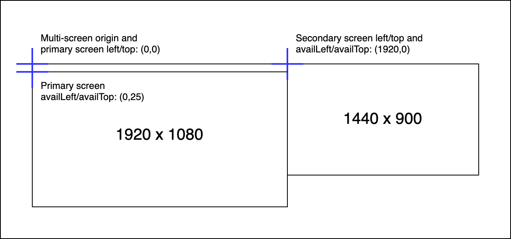
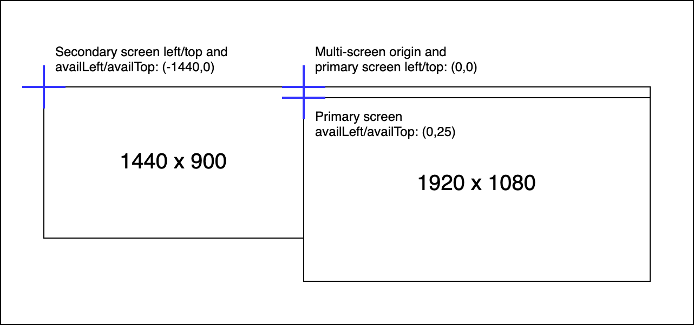

{{DefaultAPISidebar("Window Management API")}}

The [Window Management API](/en-US/docs/Web/API/Window_Management_API) introduces the concept of the **multi-screen origin** — this is the (0,0) coordinate of the host operating system (OS)'s virtual screen arrangement, around which all available screens and windows are positioned. The multi-screen origin is the top-left corner of the OS primary screen by convention, although the spec stipulates that it could be any arbitrary point within the virtual screen arrangement.

The primary screen can usually be specified by the user via OS settings, and generally contains OS UI features such as the taskbar/icon dock.

> [!NOTE]
> Positive coordinate values are to the right and downwards on the screen arrangement, while negative ones are to the left and upwards.

## Effects on existing web platform features

The multi-screen origin is relevant to the following APIs:

- The values of {{domxref("ScreenDetailed.left")}}, {{domxref("ScreenDetailed.top")}}, {{domxref("ScreenDetailed.availLeft")}}, and {{domxref("ScreenDetailed.availTop")}} for each available screen are reported relative to the multi-screen origin.
- The values of {{domxref("Window.screenLeft")}}, {{domxref("Window.screenTop")}}, {{domxref("Window.screenX")}}, {{domxref("Window.screenY")}} for each window are reported relative to the multi-screen origin.
- When using {{domxref("Window.moveTo()")}} and {{domxref("Window.open()")}}, windows are positioned relative to the multi-screen origin.

> [!NOTE]
> Not all browsers officially support multi-screen origin, but some have their own non-standard implementations. You are advised to check the browser compatibility information of the above features for the behavior in each browser.

## Visual examples

Say we have an external monitor of resolution 1920 x 1080 set as the primary monitor, and an internal laptop display of resolution 1440 x 900 set as a secondary monitor. Let's also say that the OS UI takes up 25px at the top of the screen, and is only drawn on the primary screen.

If the secondary screen was positioned directly to the right of the primary screen, top screen edges in line:

- The primary screen `left`/`top` values would be (0,0) while its `availLeft`/`availTop` values would be (0,25) — the OS UI thickness is added on.
- The secondary screen `left`/`top` values would be (1920,0) while its `availLeft`/`availTop` values would also be (1920,0) — the OS UI is not drawn on the secondary screen.

However, if the secondary screen was positioned directly to the left of the primary screen, top screen edges in line:

- The primary screen `left`/`top` values would still be (0,0) while its `availLeft`/`availTop` values would be (0,25).
- The secondary screen `left`/`top` values would be (-1440,0) while its `availLeft`/`availTop` values would also be (-1440,0).

