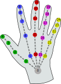

{{APIRef("WebXR Device API")}}

The **`XRHand`** interface is pair iterator (an ordered map) with the key being the hand joints and the value being an {{domxref("XRJointSpace")}}.

`XRHand` is returned by {{domxref("XRInputSource.hand")}}.

## Instance properties

- `size` {{ReadOnlyInline}} {{Experimental_Inline}}
  - : Returns `25`, the size of the pair iterator.

## Instance methods

The `XRHand` object is a pair iterator. It can directly be used in a {{jsxref("Statements/for...of", "for...of")}} structure. `for (const joint of myHand)` is equivalent to `for (const joint of myHand.entries())`.
However, it's not a map-like object, so you don't have the `clear()`, `delete()`, `has()`, and `set()` methods.

- `entries()` {{Experimental_Inline}}
  - : Returns an iterator with the hand joints/{{domxref("XRJointSpace")}} pairs for each element.
    See {{jsxref("Map.prototype.entries()")}} for more details.
- `forEach()` {{Experimental_Inline}}
  - : Runs a provided function once per each hand joint/{{domxref("XRJointSpace")}} pair.
    See {{jsxref("Map.prototype.forEach()")}} for more details.
- `get()` {{Experimental_Inline}}
  - : Returns a {{domxref("XRJointSpace")}} for a given hand joint or {{jsxref("undefined")}} if no such hand joint key is in the map.
    See {{jsxref("Map.prototype.get()")}} for more details.
- `keys()` {{Experimental_Inline}}
  - : Returns an iterator with all the hand joint keys.
    See {{jsxref("Map.prototype.keys()")}} for more details.
- `values()` {{Experimental_Inline}}
  - : Returns an iterator with all the {{domxref("XRJointSpace")}} values.
    See {{jsxref("Map.prototype.values()")}} for more details.

## Hand joints

The `XRHand` object contains the following hand joints:



| Hand joint                         | Index |
| ---------------------------------- | ----- |
| wrist                              | 0     |
| thumb-metacarpal                   | 1     |
| thumb-phalanx-proximal             | 2     |
| thumb-phalanx-distal               | 3     |
| thumb-tip                          | 4     |
| index-finger-metacarpal            | 5     |
| index-finger-phalanx-proximal      | 6     |
| index-finger-phalanx-intermediate  | 7     |
| index-finger-phalanx-distal        | 8     |
| index-finger-tip                   | 9     |
| middle-finger-metacarpal           | 10    |
| middle-finger-phalanx-proximal     | 11    |
| middle-finger-phalanx-intermediate | 12    |
| middle-finger-phalanx-distal       | 13    |
| middle-finger-tip                  | 14    |
| ring-finger-metacarpal             | 15    |
| ring-finger-phalanx-proximal       | 16    |
| ring-finger-phalanx-intermediate   | 17    |
| ring-finger-phalanx-distal         | 18    |
| ring-finger-tip                    | 19    |
| pinky-finger-metacarpal            | 20    |
| pinky-finger-phalanx-proximal      | 21    |
| pinky-finger-phalanx-intermediate  | 22    |
| pinky-finger-phalanx-distal        | 23    |
| pinky-finger-tip                   | 24    |

## Examples

### Using `XRHand` objects

```js
const wristJoint = inputSource.hand.get("wrist");
const indexFingerTipJoint = inputSource.hand.get("index-finger-tip");

for (const [joint, jointSpace] of inputSource.hand) {
  console.log(joint);
  console.log(jointSpace);
}
```

## Specifications

{{Specifications}}

## Browser compatibility

{{Compat}}

## See also

- {{domxref("XRInputSource.hand")}}
