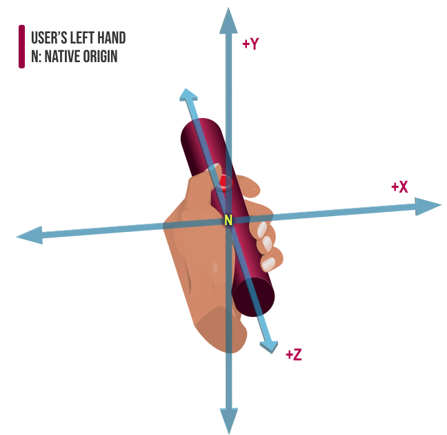
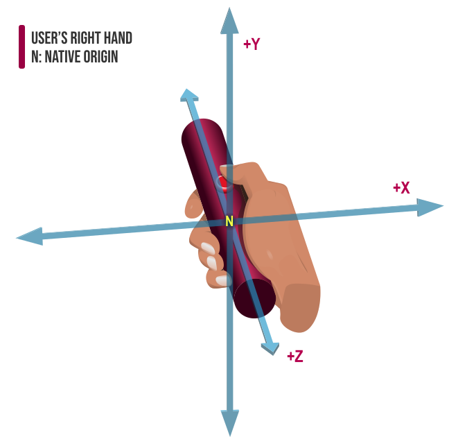

{{APIRef("WebXR Device API")}}

The read-only {{domxref("XRInputSource")}} property **`gripSpace`** returns an {{domxref("XRSpace")}} whose native origin tracks the pose used to render virtual objects so they appear to be held in (or part of) the user's hand. For example, if a user were holding a virtual straight rod, the native origin of this `XRSpace` would be located at the approximate center of mass of the user's fist.

## Value

An {{domxref("XRSpace")}} object representing the position and orientation of the input
device in virtual space, suitable for rendering an image of the device into the scene.
`gripSpace` is `null` if the input source is inherently
untrackable. For example, only inputs whose {{domxref("XRInputSource.targetRayMode",
  "targetRayMode")}} is `tracked-pointer` provide a `gripSpace`.

Imagine that the controller is shaped like a straight rod, held in the user's fist. The
native origin of the grip space is located at the centroid—the center of mass—of the
user's fist, tracking the position of the user's hand.

**The coordinate system for the left hand's grip space.**



**The coordinate system for the right hand's grip space.**



As shown in the diagram above, the coordinate system is oriented as follows:

- The x-axis is perpendicular to the palm of the user's hand, with the direction
  extending outward from the back of the hand being +X if the controller is in the
  user's right hand or -X if the controller is in the left hand.
- The z-axis along the length of the rod, parallel to the user's palm and along the
  length of their grip. -Z is in the direction of the user's thumb, and +Z is in the
  opposite direction.
- The y-axis is implied by the relationship between the other two axes; as is always
  the case, it's the cross product of the other two axes (lying 90° away from both the X
  and Z axes).

## Examples

In tis example, taken from the frame rendering callback, the `gripSpace` is
used to render a mesh that represents the position and orientation of the controller in
the virtual environment.

```js
for (const source in xrSession.inputSources) {
  if (source.gripSpace) {
    const gripPose = frame.getPose(source.gripSpace, xrRefSpace);

    if (gripPose) {
      myDrawMeshUsingTransform(controllerMesh, gripPose.transform.matrix);
    }
  }
}
```

For each input source which has a value for `gripSpace`, this loop obtains
the {{domxref("XRPose")}} representing the position and orientation that are described
by `gripSpace`. If a valid pose is returned, a method
`myDrawMeshUsingTransform()` is called to draw the controller's mesh
transformed using the grip pose's transform matrix.

## Specifications

{{Specifications}}

## Browser compatibility

{{Compat}}
