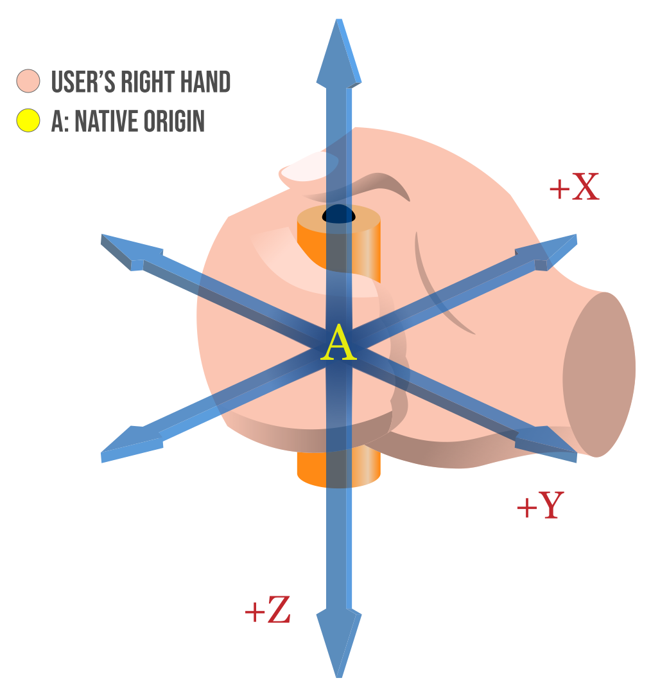

{{APIRef("WebXR Device API")}}{{SecureContext_Header}}

The [WebXR Device API's](/en-US/docs/Web/API/WebXR_Device_API) **`XRInputSource`** interface describes a single source of control input which is part of the user's WebXR-compatible virtual or augmented reality system. The device is specific to the platform being used, but provides the direction in which it is being aimed and optionally may generate events if the user triggers performs actions using the device.

## Instance properties

- {{domxref("XRInputSource.gamepad", "gamepad")}} {{ReadOnlyInline}}
  - : A {{domxref("Gamepad")}} object describing the state of the buttons and axes on the XR input source, if it is a gamepad or comparable device. If the device isn't a gamepad-like device, this property's value is `null`.
- {{domxref('XRInputSource.gripSpace', 'gripSpace')}} {{ReadOnlyInline}}
  - : An {{domxref("XRSpace")}} whose origin tracks the pose which is used to render objects which should appear as if they're held in the hand indicated by `handedness`. The orientation of this space indicates the angle at which the hand is gripping the object. Read on in the main article on {{domxref("XRInputSource.gripSpace", "gripSpace")}} for more details on how to use this space.
- {{domxref('XRInputSource.hand', 'hand')}} {{ReadOnlyInline}}
  - : An {{domxref("XRHand")}} object providing access to the underlying hand-tracking device.
- {{domxref('XRInputSource.handedness', 'handedness')}} {{ReadOnlyInline}}
  - : A string that indicates which hand the device represented by this `XRInputSource` is being used in, if any. The value will be `left`, `right`, or `none`.
- {{domxref('XRInputSource.profiles', 'profiles')}} {{ReadOnlyInline}}
  - : An array of strings, each specifying the name of an input profile describing the preferred visual representation and behavior of this input source.
- {{domxref('XRInputSource.targetRayMode', 'targetRayMode')}} {{ReadOnlyInline}}
  - : A string indicating the methodology used to produce the target ray: `gaze`, `tracked-pointer`, or `screen`.
- {{domxref('XRInputSource.targetRaySpace', 'targetRaySpace')}} {{ReadOnlyInline}}
  - : An {{domxref("XRSpace")}} object defining the origin of the target ray and the direction in which it extends. This space is established using the method defined by `targetRayMode`.

## Instance methods

_The `XRInputSource` interface defines no methods._

## Usage notes

### Actions and the target ray

If the device provides an indication of the direction in which it is pointed, this is done using a **target ray**. This is a ray extending from the position of the device outward in the direction in which it is pointed.

**A target ray emitted by a hand controller.**

If the device includes a trigger or other squeezable input, such as a hand gesture device that recognizes when the user squeezes their fist, that action is called a **primary squeeze action**. A primary squeeze action should correspond to a gripping act in reality, such as taking hold of an object or pressing a trigger on a tool or weapon. When a squeeze action begins, such as by the user pressing the trigger or tightening their grip, a {{domxref("XRSession.squeezestart_event", "squeezestart")}} event is sent to the `XRSession`. Once the action is completed and the user has released the trigger or the grip, a {{domxref("XRSession.squeeze_event", "squeeze")}} event is sent. This is followed by a {{domxref("XRSession.squeezeend_event", "squeezeend")}}, which is also sent if the action is aborted rather than completed.

If the device has a button or other pressable input control, it is a **primary input source**, and this button is a **primary action**. A primary action may occur when the user presses a button, clicks on a touchpad or the top button of a thumb stick, or uses a hand gesture or spoken command that invokes the button-like action. When a primary action begins, a {{domxref("XRSession.selectstart_event", "selectstart")}} event is sent to the {{domxref("XRSession")}}. When the action has completed (such as when the user releases the button), a {{domxref("XRSession.select_event", "select")}} event is sent. Finally, once that is done—or if the user aborts the action—a {{domxref("XRSession.selectend_event", "selectend")}} event is sent to the session object.

An action may be aborted either by the user in some device-specific fashion or if the input device is disconnected before the action is completed.

### Local coordinate system

Each input source has its own local coordinate system, which is described by the {{domxref("XRInputSource.gripSpace", "gripSpace")}} property, which is an {{domxref("XRSpace")}} used to map the input's coordinate system into the world coordinate system. The grip space's coordinate system can then be used to render objects so they appear to be held in the user's hand.

For more details on the input source's coordinate system, see the article that covers the {{domxref("XRInputSource.gripSpace", "gripSpace")}} property in detail.

## Specifications

{{Specifications}}

## Browser compatibility

{{Compat}}

## See also

- [WebXR Device API](/en-US/docs/Web/API/WebXR_Device_API)
- [Inputs and input sources](/en-US/docs/Web/API/WebXR_Device_API/Inputs)
- {{domxref("XRInputSourceArray")}}
- {{domxref("XRSpace")}}
