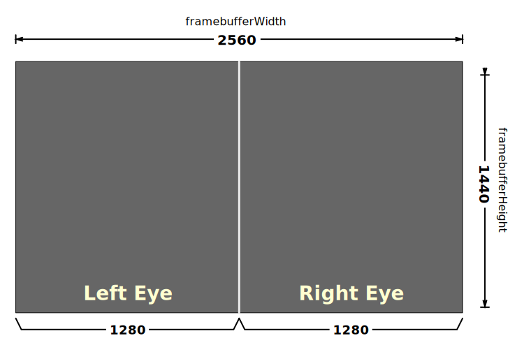
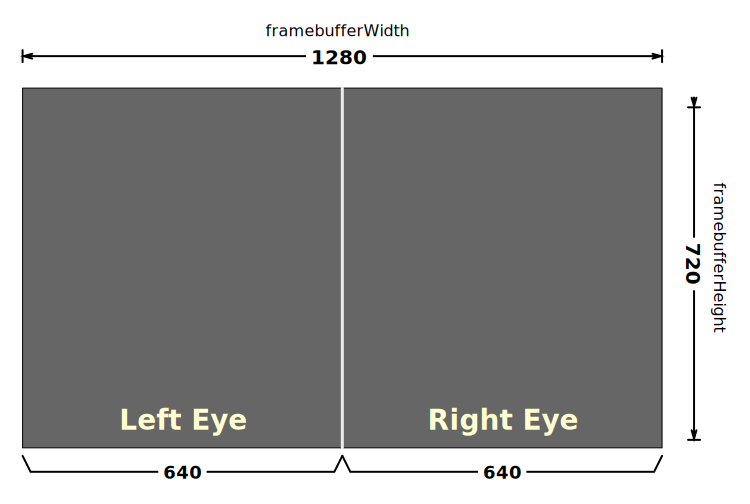
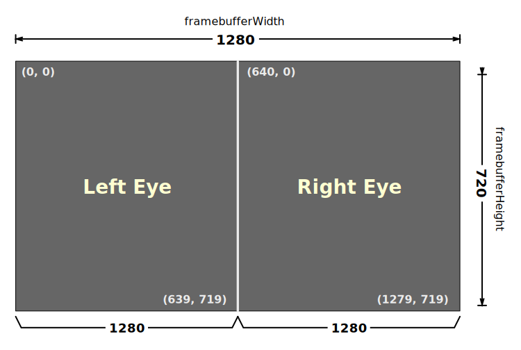
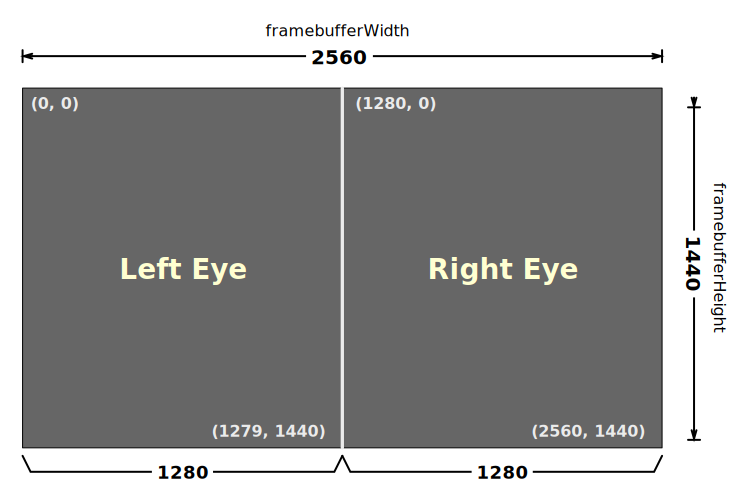

{{APIRef("WebXR Device API")}}

The static method
**`XRWebGLLayer.getNativeFramebufferScaleFactor()`** returns a
floating-point scaling factor by which one can multiply the specified
{{domxref("XRSession")}}'s resolution to get the native resolution of the WebXR
device's frame buffer.

This information can be used when creating a new `XRWebGLLayer` to configure
the `framebufferScaleFactor` in the `layerInit` configuration object
specified when calling the `XRWebGLLayer()` constructor. See the
[Usage notes](#usage_notes) and [Examples](#examples) for details.

If the scaling factor is 1.0, then the frame buffer pixels and the native display
pixels are the same size. If the scaling factor is greater than zero, then the frame
buffer is smaller than the display's native dimensions, resulting in the output being
up-scaled for display to the screen after rendering into the frame buffer. If the
scaling factor is less than zero, the frame buffer is _larger_ than the native
resolution of the display, resulting in the frame buffer's contents being scaled down
for display to the XR device. This can happen for display environments which use
superscaling or anti-aliasing techniques to improve perceived image quality.

## Syntax

```js
let nativeScaling = XRWebGLLayer.getNativeFramebufferScaleFactor(session);
```

### Parameters

- `session`
  - : The {{domxref("XRSession")}} for which to return the native framebuffer scaling
    factor.

### Return value

A floating-point value which, when multiplied by the {{domxref("XRSession")}}'s
recommended framebuffer dimensions, results in the XR device's native frame buffer
resolution. If the session has ended, this function returns 0.0.

## Usage notes

The scaling factor returned by this function will be 1.0 if the native resolution of
the XR device and the resolution of the XR device match. In any case, multiplying the
recommended resolution as identified by the `XRSession` by this value will
result in the actual native resolution of the XR hardware.

The recommended WebGL frame buffer resolution is the best possible estimate of the
resolution necessary to contain all of the {{domxref("XRView")}}s needed by the device
while at the same time providing typical applications an acceptable balance of image
quality and performance.

For example, consider a device which uses a 2560x1440 pixel frame buffer (which is used
to render two views, for the left and right eyes, side by side each at a resolution of
1280x1440 pixels). Consider a frame buffer which at full size looks like this:



If, on this device, it's determined that due to GPU limitations the browser needs to
reduce image quality in order to improve performance to an acceptable level, it might
choose to halve the resolution. In this case, the value returned by
`XRWebGLLayer.getNativeFramebufferScaleFactor()` will be 2.0. This method of
dividing the frame buffer between views is shown in the following diagram.



Now the width and height of the frame buffer are 50% what they were before, resulting
in a total frame buffer size of 1280 by 720 pixels, with each eye's half of the buffer
being 640x720 pixels. Now we can see the coordinates of each of the viewports
representing these two views:



Since each eye gets half of the frame buffer, the result is that the left eye gets a
640x720 portion of the buffer with the viewport's `x` and `y` at
0, the width at 640, and the height set to 720. The right eye gets the other half of the
frame buffer, with its viewport's `x` set at 639.

While [rendering a frame for this scene](/en-US/docs/Web/API/XRWebGLLayer#rendering_every_view_in_a_frame), we get the viewport for the view and apply it to WebGL, then
render the scene. This ensures that the scene we render will not only match the
viewpoint we need to express (which is defined by the position and orientation data in
the pose), but that the rendered output will be constrained within the correct portion
of the frame buffer for the eye we're drawing, regardless of any scaling that is being
performed.

## Examples

In this example, we request a frame buffer at the device's native resolution,
regardless of any performance concerns:

```js
function requestNativeScaleWebGLLayer(gl, xrSession) {
  return gl.makeXRCompatible().then(() => {
    let scaleFactor = XRWebGLLayer.getNativeFramebufferScaleFactor(xrSession);
    let glLayer = new XRWebGLLayer(xrSession, gl, {
                    framebufferScaleFactor: scaleFactor
    });
    xrSession.updateRenderState({ baseLayer: glLayer });
  });
};
```

This starts by calling the [WebGL rendering context](/en-US/docs/Web/API/WebGLRenderingContext) function {{domxref("WebGLRenderingContext.makeXRCompatible",
  "makeXRCompatible()")}}. When the returned {{jsxref("promise")}} resolves, we proceed by
calling `XRWebGLLayer`'s `getNativeFramebufferScaleFactor()`
static function to get the scale factor needed to reach the native resolution, and we
then pass that into the {{domxref("XRWebGLLayer.XRWebGLLayer", "WebGLLayer()")}}
constructor as the value of the `framebufferScaleFactor`
property in its `layerInit` configuration object.

That gets us a new {{domxref("XRWebGLLayer")}} object representing a rendering surface
we can use for the {{domxref("XRSession")}}; we set it as the rendering surface for
`xrSession` by calling its {{domxref("XRSession.updateRenderState",
  "updateRenderState()")}} method, passing the new `glLayer` in using the
{{domxref("XRRenderState")}} dictionary's {{domxref("XRRenderState.baseLayer")}}
property. The result is a rendering context that looks like the diagram below:



Each time the {{domxref("XRViewerPose")}}'s {{domxref("XRViewerPose.views", "views")}}
are iterated over for rendering, the rendering loop obtains an {{domxref("XRView")}} for
the left eye which has its top-left corner at (0, 0) with its width and height being
1280x1440 pixels. The right eye it obtains has its top-left corner at 1280, 0 with the
same width and height: 1280x1440.

## Specifications

{{Specifications}}

## Browser compatibility

{{Compat}}

## See also

- [WebXR Device API](/en-US/docs/Web/API/WebXR_Device_API)
- [WebXR performance guide](/en-US/docs/Web/API/WebXR_Device_API/Performance)
