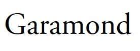
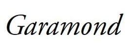

{{CSSRef}}

The **`font-style`** CSS descriptor allows authors to specify font styles for the fonts specified in the {{cssxref("@font-face")}} rule.

For a particular font family, authors can download various font faces which correspond to the different styles of the same font family, and then use the `font-style` descriptor to explicitly specify the font face's style. The values for the CSS descriptor is same as that of its corresponding font property.

## Syntax

```css
font-style: normal;
font-style: italic;
font-style: oblique;
font-style: oblique 30deg;
font-style: oblique 30deg 50deg;
```

### Values

- `normal`
  - : Selects the normal version of the font-family.
- `italic`
  - : Specifies that font-face is an italicized version of the normal font.
- `oblique`
  - : Specifies that the font-face is an artificially sloped version of the normal font.
- `oblique` with angle
  - : Selects a font classified as `oblique`, and additionally specifies an angle for the slant of the text.
- `oblique` with angle range
  - : Selects a font classified as `oblique`, and additionally specifies a range of allowable angle for the slant of the text. Note that a range is only supported when the `font-style` is `oblique`; for `font-style: normal` or `italic`, no second value is allowed.

## Formal definition

{{cssinfo}}

## Formal syntax

```
normal               |
italic               |
oblique <angle>{0,2}
```

## Examples

### Specifying an italic font style

As an example, consider the garamond font family, in its normal form, we get the following result:

```css
@font-face {
  font-family: garamond;
  src: url('garamond.ttf');
}
```



The italicized version of this text uses the same glyphs present in the unstyled version, but they are artificially sloped by a few degrees.


On the other hand, if a true italicized version of the font family exists, we can include it in the `src` descriptor and specify the font style as italic, so that it is clear that the font is italicized. True italics use different glyphs and are a bit different from their upright counterparts, having some unique features and generally have a rounded and calligraphic quality. These fonts are specially created by font designers and are **not** artificially sloped.

```css
@font-face {
  font-family: garamond;
  src: url('garamond-italic.ttf');
  font-style: italic;
}
```



## Specifications

{{Specifications}}

## Browser compatibility

{{Compat}}

## See also

- {{cssxref("@font-face/font-display", "font-display")}}
- {{cssxref("@font-face/font-family", "font-family")}}
- {{cssxref("@font-face/font-stretch", "font-stretch")}}
- {{cssxref("@font-face/font-weight", "font-weight")}}
- {{cssxref("@font-face/font-variant", "font-variant")}}
- {{cssxref("font-feature-settings", "font-feature-settings")}}
- {{cssxref("@font-face/font-variation-settings", "font-variation-settings")}}
- {{cssxref("@font-face/src", "src")}}
- {{cssxref("@font-face/unicode-range", "unicode-range")}}
