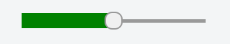

{{CSSRef}}{{Non-standard_header}}

The **`::-moz-range-progress`** [CSS](/en-US/docs/Web/CSS) [pseudo-element](/en-US/docs/Web/CSS/Pseudo-elements) is a [Mozilla extension](/en-US/docs/Web/CSS/Mozilla_Extensions) that represents the lower portion of the _track_ (i.e., groove) in which the indicator slides in an {{HTMLElement("input")}} of `type="range"`. This portion corresponds to values lower than the value currently selected by the _thumb_ (i.e., virtual knob).

> [!NOTE]
> Using `::-moz-range-progress` with anything but an `<input type="range">` doesn't match anything and has no effect.

## Syntax

```css
::-moz-range-progress {
  /* ... */
}
```

## Examples

### HTML

```html
<input type="range" min="0" max="100" step="5" value="50" />
```

### CSS

```css
input[type="range"]::-moz-range-progress {
  background-color: green;
  height: 1em;
}
```

### Result

{{EmbedLiveSample("Examples", 300, 50)}}

A progress bar using this style might look something like this:



## Specifications

Not part of any standard.

## Browser compatibility

{{Compat}}

## See also

- The pseudo-elements used by Gecko to style other parts of a range input:

  - {{cssxref("::-moz-range-thumb")}} represents the indicator that slides in the groove.
  - {{cssxref("::-moz-range-track")}} represents the groove in which the thumb slides.

- [CSS-Tricks: Styling Cross-Browser Compatible Range Inputs with CSS](https://css-tricks.com/styling-cross-browser-compatible-range-inputs-css/)
- [QuirksMode: Styling and scripting sliders](https://www.quirksmode.org/blog/archives/2015/11/styling_and_scr.html)
