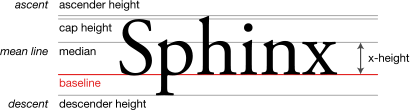

{{CSSRef}}

The [CSS](/en-US/docs/Web/CSS) **`align-content`** property sets the distribution of space between and around content items along a [flexbox](/en-US/docs/Web/CSS/CSS_flexible_box_layout)'s [cross axis](/en-US/docs/Glossary/Cross_Axis), or a [grid](/en-US/docs/Web/CSS/CSS_grid_layout) or [block-level](/en-US/docs/Glossary/Block-level_content) element's block axis.

The interactive example below uses Grid Layout to demonstrate some of the values of this property.

{{EmbedInteractiveExample("pages/css/align-content.html")}}

This property has no effect on single line flex containers (i.e. ones with `flex-wrap: nowrap`).

## Syntax

```css
/* Normal alignment */
align-content: normal;

/* Basic positional alignment */
/* align-content does not take left and right values */
align-content: start;
align-content: center;
align-content: end;
align-content: flex-start;
align-content: flex-end;

/* Baseline alignment */
align-content: baseline;
align-content: first baseline;
align-content: last baseline;

/* Distributed alignment */
align-content: space-between;
align-content: space-around;
align-content: space-evenly;
align-content: stretch;

/* Overflow alignment */
align-content: safe center;
align-content: unsafe center;

/* Global values */
align-content: inherit;
align-content: initial;
align-content: revert;
align-content: revert-layer;
align-content: unset;
```

### Values

- `normal`
  - : The items are packed in their default position as if no `align-content` value was set.
- `start`
  - : The items are packed flush to each other against the start edge of the alignment container in the cross axis.
- `center`
  - : The items are packed flush to each other in the center of the alignment container along the cross axis.
- `end`
  - : The items are packed flush to each other against the end edge of the alignment container in the cross axis.
- `flex-start`
  - : The items are packed flush to each other against the edge of the alignment container depending on the flex container's cross-start side.
    This only applies to flex layout items. For items that are not children of a flex container, this value is treated like `start`.
- `flex-end`
  - : The items are packed flush to each other against the edge of the alignment container depending on the flex container's cross-end side.
    This only applies to flex layout items. For items that are not children of a flex container, this value is treated like `end`.
- `baseline`, `first baseline`, `last baseline`

  - : Specifies participation in first- or last-baseline alignment: aligns the alignment baseline of the box's first or last baseline set with the corresponding baseline in the shared first or last baseline set of all the boxes in its baseline-sharing group.

    

    The fallback alignment for `first baseline` is `start`, the one for `last baseline` is `end`.

- `space-between`
  - : The items are evenly distributed within the alignment container along the cross axis. The spacing between each pair of adjacent items is the same. The first item is flush with the start edge of the alignment container in the cross axis, and the last item is flush with the end edge of the alignment container in the cross axis.
- `space-around`
  - : The items are evenly distributed within the alignment container along the cross axis. The spacing between each pair of adjacent items is the same. The empty space before the first and after the last item equals half of the space between each pair of adjacent items.
- `space-evenly`
  - : The items are evenly distributed within the alignment container along the cross axis. The spacing between each pair of adjacent items, the start edge and the first item, and the end edge and the last item, are all exactly the same.
- `stretch`
  - : If the combined size of the items along the cross axis is less than the size of the alignment container, any `auto`-sized items have their size increased equally (not proportionally), while still respecting the constraints imposed by {{cssxref("max-height")}}/{{cssxref("max-width")}} (or equivalent functionality), so that the combined size exactly fills the alignment container along the cross axis.
- `safe`
  - : Used alongside an alignment keyword. If the chosen keyword means that the item overflows the alignment container causing data loss, the item is instead aligned as if the alignment mode were `start`.
- `unsafe`
  - : Used alongside an alignment keyword. Regardless of the relative sizes of the item and alignment container and whether overflow which causes data loss might happen, the given alignment value is honored.

> **Note:** The `<content-distribution>` values (`space-between`, `space-around`, `space-evenly`, and `stretch`) have no effect in [block layout](/en-US/docs/Web/CSS/CSS_box_alignment/Box_alignment_in_block_abspos_tables#align-content_and_justify-content) as all the content in that block is treated as a single [alignment-subject](/en-US/docs/Glossary/Alignment_Subject)

## Formal definition

{{CSSInfo}}

## Formal syntax

{{csssyntax}}

## Examples


In this example, you can switch between three different {{cssxref("display")}} property values, includ `flex`, `grid`, and `block`. You can also switch between the different values for `align-content`.

#### HTML

```html-nolint hidden
<div class="wrapper">
```

```html
<section>
  <div class="olive"></div>
  <div class="coral"></div>
  <div class="deepskyblue"></div>
</section>
```

```html hidden
<fieldset class="controls">
    <legend>Controls</legend>
    <div class="row">
      <label for="display">display: </label>
      <select id="display">
        <option value="flex">flex</option>
        <option value="grid">grid</option>
        <option value="block">block</option>
      </select>
    </div>
    <div class="row">
      <label for="values">align-content: </label>
      <select id="values">
        <option value="normal" selected>normal</option>
        <option value="start">start</option>
        <option value="center">center</option>
        <option value="end">end</option>
        <option value="flex-start">flex-start</option>
        <option value="flex-end">flex-end</option>
        <option value="space-between">space-between</option>
        <option value="space-around">space-around</option>
        <option value="space-evenly">space-evenly</option>
      </select>
    </div>
    <h2>styles</h2>
    <pre>
      .<span class="displayType">flex</span> {
        display: <span class="displayType">flex</span>;
        align-content: <span id="align">normal</span>
      }
    </pre>
    <p id="note" hidden="hidden">
      In <a href="/en-US/docs/Web/CSS/CSS_box_alignment/Box_alignment_in_block_abspos_tables#align-content_and_justify-content">block layout the child elements are treated a single element</a><br>so  <code class="align">normal</code> behaves differently.
    </p>
  </fieldset>
</div>
```

#### CSS

```css hidden
.wrapper {
  display: flex;
  gap: 1rem;
}
h2 {
  margin: 0;
  margin-bottom: 0.2rem;
}
.row {
  margin-bottom: 0.2rem;
}
```

```css
section {
  border: solid 2px tomato;
  height: 300px;
  width: 300px;
}
section div {
  height: 75px;
  width: 100%;
}
.olive {
  background-color: olive;
}
.coral {
  background-color: coral;
}
.deepskyblue {
  background-color: deepskyblue;
}
.flex {
  display: flex;
  flex-wrap: wrap;
  gap: 0.2rem;
}
.grid {
  display: grid;
  gap: 0.2rem;
}
.block {
  display: block;
}
```

```js hidden
const values = document.querySelector("#values");
const display = document.querySelector("#display");
const container = document.querySelector("#outer");
const displayTypes = document.querySelectorAll(".displayType");
const aligns = document.querySelectorAll(".align");
const note = document.querySelector("#note");
const hideNote = (a, d) => {
  const distributions = ["space-between", "space-around", "space-evenly"];
  if (distributions.includes(a) && d === "block") {
    note.removeAttribute("hidden");
  } else {
    note.setAttribute("hidden", "hidden");
  }
};
values.addEventListener("change", (evt) => {
  const alVal = evt.target.value;
  container.style.alignContent = alVal;
  aligns.forEach((align) => {
    align.innerText = alVal;
  });
  hideNote(alVal, display.value);
});
display.addEventListener("change", (evt) => {
  const dVal = evt.target.value;
  container.className = dVal;
  displayTypes.forEach((dType) => {
    dType.innerText = dVal;
  });
  hideNote(values.value, dVal);
});
```

#### Result

Try changing the `display` value and the `align-content` value.

{{EmbedLiveSample("Examples", 260, 310)}}

In [block layout](/en-US/docs/Web/CSS/CSS_box_alignment/Box_alignment_in_block_abspos_tables#align-content_and_justify-content), child elements are treated as a single element, meaning `normal` behaves differently.

## Specifications

{{Specifications}}

## Browser compatibility

{{Compat}}

## See also

- CSS Flexbox Guide: _[Basic Concepts of Flexbox](/en-US/docs/Web/CSS/CSS_flexible_box_layout/Basic_concepts_of_flexbox)_
- CSS Flexbox Guide: _[Aligning items in a flex container](/en-US/docs/Web/CSS/CSS_flexible_box_layout/Aligning_items_in_a_flex_container)_
- CSS Grid Guide: _[Box alignment in CSS Grid layouts](/en-US/docs/Web/CSS/CSS_grid_layout/Box_alignment_in_grid_layout)_
- [CSS Box Alignment](/en-US/docs/Web/CSS/CSS_box_alignment)
- [Block and inline layout in normal flow](/en-US/docs/Web/CSS/CSS_flow_layout/Block_and_inline_layout_in_normal_flow)
- [Block-level_content](/en-US/docs/Glossary/Block-level_content)
- {{CSSXRef("display")}}
