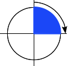
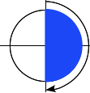
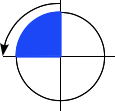
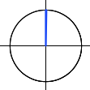

{{CSSRef}}

The **`<angle>`** [CSS](/en-US/docs/Web/CSS) [data type](/en-US/docs/Web/CSS/CSS_Types) represents an angle value expressed in degrees, gradians, radians, or turns. It is used, for example, in {{cssxref("&lt;gradient&gt;")}}s and in some {{cssxref("transform")}} functions.

{{EmbedInteractiveExample("pages/css/type-angle.html")}}

## Syntax

The `<angle>` data type consists of a {{cssxref("&lt;number&gt;")}} followed by one of the units listed below. As with all dimensions, there is no space between the unit literal and the number. The angle unit is optional after the number `0`.

Optionally, it may be preceded by a single `+` or `-` sign. Positive numbers represent clockwise angles, while negative numbers represent counterclockwise angles. For static properties of a given unit, any angle can be represented by various equivalent values. For example, `90deg` equals `-270deg`, and `1turn` equals `4turn`. For dynamic properties, like when applying an {{cssxref("animation")}} or {{cssxref("transition")}}, the effect will nevertheless be different.

### Units

- `deg`
  - : Represents an angle in [degrees](https://en.wikipedia.org/wiki/Degree_%28angle%29). One full circle is `360deg`. Examples: `0deg`, `90deg`, `14.23deg`.
- `grad`
  - : Represents an angle in [gradians](https://en.wikipedia.org/wiki/Gradian). One full circle is `400grad`. Examples: `0grad`, `100grad`, `38.8grad`.
- `rad`
  - : Represents an angle in [radians](https://en.wikipedia.org/wiki/Radian). One full circle is 2π radians which approximates to `6.2832rad`. `1rad` is 180/π degrees. Examples: `0rad`, `1.0708rad`, `6.2832rad`.
- `turn`
  - : Represents an angle in a number of turns. One full circle is `1turn`. Examples: `0turn`, `0.25turn`, `1.2turn`.

## Examples

### Setting a clockwise right angle

<table class="standard-table">
  <tbody>
    <tr>
      <td></td>
      <td><code>90deg = 100grad = 0.25turn ≈ 1.5708rad</code></td>
    </tr>
  </tbody>
</table>

### Setting a flat angle

<table class="standard-table">
  <tbody>
    <tr>
      <td></td>
      <td><code>180deg = 200grad = 0.5turn ≈ 3.1416rad</code></td>
    </tr>
  </tbody>
</table>

### Setting a counterclockwise right angle

<table class="standard-table">
  <tbody>
    <tr>
      <td></td>
      <td><code>-90deg = -100grad = -0.25turn ≈ -1.5708rad</code></td>
    </tr>
  </tbody>
</table>

### Setting a null angle

<table class="standard-table">
  <tbody>
    <tr>
      <td></td>
      <td><code>0 = 0deg = 0grad = 0turn = 0rad</code></td>
    </tr>
  </tbody>
</table>

## Specifications

{{Specifications}}

## Browser compatibility

{{Compat}}

## See also

- [CSS data types](/en-US/docs/Web/CSS/CSS_Types)
- The [`<gradient>`](/en-US/docs/Web/CSS/gradient) type
- CSS rotation transforms: [`rotate()`](/en-US/docs/Web/CSS/transform-function/rotate), [`rotate3d()`](/en-US/docs/Web/CSS/transform-function/rotate3d), [`rotateX()`](/en-US/docs/Web/CSS/transform-function/rotateX), [`rotateY()`](/en-US/docs/Web/CSS/transform-function/rotateY), and [`rotateZ()`](/en-US/docs/Web/CSS/transform-function/rotateZ)
- [CSS transforms](/en-US/docs/Web/CSS/CSS_Transforms)
- [Using CSS transforms](/en-US/docs/Web/CSS/CSS_Transforms/Using_CSS_transforms)
- [Using CSS gradients](/en-US/docs/Web/CSS/CSS_Images/Using_CSS_gradients)
