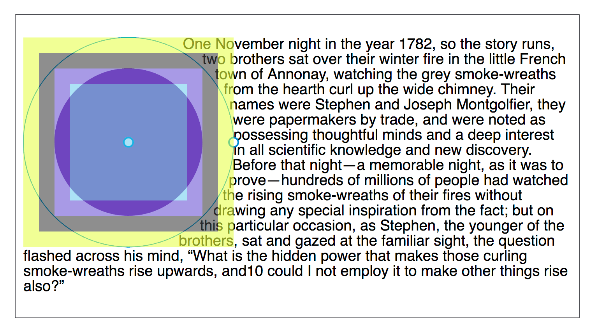

{{CSSRef}}

The **`<basic-shape>`** [CSS](/en-US/docs/Web/CSS) [data type](/en-US/docs/Web/CSS/CSS_Types) represents a shape used in the {{cssxref("clip-path")}}, {{cssxref("shape-outside")}}, and {{cssxref("offset-path")}} properties.

{{EmbedInteractiveExample("pages/css/type-basic-shape.html")}}

## Syntax

The `<basic-shape>` data type is defined with one of the basic shape functions listed below.

When creating a shape, the reference box is defined by each property that uses `<basic-shape>` values. The coordinate system for the shape has its origin at the top-left corner of the reference box, with the x-axis running to the right and the y-axis running downwards. All the lengths expressed in percentages are resolved from the used dimensions of the reference box.

The default reference box is the `margin-box`, as demonstrated in the below image which shows a circle created using `shape-outside: circle(50%)`. The shape is being defined with reference to the margin box.



### Shape functions

The following shapes are supported. All `<basic-shape>` values use functional notation and are defined here using the [value definition syntax](/en-US/docs/Web/CSS/Value_definition_syntax).

- `{{cssxref("basic-shape/inset","inset()")}}`

  - : Defines an inset rectangle.

    ```css
    inset( <length-percentage>{1,4} [ round <`border-radius`> ]? )
    ```

    When all of the first four arguments are supplied, they represent the top, right, bottom and left offsets from the reference box inward that define the position of the edges of the inset rectangle. These arguments follow the syntax of the {{cssxref("margin")}} shorthand, which lets you set all four insets with one, two, three, or four values.

    The optional `round <'border-radius'>` parameter defines rounded corners for the inset rectangle using the same syntax as the CSS [`border-radius`](/en-US/docs/Web/CSS/border-radius) shorthand property.

    A pair of insets in either dimension that add up to more than the used dimension (such as left and right insets of 75% apiece) define a shape enclosing no area. For this specification, this results in an empty float area.

- `{{cssxref("basic-shape/rect","rect()")}}` {{Experimental_Inline}}

  - : Defines a rectangle using the specified distances from the top and left edges of the reference box.

    ```css
    rect( [ <length-percentage> | auto ]{4} [ round <`border-radius`> ]? )
    ```

    You specify four values to create the rectangle. Each of the four values is either a `<length>`, a `<percentage>`, or the keyword `auto`. When using the `rect()` function, you do not define the width and height of the rectangle. The rectangle's dimensions depend on the size of the reference box and the offset values.

    The optional `round <'border-radius'>` parameter defines rounded corners for the inset rectangle using the same syntax as the CSS [`border-radius`](/en-US/docs/Web/CSS/border-radius) shorthand property.

- `{{cssxref("basic-shape/xywh","xywh()")}}` {{Experimental_Inline}}

  - : Defines a rectangle using the specified distances from the top and left edges of the reference box and the specified width and height of the rectangle.

    ```css
    xywh( <length-percentage>{2} <length-percentage [0,∞]>{2} [ round <`border-radius`> ]? )
    ```

    The optional `round <'border-radius'>` parameter defines rounded corners for the inset rectangle using the [`border-radius`](/en-US/docs/Web/CSS/border-radius) shorthand syntax.

- `{{cssxref("basic-shape/circle","circle()")}}`

  - : Defines a circle using a radius and a position.

    ```css
    circle( <shape-radius>? [ at <position> ]? )
    ```

    The `<shape-radius>` argument represents _r_, the radius of the circle. Negative values are invalid. A percentage value here is resolved from the used width and height of the reference box as `sqrt(width^2+height^2)/sqrt(2)`.

    The {{cssxref("&lt;position&gt;")}} argument defines the center of the circle. This defaults to center if omitted.

- `{{cssxref("basic-shape/ellipse","ellipse()")}}`

  - : Defines an ellipse using two radii and a position.

    ```css
    ellipse( [ <shape-radius>{2} ]? [ at <position> ]? )
    ```

    The `<shape-radius>` arguments represent rx and ry, the x-axis and y-axis radii of the ellipse, in that order. Negative values for either radius are invalid. Percentage values here are resolved against the used width (for the rx value) and the used height (for the ry value) of the reference box.

    The position argument defines the center of the ellipse. This defaults to center if omitted.

- `{{cssxref("basic-shape/polygon","polygon()")}}`

  - : Defines a polygon using an SVG {{SVGAttr("fill-rule")}} and a set of vertices.

    ```css
    polygon( <fill-rule>? [ <shape-arg> <shape-arg> ]# )
    ```

    `<fill-rule>` represents the {{SVGAttr("fill-rule")}} used to determine the interior of the polygon. Possible values are `nonzero` and `evenodd`. Default value when omitted is `nonzero`.

    Each pair argument in the list represents _xi_ and _yi_ - the x and y axis coordinates of the vertex of the polygon at position i.

- `{{cssxref("path","path()")}}`

  - : Defines a shape using an SVG {{SVGAttr("fill-rule")}} and an SVG [path definition](/en-US/docs/Web/SVG/Attribute/d).

    ```css
    path( [ <fill-rule>, ]? <string> )
    ```

    The optional `<fill-rule>` represents the {{SVGAttr("fill-rule")}} used to determine the interior of the path. Possible values are `nonzero` and `evenodd`. Default value when omitted is `nonzero`.

    The required \<string> is an [SVG Path](/en-US/docs/Web/SVG/Attribute/d) string encompassed in quotes

The arguments not defined above are defined as follows:

```css
<shape-arg> = <length> | <percentage>
<shape-radius> = <length> | <percentage> | closest-side | farthest-side
```

Defines a radius for a circle or ellipse. If omitted it defaults to `closest-side`.

`closest-side` uses the length from the center of the shape to the closest side of the reference box. For circles, this is the closest side in any dimension. For ellipses, this is the closest side in the radius dimension.

`farthest-side` uses the length from the center of the shape to the farthest side of the reference box. For circles, this is the farthest side in any dimension. For ellipses, this is the farthest side in the radius dimension.

## Description

### Computed values of basic shapes

The values in a `<basic-shape>` function are computed as specified, with these exceptions:

- Omitted values are included and compute to their defaults.
- A {{cssxref("&lt;position&gt;")}} value in `circle()` or `ellipse()` is computed as a pair of offsets (horizontal then vertical) from the top left origin, each given as a combination of an absolute length and a percentage.
- A [`<border-radius>`](/en-US/docs/Web/CSS/border-radius) value in `inset()` is computed as an expanded list of all eight {{cssxref("length")}} or percentage values.

### Interpolation of basic shapes

When animating between one `<basic-shape>` and another, the rules below are applied. The values in the shape functions {{Glossary("interpolation", "interpolate")}} as a simple list. The list values interpolate as {{cssxref("&lt;length&gt;")}}, {{cssxref("&lt;percentage&gt;")}}, or {{cssxref("calc", "calc()")}} where possible. If list values are not one of those types but are identical, those values do interpolate.

- Both shapes must use the same reference box.
- If both shapes are the same type, that type is `ellipse()` or `circle()`, and none of the radii use the `closest-side` or `farthest-side` keywords, interpolate between each value in the shape functions.
- If both shapes are of type `inset()`, interpolate between each value in the shape functions.
- If both shapes are of type `polygon()`, both polygons have the same number of vertices, and use the same `<fill-rule>`, interpolate between each value in the shape functions.
- If both shapes are of type `path()`, both paths strings have the same number and types of path data commands in the same order, interpolate each path data command as real numbers.
- In all other cases no interpolation occurs.

## Examples

### Animated polygon

In this example, we use the [@keyframes](/en-US/docs/Web/CSS/@keyframes) at-rule to animate a clip path between two polygons. Note that both polygons have the same number of vertices, which is necessary for this type of animation to work.

#### HTML

```html
<div></div>
```

#### CSS

```css
div {
  width: 300px;
  height: 300px;
  background: repeating-linear-gradient(red, orange 50px);
  clip-path: polygon(
    50% 0%,
    60% 40%,
    100% 50%,
    60% 60%,
    50% 100%,
    40% 60%,
    0% 50%,
    40% 40%
  );
  animation: 4s poly infinite alternate ease-in-out;
  margin: 10px auto;
}

@keyframes poly {
  from {
    clip-path: polygon(
      50% 0%,
      60% 40%,
      100% 50%,
      60% 60%,
      50% 100%,
      40% 60%,
      0% 50%,
      40% 40%
    );
  }

  to {
    clip-path: polygon(
      50% 30%,
      100% 0%,
      70% 50%,
      100% 100%,
      50% 70%,
      0% 100%,
      30% 50%,
      0% 0%
    );
  }
}
```

#### Result

{{EmbedLiveSample('Animated_polygon','340', '340')}}

## Specifications

{{Specifications}}

## Browser compatibility

{{Compat}}

## See also

- Properties that use this data type: {{cssxref("clip-path")}}, {{cssxref("shape-outside")}}
- [CSS shapes](/en-US/docs/Web/CSS/CSS_shapes) module
- [Overview of CSS shapes](/en-US/docs/Web/CSS/CSS_shapes/Overview_of_shapes)
- [Edit Shape Paths in CSS — Firefox Developer Tools](https://firefox-source-docs.mozilla.org/devtools-user/page_inspector/how_to/edit_css_shapes/index.html)
