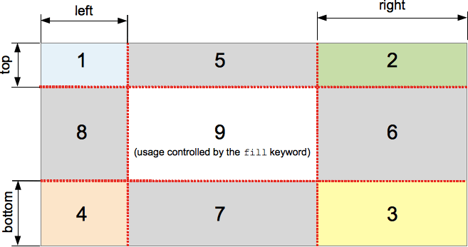

{{CSSRef}}

The **`border-image-slice`** [CSS](/en-US/docs/Web/CSS) property divides the image specified by {{cssxref("border-image-source")}} into regions. These regions form the components of an element's [border image](/en-US/docs/Web/CSS/border-image).

{{EmbedInteractiveExample("pages/css/border-image-slice.html")}}

The slicing process creates nine regions in total: four corners, four edges, and a middle region. Four slice lines, set a given distance from their respective sides, control the size of the regions.

[](/en-US/docs/Web/CSS/border-image-slice/border-image-slice.png)

The above diagram illustrates the location of each region.

- Zones 1-4 are corner regions. Each one is used a single time to form the corners of the final border image.
- Zones 5-8 are edge regions. These are [repeated, scaled, or otherwise modified](/en-US/docs/Web/CSS/border-image-repeat) in the final border image to match the dimensions of the element.
- Zone 9 is the middle region. It is discarded by default, but is used like a background image if the keyword `fill` is set.

The {{cssxref("border-image-repeat")}}, {{cssxref("border-image-width")}}, and {{cssxref("border-image-outset")}} properties determine how these regions are used to form the final border image.

## Syntax

```css
/* All sides */
border-image-slice: 30%;

/* vertical | horizontal */
border-image-slice: 10% 30%;

/* top | horizontal | bottom */
border-image-slice: 30 30% 45;

/* top | right | bottom | left */
border-image-slice: 7 12 14 5;

/* Using the `fill` keyword */
border-image-slice: 10% fill 7 12;

/* Global values */
border-image-slice: inherit;
border-image-slice: initial;
border-image-slice: revert;
border-image-slice: revert-layer;
border-image-slice: unset;
```

The `border-image-slice` property may be specified using one to four `<number-percentage>` values to represent the position of each image slice. Negative values are invalid; values greater than their corresponding dimension are clamped to `100%`.

- When **one** position is specified, it creates all four slices at the same distance from their respective sides.
- When **two** positions are specified, the first value creates slices measured from the **top and bottom**, the second creates slices measured from the **left and right**.
- When **three** positions are specified, the first value creates a slice measured from the **top**, the second creates slices measured from the **left and right**, the third creates a slice measured from the **bottom**.
- When **four** positions are specified, they create slices measured from the **top**, **right**, **bottom**, and **left** in that order (clockwise).

The optional `fill` value, if used, can be placed anywhere in the declaration.

### Values

- {{cssxref("&lt;number&gt;")}}
  - : Represents an edge offset in _pixels_ for raster images and _coordinates_ for vector images. For vector images, the number is relative to the element's size, not the size of the source image, so percentages are generally preferable in these cases.
- {{cssxref("&lt;percentage&gt;")}}
  - : Represents an edge offset as a percentage of the source image's size: the width of the image for horizontal offsets, the height for vertical offsets.
- `fill`
  - : Preserves the middle image region and displays it like a background image, but stacked above the actual {{cssxref("background")}}. Its width and height are sized to match the top and left image regions, respectively.

## Formal definition

{{CSSInfo}}

## Formal syntax

{{csssyntax}}

## Examples

### Adjustable border width and slice

The following example shows a simple `<div>` with a border image set on it. The source image for the borders is as follows:


The diamonds are 30px across, therefore setting 30 pixels as the value for both [`border-width`](/en-US/docs/Web/CSS/border-width) and `border-image-slice` will get you complete and fairly crisp diamonds in your border:

```css
border-width: 30px;
border-image-slice: 30;
```

These are the default values we have used in this example. However, we have also provided two sliders to allow you to dynamically change the values of the above two properties, allowing you to appreciate the effect they have:

`border-image-slice` Changes the size of the image slice sampled for use in each border and border corner (and the content area, if the `fill` keyword is used) — varying this away from 30 causes the border to look somewhat irregular, but can have some interesting effects.

`border-width`: Changes the width of the border. The sampled image size is scaled to fit inside the border, which means that if the width is bigger than the slice, the image can start to look somewhat pixelated (unless of course you use an SVG image).

#### HTML

```html
<div class="wrapper">
  <div></div>
</div>

<ul>
  <li>
    <label for="width">slide to adjust <code>border-width</code></label>
    <input type="range" min="10" max="45" id="width">
    <output id="width-output">30px</output>
  </li>
  <li>
    <label for="slice">slide to adjust <code>border-image-slice</code></label>
    <input type="range" min="10" max="45" id="slice">
    <output id="slice-output">30</output>
  </li>
</ul>
```

#### CSS

```css
.wrapper {
  width: 400px;
  height: 300px;
}

div > div {
  width: 300px;
  height: 200px;
  border-width: 30px;
  border-style: solid;
  border-image: url(https://interactive-examples.mdn.mozilla.net/media/examples/border-diamonds.png);
  border-image-slice: 30;
  border-image-repeat: round;
}

li {
  display: flex;
  place-content: center;
}
```

#### JavaScript

```js
const widthSlider = document.getElementById('width');
const sliceSlider = document.getElementById('slice');
const widthOutput = document.getElementById('width-output');
const sliceOutput = document.getElementById('slice-output');
const divElem = document.querySelector('div > div');

widthSlider.addEventListener('input', () => {
  const newValue = `${widthSlider.value}px`;
  divElem.style.borderWidth = newValue;
  widthOutput.textContent = newValue;
})

sliceSlider.addEventListener('input', () => {
  const newValue = sliceSlider.value;
  divElem.style.borderImageSlice = newValue;
  sliceOutput.textContent = newValue;
})
```

#### Result

{{EmbedLiveSample('Adjustable_border_width_and_slice', '100%', 400)}}

## Specifications

{{Specifications}}

## Browser compatibility

{{Compat}}

## See also

- [Illustrated description of the 1-to-4-value syntax](/en-US/docs/Web/CSS/Shorthand_properties#tricky_edge_cases)
