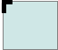

{{CSSRef}}

The **`border-radius`** [CSS](/en-US/docs/Web/CSS) property rounds the corners of an element's outer border edge. You can set a single radius to make circular corners, or two radii to make elliptical corners.

{{EmbedInteractiveExample("pages/css/border-radius.html")}}

The radius applies to the whole {{cssxref("background")}}, even if the element has no border; the exact position of the clipping is defined by the {{cssxref("background-clip")}} property.

The `border-radius` property does not apply to table elements when {{cssxref("border-collapse")}} is `collapse`.

> **Note:** As with any shorthand property, individual sub-properties cannot inherit, such as in `border-radius:0 0 inherit inherit`, which would partially override existing definitions. Instead, the individual longhand properties have to be used.

## Constituent properties

This property is a shorthand for the following CSS properties:

- [`border-top-left-radius`](/en-US/docs/Web/CSS/border-top-left-radius)
- [`border-top-right-radius`](/en-US/docs/Web/CSS/border-top-right-radius)
- [`border-bottom-right-radius`](/en-US/docs/Web/CSS/border-bottom-right-radius)
- [`border-bottom-left-radius`](/en-US/docs/Web/CSS/border-bottom-left-radius)

## Syntax

```css
/* The syntax of the first radius allows one to four values */
/* Radius is set for all 4 sides */
border-radius: 10px;

/* top-left-and-bottom-right | top-right-and-bottom-left */
border-radius: 10px 5%;

/* top-left | top-right-and-bottom-left | bottom-right */
border-radius: 2px 4px 2px;

/* top-left | top-right | bottom-right | bottom-left */
border-radius: 1px 0 3px 4px;

/* The syntax of the second radius allows one to four values */
/* (first radius values) / radius */
border-radius: 10px / 20px;

/* (first radius values) / top-left-and-bottom-right | top-right-and-bottom-left */
border-radius: 10px 5% / 20px 30px;

/* (first radius values) / top-left | top-right-and-bottom-left | bottom-right */
border-radius: 10px 5px 2em / 20px 25px 30%;

/* (first radius values) / top-left | top-right | bottom-right | bottom-left */
border-radius: 10px 5% / 20px 25em 30px 35em;

/* Global values */
border-radius: inherit;
border-radius: initial;
border-radius: revert;
border-radius: revert-layer;
border-radius: unset;
```

The `border-radius` property is specified as:

- one, two, three, or four {{cssxref("&lt;length&gt;")}} or {{cssxref("&lt;percentage&gt;")}} values. This is used to set a single radius for the corners.
- followed optionally by "/" and one, two, three, or four `<length>` or `<percentage>` values. This is used to set an additional radius, so you can have elliptical corners.

### Values

<table>
  <tbody>
    <tr>
      <td><em>radius</em></td>
      <td></td>
      <td>
        Is a {{cssxref("&lt;length&gt;")}} or a
        {{cssxref("&lt;percentage&gt;")}} denoting a radius to use
        for the border in each corner of the border. It is used only in the
        one-value syntax.
      </td>
    </tr>
    <tr>
      <td><em>top-left-and-bottom-right</em></td>
      <td>
        
      </td>
      <td>
        Is a {{cssxref("&lt;length&gt;")}} or a
        {{cssxref("&lt;percentage&gt;")}} denoting a radius to use
        for the border in the top-left and bottom-right corners of the element's
        box. It is used only in the two-value syntax.
      </td>
    </tr>
    <tr>
      <td><em>top-right-and-bottom-left</em></td>
      <td>
        
      </td>
      <td>
        Is a {{cssxref("&lt;length&gt;")}} or a
        {{cssxref("&lt;percentage&gt;")}} denoting a radius to use
        for the border in the top-right and bottom-left corners of the element's
        box. It is used only in the two- and three-value syntaxes.
      </td>
    </tr>
    <tr>
      <td><em>top-left</em></td>
      <td></td>
      <td>
        Is a {{cssxref("&lt;length&gt;")}} or a
        {{cssxref("&lt;percentage&gt;")}} denoting a radius to use
        for the border in the top-left corner of the element's box. It is used
        only in the three- and four-value syntaxes.
      </td>
    </tr>
    <tr>
      <td><em>top-right</em></td>
      <td></td>
      <td>
        Is a {{cssxref("&lt;length&gt;")}} or a
        {{cssxref("&lt;percentage&gt;")}} denoting a radius to use
        for the border in the top-right corner of the element's box. It is used
        only in the four-value syntax.
      </td>
    </tr>
    <tr>
      <td><em>bottom-right</em></td>
      <td></td>
      <td>
        Is a {{cssxref("&lt;length&gt;")}} or a
        {{cssxref("&lt;percentage&gt;")}} denoting a radius to use
        for the border in the bottom-right corner of the element's box. It is
        used only in the three- and four-value syntaxes.
      </td>
    </tr>
    <tr>
      <td><em>bottom-left</em></td>
      <td></td>
      <td>
        Is a {{cssxref("&lt;length&gt;")}} or a
        {{cssxref("&lt;percentage&gt;")}} denoting a radius to use
        for the border in the bottom-left corner of the element's box. It is
        used only in the four-value syntax.
      </td>
    </tr>
  </tbody>
</table>

- {{cssxref("&lt;length&gt;")}}
  - : Denotes the size of the circle radius, or the semi-major and semi-minor axes of the ellipse, using length values. Negative values are invalid.
- {{cssxref("&lt;percentage&gt;")}}
  - : Denotes the size of the circle radius, or the semi-major and semi-minor axes of the ellipse, using percentage values. Percentages for the horizontal axis refer to the width of the box; percentages for the vertical axis refer to the height of the box. Negative values are invalid.

For example:

```css
border-radius: 1em/5em;

/* It is equivalent to: */
border-top-left-radius: 1em 5em;
border-top-right-radius: 1em 5em;
border-bottom-right-radius: 1em 5em;
border-bottom-left-radius: 1em 5em;
```

```css
border-radius: 4px 3px 6px / 2px 4px;

/* It is equivalent to: */
border-top-left-radius: 4px 2px;
border-top-right-radius: 3px 4px;
border-bottom-right-radius: 6px 2px;
border-bottom-left-radius: 3px 4px;
```

## Formal definition

{{CSSInfo}}

## Formal syntax

{{csssyntax}}

## Examples

```html hidden
<pre id="example-1">
  border: solid 10px;
  border-radius: 10px 40px 40px 10px;
</pre>

<pre id="example-2">
  border: groove 1em red;
  border-radius: 2em;
</pre>

<pre id="example-3">
  background: gold;
  border: ridge gold;
  border-radius: 13em/3em;
</pre>

<pre id="example-4">
  border: none;
  border-radius: 40px 10px;
  background: gold;
</pre>

<pre id="example-5">
  border: none;
  border-radius: 50%;
  background: burlywood;
</pre>

<pre id="example-6">
  border: dotted;
  border-width: 10px 4px;
  border-radius: 10px 40px;
</pre>

<pre id="example-7">
  border: dashed;
  border-width: 2px 4px;
  border-radius: 40px;
</pre>
```

```css hidden
pre {
  margin: 20px;
  padding: 20px;
  width: 80%;
  height: 80px;
}

pre#example-1 {
  border: solid 10px;
  border-radius: 10px 40px 40px 10px;
}

pre#example-2 {
  border: groove 1em red;
  border-radius: 2em;
}

pre#example-3 {
  background: gold;
  border: ridge gold;
  border-radius: 13em/3em;
}

pre#example-4 {
  border: none;
  border-radius: 40px 10px;
  background: gold;
}

pre#example-5 {
  border: none;
  border-radius: 50%;
  background: burlywood;
}

pre#example-6 {
  border: dotted;
  border-width: 10px 4px;
  border-radius: 10px 40px;
}

pre#example-7 {
  border: dashed;
  border-width: 2px 4px;
  border-radius: 40px;
}
```

{{EmbedLiveSample("Examples", "200", "1150")}}

### Live Samples

- Sample 1 : <https://jsfiddle.net/Tripad/qnGKj/2/>
- Sample 2 : <https://jsfiddle.net/Tripad/qnGKj/3/>
- Sample 3 : <https://jsfiddle.net/Tripad/qnGKj/4/>
- Sample 4 : <https://jsfiddle.net/Tripad/qnGKj/5/>
- Sample 5 : <https://jsfiddle.net/Tripad/qnGKj/6/>

## Specifications

{{Specifications}}

## Browser compatibility

{{Compat}}

## See also

- Border-radius-related CSS properties: {{cssxref("border-top-left-radius")}}, {{cssxref("border-top-right-radius")}}, {{cssxref("border-bottom-right-radius")}}, {{cssxref("border-bottom-left-radius")}}, {{cssxref("border-start-start-radius")}}, {{cssxref("border-start-end-radius")}}, {{cssxref("border-end-start-radius")}}, {{cssxref("border-end-end-radius")}}
