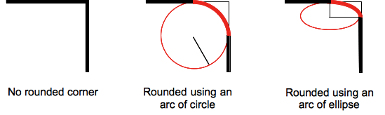

{{CSSRef}}

The **`border-top-right-radius`** [CSS](/en-US/docs/Web/CSS) property rounds the top-right corner of an element by specifying the radius (or the radius of the semi-major and semi-minor axes) of the ellipse defining the curvature of the corner.

{{EmbedInteractiveExample("pages/css/border-top-right-radius.html")}}

The rounding can be a circle or an ellipse, or if one of the value is `0` no rounding is done and the corner is square.



A background, being an image or a color, is clipped at the border, even a rounded one; the exact location of the clipping is defined by the value of the {{cssxref("background-clip")}} property.

> **Note:** If the value of this property is not set in a {{cssxref("border-radius")}} shorthand property that is applied to the element after the `border-top-right-radius` CSS property, the value of this property is then reset to its initial value by the [shorthand property](/en-US/docs/Web/CSS/Shorthand_properties).

## Syntax

```css
/* the corner is a circle */
/* border-top-right-radius: radius */
border-top-right-radius: 3px;

/* the corner is an ellipse */
/* border-top-right-radius: horizontal vertical */
border-top-right-radius: 0.5em 1em;

border-top-right-radius: inherit;

/* Global values */
border-top-right-radius: inherit;
border-top-right-radius: initial;
border-top-right-radius: revert;
border-top-right-radius: revert-layer;
border-top-right-radius: unset;
```

With one value:

- the value is a {{cssxref("&lt;length&gt;")}} or a {{cssxref("&lt;percentage&gt;")}} denoting the radius of the circle to use for the border in that corner.

With two values:

- the first value is a {{cssxref("&lt;length&gt;")}} or a {{cssxref("&lt;percentage&gt;")}} denoting the horizontal semi-major axis of the ellipse to use for the border in that corner.
- the second value is a {{cssxref("&lt;length&gt;")}} or a {{cssxref("&lt;percentage&gt;")}} denoting the vertical semi-major axis of the ellipse to use for the border in that corner.

### Values

- `<length-percentage>`
  - : Denotes the size of the circle radius or the semi-major and semi-minor axes of the ellipse. As absolute length it can be expressed in any unit allowed by the CSS {{cssxref("&lt;length&gt;")}} data type. Percentages for the horizontal axis refer to the width of the box, percentages for the vertical axis refer to the height of the box. Negative values are invalid.

## Formal definition

{{CSSInfo}}

## Formal syntax

{{csssyntax}}

## Examples

### Arc of a circle

A single `<length>` value produces an arc of a circle.

```html hidden
<div></div>
```

```css
div {
  border-top-right-radius: 40px;
  background-color: lightgreen;
  border: solid 1px black;
  width: 100px;
  height: 100px;
}
```

{{EmbedLiveSample("Arc_of_a_circle")}}

### Arc of an ellipse

Two different `<length>` values produce an arc of an ellipse.

```html hidden
<div></div>
```

```css
div {
  border-top-right-radius: 40px 20px;
  background-color: lightgreen;
  border: solid 1px black;
  width: 100px;
  height: 100px;
}
```

{{EmbedLiveSample("Arc_of_an_ellipse")}}

### Square element with percentage radius

A square element with a single `<percentage>` value produces an arc of a circle.

```html hidden
<div></div>
```

```css
div {
  border-top-right-radius: 40%;
  background-color: lightgreen;
  border: solid 1px black;
  width: 100px;
  height: 100px;
}
```

{{EmbedLiveSample("Square_element_with_percentage_radius")}}

### Non-square element with percentage radius

A non-square element with a single `<percentage>` value produces an arc of an ellipse.

```html hidden
<div></div>
```

```css
div {
  border-top-right-radius: 40%;
  background-color: lightgreen;
  border: solid 1px black;
  width: 200px;
  height: 100px;
}
```

{{EmbedLiveSample("Non-square_element_with_percentage_radius")}}

## Specifications

{{Specifications}}

## Browser compatibility

{{Compat}}

## See also

- {{cssxref("border-radius")}} shorthand property
- {{cssxref("border-bottom-right-radius")}}, {{cssxref("border-bottom-left-radius")}}, and {{cssxref("border-top-left-radius")}}
