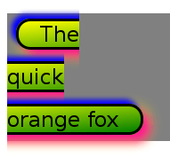
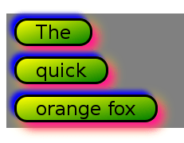
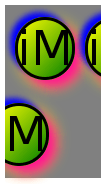
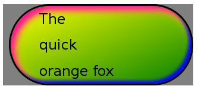

{{CSSRef}}

The **`box-decoration-break`** [CSS](/en-US/docs/Web/CSS) property specifies how an element's [fragments](/en-US/docs/Web/CSS/CSS_Fragmentation) should be rendered when broken across multiple lines, columns, or pages.

{{EmbedInteractiveExample("pages/css/box-decoration-break.html")}}

The specified value will impact the appearance of the following properties:

- {{Cssxref("background")}}
- {{Cssxref("border")}}
- {{Cssxref("border-image")}}
- {{Cssxref("box-shadow")}}
- {{Cssxref("clip-path")}}
- {{Cssxref("margin")}}
- {{Cssxref("padding")}}

## Syntax

```css
/* Keyword values */
box-decoration-break: slice;
box-decoration-break: clone;

/* Global values */
box-decoration-break: inherit;
box-decoration-break: initial;
box-decoration-break: revert;
box-decoration-break: revert-layer;
box-decoration-break: unset;
```

The `box-decoration-break` property is specified as one of the keyword values listed below.

### Values

- `slice`
  - : The element is initially rendered as if its box were not fragmented, after which the rendering for this hypothetical box is sliced into pieces for each line/column/page. Note that the hypothetical box can be different for each fragment since it uses its own height if the break occurs in the inline direction, and its own width if the break occurs in the block direction. See the CSS specification for details.
- `clone`
  - : Each box fragment is rendered independently with the specified border, padding, and margin wrapping each fragment. The {{ Cssxref("border-radius") }}, {{ Cssxref("border-image") }}, and {{ Cssxref("box-shadow") }} are applied to each fragment independently. The background is also drawn independently for each fragment, which means that a background image with {{ Cssxref("background-repeat") }}`: no-repeat` may nevertheless repeat multiple times.

## Formal definition

{{cssinfo}}

## Formal syntax

{{csssyntax}}

## Examples

### Inline box fragments

An inline element that contains line breaks styled with:

```html
<style>
  .example {
    background: linear-gradient(to bottom right, yellow, green);
    box-shadow:
      8px 8px 10px 0px deeppink,
      -5px -5px 5px 0px blue,
      5px 5px 15px 0px yellow;
    padding: 0em 1em;
    border-radius: 16px;
    border-style: solid;
    margin-left: 10px;
    font: 24px sans-serif;
    line-height: 2;
  }
</style>
…
<span class="example">The<br />quick<br />orange fox</span>
```

This results in:



Adding `box-decoration-break: clone` to the above styles:

```css
-webkit-box-decoration-break: clone;
box-decoration-break: clone;
```

This one results in:



You can [try the two inline examples above](https://mdn.dev/archives/media/attachments/2014/07/12/8179/df096e9eb57177d8b7fdcd0c8f64ef18/box-decoration-break-inline.html) in your browser.

Here's an example of an inline element using a large `border-radius` value. The second `"iM"` has a line-break between the `"i"` and the `"M"`. For comparison, the first `"iM"` is without line breaks. Note that if you stack the rendering of the two fragments horizontally next to each other it will result in the non-fragmented rendering.



[Try the above example](https://mdn.dev/archives/media/attachments/2014/07/12/8191/7a067e5731355081e856ea02b978ea2e/box-decoration-break-inline-extreme.html) in your browser.

### Block box fragments

A block element with similar styles as above and no fragmentation results in:



Fragmenting the above block into three columns results in:


Note that stacking these pieces vertically will result in the non-fragmented rendering.

Now, the same example but styled with `box-decoration-break: clone` results in:


Note here that each fragment has an identical replicated border, box-shadow, and background.

You can [try the block examples above](https://mdn.dev/archives/media/attachments/2014/07/12/8187/6288bde9d276d78e203c9f8b9a26ff65/box-decoration-break-block.html) in your browser.

## Specifications

{{Specifications}}

## Browser compatibility

{{Compat}}

## See also

- {{cssxref("break-after")}}, {{cssxref("break-before")}}, {{cssxref("break-inside")}}
