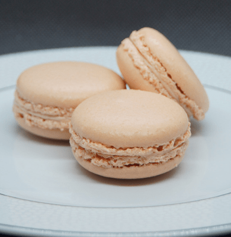

{{CSSRef}}{{Deprecated_Header}}

> **Warning:** Where possible, authors are encouraged to use the newer {{cssxref("clip-path")}} property instead.

The **`clip`** [CSS](/en-US/docs/Web/CSS) property defines a visible portion of an element. The `clip` property applies only to absolutely positioned elements — that is, elements with {{cssxref("position","position:absolute")}} or {{cssxref("position","position:fixed")}}.

## Syntax

```css
/* Keyword value */
clip: auto;

/* <shape> values */
clip: rect(1px, 10em, 3rem, 2ch);

/* Global values */
clip: inherit;
clip: initial;
clip: revert;
clip: revert-layer;
clip: unset;
```

### Values

- {{cssxref("shape")}}

  - : A rectangular {{cssxref("shape")}} of the form `rect(<top>, <right>, <bottom>, <left>)`. The `<top>` and `<bottom>` values are offsets from the _inside top border edge_ of the box, while `<right>` and `<left>` are offsets from the _inside left border edge_ of the box — that is, the extent of the padding box.

    The `<top>`, `<right>`, `<bottom>`, and `<left>` values may be either a {{cssxref("&lt;length&gt;")}} or `auto`. If any side's value is `auto`, the element is clipped to that side's _inside border edge_.

- `auto`
  - : The element does not clip (default). This is different from `rect(auto, auto, auto, auto)`, which clips to the element's inside border edges.

## Formal definition

{{cssinfo}}

## Formal syntax

{{csssyntax}}

## Examples

### Clipping an image

```html
<p class="dotted-border">
  
  
  
  
</p>
```

```css
.dotted-border {
  border: dotted;
  position: relative;
  width: 390px;
  height: 400px;
}

#top-left,
#middle,
#bottom-right {
  position: absolute;
  top: 0;
}

#top-left {
  left: 400px;
  clip: rect(0, 130px, 90px, 0);
}

#middle {
  left: 270px;
  clip: rect(100px, 260px, 190px, 130px);
}

#bottom-right {
  left: 140px;
  clip: rect(200px, 390px, 290px, 260px);
}
```

{{EmbedLiveSample('clipping_an_image', '', '450px')}}

## Specifications

{{Specifications}}

## Browser compatibility

{{Compat}}

## See also

- This property is deprecated. Use {{cssxref("clip-path")}} instead.
- Related CSS properties:
  - {{cssxref("text-overflow")}}
  - {{cssxref("white-space")}}
  - {{cssxref("overflow-x")}}
  - {{cssxref("overflow-y")}}
  - {{cssxref("overflow")}}
  - {{cssxref("display")}}
  - {{cssxref("position")}}
