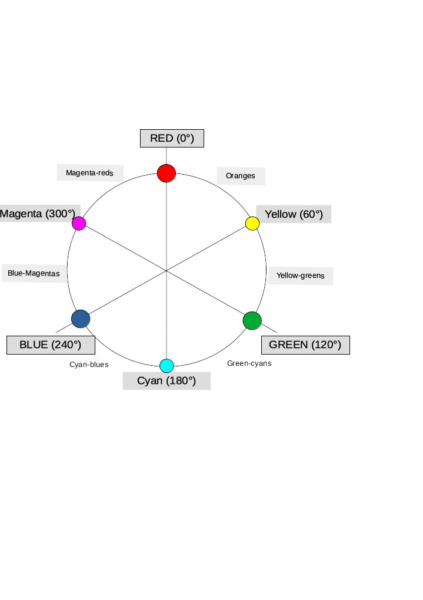

{{CSSRef}}

The **`hsl()`** functional notation expresses an {{glossary("RGB", "sRGB")}} color according to its _hue_, _saturation_, and _lightness_ components. An optional _alpha_ component represents the color's transparency.

> **Note:** The legacy `hsla()` syntax is an alias for `hsl()`, accepting the same parameters and behaving in the same way.

{{EmbedInteractiveExample("pages/css/function-hsl.html")}}

Defining _complementary colors_ with `hsl()` can be done with a single formula, as they are positioned on the same diameter of the {{glossary("color wheel")}}. If `theta` is the angle of a color, its complementary one will have `180deg-theta` as its _hue_ coordinate.

## Syntax

```css
hsl(120deg 75% 25%)
hsl(120deg 75% 25% / 0.6)
```

The function also accepts a legacy syntax in which all values are separated with commas.

### Values

Functional notation: `hsl(H S L[ / A])`

- `H`

  - : An {{cssxref("&lt;angle&gt;")}} of the {{glossary("color wheel")}} given in one of the following units: `deg`, `rad`, `grad`, or `turn`. When written as a unitless {{cssxref("&lt;number&gt;")}}, it is interpreted as degrees. By definition, _red_ is `0deg`, with the other colors spread around the circle, so _green_ is `120deg`, _blue_ is `240deg`, etc. As an `<angle>` is periodic, it implicitly wraps around such that `-120deg` = `240deg`, `480deg` = `120deg`, `-1turn` = `1turn`, and so on. This color wheel helps finding the angle associated with a color: 

- `S`

  - : A {{CSSXref("&lt;percentage&gt;")}} representing saturation, where `100%` is completely saturated, while `0%` is completely unsaturated (gray).

- `L`

  - : A {{CSSXref("&lt;percentage&gt;")}} representing lightness, where `100%` is white, `0%` is black, and `50%` is "normal".

- `A` {{optional_inline}}

  - : An {{CSSXref("&lt;alpha-value&gt;")}}, where the number `1` corresponds to `100%` (full opacity).

### Formal syntax

{{csssyntax}}

## Examples

### Using `hsl()` with `conic-gradient()`

The `hsl()` function works well with [`conic-gradient()`](/en-US/docs/Web/CSS/gradient/conic-gradient) as both deal with angles.

```html hidden
<div></div>
```

#### CSS

```css
div {
  width: 100px;
  height: 100px;
  background: conic-gradient(
    hsl(360 100% 50%),
    hsl(315 100% 50%),
    hsl(270 100% 50%),
    hsl(225 100% 50%),
    hsl(180 100% 50%),
    hsl(135 100% 50%),
    hsl(90 100% 50%),
    hsl(45 100% 50%),
    hsl(0 100% 50%)
  );
  clip-path: circle(closest-side);
}
```

#### Result

{{EmbedLiveSample('Using hsl() with conic-gradient(), ', '100%', '140px')}}

### Legacy syntax: comma-separated values

For legacy reasons, the `hsl()` function accepts a form in which all values are separated using commas.

#### HTML

```html
<div class="space-separated"></div>
<div class="comma-separated"></div>
```

#### CSS

```css
div {
  width: 100px;
  height: 50px;
  margin: 1rem;
}

div.space-separated {
  background-color: hsl(0 100% 50% / 50%);
}

div.comma-separated {
  background-color: hsl(0, 100%, 50%, 50%);
}
```

#### Result

{{EmbedLiveSample('Legacy syntax: comma-separated values', '100%', '150px')}}

### Legacy syntax: hsla()

The legacy `hsla()` syntax is an alias for `hsl()`.

#### HTML

```html
<div class="hsl"></div>
<div class="hsla"></div>
```

#### CSS

```css
div {
  width: 100px;
  height: 50px;
  margin: 1rem;
}

div.hsl {
  background-color: hsl(0 100% 50% / 50%);
}

div.hsla {
  background-color: hsla(0, 100%, 50%, 50%);
}
```

#### Result

{{EmbedLiveSample('Legacy syntax: hsla()', '100%', '150px')}}

## Specifications

{{Specifications}}

## Browser compatibility

{{Compat}}

## See also

- The {{cssxref("&lt;color&gt;")}} type that represents any color.
- [HSL Color Picker](https://hslpicker.com/)
