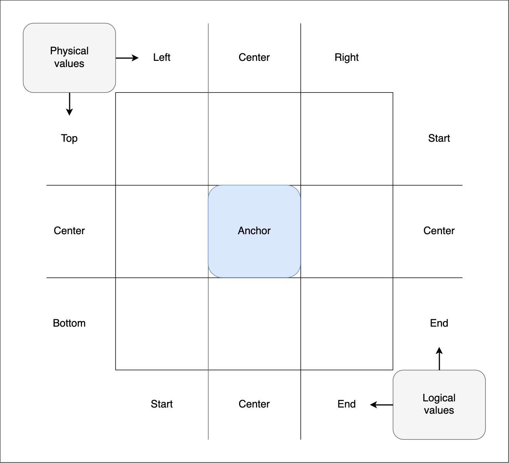

{{CSSRef}}

**CSS anchor positioning** enables elements to be tethered together — defining some elements as **anchor elements** and mechanisms by which other elements can be positioned and sized relative to them. In addition, you can declare conditions under which anchor-positioned elements should be hidden, and alternative position options to render them in, if their default rendering position is offscreen or overflows their containing element.

This article explains all the anchor positioning concepts, and how to use the spec's features at a basic level. For further examples and syntax details, see the reference pages linked throughout.

## Fundamental concepts

It's very common to want to tether one element to another, for example:

1. Error messages that appear alongside form controls.
2. Tooltips or infoboxes that pop up next to a UI element to provide more information about it.
3. Settings or options dialogs that can be accessed to quickly configure UI elements.

Creating such uses cases is fairly simple when the element to tether to (aka the **anchor element**) is always in the same place in the UI and the tethered element (aka the **anchor-positioned element**, or just **positioned element**) can just be placed before or after it in the source order. However, things are rarely that simple, and modern interfaces will often call for reusable, dynamically-generated absolutely-positioned elements to be situated next to their respective anchor elements. Their positions relative to one another need to be maintained as the anchor element moves (e.g. by scolling, or drag and drop).

In addition, if the anchor element gets close to the edge of the viewport, meaning that the positioned element would end up offscreen, it's common to want to move its position to put it back onscreen again. Think of how right-click (<kbd>Ctrl</kbd> + click) context menus work on common desktop OSes.

Historically, implementing this functionality has required JavaScript to dynamically keep positions updated as appropriate, has significant performance issues, and is difficult to get right. The [CSS anchor positioning](/en-US/docs/Web/CSS/CSS_anchor_positioning) module allows these use cases to be implemented performantly and declaratively.

## Associating anchor and positioned elements

To associate an element with an anchor, you need to first declare which element is the anchor, and then specify which positioned element(s) are to be associated with that anchor. Elements need to have absolute or fixed [positioning](/en-US/docs/Learn/CSS/CSS_layout/Positioning) applied to them to be associated with anchors.

### Via CSS

To declare an anchor element with CSS, you need to set an anchor name on it via the {{cssxref("anchor-name")}} property. The value needs to be a {{cssxref("dashed-ident")}}:

```css hidden
.anchor {
  font-size: 1.8rem;
  color: white;
  text-shadow: 1px 1px 1px black;
  background-color: hsl(240 100% 75%);
  width: fit-content;
  border-radius: 10px;
  border: 1px solid black;
  padding: 3px;
}
```

```css
.anchor {
  anchor-name: --infobox;
}
```

The positioned element is then associated with the anchor element by setting its anchor name as the value of the positioned element's {{cssxref("position-anchor")}} property. Let's say we want to tether an infobox to the anchor:

```css hidden
.infobox {
  color: darkblue;
  background-color: azure;
  border: 1px solid #ddd;
  padding: 10px;
  border-radius: 10px;
  font-size: 1rem;
}
```

```css
.infobox {
  position: fixed;
  position-anchor: --infobox;
}
```

We'll apply the above CSS to the following HTML:

```html
<div class="anchor">⚓︎</div>

<div class="infobox">
  <p>This is an information box.</p>
</div>
```

This will render as follows:

{{ EmbedLiveSample("Via CSS", "100%", "120") }}

The positioned element needs to be placed after the anchor element in the DOM, or be a descendant of it, for the association to work.

The anchor and infobox are now associated together, but for the moment you'll have to trust us on this. They are not yet tethered to each other — if you were to position the anchor and move it somewhere else on the page, it would move on its own, leaving the infobox in the same place. You'll see the actual tethering in action later on, when we look at [positioning elements based on anchor position](#positioning_elements_based_on_anchor_position).

### Via HTML

To associate a positioned element with an anchor in HTML, you need to give the anchor element an ID, and then reference that ID in the positioned element's [`anchor`](/en-US/docs/Web/HTML/Global_attributes/anchor) attribute:

```html
<div class="anchor" id="example-anchor">⚓︎</div>

<div class="infobox" anchor="example-anchor">
  <p>This is an information box.</p>
</div>
```

We still need to give the infobox absolute or fixed position so that it can be associated with the anchor:

```css hidden
.anchor {
  font-size: 1.8rem;
  color: white;
  text-shadow: 1px 1px 1px black;
  background-color: hsl(240 100% 75%);
  width: fit-content;
  border-radius: 10px;
  border: 1px solid black;
  padding: 3px;
}

.infobox {
  color: darkblue;
  background-color: azure;
  border: 1px solid #ddd;
  padding: 10px;
  border-radius: 10px;
  font-size: 1rem;
}
```

```css
.infobox {
  position: fixed;
}
```

This gives us the same result that we achieved earlier with CSS:

{{ EmbedLiveSample("Via HTML", "100%", "120") }}

> **Note:** The [`anchor`](/en-US/docs/Web/HTML/Global_attributes/anchor) attribute is currently non-standard and disabled by default in supporting browsers. See the compatibility data on its linked reference page for information on how to enable it for testing purposes.

## Positioning elements based on anchor position

As we saw above, associating a positioned element with an anchor is not really much use on its own. You also need to specify the position of the element relative to the anchor. Let's look at the machanisms available to do this.

### Using individual inset values, via `anchor()`

Conventional positioned elements can have their position specified via `inset` properties. This includes:

- Physical properties: {{cssxref("top")}}, {{cssxref("left")}}, {{cssxref("bottom")}}, and {{cssxref("right")}}.
- Logical properties: {{cssxref("inset-block-start")}}, {{cssxref("inset-block-end")}}, {{cssxref("inset-inline-start")}}, and {{cssxref("inset-inline-end")}}.
- Shorthand properties: {{cssxref("inset-block")}}, {{cssxref("inset-inline")}}, and {{cssxref("inset")}}.

With anchor-positioned elements, we have an extra value at our disposal that can be set on the above properties — the [`anchor()`](/en-US/docs/Web/CSS/anchor) function. This resolves to a {{cssxref("length")}} value, and enables `inset` values to be expressed in terms of the position of an anchor element's sides. The syntax looks like this:

```text
anchor(anchor-element anchor-side, length-percentage)
```

- `anchor-element` is the `anchor-name` set on the anchor element you want to position an element relative to. This is optional — if omitted, the positioned element is positioned relative to the anchor referenced by its `position-anchor` property (this is sometimes referred to as the element's **default anchor**).
- `anchor-side` specifies the side of the anchor element that the positioned element will be positioned relative to. This can be expressed using a variety of values, for example physical (`top`, `left`, etc.) or logical (`start`, `end`, etc.)
- The {{cssxref("length-percentage")}} is a fallback value that specifies what the function should resolve to if the `anchor()` function is invalid.

The most common `anchor()` functions you'll use will just refer to a side of the default anchor; you could then add some {{cssxref("margin")}} to create some spacing between the edges of the anchor and positioned element as required. You could also use `anchor()` functions inside {{cssxref("calc")}} functions to add the spacing. For example:

```css
.elem {
  /* Position the right edge of the positioned element
     flush to the anchor element's left edge then add
     margin to make some space between the adges  */
  right: anchor(left);
  margin-left: 10px;
}

.elem {
  /* Position the positioned element's logical block end edge
     10px from the anchor element's logical block start edge  */
  inset-block-end: calc(anchor(start) + 10px);
}
```

Let's look at an example of this in action. We'll start with the same HTML as in the previous examples, but with some filler text below and above to give the {{htmlelement("body")}} element some height:

```html
<p>
  Lorem ipsum dolor sit amet, consectetur adipiscing elit, sed do eiusmod tempor
  incididunt ut labore et dolore magna aliqua. Dui nunc mattis enim ut tellus
  elementum sagittis vitae et.
</p>

<div class="anchor">⚓︎</div>

<div class="infobox">
  <p>This is an information box.</p>
</div>

<p>
  Nisi quis eleifend quam adipiscing vitae proin sagittis nisl rhoncus. In arcu
  cursus euismod quis viverra nibh cras pulvinar. Vulputate ut pharetra sit amet
  aliquam.
</p>

<p>
  Malesuada nunc vel risus commodo viverra maecenas accumsan lacus. Vel elit
  scelerisque mauris pellentesque pulvinar pellentesque habitant morbi
  tristique. Porta lorem mollis aliquam ut porttitor. Turpis cursus in hac
  habitasse platea dictumst quisque. Dolor sit amet consectetur adipiscing elit.
  Ornare lectus sit amet est placerat. Nulla aliquet porttitor lacus luctus
  accumsan.
</p>
```

We'll also give the anchor element the same CSS. The `<body>` element is given a narrow width to make the content taller:

```css hidden
.anchor {
  font-size: 1.8rem;
  color: white;
  text-shadow: 1px 1px 1px black;
  background-color: hsl(240 100% 75%);
  width: fit-content;
  border-radius: 10px;
  border: 1px solid black;
  padding: 3px;
}
```

```css
.anchor {
  anchor-name: --infobox;
}

body {
  width: 50%;
  margin: 0 auto;
}
```

The infobox is given fixed positioning and associated with the anchor in the same way as before. However, now we tether it to the anchor using the logical {{cssxref("inset-block-start")}} and {{cssxref("inset-inline-start")}} properties (which are equivalent to {{cssxref("top")}} and {{cssxref("left")}} in horizontal writing modes). We also give the infobox some `margin` to create some extra space between the positioned element and anchor:

```css hidden
.infobox {
  color: darkblue;
  background-color: azure;
  border: 1px solid #ddd;
  padding: 10px;
  border-radius: 10px;
  font-size: 1rem;
}
```

```css
.infobox {
  position: fixed;
  position-anchor: --infobox;

  inset-block-start: anchor(end);
  inset-inline-start: anchor(self-end);
  margin: 5px 0 0 5px;
}
```

Let's look at the positioning declarations in more detail:

- `inset-block-start: anchor(end)`: Here we are setting the positioned element's block start edge to have the same position along the block axis as the anchor's block end edge (calculated using the `anchor(end)` function).
- `inset-inline-start: anchor(self-end)`: Here we are setting the positioned element's inline start edge to have the same position along the inline axis as the anchor's inline end edge (calculated using the `anchor(self-end)` function).

This gives us the following result:

{{ EmbedLiveSample("Using individual inset values, via `anchor()`", "100%", "250") }}

The positioned element is 5px below and 5px to the right of the anchor element. As the document is scrolled up and down, the positioned element — despite being given fixed position — maintains its position relative to the anchor element.

### Using an `inset-area`

The {{cssxref("inset-area")}} property provides an alternative to the `anchor()` function for positioning elements relative to anchors. `inset-area` works on the concept of a 3x3 grid of tiles, with the anchor element inside the center tile:



The grid tiles are broken up into rows and columns:

- The three rows are represented by the physical values `top`, `center`, and `bottom`. They also have logical equivalents — `start`, `center`, and `end`.
- The three columns are represented by the physical values `left`, `center`, and `right`. They also have logical equivalents — `start`, `center`, and `end`.

The dimensions of the center tile are defined by the [containing block](/en-US/docs/Web/CSS/Containing_block) of the anchor element, while the dimensions of the grid's outer edge are defined by the positioned element's containing block.

`inset-area` property values are composed of one or two values based on the row and column values described above, with a feature extra options available, to define the region of the grid the positioned element should be placed inside.

For example:

- You can specify two of the above values to place the positioned element in that specific grid square — for example `top left` (logical equivalent `start start`) or `bottom center` (logical equivalent `end center`) will place the positioned element in the top-right or bottom center square.
- You can specify a row or column value plus a `span-*` value. The first value specifies the row or column to place the positioned element in, placing it initially in the center, and the other one specifies the amount of that column to span. For example:
  - `top span-left` causes the positioned element to be placed in the top row, and span across the center and left tiles of that row.
  - `right span-bottom` causes the positioned element to be placed in the right column, and span across the center and bottom tiles of that column.
  - `bottom span-all` causes the positioned element to be placed in the bottom row, and span across the left, center, and right tiles of that row.
- If you only specify one value, the effect is different depending on which value is set:
  - A physical side value (`top`, `bottom`, `left`, or `right`) acts as if the other value is `span-all`. So for example, `top` gives the same effect as `top span-all`.
  - A logical side value (`start` or `end`) acts as if the other value is set to the same value; for example `start` gives the same effect as `start start`.
  - A value of `center` acts as if both values are set to `center` (so, `center center`),

> **Note:** See the {{cssxref("inset-area")}} property for a detailed description of all the available values.

Let's demonstrate some of these values in action; this example uses exactly the same HTML as the previous example, except that we've included a {{htmlelement("select")}} element that allows you to change the `inset-area` value applied to the positioned element, changing its position relative to the anchor.

```html
<p>
  Lorem ipsum dolor sit amet, consectetur adipiscing elit, sed do eiusmod tempor
  incididunt ut labore et dolore magna aliqua. Dui nunc mattis enim ut tellus
  elementum sagittis vitae et.
</p>

<div class="anchor">⚓︎</div>

<div class="infobox">
  <p>This is an information box.</p>
</div>

<p>
  Nisi quis eleifend quam adipiscing vitae proin sagittis nisl rhoncus. In arcu
  cursus euismod quis viverra nibh cras pulvinar. Vulputate ut pharetra sit amet
  aliquam.
</p>

<p>
  Malesuada nunc vel risus commodo viverra maecenas accumsan lacus. Vel elit
  scelerisque mauris pellentesque pulvinar pellentesque habitant morbi
  tristique. Porta lorem mollis aliquam ut porttitor. Turpis cursus in hac
  habitasse platea dictumst quisque. Dolor sit amet consectetur adipiscing elit.
  Ornare lectus sit amet est placerat. Nulla aliquet porttitor lacus luctus
  accumsan.
</p>

<form>
  <label for="inset-area-select">Choose an inset-area:</label>
  <select id="inset-area-select" name="inset-area-select">
    <option>top</option>
    <option>bottom</option>
    <option>left</option>
    <option>right</option>
    <option>top left</option>
    <option>top right</option>
    <option>bottom left</option>
    <option>bottom right</option>
    <option>top span-left</option>
    <option>bottom span-right</option>
    <option>left span-top</option>
    <option>right span-bottom</option>
    <option>center</option>
    <option>bottom center</option>
    <option>bottom span-all</option>
  </select>
</form>
```

The anchor element and `<body>` element are given the same CSS as before. We have given the `<select>` form some simple styling and fixed its position in the top-right of the viewport:

```css hidden
.anchor {
  font-size: 1.8rem;
  color: white;
  text-shadow: 1px 1px 1px black;
  background-color: hsl(240 100% 75%);
  width: fit-content;
  border-radius: 10px;
  border: 1px solid black;
  padding: 3px;
}

.anchor {
  anchor-name: --infobox;
}

body {
  width: 50%;
  margin: 0 auto;
}

form {
  background: white;
  border: 1px solid black;
  padding: 5px;
}

select {
  display: block;
  margin-top: 5px;
}
```

```css
form {
  position: fixed;
  top: 0;
  right: 2px;
}
```

The infobox is given fixed positioning and associated with the anchor in the same way as before. This time however, it is tethered to the anchor with `inset-area: top;`, which causes it to be positioned at the top of the inset-area grid. This will be overridden once you select different values from the `<select>` menu.

```css hidden
.infobox {
  color: darkblue;
  background-color: azure;
  border: 1px solid #ddd;
  padding: 10px;
  border-radius: 10px;
  font-size: 1rem;
}
```

```css
.infobox {
  position: fixed;
  position-anchor: --infobox;

  inset-area: top;
}
```

We also include a short script to apply new `inset-area` values chosen from the `<select>` menu to the infobox:

```js
const infobox = document.querySelector(".infobox");
const selectElem = document.querySelector("select");

selectElem.addEventListener("change", () => {
  const area = selectElem.value;

  // clear all the previous inline styles out to begin with
  infobox.style = "";

  // Set the inset-area to the value chosen in the select box
  infobox.style.insetArea = area;
});
```

The result is as follows. Try selecting new `inset-area` values from the `<select>` menu to see the effect they have on the position of the infobox:

{{ EmbedLiveSample("Using an `inset-area`", "100%", "250") }}

### An aside on positioned element width

In this example, the positioned element has not had a specific size set on it, in either dimension. This is not normally what you'd do in production code, but we did it deliberately to allow you to observe the behavior this causes.

If the positioned element is placed into a corner or side grid square (say with `inset-area: top left`) or is set to span two or more grid squares (for example using `inset-area: bottom span-all`), it will align with the specified grid area but behave as if it has a {{cssxref("width")}} of `max-content` set on it. It is being sized according to its containing block size, which is the size imposed on it when it was set to `position: fixed`. It will stretch as wide as the text content, although you'll see it constrained by the edge of the `<body>` if you place it on the left of the grid.

If the positioned element is vertically aligned with the center tile (say with `inset-area: bottom center`), it will align with the specified grid square but adopt the same width as the anchor element — it is being sized according to the anchor element's containing block size. However, it won't allow its content to overflow — its minimum `width` will be its `min-content` (as defined by the width of its longest word).

## Centering on the anchor using `anchor-center`

The properties {{cssxref("justify-self")}}, {{cssxref("align-self")}}, {{cssxref("justify-items")}}, and {{cssxref("align-items")}} (and their {{cssxref("place-items")}} and {{cssxref("place-self")}} shorthands) exist to allow developers to easily align elements in the inline or block direction inside various layout systems, for example along the main or cross axis in the case of flex children.

CSS anchor positioning provides a new value for these properties, `anchor-center`, which will align a positioned element with the center of its default anchor.

Let's have a look at how this works.

The HTML is the same as in the previous example, as is the CSS for the `<body>` and anchor elements.

```html hidden
<p>
  Lorem ipsum dolor sit amet, consectetur adipiscing elit, sed do eiusmod tempor
  incididunt ut labore et dolore magna aliqua. Dui nunc mattis enim ut tellus
  elementum sagittis vitae et.
</p>

<div class="anchor">⚓︎</div>

<div class="infobox">
  <p>This is an information box.</p>
</div>

<p>
  Nisi quis eleifend quam adipiscing vitae proin sagittis nisl rhoncus. In arcu
  cursus euismod quis viverra nibh cras pulvinar. Vulputate ut pharetra sit amet
  aliquam.
</p>

<p>
  Malesuada nunc vel risus commodo viverra maecenas accumsan lacus. Vel elit
  scelerisque mauris pellentesque pulvinar pellentesque habitant morbi
  tristique. Porta lorem mollis aliquam ut porttitor. Turpis cursus in hac
  habitasse platea dictumst quisque. Dolor sit amet consectetur adipiscing elit.
  Ornare lectus sit amet est placerat. Nulla aliquet porttitor lacus luctus
  accumsan.
</p>
```

```css hidden
.anchor {
  font-size: 1.8rem;
  color: white;
  text-shadow: 1px 1px 1px black;
  background-color: hsl(240 100% 75%);
  width: fit-content;
  border-radius: 10px;
  border: 1px solid black;
  padding: 3px;
}

.anchor {
  anchor-name: --infobox;
}

body {
  width: 50%;
  margin: 0 auto;
}
```

The infobox is given fixed positioning and tethered to the anchor's bottom edge. `justify-self: anchor-center` is then used to make sure it is centered horizontally on the anchor's center:

```css hidden
.infobox {
  color: darkblue;
  background-color: azure;
  border: 1px solid #ddd;
  padding: 10px;
  border-radius: 10px;
  font-size: 1rem;
}
```

```css
.infobox {
  position: fixed;
  position-anchor: --infobox;

  top: anchor(bottom);
  margin-top: 5px;
  justify-self: anchor-center;
}
```

This gives us the following result:

{{ EmbedLiveSample("Centering on the anchor using `anchor-center`", "100%", "250") }}

## Sizing elements based on anchor size

As well as positioning an element relative to its anchor's position, you can also size an element relative to its anchor's size. This is achieved using the the [`anchor-size()`](/en-US/docs/Web/CSS/anchor) function, which can be set as a value for the following sizing properties:

- Physical sizing properties: {{cssxref("width")}}, {{cssxref("height")}}, {{cssxref("min-width")}}, {{cssxref("min-height")}}, {{cssxref("max-width")}}, and {{cssxref("max-height")}}.
- Logical properties: {{cssxref("block-size")}}, {{cssxref("inline-size")}}, {{cssxref("min-block-size")}}, {{cssxref("min-inline-size")}}, {{cssxref("max-block-size")}}, and {{cssxref("max-inline-size")}}.

`anchor-size()` functions resolve to {{cssxref("length")}} values. Their syntax looks like this:

```text
anchor-size(anchor-element anchor-size, length-percentage)
```

- `anchor-element` is the `anchor-name` set on the anchor element you want to size the positioned element relative to. This is optional — if omitted, the element is sized relative to the anchor referenced by its `position-anchor` property (the element's **default anchor**).
- `anchor-size` specifies the dimension of the anchor element that the positioned element will be sized relative to. This can be expressed using physical (`width` or `height`) or logical (`inline`, `block`, `self-inline`, or `self-block`) values.
  > **Note:** The dimension of the positioned element does not need to match the anchor's dimension it is being sized relative to. For example, `width: anchor-size(height);` is valid.
- The {{cssxref("length-percentage")}} is a fallback value that specifies what the function should resolve to if the `anchor-size()` function is invalid.

The most common `anchor-size()` functions you'll use will just refer to a dimension of the default anchor. You can also use them inside {{cssxref("calc")}} functions, to modify the size applied to the positioned element. For example:

```css
.elem {
  /* Size the positioned element's width
     equal to the anchor element's width  */
  width: anchor-size(width);
}

.elem {
  /* Size the positioned element's inline size
     equal to 4 times the anchor element's inline size  */
  inline-size: calc(anchor-size(self-inline) * 4);
}
```

Let's look at an example. The HTML is the same as in the previous examples, and the anchor element and `<body>` element are given the same basic styling.

```html hidden
<p>
  Lorem ipsum dolor sit amet, consectetur adipiscing elit, sed do eiusmod tempor
  incididunt ut labore et dolore magna aliqua. Dui nunc mattis enim ut tellus
  elementum sagittis vitae et.
</p>

<div class="anchor" tabindex="0">⚓︎</div>

<div class="infobox">
  <p>This is an information box.</p>
</div>

<p>
  Nisi quis eleifend quam adipiscing vitae proin sagittis nisl rhoncus. In arcu
  cursus euismod quis viverra nibh cras pulvinar. Vulputate ut pharetra sit amet
  aliquam.
</p>

<p>
  Malesuada nunc vel risus commodo viverra maecenas accumsan lacus. Vel elit
  scelerisque mauris pellentesque pulvinar pellentesque habitant morbi
  tristique. Porta lorem mollis aliquam ut porttitor. Turpis cursus in hac
  habitasse platea dictumst quisque. Dolor sit amet consectetur adipiscing elit.
  Ornare lectus sit amet est placerat. Nulla aliquet porttitor lacus luctus
  accumsan.
</p>
```

```css hidden
.anchor {
  font-size: 1.8rem;
  color: white;
  text-shadow: 1px 1px 1px black;
  background-color: hsl(240 100% 75%);
  width: fit-content;
  border-radius: 10px;
  border: 1px solid black;
  padding: 3px;
}

.anchor {
  anchor-name: --infobox;
}

body {
  width: 50%;
  margin: 0 auto;
}
```

The infobox is given fixed positioning and associated with the anchor in the same way as before. However, this time around we tether it to the right of the anchor using an `inset-area`, and give it a width five times the width of the anchor's width:

```css hidden
.infobox {
  color: darkblue;
  background-color: azure;
  border: 1px solid #ddd;
  padding: 10px;
  border-radius: 10px;
  font-size: 1rem;
}
```

```css
.infobox {
  position: fixed;
  position-anchor: --infobox;

  inset-area: right;
  margin-left: 5px;
  width: calc(anchor-size(width) * 5);
}
```

In addition, we increase the anchor element's {{cssxref("width")}} on {{cssxref(":hover")}} and {{cssxref(":focus")}}, and give it a {{cssxref("transition")}} so that it animates when the state changes.

```css
.anchor {
  text-align: center;
  width: 30px;
  transition: 1s width;
}

.anchor:hover,
.anchor:focus {
  width: 50px;
}
```

This gives us the following result:

{{ EmbedLiveSample("Sizing elements based on anchor size", "100%", "250") }}

Try hovering or focusing the anchor element — you'll see both the anchor and the positioned element grow in width, proving that the latter's size is relative to the former's size.

## Conditional positioned element hiding

There are some situations in which you might not want to display an anchor-positioned element — for example, if it is clipped because its anchor is too close to the adge of the viewport, you might want to just hide it altogether. The {{cssxref("position-visibility")}} property allows you to control whether positioned elements are hidden in such situations. It can take the following values:

- `always`
  - : The positioned element is always displayed.
- `anchors-visible`
  - : If the anchor is completely hidden, either by overflowing its containing element (or the viewport) or being covered by other elements, the positioned element will be **strongly hidden**. Strongly hidden means that it will act as though it and its descendant elements have a {{cssxref("visibility")}} value of `hidden` set, regardless of what their actual `visibility` value is.
- `no-overflow`
  - : If the positioned element starts to overflow its containing element or the viewport, it will be strongly hidden.

Let's see this property in action.

The HTML is the same as in the previous example, except that it has a bit more content at the top to allow more scrolling to occur. The CSS for the `<body>` and anchor element is the same as in previous examples.

```html hidden
<p>
  Malesuada nunc vel risus commodo viverra maecenas accumsan lacus. Vel elit
  scelerisque mauris pellentesque pulvinar pellentesque habitant morbi
  tristique.
</p>

<p>
  Lorem ipsum dolor sit amet, consectetur adipiscing elit, sed do eiusmod tempor
  incididunt ut labore et dolore magna aliqua. Dui nunc mattis enim ut tellus
  elementum sagittis vitae et.
</p>

<div class="anchor">⚓︎</div>

<div class="infobox">
  <p>This is an information box.</p>
</div>

<p>
  Nisi quis eleifend quam adipiscing vitae proin sagittis nisl rhoncus. In arcu
  cursus euismod quis viverra nibh cras pulvinar. Vulputate ut pharetra sit amet
  aliquam.
</p>

<p>
  Malesuada nunc vel risus commodo viverra maecenas accumsan lacus. Vel elit
  scelerisque mauris pellentesque pulvinar pellentesque habitant morbi
  tristique. Porta lorem mollis aliquam ut porttitor. Turpis cursus in hac
  habitasse platea dictumst quisque. Dolor sit amet consectetur adipiscing elit.
  Ornare lectus sit amet est placerat. Nulla aliquet porttitor lacus luctus
  accumsan.
</p>
```

```css hidden
.anchor {
  font-size: 1.8rem;
  color: white;
  text-shadow: 1px 1px 1px black;
  background-color: hsl(240 100% 75%);
  width: fit-content;
  border-radius: 10px;
  border: 1px solid black;
  padding: 3px;
}

.anchor {
  anchor-name: --infobox;
}

body {
  width: 50%;
  margin: 0 auto;
}
```

The infobox is given fixed positioning and tethered to the anchor's bottom edge. It is given `position-visibility: no-overflow;` to hide it completely when it is scrolled upwards to the point where it starts to overflow the viewport.

```css hidden
.infobox {
  color: darkblue;
  background-color: azure;
  border: 1px solid #ddd;
  padding: 10px;
  border-radius: 10px;
  font-size: 1rem;
}
```

```css
.infobox {
  position: fixed;
  position-anchor: --infobox;

  margin-bottom: 5px;
  inset-area: top span-all;

  position-visibility: no-overflow;
}
```

This gives us the following result:

{{ EmbedLiveSample("Conditional positioned element hiding", "100%", "250") }}

## Specifying alternative positions

An important consideration with anchor-positioned elements is ensuring that they will always appear in a convenient place for the user to interact with them if at all possible, regardless of where the anchor is positioned. This often requires changing an elements' position as its anchor gets close to the edge of its containing element or the viewport, to stop the positioned element overflowing.

In CSS Anchor Positioning, this is managed using the following:

- {{cssxref("position-try-options")}}
  - : Specifies one or more alternative **position try options** for the browser to try placing the positioned element in, to stop it from overflowing. Position try options are tried in the order they are specified in. Options can be specified using predefined options, {{cssxref("inset-area")}} values (wrapped inside an [`inset-area()`](/en-US/docs/Web/CSS/inset-area_function) function), or custom options defined using the {{cssxref("@position-try")}} at-rule. When multiple options are specified, they are separated by commas.
- {{cssxref("position-try-order")}}
  - : Allows you to specify various options that result in an available position try option being set in preference to the element's initial positioning. For example, you might want to initially display the element in a space that has more available height or width.
- {{cssxref("@position-try")}}
  - : The `@position-try` at rule allows you to define custom position options, named with a {{cssxref("dashed-ident")}}. The `<dashed-ident>` can then be used to reference the custom position options in the `position-try-options` list.

> **Note:** There is also a shorthand property — {{cssxref("position-try")}}, which can be used to specify `position-try-options` and `position-try-order` values in a single declaration.

> **Note:** In some situations you might want to just hide overflowing positioned elements — as discussed in the [Conditional positioned element hiding](#conditional_positioned_element_hiding) section — but in most cases it is better to keep them on-screen and usable.

### Predefined try options

The predefined try options are as follows:

- `flip-block`
  - : Flips the element's position along the block axis so that it appears the same distance away from the anchor but on the opposite side of it. To put it another way, it mirrors the element's position across an inline axis drawn through the center of the anchor. As an example, if the positioned element started to overflow at the top of the anchor, this value would flip it to the bottom.
- `flip-inline`
  - : Flips the element's position along the inline axis so that it appears the same distance away from the anchor but on the opposite side of it. To put it another way, it mirrors the element's position across a block axis drawn through the center of the anchor. As an example, if the positioned element started to overflow at the left of the anchor, this value would flip it to the right.
- `flip-start`
  - : Mirrors the element's position across an axis drawn diagonally through the center of the anchor, passing through the point at the intersection of the block axis start and the inline axis start, and the point at the intersection of the block axis end and the inline axis end. As an example, if the positioned element started to overflow at the left of the anchor, this value would flip it to the top.

Let's look at an example that illustrates usage of a couple of these predefined values.

In this example, we've included only the anchor and the positioned element in the HTML, with no filler content around it:

```html hidden
<div class="anchor">⚓︎</div>

<div class="infobox">
  <p>This is an information box.</p>
</div>
```

This time, we've styled the `<body>` element to be very large, so that we can scroll the anchor and the positioned element around in the viewport, both horizontally and vertically:

```css
body {
  width: 1500px;
  height: 500px;
}
```

The CSS for the anchor is largely the same as in previous examples, except that now we've absolutely positioned it so that it appears somewhere near the center of the initial `<body>` rendering:

```css hidden
.anchor {
  font-size: 1.8rem;
  color: white;
  text-shadow: 1px 1px 1px black;
  background-color: hsl(240 100% 75%);
  width: fit-content;
  border-radius: 10px;
  border: 1px solid black;
  padding: 3px;
}

.anchor {
  anchor-name: --infobox;
  position: absolute;
  top: 100px;
  left: 350px;
}
```

The infobox is given fixed positioning and tethered to the anchor's top-left corner using an `inset-area`. It is given `position-try-options: flip-block, flip-inline;` to provide it with some options for moving the positioned element to stop it overflowing when the anchor gets near the edge of the viewport.

```css hidden
.infobox {
  color: darkblue;
  background-color: azure;
  border: 1px solid #ddd;
  padding: 10px;
  border-radius: 10px;
  font-size: 1rem;
}
```

```css
.infobox {
  position: fixed;
  position-anchor: --infobox;

  inset-area: top left;

  position-try-options: flip-block, flip-inline;
}
```

This gives us the following result. Try scrolling the demo so that the anchor starts to get near the edges:

- If you move the anchor near the top of the viewport, you will see the positioned element flip to the bottom-left of the anchor to avoid overflowing.
- If you move the anchor near the left of the viewport, you will see the positioned element flip to the top-right of the anchor to avoid overflowing.

{{ EmbedLiveSample("Predefined try options", "100%", "250") }}

However, if you move the anchor towards the top-left corner of the viewport, you'll notice a problem — as the positioned element starts to overflow in the block and inline direction, it flips back to its default top-left position and overflows in both directions, which not what we want.

This is because we only gave the browser position options of `flip-block` _or_ `flip-vertical`. We didn't give it an option of trying both at the same time. In addition, the browser tries the options, looking for one that causes the positioned element to be rendered completely inside the viewport or containing block. If it doesn't find one, it renders the positioned element in its default rendering position, with no position options applied.

The next section will show you how to fix this issue.

### Combining multiple values into one option

It is possible to put multiple [predefined try option](#predefined_try_options) or [custom try option](#custom_try_options) names into a single try option. The browser will combine the individual effects of these try options into a single combined option when trying to apply this option.

> **Note:** `inset-area` try options can't be added into a combined try option.

Let's use a combined try option to fix the problem we found with the previous demo. All of the HTML and CSS in this demo is the same, except for the infobox positioning code. In this case, it is given a third position try option: `flip-block flip-inline`:

```html hidden
<div class="anchor">⚓︎</div>

<div class="infobox">
  <p>This is an information box.</p>
</div>
```

```css hidden
body {
  width: 1500px;
  height: 500px;
}

.anchor {
  font-size: 1.8rem;
  color: white;
  text-shadow: 1px 1px 1px black;
  background-color: hsl(240 100% 75%);
  width: fit-content;
  border-radius: 10px;
  border: 1px solid black;
  padding: 3px;
}

.anchor {
  anchor-name: --infobox;
  position: absolute;
  top: 100px;
  left: 350px;
}

.infobox {
  color: darkblue;
  background-color: azure;
  border: 1px solid #ddd;
  padding: 10px;
  border-radius: 10px;
  font-size: 1rem;
}
```

```css
.infobox {
  position: fixed;
  position-anchor: --infobox;

  inset-area: top left;

  position-try-options:
    flip-block,
    flip-inline,
    flip-block flip-inline;
}
```

This means that the browser will try `flip-block` then `flip-inline` to avoid overflow, and if those options fail, it will combine the two, flipping the element's position in the block and inline directions at the same time. Now when you scroll the anchor towards the top _and_ left edges of the viewport, the positioned element will flip over to the bottom-right.

{{ EmbedLiveSample("Combining multiple values into one option", "100%", "250") }}

### `inset-area` try options

You can use an {{cssxref("inset-area")}} value as a position try option. To do so, you need to wrap it inside an [`inset-area()`](/en-US/docs/Web/CSS/inset-area_function) function and then include it in the `position-try-options` list as normal. The `inset-area()` function has the effect of automatically creating a try option based on that inset area behind the scenes. In effect, it is a shortcut for creating a [custom try option](#custom_try_option) that contains only that `inset-area` property value.

Now we'll look at a demo that shows `inset-area` position try options in use. All of the HTML and CSS in this demo is the same, except for the infobox positioning code. In this case, our position try options are all `inset-area()` functions; we've included an option for top, top-right, right, bottom-right, bottom, bottom-left, and left.

This means that the positioned element will find a reasonable position to display in, whatever viewport edges the anchor is near. This approach is a bit more longwinded than the predefined values approach, but it is also more granular and flexible.

```html hidden
<div class="anchor">⚓︎</div>

<div class="infobox">
  <p>This is an information box.</p>
</div>
```

```css hidden
body {
  width: 1500px;
  height: 500px;
}

.anchor {
  font-size: 1.8rem;
  color: white;
  text-shadow: 1px 1px 1px black;
  background-color: hsl(240 100% 75%);
  width: fit-content;
  border-radius: 10px;
  border: 1px solid black;
  padding: 3px;
}

.anchor {
  anchor-name: --infobox;
  position: absolute;
  top: 100px;
  left: 350px;
}

.infobox {
  color: darkblue;
  background-color: azure;
  border: 1px solid #ddd;
  padding: 10px;
  border-radius: 10px;
  font-size: 1rem;
}
```

```css
.infobox {
  position: fixed;
  position-anchor: --infobox;

  inset-area: top left;

  position-try-options: inset-area(top), inset-area(top right), inset-area(
      right
    ), inset-area(bottom right), inset-area(bottom), inset-area(bottom left),
    inset-area(left);
}
```

Scroll the page and check out the effect of these position try options as the anchor nears the edge of the viewport:

{{ EmbedLiveSample("`inset-area` try options", "100%", "250") }}

### Custom try options

If you want to use specific try options that aren't available via the above mechanisms, then you can create your own. This is done using the {{cssxref("@position-try")}} at rule, the syntax of which looks like this:

```text
@position-try <dashed-ident> {
  declaration-list
}
```

- The {{cssxref("dashed-ident")}} is developer-defined identifying name for the position try option, which can then be used to add that option to the {{cssxref("position-try-options")}} list.
- The `declaration-list` is a list of declarations that define the behavior of the custom try option, i.e where it will result in the positioned element being placed. Only certain properties can be used inside a `@position-try` block. This includes:
  - {{cssxref("position-anchor")}}
  - {{cssxref("inset-area")}}
  - Inset properties such as {{cssxref("top")}} or {{cssxref("inset-block-start")}}
  - Margin properties such as {{cssxref("margin-left")}} or {{cssxref("margin-inline-start")}}
  - Sizing properties such as {{cssxref("width")}} or {{cssxref("inline-size")}}
  - Self-alignment properties such as {{cssxref("align-self")}} and {{cssxref("justify-self")}}

See the {{cssxref("@position-try")}} reference page for a detailed list of exactly which properties can be used inside a `@position-try` at rule.

In the next example we'll show how to set up and use some custom try options. All of the HTML and CSS in this demo is the same, except for the infobox positioning code. First of all we'll define some custom try options using `@position-try`:

```html hidden
<div class="anchor">⚓︎</div>

<div class="infobox">
  <p>This is an information box.</p>
</div>
```

```css hidden
body {
  width: 1500px;
  height: 500px;
}

.anchor {
  font-size: 1.8rem;
  color: white;
  text-shadow: 1px 1px 1px black;
  background-color: hsl(240 100% 75%);
  width: fit-content;
  border-radius: 10px;
  border: 1px solid black;
  padding: 3px;
}

.anchor {
  anchor-name: --infobox;
  position: absolute;
  top: 100px;
  left: 350px;
}

.infobox {
  color: darkblue;
  background-color: azure;
  border: 1px solid #ddd;
  padding: 10px;
  border-radius: 10px;
  font-size: 1rem;
}
```

```css
@position-try --custom-left {
  inset-area: left;
  width: 100px;
  margin: 0 10px 0 0;
}

@position-try --custom-bottom {
  inset-area: bottom;
  margin: 10px 0 0 0;
}

@position-try --custom-right {
  inset-area: right;
  width: 100px;
  margin: 0 0 0 10px;
}

@position-try --custom-bottom-right {
  inset-area: bottom right;
  margin: 10px 0 0 10px;
}
```

Now we can include those custom try options in the position list by referencing their names:

```css
.infobox {
  position: fixed;
  position-anchor: --infobox;
  inset-area: top;
  width: 200px;
  margin: 0 0 10px 0;
  position-try-options: --custom-left, --custom-bottom, --custom-right,
    --custom-bottom-right;
}
```

Let's talk through how these position options work:

- First of all, note that our default position is defined by `inset-area: top`, so the infobox sits above the anchor. We also give the infobox a fixed width and some bottom margin so it doesn't sit right next to the anchor.
- If the infobox starts to overflow, the browser first tries the `--custom-left` position. This moves the infobox to the left of the anchor, adjusts the margin to suit, and also gives the infobox a different width as it sits alongside the anchor.
- Next, the browser tries the `--custom-bottom` position. This moves the infobox to the bottom of the anchor, and sets an appropriate margin. It doesn't set a width, so the infobox returns to its default width — 200px.
- The browser next tries the `--custom-right` position. This works much the same as the `--custom-left` position, with the same width applied, but the `inset-area` and `margin` values are mirrored to place the infobox appropriately to the right.
- If none of the other try options succeed in stopping the postitioned element from overflowing, the browser tries the `--custom-bottom-right` position as a last resort. This works in much the same way as the other options, but it places the positioned element to the bottom-right of the anchor.

Scroll the page and check out the effect of these position try options as the anchor nears the edge of the viewport:

{{ EmbedLiveSample("Custom try options", "100%", "250") }}

### The effect of `position-try-order`

One last subject to cover in this section is the effect of the {{cssxref("position-try-order")}} property. This has a slightly different focus to the rest of the position try functionality, in that it makes use of position try options when the positioned element is first displayed, rather than when it is in the process of overflowing.

It allows you to specify that you want the positioned element initially displayed using the position try option that gives its containing block the most width, or height. If no position try option is available that provides more width/height than the initial positioning assigned to the element, `position-try-order` has no effect.

`position-try-order` has five possible values:

- `normal`
  - : The default. no position try options will be tried when the element is first displayed.
- `most-height`
  - : The position try option will be applied that gives the element's containing block the most height.
- `most-width`
  - : The position try option will be applied that gives the element's containing block the most width.
- `most-block-size`
  - : The position try option will be applied that gives the element's containing block the most size in the block direction.
- `most-inline-size`
  - : The position try option will be applied that gives the element's containing block the most size in the inline direction.

Let's have a look at a demo that shows the effect of this property. The HTML is the same as in previous demos, except that we've added a `<form>` containing radio buttons, allowing you to select different values of `position-try-order` to see what their effects are.

```html hidden
<div class="anchor">⚓︎</div>

<div class="infobox">
  <p>This is an information box.</p>
</div>

<form>
  <fieldset>
    <legend>Choose a try order</legend>
    <div>
      <label for="radio-normal">normal</label>
      <input
        type="radio"
        id="radio-normal"
        name="position-try-order"
        value="normal"
        checked />
    </div>
    <div>
      <label for="radio-most-height">most-height</label>
      <input
        type="radio"
        id="radio-most-height"
        name="position-try-order"
        value="most-height" />
    </div>
  </fieldset>
</form>
```

The CSS for the example is mostly the same as in previous ones. We do however include a custom try option — `--custom-bottom` — which positions the element below the anchor and gives it appropriate margin:

```css hidden
.anchor {
  font-size: 1.8rem;
  color: white;
  text-shadow: 1px 1px 1px black;
  background-color: hsl(240 100% 75%);
  width: fit-content;
  border-radius: 10px;
  border: 1px solid black;
  padding: 3px;
}

.anchor {
  anchor-name: --infobox;
  position: absolute;
  top: 100px;
  left: 250px;
}

.infobox {
  color: darkblue;
  background-color: azure;
  border: 1px solid #ddd;
  padding: 10px;
  border-radius: 10px;
  font-size: 1rem;
  text-align: center;
}

form {
  position: fixed;
  bottom: 2px;
  right: 2px;
}
```

```css
@position-try --custom-bottom {
  top: anchor(bottom);
  bottom: unset;
  margin-top: 10px;
}
```

We initially position the infobox at the top of the anchor, and then give it our custom try option:

```css
.infobox {
  position: fixed;
  position-anchor: --infobox;

  bottom: anchor(top);
  margin-bottom: 10px;
  justify-self: anchor-center;

  position-try-options: --custom-bottom;
}
```

Finally, we include some JavaScript. This sets a [`change`](/en-US/docs/Web/API/HTMLElement/change_event) event handler on the radio buttons so that, when a new value is selected, that value is applied to the infobox's `position-try-order` property.

```js
const infobox = document.querySelector(".infobox");
const form = document.forms[0];
const radios = form.elements["position-try-order"];

for (const radio of radios) {
  radio.addEventListener("change", setTryOrder);
}

function setTryOrder(e) {
  const tryOrder = e.target.value;
  infobox.style.positionTryOrder = tryOrder;
}
```

Try selecting the `most-height` order option. This has the effect of applying the `--custom-bottom` position try option, which positions the element below the anchor. This occurs because there is more space below the anchor than there is above it.

{{ EmbedLiveSample("The effect of `position-try-order`", "100%", "300") }}

## See also

- [CSS anchor positioning](/en-US/docs/Web/CSS/CSS_anchor_positioning)
- [Positioning](/en-US/docs/Learn/CSS/CSS_layout/Positioning)
- [CSS logical properties and values](/en-US/docs/Web/CSS/CSS_logical_properties_and_values)
- [Sizing items in CSS](/en-US/docs/Learn/CSS/Building_blocks/Sizing_items_in_CSS)
