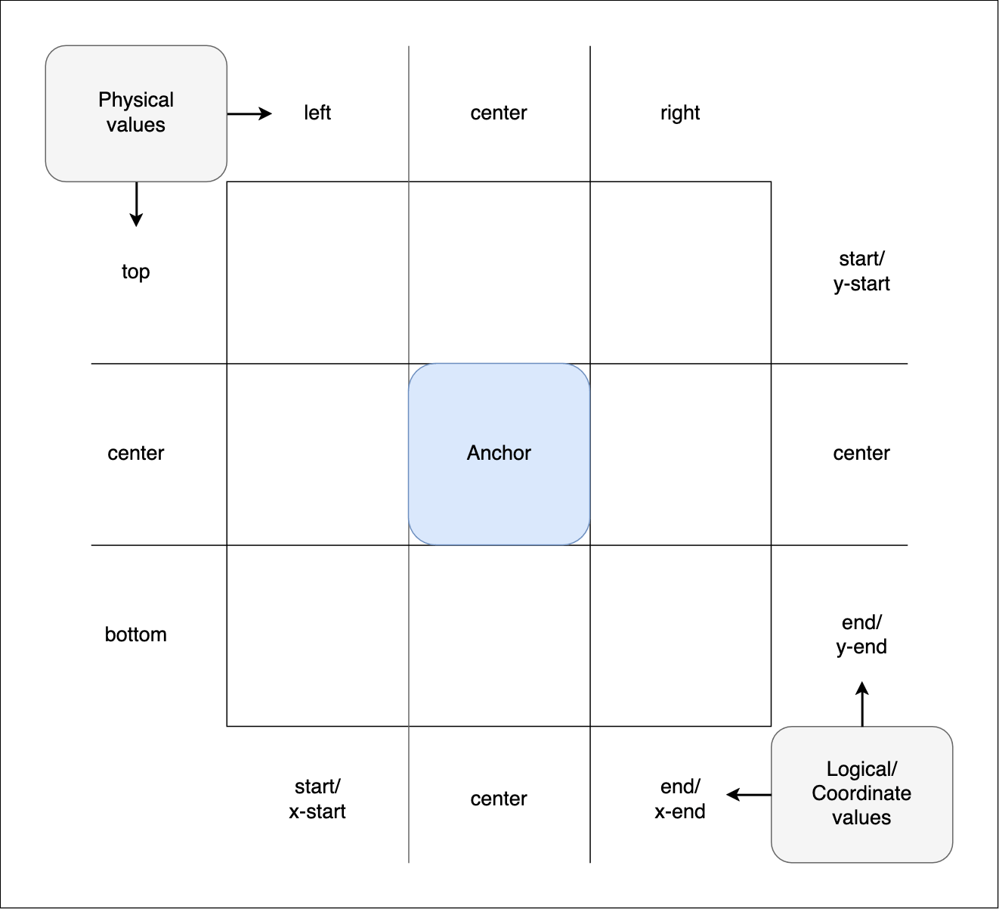

{{CSSRef}}

The **CSS anchor positioning** module defines features that allow you to tether elements together. Certain elements are defined as **anchor elements**; **anchor-positioned** elements can then have their size and position set based on the size and location of the anchor elements to which they are bound.

CSS anchor positioning also provides CSS-only mechanisms for specifying alternative positions for an anchored element. For example, if a tooltip is anchored to a form field but the tip would be rendered offscreen in its default position settings, the browser can try rendering it in alternative positions so it is placed onscreen, or, alternatively, hide it altogether if desired.

This article explains the fundamental anchor positioning concepts, and how to use the module's association, positioning, and sizing features at a basic level. We've included links to reference pages with additional examples and syntax details for each concept discussed below.

> **Note:** For information on position try options and conditional hiding, see [Handling overflow: try options and conditional hiding](/en-US/docs/Web/CSS/CSS_anchor_positioning/Try_options_hiding).

## Fundamental concepts

It's very common to want to tether, or bind, one element to another. For example:

- Error messages that appear alongside form controls.
- Tooltips or infoboxes that pop up next to a UI element to provide more information about it.
- Settings or options dialogs that can be accessed to quickly configure UI elements.

Modern interfaces frequently call for some content — often reusable and dynamically-generated — to be situated relative to an anchor element. Creating such use cases would be fairly straightforward if the element to tether to (aka the **anchor element**) was always in the same place in the UI and the tethered element (aka the **anchor-positioned element**, or just **positioned element**) could always be placed immediately before or after it in the source order. However, things are rarely that simple. The location of positioned elements relative to their anchor element needs to be maintained and adjusted as the anchor element moves or otherwise changes configuration (e.g. by scrolling, changing the viewport size, drag and drop, etc.).

For example, if an element such as a form field gets close to the edge of the viewport, its tooltip may end up offscreen. A method needs to be set to bind the tooltip to its form control and ensure the tooltip is kept fully visible on-screen as long as the form field is visible, automatically moving the tooltip if needed. You may have noticed this as the default behavior in your operating system when you right-click (<kbd>Ctrl</kbd> + click) context menus on your desktop or laptop.

Historically, associating an element with another element and dynamically changing a positioned element's location and size based on an anchor's position required JavaScript, which added complexity and performance issues and wasn't guaranteed to work for all scenarios. The features defined in the [CSS anchor positioning](/en-US/docs/Web/CSS/CSS_anchor_positioning) module enable implementing such use cases performantly and declaratively with CSS instead of JavaScript.

## Associating anchor and positioned elements

To associate an element with an anchor, you need to first declare which element is the anchor, and then specify which positioned element(s) to associate with that anchor. This can be done via CSS or via the HTML [`anchor`](/en-US/docs/Web/HTML/Global_attributes/anchor) attribute. Elements need to be absolutely or fixed [positioned](/en-US/docs/Learn/CSS/CSS_layout/Positioning) to be associated with anchors.

### CSS-only method

To declare an anchor element with CSS, you need to set an anchor name on it via the {{cssxref("anchor-name")}} property. The anchor name needs to be a {{cssxref("dashed-ident")}}. In this example, we also set the anchor's {{cssxref("width")}} to `fit-content` to get a small square anchor, which better demonstrates the anchoring effect.

```css hidden
.anchor {
  font-size: 1.8rem;
  color: white;
  text-shadow: 1px 1px 1px black;
  background-color: hsl(240 100% 75%);
  border-radius: 10px;
  border: 1px solid black;
  padding: 3px;
}
```

```css
.anchor {
  anchor-name: --myAnchor;
  width: fit-content;
}
```

The positioned element is then associated with the anchor element by setting its anchor name as the value of the positioned element's {{cssxref("position-anchor")}} property and setting its {{cssxref("position")}} to `fixed`:

```css hidden
.infobox {
  color: darkblue;
  background-color: azure;
  border: 1px solid #ddd;
  padding: 10px;
  border-radius: 10px;
  font-size: 1rem;
}
```

```css
.infobox {
  position: fixed;
  position-anchor: --myAnchor;
}
```

We'll apply the above CSS to the following HTML:

```html
<div class="anchor">⚓︎</div>

<div class="infobox">
  <p>This is an information box.</p>
</div>
```

This will render as follows:

{{ EmbedLiveSample("CSS-only method", "100%", "120") }}

The anchor and infobox are now associated together, but for the moment you'll have to trust us on this. They are not tethered to each other yet — if you were to position the anchor and move it somewhere else on the page, it would move on its own, leaving the infobox in the same place. You'll see the actual tethering in action later on, when we look at [positioning elements based on anchor position](#positioning_elements_based_on_anchor_position).

### HTML method

To associate a positioned element with an anchor in HTML, you need to give the anchor element an [`id`](/en-US/docs/Web/HTML/Global_attributes/id), and then reference that `id` in the positioned element's [`anchor`](/en-US/docs/Web/HTML/Global_attributes/anchor) attribute:

```html
<div class="anchor" id="example-anchor">⚓︎</div>

<div class="infobox" anchor="example-anchor">
  <p>This is an information box.</p>
</div>
```

We still need to give the infobox absolute or fixed position so that it can be associated with the anchor:

```css hidden
.anchor {
  font-size: 1.8rem;
  color: white;
  text-shadow: 1px 1px 1px black;
  background-color: hsl(240 100% 75%);
  width: fit-content;
  border-radius: 10px;
  border: 1px solid black;
  padding: 3px;
}

.infobox {
  color: darkblue;
  background-color: azure;
  border: 1px solid #ddd;
  padding: 10px;
  border-radius: 10px;
  font-size: 1rem;
}
```

```css
.infobox {
  position: fixed;
}
```

This gives us the same result that we achieved earlier with CSS. We associated the positioned element with the anchor element using the `anchor` attribute on the positioned element rather than the anchor element's `anchor-name` property and positioned element's `position-anchor` property.

{{ EmbedLiveSample("HTML method", "100%", "120") }}

> **Note:** The [`anchor`](/en-US/docs/Web/HTML/Global_attributes/anchor) attribute is currently non-standard and disabled by default in supporting browsers. See the compatibility data on its linked reference page for information on how to enable it for testing purposes.

We've associated the two elements, but they are not yet tethered. To tether them together, the positioned element needs to be positioned relative to its anchor.

## Positioning elements based on anchor position

As we saw above, associating a positioned element with an anchor is not really much use on its own. You also need to specify the position of the element relative to the anchor. This is done either by setting a CSS [`anchor()`](/en-US/docs/Web/CSS/anchor) function value on an [inset property](/en-US/docs/Glossary/Inset_properties), specifying an {{cssxref("inset-area")}}, or centering the positioned element with the [`anchor-center` placement value](#centering_on_the_anchor_using_anchor-center).

### Using inset properties with `anchor()` function values

Conventional absolutely and fixed positioned elements are explicitly positioned by setting {{cssxref("length")}} or {{cssxref("percentage")}} value on inset properties. With `position: absolute`, this inset position value is an absolute distance relative to the edges of nearest positioned ancestor. With `position: fixed`, the inset position value is an absolute distance relative to the viewport.

The CSS anchor positioning module enables positioning an element relative to the edges of an anchor element. The module defines the [`anchor()`](/en-US/docs/Web/CSS/anchor) function, which is a valid value for each of the inset properties. When used, the function sets the inset position value as an absolute distance relative to the anchor element by defining the anchor element, the side of the anchor element the positioned element is being positioned relative to, and the distance from that side.

The syntax looks like this:

```text
anchor(anchor-element anchor-side, length-percentage)
```

- `anchor-element`
  - : The`<dashed-ident>` value set as the `anchor-name` of the anchor element you want to position an element relative to. If omitted, the element's **default anchor**, which is the anchor referenced in the `position-anchor` property, is used.
- `anchor-side`
  - : Specifies the physical (`top`, `left`, etc.) or logical (`start`, `end`, etc.) side of the anchor element that the positioned element will be positioned relative to.|
- {{cssxref("length-percentage")}}
  - : Specifies a fallback value the function should resolve to if the `anchor()` function would otherwise be invalid.

The most common `anchor()` parameters you'll use will refer to a side of the default anchor. You will also often add a {{cssxref("margin")}} to create spacing between the edge of the anchor and positioned element. For example:

```css
.positionedElement {
  /* Position the right edge of the positioned element
     flush to the anchor element's left edge then add
     margin to make some space between the adges  */
  right: anchor(left);
  margin-left: 10px;
}

.positionedElement {
  /* Position the positioned element's logical block end edge
     10px from the anchor element's logical block start edge  */
  inset-block-end: calc(anchor(start) + 10px);
}
```

Let's look at an example of this in action. We'll use the same HTML as in the previous examples, but with some filler text placed below and above it to cause the content to overflow its container and scroll.

```html hidden
<p>
  Lorem ipsum dolor sit amet, consectetur adipiscing elit, sed do eiusmod tempor
  incididunt ut labore et dolore magna aliqua. Dui nunc mattis enim ut tellus
  elementum sagittis vitae et.
</p>

<div class="anchor">⚓︎</div>

<div class="infobox">
  <p>This is an information box.</p>
</div>

<p>
  Nisi quis eleifend quam adipiscing vitae proin sagittis nisl rhoncus. In arcu
  cursus euismod quis viverra nibh cras pulvinar. Vulputate ut pharetra sit amet
  aliquam.
</p>

<p>
  Malesuada nunc vel risus commodo viverra maecenas accumsan lacus. Vel elit
  scelerisque mauris pellentesque pulvinar pellentesque habitant morbi
  tristique. Porta lorem mollis aliquam ut porttitor. Turpis cursus in hac
  habitasse platea dictumst quisque. Dolor sit amet consectetur adipiscing elit.
  Ornare lectus sit amet est placerat. Nulla aliquet porttitor lacus luctus
  accumsan.
</p>
```

We'll also give the anchor element the same `anchor-name` as in the previous examples:

```css hidden
.anchor {
  font-size: 1.8rem;
  color: white;
  text-shadow: 1px 1px 1px black;
  background-color: hsl(240 100% 75%);
  width: fit-content;
  border-radius: 10px;
  border: 1px solid black;
  padding: 3px;
}

body {
  width: 50%;
  margin: 0 auto;
}
```

```css
.anchor {
  anchor-name: --myAnchor;
}
```

The infobox is associated with the anchor via the anchor name and given fixed positioning. By including the {{cssxref("inset-block-start")}} and {{cssxref("inset-inline-start")}} properties (which are equivalent to {{cssxref("top")}} and {{cssxref("left")}} in horizontal writing modes) we have tethered it to the anchor. We add a `margin` to the infobox to add space between the positioned element and its anchor:

```css hidden
.infobox {
  color: darkblue;
  background-color: azure;
  border: 1px solid #ddd;
  padding: 10px;
  border-radius: 10px;
  font-size: 1rem;
}
```

```css
.infobox {
  position-anchor: --myAnchor;
  position: fixed;

  inset-block-start: anchor(end);
  inset-inline-start: anchor(self-end);
  margin: 5px 0 0 5px;
}
```

Let's look at the positioning declarations in more detail:

- `inset-block-start: anchor(end)`: Here we are setting the positioned element's block start edge to have the same position along the block axis as the anchor's block end edge (calculated using the `anchor(end)` function).
- `inset-inline-start: anchor(self-end)`: Here we are setting the positioned element's inline start edge to have the same position along the inline axis as the anchor's inline end edge (calculated using the `anchor(self-end)` function).

This gives us the following result:

{{ EmbedLiveSample("Using individual inset values, via `anchor()`", "100%", "250") }}

The positioned element is 5px below and 5px to the right of the anchor element. As the document is scrolled up and down, the positioned element — despite being given fixed position — maintains its position relative to the anchor element.

### Using an `inset-area`

The {{cssxref("inset-area")}} property provides an alternative to the `anchor()` function for positioning elements relative to anchors. The `inset-area` property works on the concept of a 3x3 grid of tiles, with the anchor element inside the center tile:



The grid tiles are broken up into rows and columns:

- The three rows are represented by the physical values `top`, `center`, and `bottom`. They also have logical equivalents — `start`, `center`, and `end`.
- The three columns are represented by the physical values `left`, `center`, and `right`. They also have logical equivalents — `start`, `center`, and `end`.

The dimensions of the center tile are defined by the [containing block](/en-US/docs/Web/CSS/Containing_block) of the anchor element, while the dimensions of the grid's outer edge are defined by the positioned element's containing block.

`inset-area` property values are composed of one or two values based on the row and column values described above, with a feature extra options available, to define the region of the grid the positioned element should be placed inside.

For example:

- You can specify two of the above values to place the positioned element in that specific grid square — for example `top left` (logical equivalent `start start`) or `bottom center` (logical equivalent `end center`) will place the positioned element in the top-right or bottom center square.
- You can specify a row or column value plus a `span-*` value. The first value specifies the row or column to place the positioned element in, placing it initially in the center, and the other one specifies the amount of that column to span. For example:
  - `top span-left` causes the positioned element to be placed in the top row, and span across the center and left tiles of that row.
  - `right span-bottom` causes the positioned element to be placed in the right column, and span across the center and bottom tiles of that column.
  - `bottom span-all` causes the positioned element to be placed in the bottom row, and span across the left, center, and right tiles of that row.
- If you only specify one value, the effect is different depending on which value is set:
  - A physical side value (`top`, `bottom`, `left`, or `right`) acts as if the other value is `span-all`. So for example, `top` gives the same effect as `top span-all`.
  - A logical side value (`start` or `end`) acts as if the other value is set to the same value; for example `start` gives the same effect as `start start`.
  - A value of `center` acts as if both values are set to `center` (so, `center center`),

> **Note:** See the {{cssxref("inset-area")}} property for a detailed description of all the available values.

Let's demonstrate some of these values in action; this example uses exactly the same HTML as the previous example, except that we've included a {{htmlelement("select")}} element that allows you to change the `inset-area` value applied to the positioned element, changing its position relative to the anchor.

```html
<p>
  Lorem ipsum dolor sit amet, consectetur adipiscing elit, sed do eiusmod tempor
  incididunt ut labore et dolore magna aliqua. Dui nunc mattis enim ut tellus
  elementum sagittis vitae et.
</p>

<div class="anchor">⚓︎</div>

<div class="infobox">
  <p>This is an information box.</p>
</div>

<p>
  Nisi quis eleifend quam adipiscing vitae proin sagittis nisl rhoncus. In arcu
  cursus euismod quis viverra nibh cras pulvinar. Vulputate ut pharetra sit amet
  aliquam.
</p>

<p>
  Malesuada nunc vel risus commodo viverra maecenas accumsan lacus. Vel elit
  scelerisque mauris pellentesque pulvinar pellentesque habitant morbi
  tristique. Porta lorem mollis aliquam ut porttitor. Turpis cursus in hac
  habitasse platea dictumst quisque. Dolor sit amet consectetur adipiscing elit.
  Ornare lectus sit amet est placerat. Nulla aliquet porttitor lacus luctus
  accumsan.
</p>

<form>
  <label for="inset-area-select">Choose an inset-area:</label>
  <select id="inset-area-select" name="inset-area-select">
    <option>top</option>
    <option>bottom</option>
    <option>left</option>
    <option>right</option>
    <option>top left</option>
    <option>top right</option>
    <option>bottom left</option>
    <option>bottom right</option>
    <option>top span-left</option>
    <option>bottom span-right</option>
    <option>left span-top</option>
    <option>right span-bottom</option>
    <option>center</option>
    <option>bottom center</option>
    <option>bottom span-all</option>
  </select>
</form>
```

The anchor element and `<body>` element are given the same CSS as before. We have given the `<select>` form some simple styling and fixed its position in the top-right of the viewport:

```css hidden
.anchor {
  font-size: 1.8rem;
  color: white;
  text-shadow: 1px 1px 1px black;
  background-color: hsl(240 100% 75%);
  width: fit-content;
  border-radius: 10px;
  border: 1px solid black;
  padding: 3px;
}

.anchor {
  anchor-name: --myAnchor;
}

body {
  width: 50%;
  margin: 0 auto;
}

form {
  background: white;
  border: 1px solid black;
  padding: 5px;
}

select {
  display: block;
  margin-top: 5px;
}
```

```css
form {
  position: fixed;
  top: 0;
  right: 2px;
}
```

The infobox is given fixed positioning and associated with the anchor in the same way as before. This time however, it is tethered to the anchor with `inset-area: top;`, which causes it to be positioned at the top of the inset-area grid. This will be overridden once you select different values from the `<select>` menu.

```css hidden
.infobox {
  color: darkblue;
  background-color: azure;
  border: 1px solid #ddd;
  padding: 10px;
  border-radius: 10px;
  font-size: 1rem;
}
```

```css
.infobox {
  position: fixed;
  position-anchor: --myAnchor;

  inset-area: top;
}
```

We also include a short script to apply new `inset-area` values chosen from the `<select>` menu to the infobox:

```js
const infobox = document.querySelector(".infobox");
const selectElem = document.querySelector("select");

selectElem.addEventListener("change", () => {
  const area = selectElem.value;

  // clear all the previous inline styles out to begin with
  infobox.style = "";

  // Set the inset-area to the value chosen in the select box
  infobox.style.insetArea = area;
});
```

The result is as follows. Try selecting new `inset-area` values from the `<select>` menu to see the effect they have on the position of the infobox:

{{ EmbedLiveSample("Using an `inset-area`", "100%", "250") }}

### An aside on positioned element width

In this example, the positioned element has not had a specific size set on it, in either dimension. This is not normally what you'd do in production code, but we did it deliberately to allow you to observe the behavior this causes.

If the positioned element is placed into a corner or side grid square (say with `inset-area: top left`) or is set to span two or more grid squares (for example using `inset-area: bottom span-all`), it will align with the specified grid area but behave as if it has a {{cssxref("width")}} of `max-content` set on it. It is being sized according to its containing block size, which is the size imposed on it when it was set to `position: fixed`. It will stretch as wide as the text content, although you'll see it constrained by the edge of the `<body>` if you place it on the left of the grid.

If the positioned element is vertically aligned with the center tile (say with `inset-area: bottom center`), it will align with the specified grid square but adopt the same width as the anchor element — it is being sized according to the anchor element's containing block size. However, it won't allow its content to overflow — its minimum `width` will be its `min-content` (as defined by the width of its longest word).

## Centering on the anchor using `anchor-center`

The properties {{cssxref("justify-self")}}, {{cssxref("align-self")}}, {{cssxref("justify-items")}}, and {{cssxref("align-items")}} (and their {{cssxref("place-items")}} and {{cssxref("place-self")}} shorthands) exist to allow developers to easily align elements in the inline or block direction inside various layout systems, for example along the main or cross axis in the case of flex children.

CSS anchor positioning provides a new value for these properties, `anchor-center`, which will align a positioned element with the center of its default anchor.

Let's have a look at how this works.

The HTML is the same as in the previous example, as is the CSS for the `<body>` and anchor elements.

```html hidden
<p>
  Lorem ipsum dolor sit amet, consectetur adipiscing elit, sed do eiusmod tempor
  incididunt ut labore et dolore magna aliqua. Dui nunc mattis enim ut tellus
  elementum sagittis vitae et.
</p>

<div class="anchor">⚓︎</div>

<div class="infobox">
  <p>This is an information box.</p>
</div>

<p>
  Nisi quis eleifend quam adipiscing vitae proin sagittis nisl rhoncus. In arcu
  cursus euismod quis viverra nibh cras pulvinar. Vulputate ut pharetra sit amet
  aliquam.
</p>

<p>
  Malesuada nunc vel risus commodo viverra maecenas accumsan lacus. Vel elit
  scelerisque mauris pellentesque pulvinar pellentesque habitant morbi
  tristique. Porta lorem mollis aliquam ut porttitor. Turpis cursus in hac
  habitasse platea dictumst quisque. Dolor sit amet consectetur adipiscing elit.
  Ornare lectus sit amet est placerat. Nulla aliquet porttitor lacus luctus
  accumsan.
</p>
```

```css hidden
.anchor {
  font-size: 1.8rem;
  color: white;
  text-shadow: 1px 1px 1px black;
  background-color: hsl(240 100% 75%);
  width: fit-content;
  border-radius: 10px;
  border: 1px solid black;
  padding: 3px;
}

.anchor {
  anchor-name: --myAnchor;
}

body {
  width: 50%;
  margin: 0 auto;
}
```

The infobox is given fixed positioning and tethered to the anchor's bottom edge. `justify-self: anchor-center` is then used to make sure it is centered horizontally on the anchor's center:

```css hidden
.infobox {
  color: darkblue;
  background-color: azure;
  border: 1px solid #ddd;
  padding: 10px;
  border-radius: 10px;
  font-size: 1rem;
}
```

```css
.infobox {
  position: fixed;
  position-anchor: --myAnchor;

  top: anchor(bottom);
  margin-top: 5px;
  justify-self: anchor-center;
}
```

This gives us the following result:

{{ EmbedLiveSample("Centering on the anchor using `anchor-center`", "100%", "250") }}

## Sizing elements based on anchor size

As well as positioning an element relative to its anchor's position, you can also size an element relative to its anchor's size. This is achieved using the the [`anchor-size()`](/en-US/docs/Web/CSS/anchor) function, which can be set as a value for the following sizing properties:

- Physical sizing properties: {{cssxref("width")}}, {{cssxref("height")}}, {{cssxref("min-width")}}, {{cssxref("min-height")}}, {{cssxref("max-width")}}, and {{cssxref("max-height")}}.
- Logical properties: {{cssxref("block-size")}}, {{cssxref("inline-size")}}, {{cssxref("min-block-size")}}, {{cssxref("min-inline-size")}}, {{cssxref("max-block-size")}}, and {{cssxref("max-inline-size")}}.

`anchor-size()` functions resolve to {{cssxref("length")}} values. Their syntax looks like this:

```text
anchor-size(anchor-element anchor-size, length-percentage)
```

- `anchor-element` is the `anchor-name` set on the anchor element you want to size the positioned element relative to. This is optional — if omitted, the element is sized relative to the anchor referenced by its `position-anchor` property (the element's **default anchor**).
- `anchor-size` specifies the dimension of the anchor element that the positioned element will be sized relative to. This can be expressed using physical (`width` or `height`) or logical (`inline`, `block`, `self-inline`, or `self-block`) values.
  > **Note:** The dimension of the positioned element does not need to match the anchor's dimension it is being sized relative to. For example, `width: anchor-size(height);` is valid.
- The {{cssxref("length-percentage")}} is a fallback value that specifies what the function should resolve to if the `anchor-size()` function is invalid.

The most common `anchor-size()` functions you'll use will just refer to a dimension of the default anchor. You can also use them inside {{cssxref("calc")}} functions, to modify the size applied to the positioned element. For example:

```css
.elem {
  /* Size the positioned element's width
     equal to the anchor element's width  */
  width: anchor-size(width);
}

.elem {
  /* Size the positioned element's inline size
     equal to 4 times the anchor element's inline size  */
  inline-size: calc(anchor-size(self-inline) * 4);
}
```

Let's look at an example. The HTML is the same as in the previous examples, and the anchor element and `<body>` element are given the same basic styling.

```html hidden
<p>
  Lorem ipsum dolor sit amet, consectetur adipiscing elit, sed do eiusmod tempor
  incididunt ut labore et dolore magna aliqua. Dui nunc mattis enim ut tellus
  elementum sagittis vitae et.
</p>

<div class="anchor" tabindex="0">⚓︎</div>

<div class="infobox">
  <p>This is an information box.</p>
</div>

<p>
  Nisi quis eleifend quam adipiscing vitae proin sagittis nisl rhoncus. In arcu
  cursus euismod quis viverra nibh cras pulvinar. Vulputate ut pharetra sit amet
  aliquam.
</p>

<p>
  Malesuada nunc vel risus commodo viverra maecenas accumsan lacus. Vel elit
  scelerisque mauris pellentesque pulvinar pellentesque habitant morbi
  tristique. Porta lorem mollis aliquam ut porttitor. Turpis cursus in hac
  habitasse platea dictumst quisque. Dolor sit amet consectetur adipiscing elit.
  Ornare lectus sit amet est placerat. Nulla aliquet porttitor lacus luctus
  accumsan.
</p>
```

```css hidden
.anchor {
  font-size: 1.8rem;
  color: white;
  text-shadow: 1px 1px 1px black;
  background-color: hsl(240 100% 75%);
  width: fit-content;
  border-radius: 10px;
  border: 1px solid black;
  padding: 3px;
}

.anchor {
  anchor-name: --myAnchor;
}

body {
  width: 50%;
  margin: 0 auto;
}
```

The infobox is given fixed positioning and associated with the anchor in the same way as before. However, this time around we tether it to the right of the anchor using an `inset-area`, and give it a width five times the width of the anchor's width:

```css hidden
.infobox {
  color: darkblue;
  background-color: azure;
  border: 1px solid #ddd;
  padding: 10px;
  border-radius: 10px;
  font-size: 1rem;
}
```

```css
.infobox {
  position: fixed;
  position-anchor: --myAnchor;

  inset-area: right;
  margin-left: 5px;
  width: calc(anchor-size(width) * 5);
}
```

In addition, we increase the anchor element's {{cssxref("width")}} on {{cssxref(":hover")}} and {{cssxref(":focus")}}, and give it a {{cssxref("transition")}} so that it animates when the state changes.

```css
.anchor {
  text-align: center;
  width: 30px;
  transition: 1s width;
}

.anchor:hover,
.anchor:focus {
  width: 50px;
}
```

This gives us the following result:

{{ EmbedLiveSample("Sizing elements based on anchor size", "100%", "250") }}

Try hovering or focusing the anchor element — you'll see both the anchor and the positioned element grow in width, proving that the latter's size is relative to the former's size.

## See also

- [CSS anchor positioning](/en-US/docs/Web/CSS/CSS_anchor_positioning)
- [Handling overflow: try options and conditional hiding](/en-US/docs/Web/CSS/CSS_anchor_positioning/Try_options_hiding)
- [Positioning](/en-US/docs/Learn/CSS/CSS_layout/Positioning)
- [CSS logical properties and values](/en-US/docs/Web/CSS/CSS_logical_properties_and_values)
- [Sizing items in CSS](/en-US/docs/Learn/CSS/Building_blocks/Sizing_items_in_CSS)
