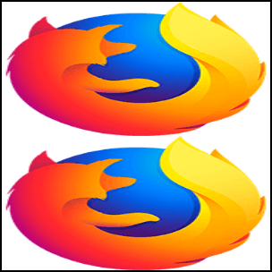

{{CSSRef}}

The <strong>{{cssxref("background-size")}}</strong> CSS property lets you resize the background image of an element, overriding the default behavior of tiling the image at its full size by specifying the width and/or height of the image. By doing so, you can scale the image upward or downward as desired.

<h2 id="Tiling_a_large_image">Tiling a large image</h2>

Let's consider a large image, a 2982x2808 Firefox logo image. We want (for some reason likely involving horrifyingly bad site design) to tile four copies of this image into a 300x300-pixel element. To do this, we can use a fixed <code>background-size</code> value of 150 pixels.

<h3 id="HTML">HTML</h3>

<pre class="brush: html">&lt;div class="tiledBackground"&gt;
&lt;/div&gt;</pre>

<h3 id="CSS">CSS</h3>

<pre class="brush: css; highlight:[3]">.tiledBackground {
  background-image: url(https://www.mozilla.org/media/img/logos/firefox/logo-quantum.9c5e96634f92.png);
  background-size: 150px;
  width: 300px;
  height: 300px;
  border: 2px solid;
  color: pink;
}
</pre>

<h3 id="Result">Result</h3>

{{EmbedLiveSample("Tiling_a_large_image", 340, 340)}}

<h2 id="Stretching_an_image">Stretching an image</h2>

You can also specify both the horizontal and vertical sizes of the image, like this:

<pre class="brush:css">background-size: 300px 150px;
</pre>

The result looks like this:

<h2 id="Scaling_an_image_up">Scaling an image up</h2>

On the other end of the spectrum, you can scale an image up in the background. Here we scale a 32x32 pixel favicon to 300x300 pixels:

<pre class="brush: css; highlight:[5]">.square2 {
  background-image: url(favicon.png);
  background-size: 300px;
  width: 300px;
  height: 300px;
  border: 2px solid;
  text-shadow: white 0px 0px 2px;
  font-size: 16px;
}
</pre>

As you can see, the CSS is actually essentially identical, save the name of the image file.

<h2 id="Special_values.3A_.22contain.22_and_.22cover.22">Special values: "contain" and "cover"</h2>

Besides {{cssxref("&lt;length&gt;")}} values, the {{ cssxref("background-size") }} CSS property offers two special size values, <code>contain</code> and <code>cover</code>. Let's take a look at these.

<h3 id="contain">contain</h3>

The <code>contain</code> value specifies that, regardless of the size of the containing box, the background image should be scaled so that each side is as large as possible while not exceeding the length of the corresponding side of the container. Try resizing the example below to see this in action.

<h4 id="HTML_2">HTML</h4>

<pre class="brush: html">&lt;div class="bgSizeContain"&gt;
  &lt;p&gt;Try resizing this element!&lt;/p&gt;
&lt;/div&gt;</pre>

<h4 id="CSS_2">CSS</h4>

<pre class="brush: css">.bgSizeContain {
  background-image: url(https://www.mozilla.org/media/img/logos/firefox/logo-quantum.9c5e96634f92.png);
  background-size: contain;
  width: 160px;
  height: 160px;
  border: 2px solid;
  color: pink;
  resize: both;
  overflow: scroll;
}</pre>

<h4 id="Result_2">Result</h4>

{{ EmbedLiveSample('contain', 250, 250) }}

<h3 id="cover">cover</h3>

The <code>cover</code> value specifies that the background image should be sized so that it is as small as possible while ensuring that both dimensions are greater than or equal to the corresponding size of the container. Try resizing the example below to see this in action.

<h4 id="HTML_3">HTML</h4>

<pre class="brush: html">&lt;div class="bgSizeCover"&gt;
  &lt;p&gt;Try resizing this element!&lt;/p&gt;
&lt;/div&gt;</pre>

<h4 id="CSS_3">CSS</h4>

<pre class="brush: css">.bgSizeCover {
  background-image: url(https://www.mozilla.org/media/img/logos/firefox/logo-quantum.9c5e96634f92.png);
  background-size: cover;
  width: 160px;
  height: 160px;
  border: 2px solid;
  color: pink;
  resize: both;
  overflow: scroll;
}</pre>

<h4 id="Result_3">Result</h4>

{{ EmbedLiveSample('cover', 250, 250) }}

<h2 id="See_also">See also</h2>

<ul>
 <li>{{ cssxref("background-size") }}</li>
 <li>{{ cssxref("background") }}</li>
 <li><a href="/en-US/docs/Web/CSS/Scaling_of_SVG_backgrounds">Scaling of SVG backgrounds</a></li>
</ul>
