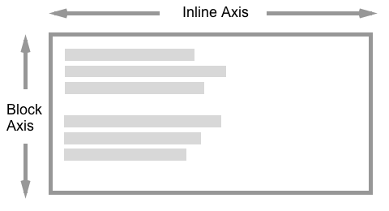
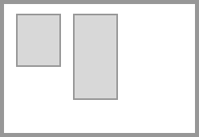
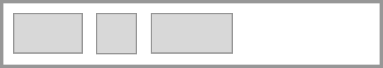
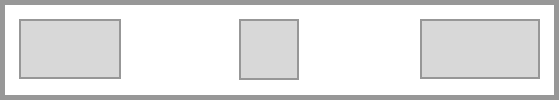

{{CSSRef}}

The [CSS box alignment](/en-US/docs/Web/CSS/CSS_box_alignment) module specifies CSS features that relate to the alignment of boxes in the various CSS box layout models. The module aims to create a consistent method of alignment across all of CSS. The CSS box alignment properties provide full horizontal and vertical alignment capabilities.

This guide details the general concepts found in this module. Additional guides provide more information on box alignment in [flexbox](/en-US/docs/Web/CSS/CSS_box_alignment/Box_alignment_in_flexbox), [grid layout](/en-US/docs/Web/CSS/CSS_box_alignment/Box_alignment_in_grid_layout), [multiple-column layout](/en-US/docs/Web/CSS/CSS_box_alignment/Box_alignment_in_multi-column_layout), and [block, absolutely positioned and table layout](/en-US/docs/Web/CSS/CSS_box_alignment/Box_alignment_in_block_abspos_tables). Alignment of text is covered by the [CSS text](/en-US/docs/Web/CSS/CSS_text) and [CSS inline layout](/en-US/docs/Web/CSS/CSS_inline_layout) modules.

## Key concepts and terminology

The specification details some alignment terminology to make it easier to discuss these alignment properties outside their implementation within a particular layout method. There are also some key concepts which are common to all layout methods.

### Relationship to writing modes

Alignment is linked to writing modes in that when we align an item we do not consider whether we are aligning it to the physical dimensions of top, right, bottom and left. Instead we describe alignment in terms of the start and end of the particular dimension we are working with. This ensures that alignment works in the same way whichever writing mode the document has.

### Two dimensions of alignment

When using the box alignment properties you will align content on one of two axes — the inline (or main) axis, and the block (or cross) axis. The inline axis is the axis along which words in a sentence flow in the writing mode being used. For English, for example, the inline axis is horizontal. The block axis is the axis along which blocks, such as paragraph elements, are laid out; it runs across the Inline axis.



When aligning items on the inline axis you will use the properties that begin with `justify-`:

- {{cssxref("justify-items")}}
- {{cssxref("justify-self")}}
- {{cssxref("justify-content")}}

When aligning items on the block axis you will use the properties that begin with `align-`:

- {{cssxref("align-items")}}
- {{cssxref("align-self")}}
- {{cssxref("align-content")}}

Flexbox adds an additional complication in that the above is true when {{cssxref("flex-direction")}} is set to `row`. The properties are swapped when flexbox is set to `column`. Therefore, when working with flexbox it is easier to think about the main and cross axis rather than inline and block. The `justify-` properties are always used to align on the main axis, the `align-` properties on the cross axis.

### The alignment subject

The **{{Glossary("alignment subject")}}** is the thing that is being aligned. For `justify-self` or `align-self`, or when setting these values as a group with `justify-items` or `align-items`, this will be the margin box of the element that this property is being used on. The `justify-content` and `align-content` properties differ per layout method.

### The alignment container

The **{{Glossary("alignment container")}}** is the box the subject is being aligned inside. This will typically be the alignment subject's containing block. An alignment container may contain one or many alignment subjects.

The below image shows an alignment container with two alignment subjects inside.



## Types of alignment

There are three different types of alignment that the specification details; these use keyword values.

- [Positional alignment](#positional-alignment)
- [Baseline alignment](#baseline-alignment)
- [Distributed alignment](#distributed-alignment)

### Positional alignment

**Positional alignment** is the position of an alignment subject with relation to its alignment container. The positional alignment keyword values are defined for positional alignment, and can be used as values for content alignment with `justify-content` and `align-content` and also for self alignment with `justify-self` and `align-self`.

- `center`
- `start`
- `end`
- `self-start`
- `self-end`
- `flex-start` for flexbox only
- `flex-end` for flexbox only
- `left`
- `right`

Other than the physical values of `left` and `right`, which relate to physical attributes of the screen, all of the other values, the {{cssxref("self-position")}} and {{cssxref("content-position")}} values, are logical values and relate to the writing mode of the content.

For example, when working in CSS grid layout, if you are working in English and set `justify-content` to `start` this will move the items in the inline dimension to the start, which will be the left as sentences in English start on the left-hand side of the page. If you were using Arabic, a right-to-left language, then the same value of `start` would result in the items moving to the right, as sentences in Arabic start on the right-hand side of the page.


Both have `justify-content: start`, but the location of the two starts is different because of the writing mode.

### Baseline alignment

**Baseline alignment** is the relationship among the baselines of multiple alignment subjects within an alignment context. The Baseline alignment {{cssxref("baseline-position")}} keywords are used to align the baselines of boxes across a group of alignment subjects. They can be used as values for content alignment with `justify-content` and `align-content` and self-alignment with `justify-self` and `align-self`.

- `baseline`
- `first baseline`
- `last baseline`

Baseline content alignment — specifying a baseline alignment value for `justify-content` or `align-content` — works in layout methods that lay items out in rows. The alignment subjects are baseline aligned against each other by adding padding inside the boxes.

Baseline self-alignment shifts the boxes to align by baseline by adding a margin outside the boxes. Self-alignment is done for singular boxes using `justify-self` or `align-self`, or for groups of boxes using `justify-items` and `align-items`.

### Distributed alignment

**Distributed alignment** defines alignment as a distribution of space among alignment subjects. The distributed alignment {{cssxref("content-distribution")}} keywords are used with the `align-content` and `justify-content` properties. These keywords define what happens to any additional space after alignment subjects have been displayed. The values are as follows:

- `stretch`
- `space-between`
- `space-around`
- `space-evenly`

For example, in Flex Layout items are aligned with `flex-start` initially. Working in a horizontal top-to-bottom writing mode (with a language such as English), with `flex-direction` set to `row`, the items start on the far left, and any available space after displaying the items is placed after them.



If you set `justify-content: space-between` on the flex container, the available space is now shared out and placed between the items.



For these keywords to take effect, space is required along the dimension in which you wish to align the items. With no space, there is nothing to distribute.

### Basic examples

The following examples demonstrate how some of the box alignment properties are applied in [Grid](/en-US/docs/Web/CSS/CSS_grid_layout) and [Flexbox](/en-US/docs/Web/CSS/CSS_flexible_box_layout).

#### CSS grid layout alignment example

In this grid layout example, there is extra space in the grid container after laying out the fixed-width tracks on the inline (main) axis. This space is distributed using {{cssxref("justify-content")}}. On the block (cross) axis, the alignment of the items inside their grid areas is controlled with {{cssxref("align-items")}}. The first item overrides the `align-items` value set on the group by setting {{cssxref("align-self")}} to `center`.

```html live-sample___grid-align-items
<div class="box">
  <div>One</div>
  <div>Two</div>
  <div>Three <br />has <br />extra <br />text</div>
  <div>Four</div>
  <div>Five</div>
  <div>Six</div>
</div>
```

```css hidden live-sample___grid-align-items
body {
  font: 1.2em sans-serif;
}

.box {
  border: 2px dotted rgb(96 139 168);
}

.box > * {
  padding: 20px;
  border: 2px solid rgb(96 139 168);
  border-radius: 5px;
  background-color: rgb(96 139 168 / 0.2);
}
```

```css live-sample___grid-align-items
.box {
  display: grid;
  grid-template-columns: 120px 120px 120px;
  align-items: start;
  justify-content: space-between;
}

.box :first-child {
  align-self: center;
}
```

{{EmbedLiveSample("grid-align-items", "", "200px")}}

#### Flexbox Alignment Example

In this example, three flex items are aligned on the main axis using `justify-content` and on the cross axis using `align-items`. The first item overrides the `align-items` set on the group by setting `align-self` to `center`.

```html live-sample___flex-align-items
<div class="box">
  <div>One</div>
  <div>Two</div>
  <div>Three <br />has <br />extra <br />text</div>
</div>
```

```css hidden live-sample___flex-align-items
body {
  font: 1.2em sans-serif;
}

.box {
  border: 2px dotted rgb(96 139 168);
}

.box > * {
  padding: 20px;
  border: 2px solid rgb(96 139 168);
  border-radius: 5px;
  background-color: rgb(96 139 168 / 0.2);
}
```

```css live-sample___flex-align-items
.box {
  display: flex;
  align-items: flex-start;
  justify-content: space-between;
}

.box :first-child {
  align-self: center;
}
```

{{EmbedLiveSample("flex-align-items")}}

## Overflow alignment

The {{cssxref("overflow-position")}} keywords `safe` and `unsafe` help define behavior when an alignment subject is larger than the alignment container. The `safe` keyword will align to `start` in the case of a specified alignment causing an overflow, the aim being to avoid "data loss" where part of the item is outside the boundaries of the alignment container and can't be scrolled to.

If you specify `unsafe` then the alignment will be honoured even if it would cause such data loss.

## Gaps between boxes

The box alignment specification also includes the `gap`, `row-gap`, and `column-gap` properties. These properties enable the setting of a consistent gap between items in a row or column, in any layout method which has items arranged in this way.

The `gap` property is a shorthand for `row-gap` and `column-gap`, which allows us to set these properties at once:

- {{cssxref("row-gap")}}
- {{cssxref("column-gap")}}
- {{cssxref("gap")}}

In the below example, a grid layout uses the `gap` shorthand to set a `10px` gap between row tracks, and a `2em` gap between column tracks.

```html live-sample___grid-gap
<div class="box">
  <div>One</div>
  <div>Two</div>
  <div>Three</div>
  <div>Four</div>
  <div>Five</div>
  <div>Six</div>
</div>
```

```css hidden live-sample___grid-gap
body {
  font: 1.2em sans-serif;
}

.box {
  border: 2px dotted rgb(96 139 168);
}

.box > * {
  padding: 20px;
  border: 2px solid rgb(96 139 168);
  border-radius: 5px;
  background-color: rgb(96 139 168 / 0.2);
}
```

```css live-sample___grid-gap
.box {
  display: grid;
  grid-template-columns: 1fr 1fr 1fr;
  gap: 10px 2em;
}

.box :first-child {
  align-self: center;
}
```

{{EmbedLiveSample("grid-gap")}}

Early grid implementations included `gap` properties prefixed with `grid-`. All browsers support the unprefixed properties, though you may see the following properties in a code-base: {{cssxref("row-gap", "grid-row-gap")}}, {{cssxref("column-gap", "grid-column-gap")}}, and {{cssxref("gap", "grid-gap")}}. The prefixed versions are aliases of the unprefixed ones.

Be aware that other things may increase the visual gap displayed, for example using the space distribution keywords or adding margins to items.

## Box-alignment by layout type

As the CSS box alignment properties are implemented differently depending on the specification they interact with, refer to the following guides for details of how to use the alignment properties with each layout type:

- [Box alignment in flexbox](/en-US/docs/Web/CSS/CSS_box_alignment/Box_alignment_in_flexbox)
- [Box alignment in CSS grid layout](/en-US/docs/Web/CSS/CSS_box_alignment/Box_alignment_in_grid_layout)
- [Box alignment in multiple-column layout](/en-US/docs/Web/CSS/CSS_box_alignment/Box_alignment_in_multi-column_layout)
- [Box alignment for block, absolutely positioned and table layout](/en-US/docs/Web/CSS/CSS_box_alignment/Box_alignment_in_block_abspos_tables)

## See also

- [CSS display](/en-US/docs/Web/CSS/CSS_display) module
- [CSS flex layout](/en-US/docs/Web/CSS/CSS_flexible_box_layout) module
- [Basic concepts of flexbox](/en-US/docs/Web/CSS/CSS_flexible_box_layout/Basic_concepts_of_flexbox)
- [Aligning items in a flex container](/en-US/docs/Web/CSS/CSS_flexible_box_layout/Aligning_items_in_a_flex_container)
- [CSS grid layout](/en-US/docs/Web/CSS/CSS_grid_layout) module
- [Box alignment in grid layout](/en-US/docs/Web/CSS/CSS_box_alignment/Box_alignment_in_grid_layout)
