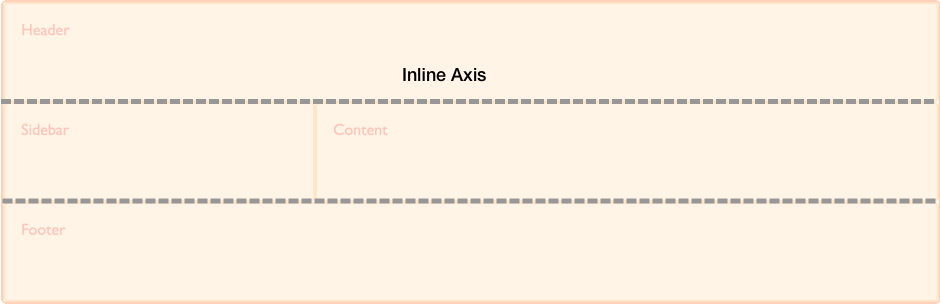
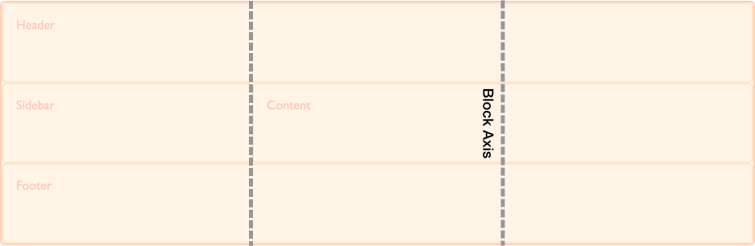

{{CSSRef}}

The [box alignment](/en-US/docs/Web/CSS/CSS_box_alignment) specification details how alignment works in various layout methods. On this page we explore how box alignment works in the context of [CSS grid layout](/en-US/docs/Web/CSS/CSS_Grid_Layout).

As this page aims to detail things which are specific to CSS Grid Layout and Box Alignment, it should be read in conjunction with the main [box alignment](/en-US/docs/Web/CSS/CSS_box_alignment) page which details the common features of box alignment across layout methods.

## Basic example

In this example using grid layout, there is extra space in the grid container after laying out the fixed width tracks on the inline (main) axis. This space is distributed using `justify-content`. On the block (cross) axis the alignment of the items inside their grid areas is controlled with `align-items`. The first item overrides the `align-items` value set on the group by setting `align-self` to `center`.

{{EmbedGHLiveSample("css-examples/box-alignment/overview/grid-align-items.html", '100%', 500)}}

## Grid axes

As a two-dimensional layout method, when working with grid layout we always have two axes on which to align our items. We have access to all of the box alignment properties to help us achieve this.

The inline axis is the axis that corresponds to the direction that words in a sentence would run in the writing mode used. Therefore, in a horizontal language such as English or Arabic the inline direction runs horizontally. Should you be in a vertical writing mode the inline axis will run vertically.

To align things on the inline axis you use the properties that start with `justify-`, {{cssxref("justify-content")}}, {{cssxref("justify-items")}} and {{cssxref("justify-self")}}.

The block axis crosses the inline axis in the direction that blocks are displayed down the page — for example paragraphs in English are displayed one below the other vertically. This, therefore is the block dimension.

To align things on the block axis you use the properties that start with `align-`, {{cssxref("align-content")}}, {{cssxref("align-items")}} and {{cssxref("align-self")}}.

## Self alignment

- {{cssxref("justify-self")}}
- {{cssxref("align-self")}}
- {{cssxref("place-self")}}
- {{cssxref("justify-items")}}
- {{cssxref("align-items")}}
- {{cssxref("place-items")}}

These properties deal with aligning the item inside the grid area it is placed into. The properties `align-items` and `justify-items` are applied to the grid container and set the `align-self` and `justify-self` properties as a group. This means that you can set alignment for all of your grid Items at once, then override any items that need a different alignment by applying the `align-self` or `justify-self` property to the rules for the individual grid Items.

The initial value for `align-self` and `justify-self` is `stretch` so the item will stretch over the entire grid area. The exception to this rule is where the item has an intrinsic aspect ratio, for example an image. In this case the item will be aligned to `start` in both dimensions in order that the image is not distorted.

## Content alignment

- {{cssxref("justify-content")}}
- {{cssxref("align-content")}}
- {{cssxref("place-content")}}

These properties deal with aligning the tracks of the grid when there is extra space to distribute. This scenario will occur if the tracks that you have defined total less than the total width of the grid container.

## Gap and legacy grid-gap properties

- {{cssxref("row-gap")}}
- {{cssxref("column-gap")}}
- {{cssxref("gap")}}

The Grid specification originally contained the definition for the properties {{cssxref("row-gap", "grid-row-gap")}}, {{cssxref("column-gap", "grid-column-gap")}} and {{cssxref("gap", "grid-gap")}}. These have since been moved into the Box Alignment specification and renamed to {{cssxref("row-gap")}}, {{cssxref("column-gap")}}, and {{cssxref("gap")}}. This allows them to be used for other layout methods where a gap between items makes sense.

The updated properties have not yet been implemented in all browsers. Therefore, to use the gap properties in grid layout, you should use the `grid-row-gap`, `grid-column-gap` and `grid-gap` versions to ensure full compatibility. You could double up the properties and use both as you would for vendor prefixes.

## Reference

### CSS Properties

- {{cssxref("justify-content")}}
- {{cssxref("align-content")}}
- {{cssxref("place-content")}}
- {{cssxref("justify-items")}}
- {{cssxref("align-items")}}
- {{cssxref("place-items")}}
- {{cssxref("justify-self")}}
- {{cssxref("align-self")}}
- {{cssxref("place-self")}}
- {{cssxref("row-gap")}}
- {{cssxref("column-gap")}}
- {{cssxref("gap")}}

### Glossary Entries

- [Cross Axis](/en-US/docs/Glossary/Cross_Axis)
- [Main Axis](/en-US/docs/Glossary/Main_Axis)

## Guides

- [Alignment in grid layout](/en-US/docs/Web/CSS/CSS_Grid_Layout/Box_Alignment_in_CSS_Grid_Layout)

## External Resources

- [CSS Grid, Flexbox and Box Alignment](https://www.smashingmagazine.com/2016/11/css-grids-flexbox-box-alignment-new-layout-standard/)
- [Thoughts on partial implementations of Box Alignment](https://blogs.igalia.com/jfernandez/2017/05/03/can-i-use-css-box-alignment/)
