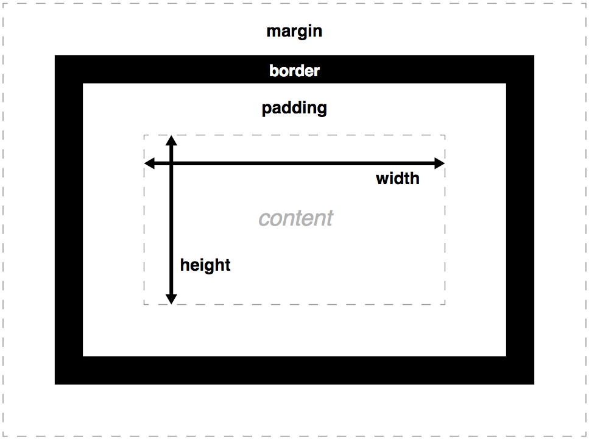

{{CSSRef}}

The **CSS box model** module defines the `height`, `width`, `margin`, and `padding` properties, which along with [border properties](/en-US/docs/Web/CSS/CSS_backgrounds_and_borders) make up the CSS [box model](/en-US/docs/Web/CSS/CSS_box_model/Introduction_to_the_CSS_box_model).

Every visible element on a webpage is a box laid out according to the [visual formatting model](/en-US/docs/Web/CSS/Visual_formatting_model). CSS properties define their size, position, and stacking level, with the box model properties (and others) defining the extrinsic size of each box, and the space around them.

Each box has a rectangular content area, inside which any text, images, and other content is displayed. The content may be surrounded by padding, a border, and a margin, on one or more sides. The padding is around the content, the border is around the padding, and the margin sits outside the border. The box model describes how these features — the content, padding, border, and margin — work together to create a box as displayed by CSS.

The CSS box model module defines physical (or "page relative") properties such as `width` and `margin-top`. Flow-relative properties such as `inline-size` and `margin-block-start` (which relate to text direction) are defined in [Logical Properties and Values](/en-US/docs/Web/CSS/CSS_logical_properties_and_values). The box model module is extended by the [CSS box sizing module](/en-US/docs/Web/CSS/CSS_box_sizing), which introduces the {{glossary("intrinsic size")}} value and enables defining {{glossary("aspect ratio")}}s for elements that are auto-sized in at least one dimension.

## Reference

### Properties

- {{cssxref("box-sizing")}}
- {{cssxref("height")}}
- {{cssxref("margin")}}
- {{cssxref("margin-bottom")}}
- {{cssxref("margin-left")}}
- {{cssxref("margin-right")}}
- {{cssxref("margin-top")}}
- {{cssxref("margin-trim")}}
- {{cssxref("max-height")}}
- {{cssxref("max-width")}}
- {{cssxref("min-height")}}
- {{cssxref("min-width")}}
- {{cssxref("padding")}}
- {{cssxref("padding-bottom")}}
- {{cssxref("padding-left")}}
- {{cssxref("padding-right")}}
- {{cssxref("padding-top")}}
- {{cssxref("width")}}

### Data types

- [`<box>`](/en-US/docs/Web/CSS/box-edge)
  - [`<visual-box>`](/en-US/docs/Web/CSS/box-edge#visual-box)
  - [`<layout-box>`](/en-US/docs/Web/CSS/box-edge#layout-box)
  - [`<paint-box>`](/en-US/docs/Web/CSS/box-edge#paint-box)
  - [`<coord-box>`](/en-US/docs/Web/CSS/box-edge#coord-box)
  - [`<geometry-box>`](/en-US/docs/Web/CSS/box-edge#geometry-box)

## Guides

- [Introduction to the CSS box model](/en-US/docs/Web/CSS/CSS_box_model/Introduction_to_the_CSS_box_model)

  - : Explains one of the fundamental concepts of CSS: the box model. This model defines how CSS lays out elements, including their content, padding, border, and margin areas.

- [Mastering margin collapsing](/en-US/docs/Web/CSS/CSS_box_model/Mastering_margin_collapsing)

  - : Sometimes, two adjacent margins are collapsed into one. This article describes the rules that govern when and why this happens, and how to control it.

- [Visual formatting model](/en-US/docs/Web/CSS/Visual_formatting_model)

  - : Explains the visual formatting model.

## Related concepts

- [CSS backgrounds and borders](/en-US/docs/Web/CSS/CSS_backgrounds_and_borders) module
  - {{cssxref("border-width")}} shorthand
  - {{cssxref("border-bottom-width")}}
  - {{cssxref("border-left-width")}}
  - {{cssxref("border-right-width")}}
  - {{cssxref("border-top-width")}}
- [CSS logical properties](/en-US/docs/Web/CSS/CSS_logical_properties_and_values) module
  - {{CSSxRef("block-size")}}
  - {{CSSxRef("inline-size")}}
  - {{CSSxRef("max-block-size")}}
  - {{CSSxRef("max-inline-size")}}
  - {{CSSxRef("min-block-size")}}
  - {{CSSxRef("min-inline-size")}}
  - {{CSSxRef("margin-block")}}
  - {{CSSxRef("margin-block-end")}}
  - {{CSSxRef("margin-block-start")}}
  - {{CSSxRef("margin-inline")}}
  - {{CSSxRef("margin-inline-end")}}
  - {{CSSxRef("margin-inline-start")}}
  - {{CSSxRef("padding-block")}}
  - {{CSSxRef("padding-block-end")}}
  - {{CSSxRef("padding-block-start")}}
  - {{CSSxRef("padding-inline")}}
  - {{CSSxRef("padding-inline-end")}}
  - {{CSSxRef("padding-inline-start")}}
  - {{CSSxRef("border-block")}}
  - {{CSSxRef("border-block-end")}}
  - {{CSSxRef("border-block-end-width")}}
  - {{CSSxRef("border-block-start")}}
  - {{CSSxRef("border-block-start-width")}}
  - {{CSSxRef("border-block-style")}}
  - {{CSSxRef("border-block-width")}}
  - {{CSSxRef("border-inline")}}
  - {{CSSxRef("border-inline-end")}}
  - {{CSSxRef("border-inline-end-width")}}
  - {{CSSxRef("border-inline-start")}}
  - {{CSSxRef("border-inline-start-width")}}
  - {{CSSxRef("border-inline-width")}}
- [CSS box sizing](/en-US/docs/Web/CSS/CSS_box_sizing) module
  - {{cssxref("aspect-ratio")}}
  - {{cssxref("contain-intrinsic-block-size")}}
  - {{cssxref("contain-intrinsic-height")}}
  - {{cssxref("contain-intrinsic-inline-size")}}
  - {{cssxref("contain-intrinsic-size")}}
  - {{cssxref("contain-intrinsic-width")}}
  - {{cssxref("max-height")}}
  - {{cssxref("max-width")}}
  - {{cssxref("min-height")}}
  - {{cssxref("min-width")}}
- [CSS overflow](/en-US/docs/Web/CSS/CSS_overflow) module
  - {{CSSxRef("overflow")}} shorthand
  - {{CSSxRef("overflow-block")}}
  - {{CSSxRef("overflow-clip-margin")}}
  - {{CSSxRef("overflow-inline")}}
  - {{CSSxRef("overflow-x")}}
  - {{CSSxRef("overflow-y")}}
  - {{CSSxRef("text-overflow")}}

## Specifications

{{Specifications}}

## See also

- [CSS display](/en-US/docs/Web/CSS/CSS_display) module
- [CSS flex layout](/en-US/docs/Web/CSS/CSS_flexible_box_layout) module
- [CSS grid layout](/en-US/docs/Web/CSS/CSS_grid_layout) module
- [CSS table](/en-US/docs/Web/CSS/CSS_table) module
- [CSS positioned layout](/en-US/docs/Web/CSS/CSS_positioned_layout) module
- [CSS fragmentation](/en-US/docs/Web/CSS/CSS_fragmentation) module
- [Understanding aspect ratios](/en-US/docs/Web/CSS/CSS_box_sizing/Understanding_aspect-ratio)
