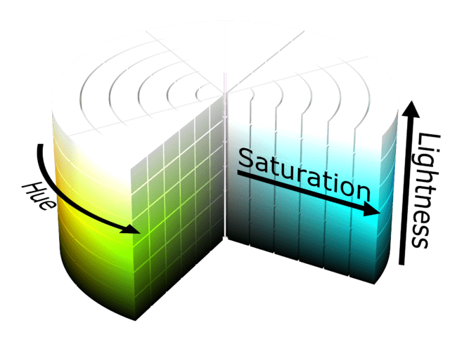
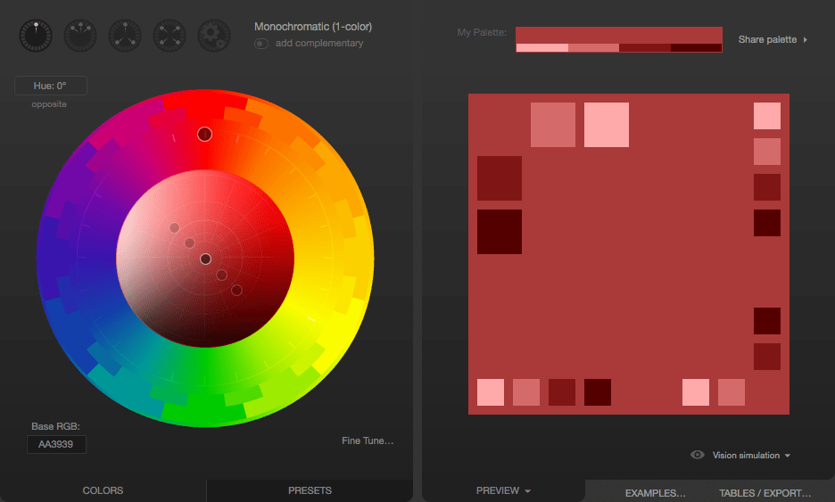
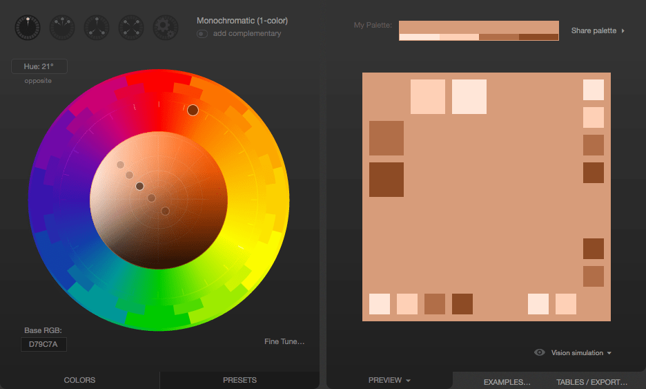
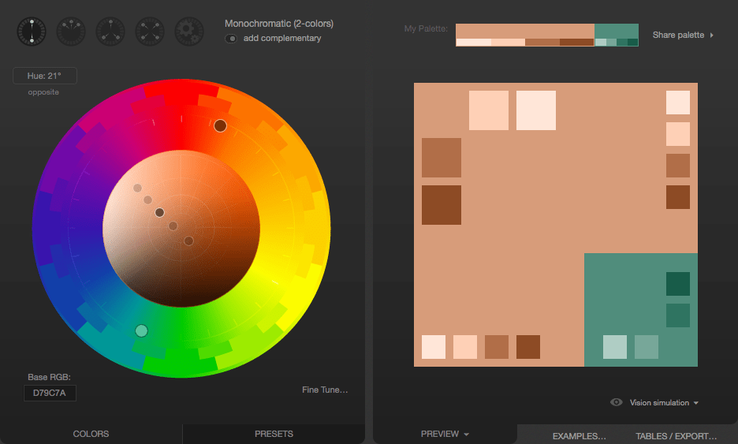
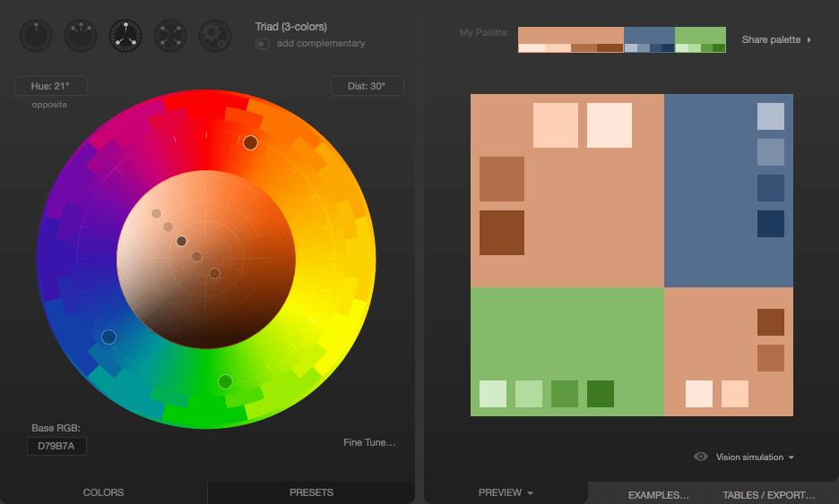
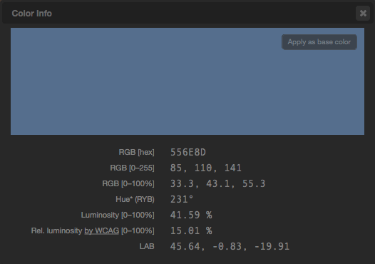

{{CSSRef}}

This article is a primer introducing each of the ways CSS color can be used in HTML.

The use of color is a fundamental form of human expression. Children experiment with color before they even have the manual dexterity to draw. Maybe that's why color is one of the first things people often want to experiment with when learning to develop websites. With [CSS](/en-US/docs/Web/CSS), there are lots of ways to add color to your [HTML](/en-US/docs/Web/HTML) [elements](/en-US/docs/Web/HTML/Element) to create just the look you want.

We're going to touch on most of what you'll need to know when using color, including a [list of what you can color and what CSS properties are involved](#things_that_can_have_color), [how you describe colors](#how_to_describe_a_color), and how to actually [use colors both in stylesheets and in scripts](#using_color). We'll also take a look at how to [let the user pick a color](#letting_the_user_pick_a_color).

Then we'll wrap things up with a brief discussion of how to [use color wisely](#using_color_wisely): how to select appropriate colors, keeping in mind the needs of people with differing visual capabilities.

## Things that can have color

At the element level, everything in HTML can have color applied to it. Instead, let's look at things in terms of the kinds of things that are drawn in the elements, such as text and borders and so forth. For each, we'll see a list of the CSS properties that apply color to them.

At a fundamental level, the {{cssxref("color")}} property defines the foreground color of an HTML element's content and the {{cssxref("background-color")}} property defines the element's background color. These can be used on just about any element.

### Text

Whenever an element is rendered, these properties are used to determine the color of the text, its background, and any decorations on the text.

- {{cssxref("color")}}
  - : The color to use when drawing the text and any [text decorations](/en-US/docs/Learn/CSS/Styling_text/Fundamentals#font_style_font_weight_text_transform_and_text_decoration) (such as the addition of under- or overlines, strike-through lines, and so forth.
- {{cssxref("background-color")}}
  - : The text's background color.
- {{cssxref("text-shadow")}}
  - : Configures a shadow effect to apply to text. Among the options for the shadow is the shadow's base color (which is then blurred and blended with the background based on the other parameters). See [Text drop shadows](/en-US/docs/Learn/CSS/Styling_text/Fundamentals#text_drop_shadows) to learn more.
- {{cssxref("text-decoration-color")}}
  - : By default, text decorations (such as underlines, strikethroughs, etc.) use the `color` property as their colors. However, you can override that behavior and use a different color for them with the `text-decoration-color` property.
- {{cssxref("text-emphasis-color")}}
  - : The color to use when drawing emphasis symbols adjacent to each character in the text. This is used primarily when drawing text for East Asian languages.
- {{cssxref("caret-color")}}
  - : The color to use when drawing the {{Glossary("caret")}} (sometimes referred to as the text input cursor) within the element. This is only useful in elements that are editable, such as {{HTMLElement("input")}} and {{HTMLElement("textarea")}} or elements whose HTML [`contenteditable`](/en-US/docs/Web/HTML/Global_attributes#contenteditable) attribute is set.

### Boxes

Every element is a box with some sort of content, and has a background and a border in addition to whatever contents the box may have.

- [Borders](#borders_2)
  - : See the section [Borders](#borders_2) for a list of the CSS properties you can use to set the colors of a box's borders.
- {{cssxref("background-color")}}
  - : The background color to use in areas of the element that have no foreground content.
- {{cssxref("column-rule-color")}}
  - : The color to use when drawing the line separating columns of text.
- {{cssxref("outline-color")}}
  - : The color to use when drawing an outline around the outside of the element. This outline is different from the border in that it doesn't get space set aside for it in the document (so it may overlap other content). It's generally used as a focus indicator, to show which element will receive input events.

### Borders

Any element can have a [border](/en-US/docs/Learn/CSS/Building_blocks/Backgrounds_and_borders) drawn around it. A basic element border is a line drawn around the edges of the element's content. See [The box model](/en-US/docs/Learn/CSS/Building_blocks/The_box_model) to learn about the relationship between elements and their borders, and the article [Styling borders using CSS](/en-US/docs/Learn/CSS/Building_blocks/Backgrounds_and_borders) to learn more about applying styles to borders.

You can use the {{cssxref("border")}} shorthand property, which lets you configure everything about the border in one shot (including non-color features of borders, such as its [width](/en-US/docs/Web/CSS/border-width), [style](/en-US/docs/Web/CSS/border-style) (solid, dashed, etc.), and so forth.

- {{cssxref("border-color")}}
  - : Specifies a single color to use for every side of the element's border.
- {{cssxref("border-left-color")}}, {{cssxref("border-right-color")}}, {{cssxref("border-top-color")}}, and {{cssxref("border-bottom-color")}}
  - : Lets you set the color of the corresponding side of the element's border.
- {{cssxref("border-block-start-color")}} and {{cssxref("border-block-end-color")}}
  - : With these, you can set the color used to draw the borders which are closest to the start and end of the block the border surrounds. In a left-to-right writing mode (such as the way English is written), the block start border is the top edge and the block end is the bottom. This differs from the inline start and end, which are the left and right edges (corresponding to where each line of text in the box begins and ends).
- {{cssxref("border-inline-start-color")}} and {{cssxref("border-inline-end-color")}}
  - : These let you color the edges of the border closest to the beginning and the end of the start of lines of text within the box. Which side this is will vary depending on the {{cssxref("writing-mode")}}, {{cssxref("direction")}}, and {{cssxref("text-orientation")}} properties, which are typically (but not always) used to adjust text directionality based on the language being displayed. For example, if the box's text is being rendered right-to-left, then the `border-inline-start-color` is applied to the right side of the border.

### Other ways to use color

CSS isn't the only web technology that supports color. There are graphics technologies that are available on the web which also support color.

- The HTML [Canvas API](/en-US/docs/Web/API/Canvas_API)
  - : Lets you draw 2D bitmapped graphics in a {{HTMLElement("canvas")}} element. See our [Canvas tutorial](/en-US/docs/Web/API/Canvas_API/Tutorial) to learn more.
- [SVG](/en-US/docs/Web/SVG) (Scalable Vector Graphics)
  - : Lets you draw images using commands that draw specific shapes, patterns, and lines to produce an image. SVG commands are formatted as XML, and can be embedded directly into a web page or can be placed in the page using the {{HTMLElement("img")}} element, just like any other type of image.
- [WebGL](/en-US/docs/Web/API/WebGL_API)
  - : The Web Graphics Library is an OpenGL ES-based API for drawing high-performance 2D and 3D graphics on the Web. See our [WebGL tutorial](/en-US/docs/Web/API/WebGL_API/Tutorial) to find out more.

## How to describe a color

In order to represent a color in CSS, you have to find a way to translate the analog concept of "color" into a digital form that a computer can use. This is typically done by breaking down the color into components, such as how much of each of a set of primary colors to mix together, or how bright to make the color. As such, there are several ways you can describe color in CSS.

For more detailed discussion of each of the color value types, see the reference for the CSS {{cssxref("&lt;color&gt;")}} unit.

### Keywords

A set of standard color names have been defined, letting you use these keywords instead of numeric representations of colors if you choose to do so and there's a keyword representing the exact color you want to use. Color keywords include the standard primary and secondary colors (such as `red`, `blue`, or `orange`), shades of gray (from `black` to `white`, including colors like `darkgray` and `lightgrey`), and a variety of other blended colors including `lightseagreen`, `cornflowerblue`, and `rebeccapurple`.

See [Named colors](/en-US/docs/Web/CSS/named-color) for more information on color keywords.

### RGB values

There are three ways to represent an RGB color in CSS.

#### Hexadecimal string notation

Hexadecimal string notation represents a color using hexadecimal digits to represent each of the color components (red, green, and blue). It may also include a fourth component: the alpha channel (or opacity). Each color component can be represented as a number between 0 and 255 (0x00 and 0xFF) or, optionally, as a number between 0 and 15 (0x0 and 0xF). All components _must_ be specified using the same number of digits. If you use the single-digit notation, the final color is computed by using each component's digit twice; that is, `"#D"` becomes `"#DD"` when drawing.

A color in hexadecimal string notation always begins with the character `"#"`. After that come the hexadecimal digits of the color code. The string is case-insensitive.

- `"#rrggbb"`
  - : Specifies a fully-opaque color whose red component is the hexadecimal number `0xrr`, green component is `0xgg`, and blue component is `0xbb`.
- `"#rrggbbaa"`
  - : Specifies a color whose red component is the hexadecimal number `0xrr`, green component is `0xgg`, and blue component is `0xbb`. The alpha channel is specified by `0xaa`; the lower this value is, the more translucent the color becomes.
- `"#rgb"`
  - : Specifies a color whose red component is the hexadecimal number `0xrr`, green component is `0xgg`, and blue component is `0xbb`.
- `"#rgba"`
  - : Specifies a color whose red component is the hexadecimal number `0xrr`, green component is `0xgg`, and blue component is `0xbb`. The alpha channel is specified by `0xaa`; the lower this value is, the more translucent the color becomes.

As an example, you can represent the opaque color bright blue as `"#0000ff"` or `"#00f"`. To make it 25% opaque, you can use `"#0000ff44"` or `"#00f4"`.

#### RGB functional notation

RGB (Red/Green/Blue) functional notation, like hexadecimal string notation, represents colors using their red, green, and blue components (as well as, optionally, an alpha channel component for opacity). However, instead of using a string, the color is defined using the CSS function {{cssxref("color_value", "rgb()", "#rgb()")}}. This function accepts as its input parameters the values of the red, green, and blue components and an optional fourth parameter, the value for the alpha channel.

Legal values for each of these parameters are:

- `red`, `green`, and `blue`
  - : Each must be an {{cssxref("&lt;integer&gt;")}} value between 0 and 255 (inclusive), or a {{cssxref("&lt;percentage&gt;")}} from 0% to 100%.
- `alpha`
  - : The alpha channel is a number between 0.0 (fully transparent) and 1.0 (fully opaque). You can also specify a percentage where 0% is the same as 0.0 and 100% is the same as 1.0.

For example, a bright red that's 50% opaque can be represented as `rgb(255, 0, 0, 0.5)` or `rgb(100%, 0, 0, 50%)`.

### HSL functional notation

Designers and artists often prefer to work using the [HSL](https://en.wikipedia.org/wiki/HSL_and_HSV) (Hue/Saturation/Luminosity) color method. On the web, HSL colors are represented using HSL functional notation. The `hsl()` CSS function is very similar to the `rgb()` function in usage otherwise.

The diagram below shows an HSL color cylinder. Hue defines the actual color based on the position along a circular {{glossary("color wheel")}} representing the colors of the visible spectrum. Saturation is a percentage of how much of the way between being a shade of gray and having the maximum possible amount of the given hue. As the value of luminance (or lightness) increases, the color transitions from the darkest possible to the brightest possible (from black to white). Image courtesy of user [SharkD](https://commons.wikimedia.org/wiki/User:SharkD) on [Wikipedia](https://en.wikipedia.org/), distributed under the [CC BY-SA 3.0](https://creativecommons.org/licenses/by-sa/3.0/) license.



The value of the hue (H) component of an HSL color is an angle from red around through yellow, green, cyan, blue, and magenta (ending up back at red again at 360°) that identifies what the base color is. The value can be specified in any {{cssxref("&lt;angle&gt;")}} unit supported by CSS, including degrees (`deg`), radians (`rad`), gradians (`grad`), or turns (`turn`). But this doesn't control how vivid or dull, or how bright or dark the color is.

The saturation (S) component of the color specifies what percentage of the final color is comprised of the specified hue. The rest is defined by the grey level provided by the luminance (L) component.

Think of it like creating the perfect paint color:

1. You start with base paint that's the maximum intensity possible for a given color, such as the most intense blue that can be represented by the user's screen. This is the **hue** (H) component: a value representing the angle around the {{glossary("color wheel")}} for the vivid hue we want to use as our base.
2. Then select a greyscale paint that corresponds how bright you want the color to be; this is the luminance. Do you want it to be very bright and nearly white, or very dark and closer to black, or somewhere in between? This is specified using a percentage, where 0% is perfectly black and 100% is perfectly white (regardless of the saturation or hue). In between values are a literal grey area.
3. Now that you have a grey paint and a perfectly vivid color, you need to mix them together. The saturation (S) component of the color indicates what percentage of the final color should be comprised of that perfectly vivid color. The rest of the final color is made up of the grey paint that represents the saturation.

You can also optionally include an alpha channel, to make the color less than 100% opaque.

Here are some sample colors in HSL notation:

```css hidden
table {
  border: 1px solid black;
  font:
    16px "Open Sans",
    Helvetica,
    Arial,
    sans-serif;
  border-spacing: 0;
  border-collapse: collapse;
}

th,
td {
  border: 1px solid black;
  padding: 4px 6px;
  text-align: left;
}

th {
  background-color: hsl(0, 0%, 75%);
}
```

```html
<table>
  <thead>
    <tr>
      <th scope="col">Color in HSL notation</th>
      <th scope="col">Example</th>
    </tr>
  </thead>
  <tbody>
    <tr>
      <td><code>hsl(90deg, 100%, 50%)</code></td>
      <td style="background-color: hsl(90deg, 100%, 50%);">&nbsp;</td>
    </tr>
    <tr>
      <td><code>hsl(90, 100%, 50%)</code></td>
      <td style="background-color: hsl(90, 100%, 50%);">&nbsp;</td>
    </tr>
    <tr>
      <td><code>hsl(0.15turn, 50%, 75%)</code></td>
      <td style="background-color: hsl(0.15turn, 50%, 75%);">&nbsp;</td>
    </tr>
    <tr>
      <td><code>hsl(0.15turn, 90%, 75%)</code></td>
      <td style="background-color: hsl(0.15turn, 90%, 75%);">&nbsp;</td>
    </tr>
    <tr>
      <td><code>hsl(0.15turn, 90%, 50%)</code></td>
      <td style="background-color: hsl(0.15turn, 90%, 50%);">&nbsp;</td>
    </tr>
    <tr>
      <td><code>hsl(270deg, 90%, 50%)</code></td>
      <td style="background-color: hsl(270deg, 90%, 50%);">&nbsp;</td>
    </tr>
  </tbody>
</table>
```

{{EmbedLiveSample("HSL_functional_notation", 300, 260)}}

> **Note:** When you omit the hue's unit, it's assumed to be in degrees (`deg`).

### HWB functional notation

Much like the HSL functional notation above, the [hwb()](/en-US/docs/Web/CSS/color_value/hwb) function uses the same hue value. But instead of lightness and saturation you specify whiteness and blackness values in percentages. Values are **not** separated with a comma and an optional alpha value can be included (it must be preceded by a forward slash `/`).

Here are some examples of using HWB notation:

```css
/* These examples all specify varying shades of a lime green. */
hwb(90 10% 10%)
hwb(90 10% 10%)
hwb(90 50% 10%)
hwb(90deg 10% 10%)
hwb(1.5708rad 60% 0%)
hwb(.25turn 0% 40%)

/* Same lime green but with an alpha value */
hwb(90 10% 10% / 0.5)
hwb(90 10% 10% / 50%)
```

## Using color

Now that you know what CSS properties exist that let you apply color to elements and the formats you can use to describe colors, you can put this together to begin to make use of color. As you may have seen from the list under [Things that can have color](#things_that_can_have_color), there are plenty of things you can color with CSS. Let's look at this from two sides: using color within a {{Glossary("stylesheet")}}, and adding and changing color using {{Glossary("JavaScript")}} code to alter the styles of elements.

### Specifying colors in stylesheets

The easiest way to apply color to elements—and the way you'll usually do it—is to specify colors in the CSS that's used when rendering elements. While we won't use every single property mentioned previously, we'll look at a couple of examples. The concept is the same anywhere you use color.

Let's take a look at an example, starting by looking at the results we're trying to achieve:

{{EmbedLiveSample("Specifying_colors_in_stylesheets", 650, 150)}}

#### HTML

The HTML responsible for creating the above example is shown here:

```html
<div class="wrapper">
  <div class="box boxLeft">
    <p>This is the first box.</p>
  </div>
  <div class="box boxRight">
    <p>This is the second box.</p>
  </div>
</div>
```

This is pretty simple, using a {{HTMLElement("div")}} as a wrapper around the contents, which consists of two more `<div>`s, each styled differently with a single paragraph ({{HTMLElement("p")}}) in each box.

The magic happens, as usual, in the CSS, where we'll apply colors and define the layout for the HTML above.

#### CSS

We'll look at the CSS to create the above results a piece at a time, so we can review the interesting parts one by one.

```css
.wrapper {
  width: 620px;
  height: 110px;
  margin: 0;
  padding: 10px;
  border: 6px solid mediumturquoise;
}
```

The `.wrapper` class is used to assign styles to the {{HTMLElement("div")}} that encloses all of our other content. This establishes the size of the container using {{cssxref("width")}} and {{cssxref("height")}} as well as its {{cssxref("margin")}} and {{cssxref("padding")}}.

Of more interest to our discussion here is the use of the {{cssxref("border")}} property to establish a border around the outside edge of the element. This border is a solid line, 6 pixels wide, in the color `mediumturquoise`.

Our two colored boxes share a number of properties in common, so next we establish a class, `.box`, that defines those shared properties:

```css
.box {
  width: 290px;
  height: 100px;
  margin: 0;
  padding: 4px 6px;
  font:
    28px "Marker Felt",
    "Zapfino",
    cursive;
  display: flex;
  justify-content: center;
  align-items: center;
}
```

In brief, `.box` establishes the size of each box, as well as the configuration of the font used within. We also take advantage of [CSS Flexbox](/en-US/docs/Web/CSS/CSS_flexible_box_layout) to easily center the contents of each box. We enable `flex` mode using {{cssxref("display", "display: flex")}}, and set both {{cssxref("justify-content")}} and {{cssxref("align-items")}} to `center`. Then we can create a class for each of the two boxes that defines the properties that differ between the two.

```css
.boxLeft {
  float: left;
  background-color: rgb(245, 130, 130);
  outline: 2px solid darkred;
}
```

The `.boxLeft` class—which, cleverly, is used to style the box on the left—floats the box to the left, then sets up the colors:

- The box's background color is set by changing the value of the CSS {{cssxref("background-color")}} property to `rgb(245, 130, 130)`.
- An outline is defined for the box. Unlike the more commonly used `border`, {{cssxref("outline")}} doesn't affect layout at all; it draws over the top of whatever may happen to be outside the element's box instead of making room as `border` does. This outline is a solid, dark red line that's two pixels thick. Note the use of the `darkred` keyword when specifying the color.
- Notice that we're not explicitly setting the text color. That means the value of {{cssxref("color")}} will be inherited from the nearest containing element that defines it. By default, that's black.

```css
.boxRight {
  float: right;
  background-color: hsl(270deg, 50%, 75%);
  outline: 4px dashed rgb(110, 20, 120);
  color: hsl(0deg, 100%, 100%);
  text-decoration: underline wavy #88ff88;
  text-shadow: 2px 2px 3px black;
}
```

> **Note:** When you try to show it in Safari, it will not show properly. Because Safari doesn't support `text-decoration: underline wavy #88ff88`.

Finally, the `.boxRight` class describes the unique properties of the box that's drawn on the right. It's configured to float the box to the right so that it appears next to the previous box. Then the following colors are established:

- The `background-color` is set using the HSL value specified using `hsl(270deg, 50%, 75%)`. This is a medium purple color.
- The box's `outline` is used to specify that the box should be enclosed in a four pixel thick dashed line whose color is a somewhat deeper purple (`rgb(110, 20, 120)`).
- The foreground (text) color is specified by setting the {{cssxref("color")}} property to `hsl(0deg, 100%, 100%)`. This is one of many ways to specify the color white.
- We add a green wavy line under the text with {{cssxref("text-decoration")}}.
- Finally, a bit of a shadow is added to the text using {{cssxref("text-shadow")}}. Its `color` parameter is set to `black`.

## Letting the user pick a color

There are many situations in which your website may need to let the user select a color. Perhaps you have a customizable user interface, or you're implementing a drawing app. Maybe you have editable text and need to let the user choose the text color. Or perhaps your app lets the user assign colors to folders or items. Although historically it's been necessary to implement your own [color picker](https://en.wikipedia.org/wiki/Color_picker), HTML now provides support for browsers to provide one for your use through the {{HTMLElement("input")}} element, by using `"color"` as the value of its [`type`](/en-US/docs/Web/HTML/Element/input#type) attribute.

The `<input>` element represents a color only in the [hexadecimal string notation](#hexadecimal_string_notation) covered above.

### Example: Picking a color

Let's look at a simple example, in which the user can choose a color. As the user adjusts the color, the border around the example changes to reflect the new color. After finishing up and picking the final color, the color picker's value is displayed.

{{EmbedLiveSample("Example_Picking_a_color", 525, 275)}}

> **Note:** On macOS, you indicate that you've finalized selection of the color by closing the color picker window.

#### HTML

The HTML here creates a box that contains a color picker control (with a label created using the {{HTMLElement("label")}} element) and an empty paragraph element ({{HTMLElement("p")}}) into which we'll output some text from our JavaScript code.

```html
<div id="box">
  <label for="colorPicker">Border color:</label>
  <input type="color" value="#8888ff" id="colorPicker" />
  <p id="output"></p>
</div>
```

#### CSS

The CSS establishes a size for the box and some basic styling for appearances. The border is also established with a 2-pixel width and a border color.

```css
#box {
  width: 500px;
  height: 200px;
  border: 2px solid rgb(245, 220, 225);
  padding: 4px 6px;
  font:
    16px "Lucida Grande",
    "Helvetica",
    "Arial",
    "sans-serif";
}
```

#### JavaScript

The script here handles the task of updating the starting color of the border to match the color picker's value. Then two event handlers are added to deal with input from the [`<input type="color">`](/en-US/docs/Web/HTML/Element/input/color) element.

```js
const colorPicker = document.getElementById("colorPicker");
const box = document.getElementById("box");
const output = document.getElementById("output");

box.style.borderColor = colorPicker.value;

colorPicker.addEventListener(
  "input",
  (event) => {
    box.style.borderColor = event.target.value;
  },
  false,
);

colorPicker.addEventListener(
  "change",
  (event) => {
    output.innerText = `Color set to ${colorPicker.value}.`;
  },
  false,
);
```

The {{domxref("HTMLElement/input_event", "input")}} event is sent every time the value of the element changes; that is, every time the user adjusts the color in the color picker. Each time this event arrives, we set the box's border color to match the color picker's current value.

The {{domxref("HTMLElement/change_event", "change")}} event is received when the color picker's value is finalized. We respond by setting the contents of the `<p>` element with the ID `"output"` to a string describing the finally selected color.

## Using color wisely

Making the right choices when selecting colors when designing a website can be a tricky process, especially if you aren't well-grounded in art, design, or at least basic color theory. The wrong color choice can render your site unattractive, or even worse, leave the content unreadable due to problems with contrast or conflicting colors. Worse still, if using the wrong colors can result in your content being outright unusable by people with certain vision problems, particularly color blindness.

### Finding the right colors

Coming up with just the right colors can be tricky, especially without training in art or design. Fortunately, there are tools available that can help you. While they can't replace having a good designer helping you make these decisions, they can definitely get you started.

#### Base color

The first step is to choose your **base color**. This is the color that in some way defines your website or the subject matter of the site. Just as we associate green with the beverage [Mountain Dew](https://en.wikipedia.org/wiki/Mountain_Dew) and one might think of the color blue in relationship with the sky or the ocean, choosing an appropriate base color to represent your site is a good place to start. There are plenty of ways to select a base color; a few ideas include:

- A color that is naturally associated with the topic of your content, such as the existing color identified with a product or idea or a color representative of the emotion you wish to convey.
- A color that comes from imagery associated with what your content is about. If you're creating a website about a given item or product, choose a color that's physically present on that item.
- Browse websites that let you look at lots of existing color palettes and images to find inspiration.

When trying to decide upon a base color, you may find that browser extensions that let you select colors from web content can be particularly handy. Some of these are even specifically designed to help with this sort of work. For example, the website [ColorZilla](https://www.colorzilla.com/) offers an extension ([Chrome](https://www.colorzilla.com/chrome/) / [Firefox](https://www.colorzilla.com/firefox/)) that offers an eyedropper tool for picking colors from the web. It can also take averages of the colors of pixels in various sized areas or even a selected area of the page.

> **Note:** The advantage to averaging colors can be that often what looks like a solid color is actually a surprisingly varied number of related colors all used in concert, blending to create a desired effect. Picking just one of these pixels can result in getting a color that on its own looks very out of place.

#### Fleshing out the palette

Once you have decided on your base color, there are plenty of online tools that can help you build out a palette of appropriate colors to use along with your base color by applying color theory to your base color to determine appropriate added colors. Many of these tools also support viewing the colors filtered so you can see what they would look like to people with various forms of color blindness. See [Color and accessibility](#color_and_accessibility) for a brief explanation of why this matters.

A few examples (all free to use as of the time this list was last revised):

- [MDN's color picker tool](/en-US/docs/Web/CSS/CSS_colors/Color_picker_tool)
- [Paletton](https://paletton.com/)
- [Adobe Color CC online color wheel](https://color.adobe.com/create/color-wheel)

When designing your palette, be sure to keep in mind that in addition to the colors these tools typically generate, you'll probably also need to add some core neutral colors such as white (or nearly white), black (or nearly black), and some number of shades of gray.

> **Note:** Usually, you are far better off using the smallest number of colors possible. By using color to accentuate rather than adding color to everything on the page, you keep your content easy to read and the colors you do use have far more impact.

### Color theory resources

A full review of color theory is beyond the scope of this article, but there are plenty of articles about color theory available, as well as courses you can find at nearby schools and universities. A couple of useful resources about color theory:

- [Color Science](https://www.khanacademy.org/computing/pixar/color) ([Khan Academy](https://www.khanacademy.org/) in association with [Pixar](https://www.pixar.com/))
  - : An online course which introduces concepts such as what color is, how it's perceived, and how to use colors to express ideas. Presented by Pixar artists and designers.
- [Color theory](https://en.wikipedia.org/wiki/Color_theory) on Wikipedia
  - : Wikipedia's entry on color theory, which has a lot of great information from a technical perspective. It's not really a resource for helping you with the color selection process, but is still full of useful information.

### Color and accessibility

There are several ways color can be an {{Glossary("accessibility")}} problem. Improper or careless use of color can result in a website or app that a percentage of your target audience may not be able to use adequately, resulting in lost traffic, lost business, and possibly even a public relations problem. So it's important to consider your use of color carefully.

You should do at least basic research into [color blindness](https://en.wikipedia.org/wiki/Color_blindness). There are several kinds; the most common is red-green color blindness, which causes people to be unable to differentiate between the colors red and green. There are others, too, ranging from inabilities to tell the difference between certain colors to total inability to see color at all.

> **Note:** The most important rule: never use color as the only way to know something. If, for example, you indicate success or failure of an operation by changing the color of a shape from white to green for success and red for failure, users with red-green color-blindness won't be able to use your site properly. Instead, perhaps use both text and color together, so that everyone can understand what's happening.

For more information about color blindness, see the following articles:

- [Medline Plus: Color Blindness](https://medlineplus.gov/colorblindness.html) (United States National Institute of Health)
- [American Academy of Ophthalmology: What Is Color Blindness?](https://www.aao.org/eye-health/diseases/what-is-color-blindness)
- [Color Blindness & Web Design](https://www.usability.gov/get-involved/blog/2010/02/color-blindness.html) (Usability.gov: United States Department of Health and Human Services)

### Palette design example

Let's consider a quick example of selecting an appropriate color palette for a site. Imagine that you're building a website for a new game that takes place on the planet Mars. So let's do a [Google search for photos of Mars](https://www.google.com/search?q=Mars&tbm=isch). Lots of good examples of Martian coloration there. We carefully avoid the mockups and the photos from movies. And we decide to use a photo taken by one of the Mars landers humanity has parked on the surface over the last few decades, since the game takes place on the planet's surface. We use a color picker tool to select a sample of the color we choose.

Using an eyedropper tool, we identify a color we like and determine that the color in question is `#D79C7A`, which is an appropriate rusty orange-red color that's so stereotypical of the Martian surface.

Having selected our base color, we need to build out our palette. We decide to use [Paletton](https://www.paletton.com/) to come up with the other colors we need. Upon opening Paletton, we see:



Next, we enter our color's hex code (`D79C7A`) into the "Base RGB" box at the bottom-left corner of the tool:



We now see a monochromatic palette based on the color we picked from the Mars photo. If you need a lot of related colors for some reason, those are likely to be good ones. But what we really want is an accent color. Something that will pop along side the base color. To find that, we click the "add complementary" toggle underneath the menu that lets you select the palette type (currently "Monochromatic"). Paletton computes an appropriate accent color; clicking on the accent color down in the bottom-right corner tells us that this color is `#508D7C`.



If you're unhappy with the color that's proposed to you, you can change the color scheme, to see if you find something you like better. For example, if we don't like the proposed greenish-blue color, we can click the Triad color scheme icon, which presents us with the following:



That greyish blue in the top-right looks pretty good. Clicking on it, we find that it's `#556E8D`. That would be used as the accent color, to be used sparingly to make things stand out, such as in headlines or in the highlighting of tabs or other indicators on the site:



Now we have our base color and our accent. On top of that, we have a few complementary shades of each, just in case we need them for gradients and the like. The colors can then be exported in a number of formats so you can make use of them.

Once you have these colors, you will probably still need to select appropriate neutral colors. Common design practice is to try to find the sweet spot where there's just enough contrast that the text is crisp and readable but not enough contrast to become harsh for the eyes. It's easy to go too far in one way or another so be sure to get feedback on your colors once you've selected them and have examples of them in use available. If the contrast is too low, your text will tend to be washed out by the background, leaving it unreadable, but if your contrast is too high, the user may find your site garish and unpleasant to look at.

### Color, backgrounds, contrast, and printing

What looks good on screen may look very different on paper.
In addition, ink can be expensive, and if a user is printing your page, they don't necessarily need all the backgrounds and such using up their precious ink when all that matters is the text itself.
Most browsers, by default, remove background images when printing documents.

If your background colors and images have been selected carefully and/or are crucial to the usefulness of the content, you can use the CSS {{cssxref("print-color-adjust")}} property to tell the browser that it should not make adjustments to the appearance of content.

The default value of `print-color-adjust`, `economy`, indicates that the browser is allowed to make appearance changes as it deems necessary in order to try to optimize the legibility and/or print economy of the content, given the type of output device the document is being drawn onto.

You can set `print-color-adjust` to `exact` to tell the browser that the element or elements on which you use it have been designed specifically to best work with the colors and images left as they are.
With this set, the browser won't tamper with the appearance of the element, and will draw it as indicated by your CSS.

> **Note:** There is no guarantee, though, that `print-color-adjust: exact` will result in your CSS being used exactly as given.
> If the browser provides user preferences to change the output (such as a "don't print backgrounds" checkbox in a print dialog box), that overrides the value of `print-color-adjust`.

## See also

- [Drawing graphics](/en-US/docs/Learn/JavaScript/Client-side_web_APIs/Drawing_graphics)
- [Graphics on the web](/en-US/docs/Web/Guide/Graphics)
- [MDN's color picker tool](/en-US/docs/Web/CSS/CSS_colors/Color_picker_tool)
