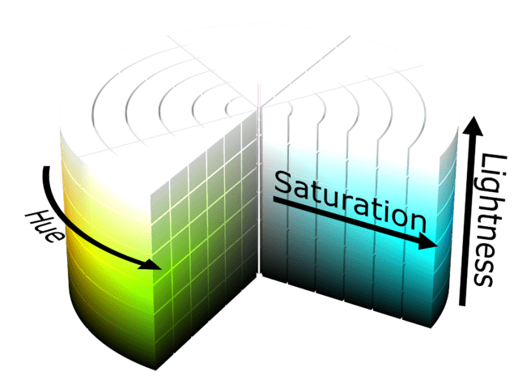

{{CSSRef}}

To represent a color in CSS, you have to find a way to translate the analog concept of "color" into a digital form that a computer can use. This is typically done by breaking the color down into components, such as amounts of different primary colors to mix together, or brightness and hue. Defined color models ensure that colors will appear the same no matter where they are rendered.

A color model is a mathematical model that represents colors using numeric values. Color models describe how to create the available colors within a color space. {{glossary("RGB")}} was the first color model for the web. The `sRGB` color space of the RGB color model — the standard red, green, and blue color space — was created in 1996 for computer monitors and the web. A {{glossary("color space")}} is a system for grouping colors so that describing any given color is consistent. If you transform a color between two different color spaces, it should look identical in both.

Originally, monitors were limited regarding how many colors they could render, and CSS colors were limited by those constraints, expanding as capabilities improved. With modern devices no longer limited to RGB, we now also have color models based on human perception instead, providing a much wider {{glossary("gamut")}} of colors. We can now describe color in CSS in several ways, and the options keep expanding.

This guide introduces the different {{cssxref("&lt;color&gt;")}} value types. For a more detailed discussion, see the reference links provided below.

## Keywords

The web defines a set of standard color names that lets you use keywords instead of numeric representations to describe colors. This is a simpler albeit more limited approach — there may not be a keyword representing the exact color you want to use.

Color keywords include standard primary and secondary colors (such as `red`, `blue`, or `orange`), shades of gray (from `black` to `white`, including colors like `darkgray` and `lightgrey`), and a variety of other blended colors, including `lightseagreen`, `cornflowerblue`, and `rebeccapurple`. Named colors use the [RGB](/en-US/docs/Glossary/RGB) model and are associated with the sRGB (`srgb`) color space.

There are over 160 named colors. There are named colors of special interest: [`transparent`](/en-US/docs/Web/CSS/named-color#transparent) sets a transparent color value, while [`currentcolor`](/en-US/docs/Web/CSS/color_value#currentcolor_keyword) sets the current value of the CSS {{cssxref("color")}} property. There are also named {{cssxref("system-color")}} colors, such as `accentcolortext` and `buttonface`, that reflect the default color choices made by the user, the browser, or the operating system.

All color keywords are case-insensitive. See the {{cssxref("named-color")}} data type for more information on color keywords.

## RGB values

There are two primary ways of defining an {{glossary("RGB")}} color by its red, green, and blue components in CSS — hexadecimal and `rgb()` values. Like named colors, these methods use the [RGB](/en-US/docs/Glossary/RGB) model and are associated with the sRGB (`srgb`) color space. However, they allow a much wider range of colors to be specified.

### Hexadecimal string notation

Hexadecimal (hex) string notation uses a hexadecimal value to represent each component (red, green, and blue) of an RGB color. It may also include a fourth component: the alpha channel (or opacity).

A color in hexadecimal string notation always begins with the character `"#"`. After that comes the hexadecimal digits of the color code. The string is case-insensitive.

- `"#rrggbb"`

  - : Specifies a fully opaque color whose red component is the hexadecimal number `0xrr`, green component is `0xgg`, and blue component is `0xbb`.

- `"#rrggbbaa"`

  - : Specifies a color whose red component is the hexadecimal number `0xrr`, green component is `0xgg`, and blue component is `0xbb`. The alpha channel is specified by `0xaa`; the lower this value is, the more translucent the color becomes.

- `"#rgb"`

  - : Specifies a color whose red component is the hexadecimal number `0xrr`, green component is `0xgg`, and blue component is `0xbb`.

- `"#rgba"`

  - : Specifies a color whose red component is the hexadecimal number `0xrr`, green component is `0xgg`, and blue component is `0xbb`. The alpha channel is specified by `0xaa`; the lower this value is, the more translucent the color becomes.

As shown above, the red, green, and blue color components can each be represented as a double-digit hex value representing a number between 0 (`00`) and 255 (`FF`) or a single-digit hex value (a number between 0 (`0`) and 15 (`F`).

> **Note:** The leading `0x` in the values above indicates a hexadecimal integer literal. Hexadecimal integers can include digits (`0` - `9`) and the letters `a` – `f` and `A` – `F`. The case of a character does not change its value. Therefore: `0xa` = `0xA` = `10` and `0xf` = `0xF` = `15`.

These two hex colors are equivalent color values; they're both red:

```css
color: #ff0000;
color: #f00;
```

All components _must_ be specified using the same number of digits. If you use the single-digit notation, the final color is computed by using each component's digit twice; that is, `"#D"` becomes `"#DD"` when drawing.

To make the values 25% opaque, add in the alpha channel value as shown below:

```css
color: #ff000044;
color: #f004;
```

See the {{cssxref("hex-color")}} data type for more information on hexadecimal string notation for colors.

#### HTML color input type

There are many situations in which your website may need to let the user select a color. Perhaps you have a customizable user interface, or you're implementing a drawing app. Maybe you have editable text and need to let the user choose the text color. Or perhaps your app lets the user assign colors to folders or items. For such use cases, the {{HTMLElement("input")}} element has a `"color"` [`type`](/en-US/docs/Web/HTML/Element/input#type), which renders a color picker control.

This example allows you to choose a color. Once a choice is made, the {{cssxref("border-color")}} is set to that color, and the value is displayed.

```html
<div id="box">
  <label for="colorPicker">Border color:</label>
  <input type="color" value="#8888ff" id="colorPicker" />
  <output></output>
</div>
```

The HTML creates a box containing a color picker control (with a label created using the {{HTMLElement("label")}} element) and an empty {{HTMLElement("output")}} element into which we'll output the color's value using JavaScript. The color input's value is always a hexadecimal string.

{{EmbedLiveSample("HTML color input type", 525, 120)}}

```css hidden
#box {
  width: 500px;
  height: 100px;
  border: 5px solid rgb(245 220 225);
  padding: 4px 6px;
  font:
    16px "Lucida Grande",
    "Helvetica",
    "Arial",
    "sans-serif";
}
```

The following JavaScript updates the border's color to match the color picker's initial value, then adds two event handlers to the [`<input type="color">`](/en-US/docs/Web/HTML/Element/input/color) element to respond to changes made to its value.

```js
const colorPicker = document.querySelector("#colorPicker");
const box = document.querySelector("#box");
const output = document.querySelector("output");

box.style.borderColor = colorPicker.value;

colorPicker.addEventListener(
  "input",
  (event) => {
    box.style.borderColor = event.target.value;
  },
  false,
);

colorPicker.addEventListener(
  "change",
  (event) => {
    output.innerText = `${colorPicker.value}`;
  },
  false,
);
```

The {{domxref("Element/input_event", "input")}} event is sent every time the value of the element changes; that is, every time the user adjusts the color in the color picker. Each time this event arrives, we set the box's border color to match the color picker's current value.

The {{domxref("HTMLElement/change_event", "change")}} event is received when the color picker's value is finalized. We respond by setting the contents of the `<output>` to the string value of the selected color.

### RGB functional notation

RGB (Red/Green/Blue) functional notation, like hexadecimal string notation, represents colors using their red, green, and blue components (and, optionally, an alpha channel component for opacity). However, instead of using a string, the color is defined using the CSS function {{cssxref("color_value/rgb", "rgb()")}}. This function accepts 3 or 4 input parameters — red, green, and blue component values and an optional alpha channel value.

Legal values for each of these parameters are:

- `red`, `green`, and `blue`

  - : Each must be an {{cssxref("&lt;number&gt;")}} value between 0 and 255 (inclusive), a {{cssxref("&lt;percentage&gt;")}} from 0% to 100%, or the keyword `none`, which is equal to `0` in this case.

- `alpha`

  - : The alpha channel is specified as a percentage between `0%` (fully transparent) and `100%` (fully opaque), or a number between `0.0` (equivalent to `0%`) and `1.0` (equivalent to `100%`).

For example, a bright red that's 50% opaque can be represented as `rgb(255 0 0 / 50%)` or `rgb(100% 0 0 / 0.5)`.

See the {{cssxref("color_value/rgb", "rgb()")}} color function for more information on the RGB functional notation.

## Color functions with a hue component

The color functions that have a [`<hue>`](/en-US/docs/Web/CSS/hue) component — an [`<angle>`](/en-US/docs/Web/CSS/angle) from that color model's {{glossary("color wheel")}} — include the `srgb` color functions `hsl()` and `hwb()`, CIElab's `lch()` function, and OKLab's `oklch()` color function. These color functions are more intuitive as the hue allows us to tell the difference or similarity between colors like red, orange, yellow, green, blue, etc.

### HSL functional notation

The `hsl()` CSS color function was the first hue-based color function to be supported in browsers. `hsl()` is more intuitive than `rgb()` — it is easier to determine the effect of varying hue (`h`), saturation (`s`), and lightness (`l`) values than it is to declare specific colors via red, green, and blue channel values. In addition, HSL is similar to the HSB (hue, saturation, and brightness) color picker in Photoshop, which made it immediately familiar to many people when first supported.

The `hsl()` and `hwb()` sRGB color functions are both cylindrical. Hue defines the color as an [`<angle>`](/en-US/docs/Web/CSS/angle) on a circular {{glossary("color wheel")}}. The diagram below shows an HSL color cylinder. Saturation is a percentage that defines how far the color is along a scale between completely grayscale and having the maximum possible amount of the given hue.
As the value of lightness increases, the color transitions from the darkest to the lightest possible color (from black to white).



Image courtesy of user [SharkD](https://commons.wikimedia.org/wiki/User:SharkD) on [Wikipedia](https://en.wikipedia.org/), distributed under the [CC BY-SA 3.0](https://creativecommons.org/licenses/by-sa/3.0/) license.

The value of the hue (`H`) component of an HSL (or HWB) color is an angle that starts at 0° as red, then moves through yellow, green, cyan, blue, and magenta, before ending up back at red again at 360°. The value can be specified in any {{cssxref("&lt;angle&gt;")}} unit supported by CSS, including degrees (`deg`), radians (`rad`), gradians (`grad`), or turns (`turn`). The hue value identifies what the base shade of the color is, but it doesn't control how vivid or dull, or how light or dark the color is.

The saturation (`S`) component of the color specifies the percentage of the final color comprised of the specified hue, with 100% being fully saturated and 0% being a complete lack of color (greyscale). The lightness (`L`) component specifies how light the color is along a sliding scale between completely black (`0%`) and completely white (`100%`). You can also optionally include an alpha channel, preceded by a slash (`/`) to make the color less than 100% opaque.

Here are some sample colors in HSL notation:

```css hidden
table {
  border: 1px solid black;
  font:
    16px "Open Sans",
    Helvetica,
    Arial,
    sans-serif;
  border-spacing: 0;
  border-collapse: collapse;
}

th,
td {
  border: 1px solid black;
  padding: 4px 6px;
  text-align: left;
}

th {
  background-color: hsl(0 0% 75%);
}
```

```html
<table>
  <thead>
    <tr>
      <th scope="col">Color in HSL notation</th>
      <th scope="col">Example</th>
    </tr>
  </thead>
  <tbody>
    <tr>
      <td><code>hsl(90deg 0% 50%)</code></td>
      <td style="background-color: hsl(90deg 0% 50%);">&nbsp;</td>
    </tr>
    <tr>
      <td><code>hsl(90 100% 50%)</code></td>
      <td style="background-color: hsl(90 100% 50%);">&nbsp;</td>
    </tr>
    <tr>
      <td><code>hsl(0.15turn 50% 75%)</code></td>
      <td style="background-color: hsl(0.15turn 50% 75%);">&nbsp;</td>
    </tr>
    <tr>
      <td><code>hsl(0.15turn 90% 75%)</code></td>
      <td style="background-color: hsl(0.15turn 90% 75%);">&nbsp;</td>
    </tr>
    <tr>
      <td><code>hsl(0.15turn 90% 50%)</code></td>
      <td style="background-color: hsl(0.15turn 90% 50%);">&nbsp;</td>
    </tr>
    <tr>
      <td><code>hsl(270deg 90% 50% / 50%)</code></td>
      <td style="background-color: hsl(270deg 90% 50% / 50%);">&nbsp;</td>
    </tr>
  </tbody>
</table>
```

{{EmbedLiveSample("HSL_functional_notation", 300, 200)}}

The last value is semi-opaque; it includes the optional alpha value, preceded by a forward slash.

> **Note:** When you omit the hue's unit, it's assumed to be in degrees (`deg`).

### HWB functional notation

The [`hwb()`](/en-US/docs/Web/CSS/color_value/hwb) color function uses the same hue coordinate system as `hsl()`, with `0deg` being red. However, instead of `hsl()`'s lightness and saturation, `hwb()` functions specify whiteness (`W`) and blackness (`B`). This function is also fairly intuitive — allowing you to pick a hue and then mix in amounts of white and or black to achieve the desired color.

`W` and `B` values range from `0%` to `100%` (or `0` to `1`). If the combined value of `W` and `B` is 100% (or `1`) or greater, the color will be grey, similar to setting the `s` to `0%` with `hsl()`. As with `hsl()`, an optional alpha value can be included, preceded by a forward slash `/`.

Here are some examples of using HWB notation:

```css
/* These examples all specify varying shades of a lime green. */
hwb(90 10% 10%)
hwb(90 50% 10%)
hwb(90deg 10% 10%)
hwb(1.5708rad 60% 0%)
hwb(.25turn 0% 40%)

/* Same lime green but with an alpha value */
hwb(90 10% 10% / 0.5)
hwb(90 10% 10% / 50%)
```

In the below examples, we set the same hues as in the `hsl()` examples, but we are adding whiteness and blackness to each hue via `hwb()` instead of saturation and lightness:

```css hidden
{/*end the bad selector*/}
table {
  border: 1px solid black;
  font:
    16px "Open Sans",
    Helvetica,
    Arial,
    sans-serif;
  border-spacing: 0;
  border-collapse: collapse;
}

th,
td {
  border: 1px solid black;
  padding: 4px 6px;
  text-align: left;
}

th {
  background-color: hwb(0 75% 25%);
}
```

```html
<table>
  <thead>
    <tr>
      <th scope="col">Color in HWB notation</th>
      <th scope="col">Example</th>
    </tr>
  </thead>
  <tbody>
    <tr>
      <td><code>hwb(90deg 50% 50%)</code></td>
      <td style="background-color: hwb(90deg 50% 50%);">&nbsp;</td>
    </tr>
    <tr>
      <td><code>hwb(90 0% 0%)</code></td>
      <td style="background-color: hwb(90 0% 0%);">&nbsp;</td>
    </tr>
    <tr>
      <td><code>hwb(0.15turn 25% 0%)</code></td>
      <td style="background-color: hwb(0.15turn 25% 0%);">&nbsp;</td>
    </tr>
    <tr>
      <td><code>hwb(0.15turn 10% 25%)</code></td>
      <td style="background-color: hwb(0.15turn 10% 25%);">&nbsp;</td>
    </tr>
    <tr>
      <td><code>hwb(1turn 10% 65%)</code></td>
      <td style="background-color: hwb(1turn 10% 65%);">&nbsp;</td>
    </tr>
    <tr>
      <td><code>hwb(270deg 75% 10%)</code></td>
      <td style="background-color: hwb(270deg 75% 10%);">&nbsp;</td>
    </tr>
  </tbody>
</table>
```

{{EmbedLiveSample("HWB_functional_notation", 300, 200)}}

### LCH and OKLCH: CIELAB and Oklab color spaces

While `hsl()` and `hwb()` are intuitive, they have a major drawback. With these functions, every fully-saturated hue angle (`hsl(<angle> 100% 50%)` or `hwb(<angle> 0% 0%)`) has the same lightess, but that is not how human vision or monitors work. Putting white text on fully saturated blue (`hsl(240deg 100% 50%)`) is legible, but that same text on fully saturated yellow (`hsl(60deg 100% 50%)`) will not only be illegible, but may hurt your user's eyes. In these color functions, the lightness of a color is relative to other colors, not to human perception. In reality, not all hues have the same max saturation.

Wouldn't it be fantastic if you could simply change the hue channel of a color on a site without making text illegible? You can with color functions in the CIELAB and Oklab color spaces.

The CIELAB and Oklab color spaces represent the entire range of colors that humans can see. CIE lab color functions include [`lch()`](/en-US/docs/Web/CSS/color_value/lch) and [`lab()`](/en-US/docs/Web/CSS/color_value/lab). Oklab color functions include [`oklch()`](/en-US/docs/Web/CSS/color_value/oklch) and [`oklab()`](/en-US/docs/Web/CSS/color_value/oklab). The primary purpose of these models is that they are uniform so that a given distance between any two points in the color space should appear equally different to a viewer. Oklab is a color space that uses the same model type as CIELAB but is built using additional numerical optimization steps, so the values are considered more accurate than CIELAB. Because of this optimization, hues are more perceptually uniform.

The `lch()` and `oklch()` functions use lightness (`L`), chroma (`C`), and hue (`H`), and are discussed further in this section. The [`lab()` and `oklab()`](#lab_and_oklab) functions work differently, using lightness (`L`), red/green-ness (along the `a`-axis), and yellow/blue-ness (along the `b`-axis). These axes are referred to as rectangular coordinates. The main benefit of these color functions is that the "lightness" is perceived lightness; it is the brightness of a color as perceived by the human eye rather than the lightness as compared to other colors.

Similar to the sRGB hue color functions, the hue (`h`) value in `lch()` and `oklch()` is a number, an angle, or the keyword `none` (equivalent to `0deg`) representing the color's `<hue>` angle. However, the colors at each angle value are not the same. The angles corresponding to particular hues differ across the sRGB, CIELAB (used by `lch()`), and Oklab (used by `oklch()`) color spaces.

The following gradients demonstrate the hue colors at every angle form `0deg` to `360deg` in the sRGB, CIE Lab, and OKlab color spaces:

```html hidden live-sample___hues
<p>sRGB (`hsl()` and `hwb()`)</p>
<div id="srgb"></div>
<p>CIE Lab (`lch()`)</p>
<div id="lch"></div>
<p>OKLab (`oklch()`)</p>
<div id="oklch"></div>
<p>
  <label><input type="checkbox" /> Toggle greyscale</label>
</p>
```

```css hidden live-sample___hues
div:has(~ p input:checked) {
  filter: grayscale(100%);
}
p {
  margin: 0;
}
div {
  height: 50px;
  margin-bottom: 10px;
}
#srgb {
  background: linear-gradient(
    to right,
    hsl(0deg 100% 50%),
    hsl(90deg 100% 50%),
    hsl(180deg 100% 50%),
    hsl(270deg 100% 50%),
    hsl(360deg 100% 50%)
  );
}
#lch {
  background: linear-gradient(
    to right,
    lch(50% 100% 0deg),
    lch(50% 100% 90deg),
    lch(50% 100% 180deg),
    lch(50% 100% 270deg),
    lch(50% 100% 360deg)
  );
}
#oklch {
  background: linear-gradient(
    to right,
    oklch(50% 100% 0deg),
    oklch(50% 100% 90deg),
    oklch(50% 100% 180deg),
    oklch(50% 100% 270deg),
    oklch(50% 100% 360deg)
  );
}
```

{{embedlivesample("hues", '100', '260') }}

You may notice how the brightness of the latter gradients is more even across the spectrum of hues than the sRGB gradient. Select the checkbox in the example above to convert the hue gradient to greyscale to make this more apparent.

Note also how the spread of blue values in CIE Lab is longer than in the other two. This is the difference between `lch()` and `oklch()`. The `lch()` blue spread is due to a bug that shifts the chroma and lightness of hue values between `270deg` and `330deg`. This was resolved in the oklab color space and therefore the `oklch()` color notation.

As discussed above, the hue (`H`) in the `lch()` and `oklch()` is an `<angle>`, `number` or the keyword `none`. The `lightness` is either a {{cssxref("percentage")}} or for `lch()` a number between `0` and `100` and for `oklch()` a number between `0` and `1`, with `0` or `0%` being the complete lack of lightness, which is black.

The `C` is a `<number>`, `<percentage>`, or the keyword `none` (equivalent to `0%`) is the color's chroma, or the "amount of color". This is similar to the `S` saturation value of the `hsl()` color function. The value `0` is the complete lack of chroma or saturation; resulting in a grey between white and black inclusive, depending on the lightness value. The number values are theoretically unbounded, with `100%` being equal to `150` for `lch()` and `0.4` with `oklch()`.

Like the other color functions, there is also an optional alpha transparency value, preceded by a slash (`/`).

The example below shows the effect of changing the lightness value in the `lch()` and `oklch()` functions.

```css hidden live-sample___lch-colors
/* Varying shades of pink */
.container {
  display: grid;
  font-family: sans-serif;
  font-size: 14px;
  color: white;
  grid-template-columns: repeat(6, 1fr);
  gap: 4px;
}
[id$="99"],
[id$="90"],
[id$="80"] {
  color: lch(1% 40 0deg);
}

.container div {
  border-radius: 8px;
  padding: 8px 4px;
}
#lch-1 {
  background-color: lch(1% 40 0deg);
}
#lch-10 {
  background-color: lch(10% 40 0deg);
}
#lch-20 {
  background-color: lch(20% 40 0deg);
}
#lch-30 {
  background-color: lch(30% 40 0deg);
}
#lch-40 {
  background-color: lch(40% 40 0deg);
}
#lch-50 {
  background-color: lch(50% 40 0deg);
}
#lch-60 {
  background-color: lch(60% 40 0deg);
}
#lch-70 {
  background-color: lch(70% 40 0deg);
}
#lch-80 {
  background-color: lch(80% 40 0deg);
}
#lch-90 {
  background-color: lch(90% 40 0deg);
}
#lch-99 {
  background-color: lch(99% 40 0deg);
}

#oklch-1 {
  background-color: oklch(1% 0.12 0deg);
}
#oklch-10 {
  background-color: oklch(10% 0.12 0deg);
}
#oklch-20 {
  background-color: oklch(20% 0.12 0deg);
}
#oklch-30 {
  background-color: oklch(30% 0.12 0deg);
}
#oklch-40 {
  background-color: oklch(40% 0.12 0deg);
}
#oklch-50 {
  background-color: oklch(50% 0.12 0deg);
}
#oklch-60 {
  background-color: oklch(60% 0.12 0deg);
}
#oklch-70 {
  background-color: oklch(70% 0.12 0deg);
}
#oklch-80 {
  background-color: oklch(80% 0.12 0deg);
}
#oklch-90 {
  background-color: oklch(90% 0.12 0deg);
}
#oklch-99 {
  background-color: oklch(99% 0.12 0deg);
}
```

```html hidden live-sample___lch-colors
<div class="container">
  <div id="lch-1">lch(1 40 0)</div>
  <div id="lch-10">lch(10 40 0)</div>
  <div id="lch-20">lch(20 40 0)</div>
  <div id="lch-30">lch(30 40 0)</div>
  <div id="lch-40">lch(40 40 0)</div>
  <div id="lch-50">lch(50 40 0)</div>
  <div id="lch-60">lch(60 40 0)</div>
  <div id="lch-70">lch(70 40 0)</div>
  <div id="lch-80">lch(80 40 0)</div>
  <div id="lch-90">lch(90 40 0)</div>
  <div id="lch-99">lch(99 40 0)</div>
  <div></div>
  <div id="oklch-1">oklch(1 .12 0)</div>
  <div id="oklch-10">oklch(10 .12 0)</div>
  <div id="oklch-20">oklch(20 .12 0)</div>
  <div id="oklch-30">oklch(30 .12 0)</div>
  <div id="oklch-40">oklch(40 .12 0)</div>
  <div id="oklch-50">oklch(50 .12 0)</div>
  <div id="oklch-60">oklch(60 .12 0)</div>
  <div id="oklch-70">oklch(70 .12 0)</div>
  <div id="oklch-80">oklch(80 .12 0)</div>
  <div id="oklch-90">oklch(90 .12 0)</div>
  <div id="oklch-99">oklch(99 .12 0)</div>
</div>
```

{{embedlivesample("lch-colors", '100', '150') }}

## Lab and OKLab

The [`lab()`](/en-US/docs/Web/CSS/color_value/lab) functional notation expresses a given color in the CIE L\*a\*b\* color space. The [`oklab()`](/en-US/docs/Web/CSS/color_value/oklab) function defines colors in the OKLab color space. These functions represent the entire range of colors that humans can see by specifying the color's lightness (`L`), a red/green axis value (`a`), a blue/yellow axis value (`b`), and an optional alpha transparency value.

Similar to `lch()` and `oklch()`, the `lightness` is either:

- A {{cssxref("percentage")}}, with `0%` being completely black and `100%` being completely white.
- A number between `0` and `100` for `lab()` and `0` and `1` for `oklab()`, where `0` is completely black and`1`/`100` is completely white.

The `a` value is `<number>` between `-125` and `125` for `lab()` or `-0.4` and `0.4` for `oklab()`, a `<percentage>` between `-100%` and `100%`, or the keyword `none` (equivalent to `0%` in this case). This value specifies the color's distance along the a-axis in the color space, which defines how green (moving towards -100%) or red (moving towards +100%) the color is.

Note that these values are signed (allowing both positive and negative values) and theoretically unbounded, meaning that you can set values outside the ±125 or ±0.4 (±100%) limits. In practice, values cannot exceed ±160 or ±0.5, respectively.

The `b` value has the same constraints. It specifies the color's distance along the b-axis in the color space, which defines how blue (moving towards -100%) or yellow (moving towards +100%) the color is.

The following example demonstrates the effects of varying the `a` axis via a `lab()` function and the `b` axis via an `oklab()` function.

```html hidden live-sample___lab-colors
<div class="container">
  <div id="lab-100">lab(50% -100% 0)</div>
  <div id="lab-75">lab(50% -75% 0)</div>
  <div id="lab-50">lab(50% -50% 0)</div>
  <div id="lab-25">lab(50% -25% 0)</div>
  <div id="lab-0">lab(50% 0 0)</div>
  <div id="lab--25">lab(50% 25% 0)</div>
  <div id="lab--50">lab(50% 50% 0)</div>
  <div id="lab--75">lab(50% 75% 0)</div>
  <div id="lab--100">lab(50% 100% 0)</div>
  <div></div>
  <div id="oklab-4">oklab(50% 0 -0.4)</div>
  <div id="oklab-3">oklab(50% 0 -0.3)</div>
  <div id="oklab-2">oklab(50% 0 -0.2)</div>
  <div id="oklab-1">oklab(50% 0 -0.1)</div>
  <div id="oklab-0">oklab(50% 0 0)</div>
  <div id="oklab--1">oklab(50% 0 0.1)</div>
  <div id="oklab--2">oklab(50% 0 0.2)</div>
  <div id="oklab--3">oklab(50% 0 0.3)</div>
  <div id="oklab--4">oklab(50% 0 0.4)</div>
</div>
```

```css hidden live-sample___lab-colors
/* Varying shades of pink */
.container {
  display: grid;
  font-family: sans-serif;
  font-size: 14px;
  color: white;
  grid-template-columns: repeat(5, 1fr);
  gap: 4px;
}
.container div {
  border-radius: 8px;
  padding: 8px 4px;
}
#lab-100 {
  background-color: lab(50% -100% 0);
}
#lab-75 {
  background-color: lab(50% -75% 0);
}
#lab-50 {
  background-color: lab(50% -50% 0);
}
#lab-25 {
  background-color: lab(50% -25% 0);
}
#lab-0 {
  background-color: lab(50% 0 0);
}
#lab--25 {
  background-color: lab(50% 25% 0);
}
#lab--50 {
  background-color: lab(50% 50% 0);
}
#lab--75 {
  background-color: lab(50% 75% 0);
}
#lab--100 {
  background-color: lab(50% 100% 0);
}

#oklab-4 {
  background-color: oklab(50% 0 -0.4);
}
#oklab-3 {
  background-color: oklab(50% 0 -0.3);
}
#oklab-2 {
  background-color: oklab(50% 0 -0.2);
}
#oklab-1 {
  background-color: oklab(50% 0 -0.1);
}
#oklab-0 {
  background-color: oklab(50% 0 0);
}
#oklab--1 {
  background-color: oklab(50% 0 0.1);
}
#oklab--2 {
  background-color: oklab(50% 0 0.2);
}
#oklab--3 {
  background-color: oklab(50% 0 0.3);
}
#oklab--4 {
  background-color: oklab(50% 0 0.4);
}
```

{{embedlivesample("lab-colors", '100', '150') }}

## Additional color functional notations

### The `color()` function

If you want explicit control over color spaces when defining colors, you can use the [`color()`](/en-US/docs/Web/CSS/color_value/color) function.

This is useful to describe a color for high-definition devices with wider color [gamuts](/en-US/docs/Glossary/Gamut).
For example, if you wanted to show the `display-p3 0 0 1` color, which is outside of the sRGB gamut, you could use a `@media` [`color-gamut`](/en-US/docs/Web/CSS/@media/color-gamut) at-rule to detect if the client's hardware supports colors in this range before trying to use it:

```css
.vibrant {
  background-color: color(srgb 0 0 1);
}

@media (color-gamut: p3) {
  .vibrant {
    background-color: color(display-p3 0 0 1);
    /* Equivalent to out-of-gamut color(srgb 0 0 1.042) */
  }
}
```

Understanding `color()` is important when it comes to relative colors, discussed next. The older sRGB color notations discussed above — `hsl()`, `hwb()`, and `rgb()`— do not express the full spectrum of visible colors, while the `color()` function supports a much wider color gamut. As a result, when using the older functions types to define relative colors, the output color returned by querying {{domxref("HTMLElement.style")}} property or the {{domxref("CSSStyleDeclaration.getPropertyValue()")}} method will be a `color(srgb ...)` value.

To see an example of converting the `hsl()`, `hwb()`, and `rgb()` color functions to `color()` in the `srgb` color space, check out our [color picker tool](/en-US/docs/Web/CSS/CSS_colors/Color_picker_tool).

### Relative colors

Every color function listed above can be used to define [**relative colors**](/en-US/docs/Web/CSS/CSS_colors/Relative_colors), which allows {{cssxref("&lt;color&gt;")}} values to be defined relative to other existing colors, rather than defining a color value from scratch each time. This powerful feature enables the creation of complements to existing colors — such as lighter, darker, saturated, semi-transparent, or inverted variants of an original color. Relative colors provide an effective mechanism to create palettes and define color adjustments. See each color function page to learn more about their relative syntaxes.

As noted above, when using `rgb()`, `hsl()`, or `hwb()` to output a relative color, the output color will be a `color()` function in the `srgb` color space.

### color-mix() function

The {{cssxref("color_value/color-mix", "color-mix()")}} function takes two color values of any syntax mentioned above, optionally with proportional percent values for each color, and returns the result of mixing them in a given colorspace by a given amount.

### light-dark() function

The {{cssxref("color_value/light-dark", "light-dark()")}} function lets you specify two color values for a property intended for use in light and dark color schemes, respectively. Which one is set depends on whether the developer has set or the user has requested a light or dark color scheme. This is a shortcut function, allowing you to achieve the same results as the {{cssxref("@media/prefers-color-scheme", "prefers-color-scheme")}} media feature query but with less code.

## See also

- [Applying color to HTML elements using CSS](/en-US/docs/Web/CSS/CSS_colors/Applying_color)
- [Using color wisely](/en-US/docs/Web/CSS/CSS_colors/Using_color_wisely)
- [Using relative colors](/en-US/docs/Web/CSS/CSS_colors/Relative_colors)
- [Understanding color and luminance](/en-US/docs/Web/Accessibility/Understanding_Colors_and_Luminance)
- [WCAG 1.4.1: Color contrast](/en-US/docs/Web/Accessibility/Understanding_WCAG/Perceivable/Color_contrast)
- [CSS color module](/en-US/docs/Web/CSS/CSS_colors)
