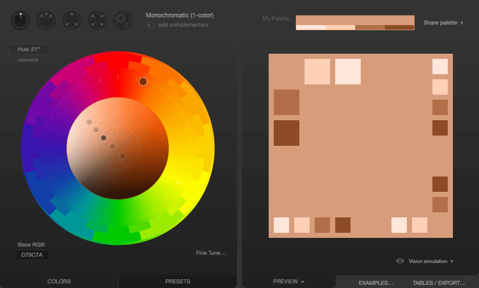

{{CSSRef}}

Choosing the right colors for a website can be tricky, especially if you aren't well-grounded in art, design, or at least basic color theory. The wrong color choice can render your site unattractive, or worse, leave the content unreadable due to problems with contrast or conflicting colors. Using the wrong colors can result in your content being outright unusable by people with certain vision problems, particularly color blindness.

## Finding the right colors

There are tools and processes available to help you pick a good color scheme. While they can't replace having a good designer helping you make these decisions, they can get you started.

### Base color

The first step is to choose your **base color**. This color represents your website or its subject matter. Just as we associate green with the beverage [Mountain Dew](https://en.wikipedia.org/wiki/Mountain_Dew) blue with the sky or the ocean, choosing an appropriate base color to represent your site is a good place to start. There are plenty of ways to select a base color; a few ideas include:

- A color that is naturally associated with the topic of your content, such as the existing color identified with a product or idea or a color representative of the emotion you wish to convey.
- A color that comes from imagery associated with your subject matter. If you're creating a website about a given item or product, choose a color that's physically present on that item.
- Browse websites that let you look at lots of existing color palettes and images to find inspiration.

Several useful browser extensions can help pick base colors. For example, the [ColorZilla](https://www.colorzilla.com/) browser extension provides an eyedropper tool for picking colors from any webpage. It can also take averages of the colors of an area of a page.

An "average color" grab is useful because sometimes what may look like a solid block of color might actually be multiple related colors, such as grabbing the blue in a photograph of an ocean or the sky. A single pixel of blue selected from a photo may result in a color that looks out of place.

### Fleshing out the palette

Once you have decided on your base color, the next step is to build a palette of appropriate colors to use alongside it. Several tools are available to apply color theory to your base color and output appropriate added colors. Online tools, like the free [Adobe Color CC online color wheel](https://color.adobe.com/create/color-wheel) can help you pick an accessible color palette.

Many of these tools can also apply filters to your palette so you can see what they would look like to people with various forms of color blindness. See [Color and accessibility](#color_and_accessibility) for a brief explanation of why this matters.

When designing your palette, you'll probably also need to supplement it with some core neutral colors such as white (or nearly white), black (or nearly black), and one or more shades of gray.

> **Note:** Usually, you are better off using the smallest number of colors possible. Using color to highlight important content rather than adding color to everything will have more impact and your content will be more readable.

## Color theory resources

A full review of color theory is beyond the scope of this article, however there are plenty of articles about color theory available, as well as courses you can find at schools and universities. We found the following resources particularly useful:

- [Color Science](https://www.khanacademy.org/computing/pixar/color) ([Khan Academy](https://www.khanacademy.org/) in association with [Pixar](https://www.pixar.com/))
  - : An online course which introduces concepts such as what color is, how it's perceived, and how to use colors to express ideas. Presented by Pixar artists and designers.
- [Color theory](https://en.wikipedia.org/wiki/Color_theory) on Wikipedia
  - : Wikipedia's entry on color theory, which has a lot of great information from a technical perspective. It's not really a resource for helping you with the color selection process, but is still full of useful information.

## Color and accessibility

Make sure your content is [accessible](/en-US/docs/Web/Accessibility). There are several ways color can create an {{Glossary("accessibility")}} problem. Improper or careless use of color can result in a website or app that a percentage of your target audience may not be able to use adequately, resulting in lost traffic, lost business, and possibly even a public relations problem or a lawsuit. So it's important to consider your use of color carefully.

It's important to [understand color and luminance](/en-US/docs/Web/Accessibility/Understanding_Colors_and_Luminance) and to always consider [color blindness](https://medlineplus.gov/colorblindness.html) and [vestibular disorders](/en-US/docs/Web/Accessibility/Seizure_disorders). There are several kinds; the most common is red-green color blindness, which causes people to be unable to differentiate between the colors red and green. There are others, too, ranging from inabilities to tell the difference between certain colors to total inability to see color at all. There are even color and animation combinations that can lead your photosensitive users to have experience [seizures](/en-US/docs/Web/Accessibility/Seizure_disorders#colors). While normally higher [color contrast](https://digital.gov/guides/accessibility-for-teams/visual-design/#color-and-contrast) is a good thing when it comes to accessibility, when animating, especially rapidly, [reducing color contrast](/en-US/docs/Web/Accessibility/Seizure_disorders#reduce_contrast) on animating elements reduces seizure risk. If you include animations, use the [`prefers-reduced-motion`](/en-US/docs/Web/CSS/@media/prefers-reduced-motion) feature of the {{cssxref("@media")}} query to reduce animations for users who have selected that preference.

That said, ensure you have enough [color contrast](/en-US/docs/Web/Accessibility/Understanding_WCAG/Perceivable/Color_contrast) between your background and foreground content to ensure legibility. Also, never use color as the only way to convey information. If, for example, you indicate the success of an operation with a green border around the associated UI element, and failure with a red border, users with red-green color blindness won't be able to use your site properly. Instead, use text and color indicators together to include those users. A green check and red cross would be a better choice.

## Palette design example

Let's consider a quick example of selecting an appropriate color palette for a site. Imagine that you're building a website for a new game that takes place on the planet Mars. A [Google search for photos of Mars](https://www.google.com/search?q=Mars&tbm=isch) will output several good examples of Martian coloration there. We'll use a color picker tool to select a color sample for the base color, carefully avoiding mockups and photos from movies.

Using an eyedropper tool, we identify a color we like and determine that the color in question is `#D79C7A`, which is an appropriate rusty orange-red color stereotypical of the Martian surface.

Having selected our base color, we need to build out our palette. We can use [Paletton](https://www.paletton.com/) to come up with the other colors we need. Upon opening Paletton, we see:

Next, we enter our color's hex code (`D79C7A`) into the "Base RGB" box at the bottom-left corner of the tool:

We now see a monochromatic palette based on the color we picked from the Mars photo. If you need a lot of related colors for some reason, those are likely to be good ones. But what we really want is an accent color. Something that will pop alongside the base color. To find that, we click the "add complementary" toggle underneath the menu that lets you select the palette type (currently "Monochromatic"). Paletton computes an appropriate accent color; clicking on the accent color in the bottom-right corner tells us that this color is `#508D7C`.

If you're unhappy with the color that's proposed to you, you can change the color scheme, to see if you find something you like better. For example, if we don't like the proposed greenish-blue color, we can click the Triad color scheme icon, which presents us with the following:

That greyish blue in the top-right looks pretty good. Clicking on it, we find that it's `#556E8D`. That can be used as an accent color, to make things stand out, such as in headlines, tabs highlights, or other indicators on the site:

Now we have our base color and our accent. On top of that, we have a few complementary shades of each, just in case we need them for gradients and the like. The colors can be exported in several formats for you to use.

Once you have these colors, you should select appropriate neutral colors. It is common design practice to try to find the sweet spot where there's just enough contrast that the text is crisp and readable without being too harsh for the eyes. It's easy to go too far in one way or another so be sure to get feedback on your colors once you've selected them and have examples of them in use available. If the contrast is too low, your text will be washed out by the background, leaving it unreadable, but if your contrast is too high, the user may find your site garish and unpleasant to look at.

## Color, backgrounds, contrast, and printing

What looks good on screen may look very different on paper.
In addition, ink can be expensive, and if a user is printing your page, they don't necessarily need all the backgrounds and such using up their precious ink when all that matters is the text itself.
Most browsers, by default, remove background images when printing documents.

If your background colors and images have been selected carefully and/or are crucial to the usefulness of the content, you can use the CSS {{cssxref("print-color-adjust")}} property to tell the browser that it should not make adjustments to the appearance of content.

The default value of `print-color-adjust`, `economy`, indicates that the browser is allowed to make appearance changes as it deems necessary in order to try to optimize the legibility and/or print economy of the content, given the type of output device the document is being drawn onto.

You can set `print-color-adjust` to `exact` to tell the browser that the element or elements on which you use it have been designed specifically to best work with the colors and images left as they are.
With this set, the browser won't tamper with the appearance of the element, and will draw it as indicated by your CSS.

> **Note:** There is no guarantee, though, that `print-color-adjust: exact` will result in your CSS being used exactly as given.
> If the browser provides user preferences to change the output (such as a "don't print backgrounds" checkbox in a print dialog box), that overrides the value of `print-color-adjust`.

## See also

- [Applying color to HTML elements using CSS](/en-US/docs/Web/CSS/CSS_colors/Applying_color)
- [CSS color values](/en-US/docs/Web/CSS/CSS_colors/Color_values)
- [Using relative colors](/en-US/docs/Web/CSS/CSS_colors/Relative_colors)
- [CSS color module](/en-US/docs/Web/CSS/CSS_colors)
- [Understanding color and luminance](/en-US/docs/Web/Accessibility/Understanding_Colors_and_Luminance)
- [WCAG 1.4.1: Color contrast](/en-US/docs/Web/Accessibility/Understanding_WCAG/Perceivable/Color_contrast)
- [Paletton](https://paletton.com/)
