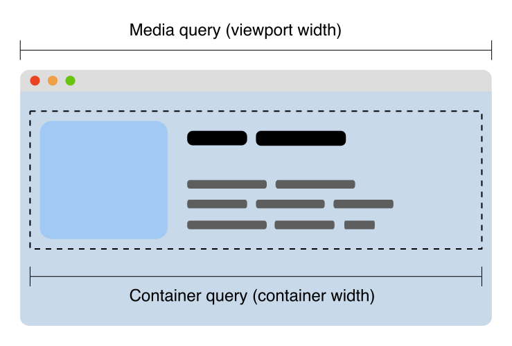

{{CSSRef}}

[CSS containment](/en-US/docs/Web/CSS/CSS_Containment) provides a way to isolate parts of a page and declare to the browser these parts are independent from the rest of the page in terms of styles and layout.

If you are creating [a responsive design](/en-US/docs/Learn/CSS/CSS_layout/Responsive_Design), you often use [media queries](/en-US/docs/Web/CSS/Media_Queries) to change the page layout based on the size of the {{Glossary("viewport")}}.
It's common to group HTML elements into reusable components that have a specific layout depending on the available space in a page.
The available space might not only depend on the size of the viewport, but also on the context where a component appears.



Container queries allow us to look at a container size and apply styles to the contents based on the size of their container rather than the viewport.
If the container has less available space, we can hide certain elements or use smaller fonts, for example.
The illustration below shows how the same component can be displayed with multiple layouts using container queries:


### The container-type property

The `container-type` property can have the following values:

- `size`
  - : Establishes a query container for dimensional queries on the block and inline axis.
    Applies layout, style, and size containment to the element.
- `inline-size`
  - : Establishes a query container for dimensional queries on the inline axis of the container.
    Applies layout, style, and inline-size containment to the element.
- `normal`
  - : The element is not a query container for any dimensional queries on the block and inline axis.

> **Note:** to understand what happens when you apply layout, style, and size containment to a box, see the documentation for {{cssxref("contain")}}.

#### Single-axis containment

Using `container-type: size` indicates to the browser that the size of this area is known in both dimensions.

However, we don't often know how big things are in both dimensions.
When we use media queries, most of the time we care about the available width (or inline size).
We define columns as a percentage or fraction of the space in that dimension.
Therefore, container queries can use the `container-type` property to allow size to be indicated in one dimension only.
This is described as single-axis containment.

The following CSS creates a container with containment on the inline axis only.
The content can grow to as large as it needs to be on the block axis.

```css
.sidebar {
  container-type: inline-size;
}
```

### `container-type`

Adding the `container-type` property with a size value creates a **containment context** on that element.
This means that the browser knows we might want to query this container later.
You can then write a query which looks to this containment context rather than the viewport size, in order to make layout decisions for a component.

A container query is created using `@container`.
This will query the nearest containment context.
To cause the card to display as two columns only if the sidebar is wider than `700px`, we use the following CSS:

```css
@container (min-width: 700px) {
  .card {
    display: grid;
    grid-template-columns: 2fr 1fr;
  }
}
```

If other areas of the layout are also containment contexts then we can drop the component into those areas and it will respond to the relevant containment context.
This makes the various components that we might create in our pattern library truly reusable, without us needing to know the context that they are in.

### `container-name`

The previous example allows a component to query the nearest containment context, which is likely the most common use case.
Sometimes however, you might want to query another container. This is where the `container-name` property will be useful.
When creating your query container with `container-type`, add the `container-name` property. This takes a {{cssxref("custom-ident")}}, in the same way that you might name a {{cssxref("grid-area")}}.

```css
.sidebar {
  container-type: inline-size;
  container-name: sidebar;
}
```

You can then target just that query container by adding the name to the container query:

```css
@container sidebar (min-width: 400px) {
  .card {
    display: grid;
    grid-template-columns: 2fr 1fr;
  }
}
```

## Fallbacks for container queries

For browsers that don't yet support container queries, grid and flex layouts can be used to achieve a similar effect.

Alternatively, you can detect where the component is in a document using JavaScript and apply a selector or a class based on document location.

## See also

- {{Cssxref("@container")}}
- {{Cssxref("contain")}}
- {{Cssxref("container-name")}}
- {{Cssxref("container-type")}}
- {{cssxref("content-visibility")}}
- [Media Queries](/en-US/docs/Web/CSS/Media_Queries)
- [Editor's Draft CSS Containment Level 3](https://drafts.csswg.org/css-contain-3/)
- [Container Queries: a Quick Start Guide](https://www.oddbird.net/2021/04/05/containerqueries/)
- [Collection of Container Queries articles](https://github.com/sturobson/Awesome-Container-Queries)
- CSS Working Group [GitHub project for Container Queries](https://github.com/w3c/csswg-drafts/projects/18)
