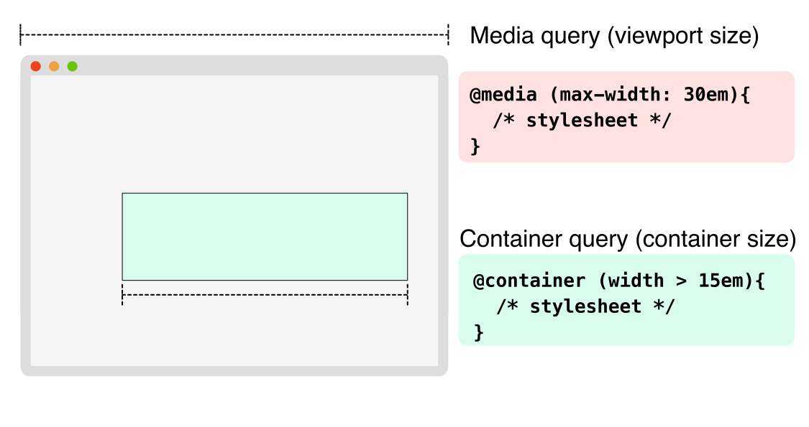

{{CSSRef}}

Container queries allow us to look at an element and apply styles to the children of that element based on the size of their container.
This is an alternative to [media queries](/en-US/docs/Web/CSS/Media_Queries) which apply styles to elements based on viewport size or other device characteristics.
If a container has less available space in the surrounding context, you can hide certain elements or use smaller fonts, for example.



## Using container queries

To use container queries, you need to declare a **containment context** on an element so that the browser knows you might want to query the dimensions of this container later.
To do this, use the {{Cssxref("container-type")}} property a value of `size`, `inline-size`, or `normal`.
These values have the following effects:

- `size`: the query will be based on the [inline and block](/en-US/docs/Web/CSS/CSS_Logical_Properties/Basic_concepts#block_and_inline_dimensions) dimensions of the container.
  Applies layout, style, and size containment to the container.
- `inline-size`: the query will be based on the [inline](/en-US/docs/Web/CSS/CSS_Logical_Properties/Basic_concepts#block_and_inline_dimensions) dimensions of the container.
  Applies layout, style, and inline-size containment to the element.
- `normal`: The element is not a query container for any container size queries, but remains a query container for container style queries.

Take the following example which is a card component for a blog post with a title and some text:

```html
<div class="post">
  <div class="card">
    <h2>Card title</h2>
    <p>Card content</p>
  </div>
</div>
```

You can create a containment context using the `container-type` property:

```css
.post {
  container-type: inline-size;
}
```

An {{cssxref("@container")}} at-rule allows you to write a container query.
The query in the following example will apply styles to elements based on the size of the nearest ancestor with a containment context.
Specifically, this query will apply a larger font size for the card title if the container is wider than `700px`:

```css
/* Default heading styles for the card title */
.card h2 {
  font-size: 1em;
}

/* if the container is larger than 700px */
@container (min-width: 700px) {
  .card h2 {
    font-size: 2em;
  }
}
```

Using container queries, the card can be reused in multiple areas of a page without needing to know specifically where it will be placed each time.
If there is a smaller container, the card title will be smaller, and if there is a larger container with more space available, the card title will be larger.

For more information on the syntax of container queries, see the {{cssxref("@container")}} page.

### Naming containment contexts

In the previous section, a container query applied styles based on the nearest ancestor with a containment context.
It's possible to give a containment context a name using the {{Cssxref("container-name")}} property. Once named, the name can be used in a `@container` query so as to target a specific container.
The following example creates a containment context with the name `sidebar`:

```css
.post {
  container-type: inline-size;
  container-name: sidebar;
}
```

You can then target this containment context using the `@container` at-rule:

```css
@container sidebar (min-width: 700px) {
  .card {
    font-size: 2em;
  }
}
```

More information on naming containment contexts is available on the {{cssxref("container-name")}} page.

### Shorthand container syntax

The shorthand way of declaring a containment context is to use the `container` property:

```css
.post {
  container: sidebar / inline-size;
}
```

For more information on this property, see the {{Cssxref("container")}} reference.

### Container query length units

When applying styles to a container using container queries, you can use container query length units.
These units specify a length relative to the dimensions of a query container.
Components that use units of length relative to their container are more flexible to use in different containers without having to recalculate concrete length values.

The container query length units are:

- `cqw`: 1% of a query container's width
- `cqh`: 1% of a query container's height
- `cqi`: 1% of a query container's inline size
- `cqb`: 1% of a query container's block size
- `cqmin`: The smaller value of either `cqi` or `cqb`
- `cqmax`: The larger value of either `cqi` or `cqb`

The following example uses the `cqi` unit to set the font size of a heading based on the inline size of the container:

```css
@container (min-width: 700px) {
  .card h2 {
    font-size: max(1.5em, 1.23em + 2cqi);
  }
}
```

For more information on these units, see the [Container query length units](/en-US/docs/Web/CSS/length#container_query_length_units) reference.

## Fallbacks for container queries

For browsers that don't yet support container queries, {{cssxref("grid")}} and {{cssxref("flex")}} can be used to create a similar effect for the card component used on this page.
The following example uses a {{cssxref("grid-template-columns")}} declaration to create a two-column layout for the card component.

```css
.card {
  display: grid;
  grid-template-columns: 2fr 1fr;
}
```

If you want to use a single-column layout for devices with a smaller viewport, you can use a media query to change the grid template:

```css
@media (max-width: 700px) {
  .card {
    grid-template-columns: 1fr;
  }
}
```

## See also

- [Media queries](/en-US/docs/Web/CSS/Media_Queries)
- CSS {{Cssxref("@container")}} at-rule
- CSS {{Cssxref("contain")}} property
- CSS {{Cssxref("container")}} shorthand property
- CSS {{Cssxref("container-name")}} property
- CSS {{cssxref("content-visibility")}} property
- [Say Hello to CSS Container Queries](https://ishadeed.com/article/say-hello-to-css-container-queries/) by Ahmad Shadeed
- [Container Queries: a Quick Start Guide](https://www.oddbird.net/2021/04/05/containerqueries/)
- [Collection of Container Queries articles](https://github.com/sturobson/Awesome-Container-Queries)
