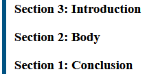

{{CSSRef}}

**CSS counters** let you adjust the appearance of content based on its location in a document.
For example, you can use counters to automatically number the headings on a webpage or to change the numbering on ordered lists.

Counters are, in essence, variables maintained by CSS whose values may be incremented or decremented by CSS rules that track how many times they're used. The following things affect the counter values on an element:

1. Counters are [inherited](#counter_inheritance_and_propagation) from the parent element or received from a previous sibling.
2. New counters are instantiated using {{cssxref("counter-reset")}} property.
3. Counters are incremented using {{cssxref("counter-increment")}} property.
4. Counters are directly set to a value using the {{cssxref("counter-set")}} property.

You can define your own named counters, and you can also manipulate the `list-item` counter that is created by default for all ordered lists.

## Using counters

To use a counter it must first be initialized to a value with the {{cssxref("counter-reset")}} property.
The counter's value can be increased or decreased using the {{cssxref("counter-increment")}} property and can be directly set to a specific value using the {{cssxref("counter-set")}} property.
The current value of a counter is displayed using the {{cssxref("counter", "counter()")}} or {{cssxref("counters", "counters()")}} function, typically within a [pseudo-element](/en-US/docs/Web/CSS/Pseudo-elements) {{CSSxRef("content")}} property.

Counters can only be set, reset, or incremented in elements that generate boxes.
For example, if an element is set to `display: none` then any counter operation on that element will be ignored.

The properties of counters can be scoped to specific elements using style containment which is described in more detail in the {{cssxref("contain")}} property.

### Manipulating a counter's value

To use a CSS counter, it must first be initialized to a value with the {{cssxref("counter-reset")}} property.
The property can also be used to change the counter value to any specific number.

Below we initialize a counter named `section` to the default value (0).

```css
counter-reset: section;
```

You can also initialize multiple counters, optionally specifying an initial value for each.
Below we initialize the `section` and `topic` counters to the default value, and the `page` counter to 3.

```css
counter-reset: section page 3 topic;
```

Once initialized, a counter's value can be increased or decreased using {{cssxref("counter-increment")}}.
For example, the following declaration would increment the `section` counter by one on every `h3` tag.

```css
h3::before {
  counter-increment: section; /* Increment the value of section counter by 1 */
}
```

You can specify the increment or decrement amount after the counter name. It can be a positive or negative number, but defaults to `1` if no integer is provided.

Apart from being incremented or decremented, counters can also be explicitly set to a value using the {{cssxref("counter-set")}} property.

```css
.done::before {
  counter-set: section 20;
}
```

The counter's name must not be `none`, `inherit`, or `initial`; otherwise the declaration is ignored.

### Displaying a counter

The value of a counter can be displayed using either the {{cssxref("counter", "counter()")}} or {{cssxref("counters", "counters()")}} function in a {{cssxref("content")}} property.

For example, the following declaration uses `counter()` to prefix each `h3` heading with the text `Section <number>:`, where `<number>` is the value of the count in decimal (the default display style):

```css
h3::before {
  counter-increment: section; /* Increment the value of section counter by 1 */
  content: "Section " counter(section) ": "; /* Display counter value in default style (decimal) */
}
```

The {{cssxref("counter", "counter()")}} function is used when the numbering of nesting levels does not include the context of parent levels.
For example, here each nested level restarts from one:

```plain
1 One
  1 Nested one
  2 Nested two
2 Two
  1 Nested one
  2 Nested two
  3 Nested three
3 Three
```

The {{cssxref("counters", "counters()")}} function is used when the count for nested levels must include the count from parent levels.
For example, you might use this to lay out sections as shown:

```plain
1 One
  1.1 Nested one
  1.2 Nested two
2 Two
  2.1 Nested one
  2.2 Nested two
  2.3 Nested three
3 Three
```

The {{cssxref("counter", "counter()")}} function has two forms: `counter(<counter-name>)` and `counter(<counter-name>, <counter-style>)`.
The generated text is the value of the innermost counter of the given name in scope at the pseudo-element.

The {{cssxref("counters", "counters()")}} function also has two forms: `counters(<counter-name>, <separator>)` and `counters(<counter-name>, <separator>, <counter-style>)`.
The generated text is the value of all counters with the given name in scope at the given pseudo-element, from outermost to innermost, separated by the specified string (`<separator>`).

The counter is rendered in the specified `<counter-style>` for both methods (`decimal` by default).
You can use any of the {{cssxref("list-style-type")}} values or your own [custom styles](/en-US/docs/Web/CSS/CSS_counter_styles).

Examples showing the use of `counter()` and `counters()` are given below in the [basic example](#basic_example) and [Example of a nested counter](#example_of_a_nested_counter), respectively.

### Reversed counters

A reversed counter is one that is intended to count down (decrement) rather than up (increment).
Reversed counters are created using the `reversed()` function notation when naming the counter in {{cssxref("counter-reset")}}.

Reversed counters have a default initial value equal to the number of elements (unlike normal counters, which have a default value of 0).
This makes it easy to implement a counter that counts from the number of elements down to one.

For example, to create a reversed counter named `section` with a default initial value, you would use the following syntax:

```css
counter-reset: reversed(section);
```

You can of course specify any initial value that you like.

The counter value is decreased by specifying a negative value for {{cssxref("counter-increment")}}.

> [!NOTE]
> You can also use {{cssxref("counter-increment")}} to decrement a non-reversed counter.
> The main benefit of using a reversed counter is the default initial value, and that the `list-item` counter automatically decrements reversed counters.

### Counter inheritance and propagation

Each element or pseudo-element has a set of counters in the scope of that element. Initial counters in the set are received from the element's parent and the preceding sibling. The counter values are received from the last descendent of the previous sibling, the last sibling, or the parent.

When an element declares a counter, the counter is nested inside the counter with the same name received from the parent. If the parent doesn't have a counter with the same name then the counter is added to the element's counters set as it is. A counter with the same name received from the previous sibling is removed from the counters set.

The {{cssxref("counter", "counter()")}} function retrieves the innermost counter with the provided name. And the {{cssxref("counters", "counters()")}} function retrieves the entire counter tree with the given name.

In the following example, we are demoing an inherited counter named `primary` and a sibling counter named `secondary`. All the `<div>` elements display their counters using the `counters()` function. Note that all the counters have been created using `counter-reset` property, and none of the counters have been incremented.

```html
<section>
  counter-reset: primary 3
  <div>A</div>
  <div>B</div>
  <div>C</div>
  <div class="same-primary-name">D</div>
  <span> counter-reset: primary 6</span>
  <div>E</div>
  <div class="new-secondary-name">F</div>
  <span> counter-reset: secondary 5</span>
  <div>G</div>
  <div>H</div>
  <div class="same-secondary-name">I&nbsp;</div>
  <span> counter-reset: secondary 10</span>
  <div>J&nbsp;</div>
  <div>K</div>
  <section></section>
</section>
```

```css hidden
.same-primary-name,
.new-secondary-name,
.same-secondary-name {
  display: inline-block;
}

@counter-style style {
  system: numeric;
  symbols: "" "1" "2" "3" "4" "5" "6" "7" "8" "9" "10";
}
```

```css
/* create 'primary' counter on divs' parent */
section {
  counter-reset: primary 3;
}

div::after {
  content: " ('primary' counters: " counters(primary, "-", style)
    ", 'secondary' counters: " counters(secondary, "-", style) ")";
  color: blue;
}

/* create new 'primary' counter */
.same-primary-name {
  counter-reset: primary 6;
}

/* create 'secondary' counter on div 'F' */
.new-secondary-name {
  counter-reset: secondary 5;
}

/* override the sibling 'secondary' counter */
.same-secondary-name {
  counter-reset: secondary 10;
}
```

{{EmbedLiveSample("Counter inheritance and propagation", "100%", 250)}}

The section element initializes a counter named `primary` with value `3`, and all the child `<div>`s receive the inherited `primary` counter. The element 'D' creates a new `primary` (value `6`) counter which gets nested in the counter received from the parent, so the element has two counters named `primary` with values `3` and `6`.

The element 'F' creates the `secondary` (value `5`) counter for the first time, and it passes the counter to the next sibling 'G'. The element 'G' passes the counter to the next element 'H' and so on. Next, the element 'I' creates a new counter with the same name `secondary` (value `10`), but it drops the `secondary` (value `5`) counter received from the previous sibling 'H' and passes its own counter to 'J'.

### Difference between counter-set and counter-reset

The {{cssxref("counter-set")}} property updates an existing counter and if no counter with the name exists then a new counter is instantiated. The {{cssxref("counter-reset")}} property _always_ creates a new counter.

In the following example, we have two sub-lists inside a parent list. Each list item has been numbered using a counter named 'item'. The first sub-list uses {{cssxref("counter-set")}} property and the second sub-list uses {{cssxref("counter-reset")}} property to change the 'item' counter.

```html
<ul class="parent">
  <li>A</li>
  <li>B</li>
  <li>
    C (the counter updated using `counter-set`)
    <ul class="sub-list-one">
      <li>sub-A</li>
      <li>sub-B</li>
    </ul>
  </li>
  <li>D</li>
  <li>
    E (a new counter created using `counter-reset`)
    <ul class="sub-list-two">
      <li>sub-A</li>
      <li>sub-B</li>
      <li>sub-C</li>
    </ul>
  </li>
  <li>F</li>
  <li>G</li>
</ul>
```

```css hidden
ul {
  list-style: none;
}
```

```css
/* create a new counter for the first time */
.parent {
  counter-reset: item 0;
}

/* increment the counter on each list item */
li {
  counter-increment: item;
}

/* show numbers on list items */
li::before {
  content: counter(item) " ";
}

/* change the existing counter value */
.sub-list-one {
  counter-set: item 10;
}

/* change the counter value */
.sub-list-two {
  counter-reset: item 0;
}
```

{{EmbedLiveSample("Difference between counter-set and counter-reset", "100%", 300)}}

Notice how the first sub-list items start receiving numbers from `11`, and the numbering is continued in the parent list. This is because the `counter-set` property updates the same 'item' counter declared on the `.parent` element. Then notice how the second sub-list items receive new numbering starting from '1' and the parent list items after it don't carry forward the numbering. This is because the `counter-reset` property created a new counter with the same name so the parent list items kept using the old counter.

### List item counters

Ordered lists, as created using {{HTMLElement("ol")}} elements, implicitly have a counter named `list-item`.

Like other counters, this has a default initial value of 0 for upward counters and "number of items" for reversed counters.
Unlike author-created counters, `list-item` _automatically_ increments or decrements by one for each list element, depending on whether or not the counter is reversed.

The `list-item` counter can be used to manipulate the default behavior of ordered lists using CSS.
For example, you can change the default initial value, or use {{cssxref("counter-increment")}} to change the way in which the list items increment or decrement.

## Examples

### Basic example

This example adds "Section \[the value of the counter]:" to the beginning of each heading.

#### CSS

```css
body {
  counter-reset: section; /* Set a counter named 'section', and its initial value is 0. */
}

h3::before {
  counter-increment: section; /* Increment the value of section counter by 1 */
  content: "Section " counter(section) ": "; /* Display the word 'Section ', the value of
                                                section counter, and a colon before the content
                                                of each h3 */
}
```

#### HTML

```html
<h3>Introduction</h3>
<h3>Body</h3>
<h3>Conclusion</h3>
```

#### Result

{{EmbedLiveSample("Basic_example", "100%", 150)}}

### Basic example: reversed counter

This example is the same as the one above but uses a reversed counter.
If your browser supports the `reversed()` function notation, the result will look like this:



#### CSS

```css
body {
  counter-reset: reversed(
    section
  ); /* Set a counter named 'section', and its initial value is 0. */
}

h3::before {
  counter-increment: section -1; /* Decrement the value of section counter by 1 */
  content: "Section " counter(section) ": "; /* Display the word 'Section ', the value of
                                                section counter, and a colon before the content
                                                of each h3 */
}
```

#### HTML

```html
<h3>Introduction</h3>
<h3>Body</h3>
<h3>Conclusion</h3>
```

#### Result

{{EmbedLiveSample("Basic example: reversed counter", "100%", 150)}}

### A more sophisticated example

A counter need not necessarily be shown every time it is incremented.
This example counts all links with the counter showing only when a link has no text, as a convenient replacement.

#### CSS

```css
:root {
  counter-reset: link;
}

a[href] {
  counter-increment: link;
}

a[href]:empty::after {
  content: "[" counter(link) "]";
}
```

#### HTML

```html
<p>See <a href="https://www.mozilla.org/"></a></p>
<p>Do not forget to <a href="contact-me.html">leave a message</a>!</p>
<p>See also <a href="https://developer.mozilla.org/"></a></p>
```

#### Result

{{EmbedLiveSample("A_more_sophisticated_example", "100%", 150)}}

### Example of a nested counter

A CSS counter can be especially useful for making outlined lists, because a new instance of the counter is automatically created in child elements.
Using the {{cssxref("counters", "counters()")}} function, separating text can be inserted between different levels of nested counters.

#### CSS

```css
ol {
  counter-reset: section; /* Creates a new instance of the
                             section counter with each ol
                             element */
  list-style-type: none;
}

li::before {
  counter-increment: section; /* Increments only this instance
                                            of the section counter */
  content: counters(section, ".") " "; /* Combines the values of all instances
                                          of the section counter, separated
                                          by a period */
}
```

#### HTML

```html-nolint
<ol>
  <li>item</li>          <!-- 1     -->
  <li>item               <!-- 2     -->
    <ol>
      <li>item</li>      <!-- 2.1   -->
      <li>item</li>      <!-- 2.2   -->
      <li>item           <!-- 2.3   -->
        <ol>
          <li>item</li>  <!-- 2.3.1 -->
          <li>item</li>  <!-- 2.3.2 -->
        </ol>
        <ol>
          <li>item</li>  <!-- 2.3.1 -->
          <li>item</li>  <!-- 2.3.2 -->
          <li>item</li>  <!-- 2.3.3 -->
        </ol>
      </li>
      <li>item</li>      <!-- 2.4   -->
    </ol>
  </li>
  <li>item</li>          <!-- 3     -->
  <li>item</li>          <!-- 4     -->
</ol>
<ol>
  <li>item</li>          <!-- 1     -->
  <li>item</li>          <!-- 2     -->
</ol>
```

#### Result

{{EmbedLiveSample("Example_of_a_nested_counter", "100%", 350)}}

## Specifications

{{Specifications}}

## See also

- {{cssxref("contain")}}
- {{cssxref("counter-reset")}}
- {{cssxref("counter-set")}}
- {{cssxref("counter-increment")}}
- {{cssxref("@counter-style")}}
- [CSS counter styles](/en-US/docs/Web/CSS/CSS_counter_styles) module
- [CSS lists and counters](/en-US/docs/Web/CSS/CSS_lists) module
