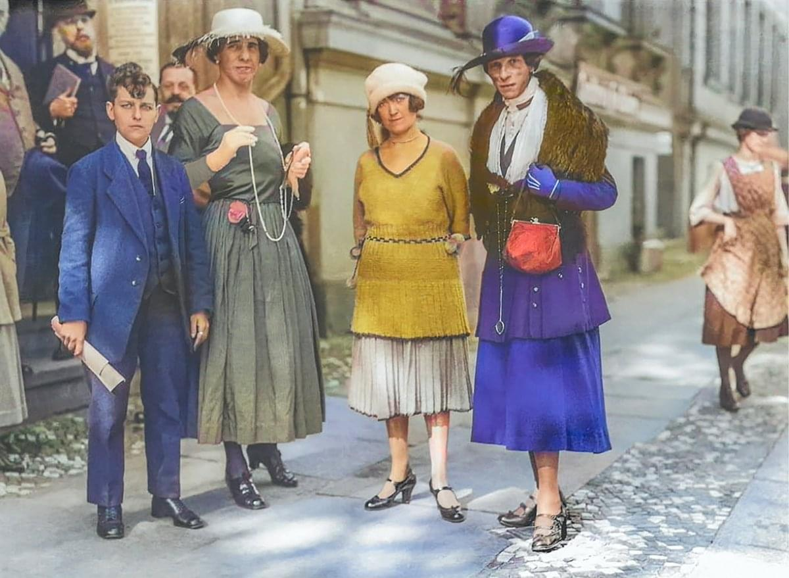

{{CSSRef}}

Have you ever hovered over a black-and-white or sepia image and the full-color image came into view instantly? Have you ever encountered a background image with a small blurred-out section that makes the text on top more legible? In the past, these manipulations required image editing software, time, and additional HTTP requests.

## Advantages of using CSS filter effects

The [Filter effects](/en-US/docs/Web/CSS/CSS_filter_effects) module in CSS provides properties and functions that let you apply the visual effects described above without using Photoshop or sending extra HTTP requests. The only software required is the user's browser. Moreover, unlike pre-set image effects, CSS filter effects are responsive and animatable.

The CSS filter effects module provides the {{cssxref("filter")}} and {{cssxref("backdrop-filter")}} properties that you can use to impact the rendering of text, images, backgrounds, and borders, or any element on which you apply these properties. This module also defines the {{cssxref("&lt;filter-function&gt;")}} data type that lets you add graphical effects such as blurring or color shifting. Using the filter functions, you can not only alter the appearance of an element but also reference an SVG filter using a filter that you create.

## Filter effect properties

The following two filter properties of the CSS filter effects module enable you to apply zero, one, or more graphical effects to an element:

- Using the {{cssxref("filter")}} property, you can apply filter effects such as blur, drop-shadow, and sepia to an element before the element is rendered. The filters effects are applied directly on the element, including the element's contents, borders, and padding.

- Using the {{cssxref("backdrop-filter")}} property, you can apply graphical effects to the area behind an element (the element's "backdrop"). The `backdrop-filter` property is often used to make the foreground content more legible, especially when the larger area on which the content is placed otherwise does not provide enough contrast for the content. The filter effects are applied only to the background of the element and not to the element's content.

The `filter` and `backdrop-filter` properties accept a space-separated list of filters, which are applied in the order declared.

## Filter functions

The CSS filter effects module provides 10 [`<filter-function>`](/en-US/docs/Web/CSS/filter#functions) functions, as well as the ability to define an almost endless array of effects using SVG filters applied via a `url()` reference.

The following table lists the 10 filter functions, along with their value types, the minimum valid value if applicable, the largest value that creates an effect, and the initial value used for [interpolation](/en-US/docs/Glossary/Interpolation).

| Filter function                                             | Parameter type                                                     | Min value | Max effect | Interpolation value  | Default value (no effect)             |
| ----------------------------------------------------------- | ------------------------------------------------------------------ | --------- | ---------- | -------------------- | ------------------------------------- |
| {{cssxref("filter-function/blur", "blur()")}}               | {{cssxref("&lt;length&gt;")}}                                      | `0`       |            | `0`                  | `blur(0)`                             |
| {{cssxref("filter-function/brightness", "brightness()")}}   | {{cssxref("&lt;number&gt;")}} or {{cssxref("&lt;percentage&gt;")}} | `0`       |            | `1`                  | `brightness(1)` or `brightness(100%)` |
| {{cssxref("filter-function/contrast", "contrast()")}}       | {{cssxref("&lt;length&gt;")}}                                      | `0`       |            | `1`                  | `contrast(1)` or `contrast(100%)`     |
| {{cssxref("filter-function/drop-shadow", "drop-shadow()")}} | `<shadow>`                                                         |           |            | `0 0 0 currentcolor` | `drop-shadow(0 0 0 currentcolor)`     |
| {{cssxref("filter-function/grayscale", "grayscale()")}}     | {{cssxref("&lt;number&gt;")}} or {{cssxref("&lt;percentage&gt;")}} | `0`       | `100%`     | `0`                  | `grayscale(0)` or `grayscale(0%)`     |
| {{cssxref("filter-function/hue-rotate", "hue-rotate()")}}   | {{cssxref("&lt;angle&gt;")}}                                       |           |            | `0`                  | `hue-rotate(0deg)`                    |
| {{cssxref("filter-function/invert", "invert()")}}           | {{cssxref("&lt;number&gt;")}} or {{cssxref("&lt;percentage&gt;")}} | `0`       | `100%`     | `0`                  | `invert(0)` or `invert(0%)`           |
| {{cssxref("filter-function/opacity", "opacity()")}}         | {{cssxref("&lt;number&gt;")}} or {{cssxref("&lt;percentage&gt;")}} | `0`       | `100%`     | `1`                  | `opacity(1)` or `opacity(100%)`       |
| {{cssxref("filter-function/saturate", "saturate()")}}       | {{cssxref("&lt;number&gt;")}} or {{cssxref("&lt;percentage&gt;")}} | `0`       | `100%`     | `1`                  | `saturate(100%)`                      |
| {{cssxref("filter-function/sepia", "sepia()")}}             | {{cssxref("&lt;number&gt;")}} or {{cssxref("&lt;percentage&gt;")}} | `0`       | `100%`     | `0`                  | `sepia(0%)`                           |

The minimum value allowed is included for filter functions that have a minimum value. Including a value less than the minimum value for any filter function invalidates the entire property declaration, not just the offending filter function in the comma-separated list.

The maximum effect value can be exceeded. Including a value greater than the listed maximum value is valid, but it does not increase the effect over the listed maximum value. In other words, the effect on the element will look the same as when the maximum effect value is set. For example, setting `sepia(400%)` in the [sepia example](#applying_sepia_filter_effect) will produce the same effect as `sepia(100%)`, the maximum value.

The default value is a value that creates no effect. While these values create no effect, they provide the initial interpolation values and offer an example of how the value can be set. These default values provide a gauge between the minimum value allowed and the maximum effect value.

## Applying filter effects

The `filter` and `backdrop-filter` properties accept a filter function list, which may contain one or more `<filter-function>`s, the default keyword `none`, or an [SVG filter](#using_svg_filters) as a `url()` value.

### Applying sepia filter effect

If you hover over the sepia image below, you'll see the full-color image come into view instantly.

The image is set to be sepia by specifying the value of the `filter` property as the [`sepia()`](/en-US/docs/Web/CSS/filter-function/sepia) filter function. The filter is removed on [`:hover`](/en-US/docs/Web/CSS/:hover) and [`:focus`](/en-US/docs/Web/CSS/:focus) by setting `filter: none`.

```html

```

```css
img {
  filter: sepia(100%);
}
img:hover,
img:focus {
  filter: none;
}
```

In the {{HTMLElement("img")}} element, [`tabindex`](/en-US/docs/Web/HTML/Global_attributes/tabindex) is set to `0` to enable focus without altering the tabbing order for keyboard users because `` is not an interactive element.

```css hidden
img {
  max-width: 100%;
  height: 100%;
}
```

{{EmbedLiveSample("Applying_sepia_filter_effect", 600, 550)}}

### Applying filter effects to other elements

While generally applied to images, the `filter` and `backdrop-filter` properties can be applied to any element or pseudo-element.

In this example, a glow effect is added using a [`drop-shadow()`](/en-US/docs/Web/CSS/filter-function/drop-shadow) filter with a `3px` blur and `0` offset.

```css
h1 {
  color: midnightblue;
  filter: drop-shadow(0 0 3px magenta);
}
```

```css hidden
h1 {
  font-family: sans-serif;
  font-size: 2rem;
}
```

```html hidden
<h1>Glow created with CSS filter</h1>
```

{{EmbedLiveSample('Applying_filter_effects_to_other_elements','100%','80')}}

### Applying multiple filters

While the sepia `filter` example included only a single filter function, you can set multiple filters. The `filter` and `backdrop-filter` properties accept a space-separated list of filters, which are applied in the order declared.

This example applies two filters — [`hue-rotate()`](/en-US/docs/Web/CSS/filter-function/hue-rotate) and [`blur()`](/en-US/docs/Web/CSS/filter-function/blur) — via the `backdrop-filter` property. The backdrop, the area behind the {{HTMLElement("p")}} element, has a color shift and a blur applied.

```css
.container {
  background: url(image.jpg) no-repeat left / contain goldenrod;
}
p {
  backdrop-filter: hue-rotate(240deg) blur(5px);
  background-color: rgb(255 255 255 / 10%);
  text-shadow: 2px 2px black;
}
```

```css hidden
.container {
  padding: 3rem;
  width: 30rem;
}
p {
  padding: 0.5rem;
  color: #ffffff;
  font-size: 2rem;
  font-family: sans-serif;
}
```

```html hidden
<div
  class="container"
  style="background-image: url('https://mdn.github.io/shared-assets/images/examples/listen_to_black_women.jpg');">
  <p>
    Text on images can be illegible and inaccessible even with a drop shadow.
  </p>
</div>
```

{{EmbedLiveSample('Applying_multiple_filters','100%','300')}}

### Applying repeated filters

As filters are applied in sequential order, you can use filter functions more than once. In this example, the [`drop-shadow()`](/en-US/docs/Web/CSS/filter-function/drop-shadow) filter has been used four times, each time with a different `<shadow>` value.

```html


```

```css hidden
img {
  width: 49%;
}
```

```css
img {
  filter: drop-shadow(2px 2px 0 hsl(300deg 100% 50%))
    drop-shadow(-2px -2px 0 hsl(210deg 100% 50%))
    drop-shadow(2px 2px 0 hsl(120deg 100% 50%))
    drop-shadow(-2px -2px 0 hsl(30deg 100% 50%));
}
img + img {
  filter: none;
}
```

In the first Mandala example, four drop shadows are applied to a line-drawn SVG. The same SVG, with the filter removed with `filter: none`, is included for comparison.

{{EmbedLiveSample("Applying_repeated_filters", 600, 400)}}

### Specifying filter function order

When creating filter effects, the `filter` or `backdrop-filter` property is provided a space-separated list of filters. These filter effects are applied in the order in which they appear.

In this example, both `magenta` drop shadow and `180deg` hue rotation are applied on the level-one heading. The example shows the effect when these filters are applied in different orders.

```css
h1 {
  color: midnightblue;
}
#hueFirst {
  filter: hue-rotate(180deg) drop-shadow(3px 3px magenta);
}
#shadowFirst {
  filter: drop-shadow(3px 3px magenta) hue-rotate(180deg);
}
```

```css hidden
h1 {
  font-family: sans-serif;
  font-size: 2rem;
}
```

```html hidden
<h1 id="hueFirst">Hue change happens before drop shadow.</h1>
<h1 id="shadowFirst">Drop shadow applied before hue change.</h1>
<h1>No filter effects applied.</h1>
```

{{EmbedLiveSample('Applying_a_filter_to_an_element','100%','280')}}

The same filters are applied to both the lines of text but in a different order. In the first line, the hue of the text is altered before the shadow is applied, so the shadow is `magenta`. In the second line, the drop shadow is added to the dark blue text, and then the hue of both the text and the shadow are altered.

No filter effect is applied to the third line to show the original effect as a comparison. So the third line stays as `midnightblue` or `#191970`. The `hue-rotate(180deg)` filter changes the text in the first two lines to `#252500`.

> [!NOTE]
> The hexadecimal rgb color `#191970` is equal to `hsl(240deg 63.5% 26.9%)`, while `#252500` is `hsl(60deg 100% 7.3%)`. The [color rotation takes place in the sRGB color space](/en-US/docs/Web/CSS/color_value#interpolation), which is why the hue has been changed as expected while not maintaining the same values for saturation and lightness.

## Using SVG filters

In addition to the 10 defined {{cssxref("filter-function")}}s, the CSS filter effects support `url()`, with the parameter being an [SVG filter](/en-US/docs/Web/SVG/Element/filter), which may be embedded in an internal or external SVG file.

A single SVG can be used to define several filters, each with an `id`:

```html
<svg role="none">
  <defs>
    <filter id="blur1">
      <feGaussianBlur stdDeviation="1" edgeMode="duplicate" />
    </filter>
    <filter id="blur3">
      <feGaussianBlur stdDeviation="3" edgeMode="duplicate" />
    </filter>
    <filter id="hue-rotate90">
      <feColorMatrix type="hueRotate" values="90" />
    </filter>
  </defs>
</svg>
```

The filter's `id` is referenced in the `url()` for both inline and external SVGs:

```css
filter: url(#blur3);
filter: url("https://example.com/svg/filters.svg#blur3");
```

### Blurring an image

Just like the {{cssxref("filter-function/blur", "blur()")}} filter function applies a Gaussian blur to the elements on which it is applied, the SVG {{SVGElement("feGaussianBlur")}} filter element can also be used to blur content.

In both the cases, the blur radius value, specified as a {{cssxref("&lt;length&gt;")}} in CSS and as a pixel equivalent {{cssxref("&lt;number&gt;")}} in SVG, defines the value of the standard deviation to the Gaussian function. In other words, it defines the number of pixels on the screen that blend into each other; a larger value creates more blur.

The [`<filter>`](/en-US/docs/Web/SVG/Element/filter)'s {{SVGAttr("stdDeviation")}} attribute accepts up to two values enabling creating more complex blur values. To create an equivalent blur, we include one value for `stdDeviation`:

```html hidden
<table cellpadding="5">
  <thead>
    <tr>
      <th>CSS example</th>
      <th>SVG example</th>
      <th>Original image</th>
    </tr>
  </thead>
  <tbody>
    <tr>
      <td>
        
      </td>
      <td>
        
      </td>
      <td>
        
      </td>
    </tr>
  </tbody>
</table>
```

```html
<svg role="img" aria-label="Flag">
  <filter id="blur">
    <feGaussianBlur stdDeviation="3.5" edgeMode="duplicate" />
  </filter>
  <image
    xlink:href="https://mdn.github.io/shared-assets/images/examples/progress-pride-flag.jpg"
    filter="url(#blur)" />
</svg>
```

The SVG `url()` filter value can be included as the value of the SVG [`<image>`](/en-US/docs/Web/SVG/Element/image) element's [`filter`](/en-US/docs/Web/SVG/Attribute/filter) attribute or as part of the value of the CSS `filter` and `backdrop-filter` properties.

```css
.filter {
  filter: blur(3.5px);
}
.svgFilter {
  filter: url(#blur);
}
```

{{EmbedLiveSample('blur_example','100%','550')}}

## See also

- {{cssxref("mask")}}
- {{cssxref("background-blend-mode")}}, {{cssxref("mix-blend-mode")}}
- [CSS filter effects](/en-US/docs/Web/CSS/CSS_filter_effects)
- SVG {{SVGElement("filter")}} element, SVG {{SVGAttr("filter")}} attribute in [SVG](/en-US/docs/Web/SVG)
- [Applying SVG effects to HTML content](/en-US/docs/Web/SVG/Applying_SVG_effects_to_HTML_content)
