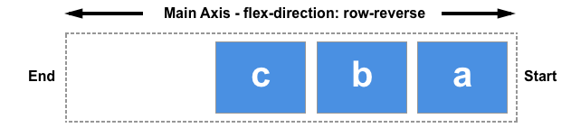

{{CSSRef}}

One of the reasons flexbox is so useful is that it enables proper alignment, including providing a quick method of vertically centering elements. In this guide, we will take a thorough look at how the alignment and justification properties work in flexbox.

Flexbox provides several properties to control alignment and spacing, with `align-items` and `justify-content` being fundamental for centering elements. To center an element, we use the {{cssxref("align-items")}} property to align the item on the {{glossary("cross axis")}}, which in this case is the [block axis](/en-US/docs/Glossary/Flow_relative_values) running vertically. We use {{cssxref("justify-content")}} to align the item on the main axis, which in this case is the inline axis running horizontally.

Change the size of the container or nested element in the code example below. The nested element always remains centered.

{{EmbedGHLiveSample("css-examples/flexbox/alignment/intro.html", '100%', 700)}}

## Properties for controlling alignment in flexbox

The properties we will look at in this guide are as follows.

- {{cssxref("justify-content")}}: Controls the alignment of all items on the main axis.
- {{cssxref("align-items")}}: Controls the alignment of all items on the cross axis.
- {{cssxref("align-self")}}: Controls the alignment of an individual flex item on the cross axis.
- {{cssxref("align-content")}}: Controls the space between flex lines on the cross axis.
- {{cssxref("gap")}}, {{cssxref("column-gap")}}, and {{cssxref("row-gap")}}: Used to create gaps or gutters between flex items.

We will also discover how auto margins can be used for alignment in flexbox.

## Aligning items on the cross axis

The {{cssxref("align-items")}} property, set on the flex container, and the {{cssxref("align-self")}} property, set on flex items, control the alignment of flex items on the cross axis. The cross axis runs down the columns if {{cssxref("flex-direction")}} is `row` and along the rows if `flex-direction` is `column`.

In this basic flex example, we're using cross-axis alignment. When we add `display: flex` to a container, the child items become flex items arranged in a row. By default, they will all stretch to match the height of the tallest item, as that item defines the height of the items on the cross axis. If the flex container has a height set, the items will stretch to that height, regardless of how much content is in each item.

The reason the items become the same height is that the initial value of `align-items`, the property that controls alignment on the cross axis, is set to `stretch`.

We can use other values to control how the items align:

- `align-items: stretch`
- `align-items: flex-start`
- `align-items: flex-end`
- `align-items: start`
- `align-items: end`
- `align-items: center`
- `align-items: baseline`
- `align-items: first baseline`
- `align-items: last baseline`

In the example below, the value of `align-items` is `stretch`. Try the other values and see how the items align against each other in the flex container.

{{EmbedGHLiveSample("css-examples/flexbox/alignment/align-items.html", '100%', 520)}}

### Aligning one item with `align-self`

The `align-items` property sets the `align-self` property on all of the flex items as a group. This means you can explicitly declare the {{cssxref("align-self")}} property to target a single item. The `align-self` property accepts all of the same values as `align-items`, plus a value of `auto`, which resets the value to that defined on the flex container.

In this next live example, the flex container has `align-items: flex-start`, which means the items are all aligned to the start of the cross axis. Using the `first-child` selector, the first item is set to `align-self: stretch`. Another item with the `selected` class has `align-self: center` set. Change the value of `align-items` or change the values of `align-self` on the individual items to see how this works.

{{EmbedGHLiveSample("css-examples/flexbox/alignment/align-self.html", '100%', 650)}}

### Changing the main axis

Thus far, we have looked at alignment behavior when the `flex-direction` defaults to `row` while working in a language written top to bottom, with a horizontal main axis and vertical cross axis.

Keeping the same writing mode, when the `flex-direction` is changed to `column`, the `align-items` and `align-self` properties will align the items to the left and right instead of top and bottom; these properties are still aligning items along the cross axis, but the cross axis is now horizontal!

You can try this out in the example below, which has a flex container with `flex-direction: column` yet otherwise is exactly the same as the previous example.

{{EmbedGHLiveSample("css-examples/flexbox/alignment/align-self-column.html", '100%', 730)}}

## Aligning content on the cross axis with the `align-content` property

So far, we have focused on aligning items or an individual items inside the area defined by a {{glossary("flex_container")}} containing a single line of flex items. When flex items are allowed to wrap across multiple lines, the {{cssxref("align-content")}} property can be used to control the distribution of space between the lines, also known as **packing flex lines**.

For `align-content` to have an effect, the cross axis dimension (the height in this case) of the flex container must be greater than needed to display the items. It then works on all the items as a set. The `align-content` values dictate what happens with the extra available space and the alignment of the entire set of items within it.

The `align-content` property takes the following values:

- `align-content: flex-start`
- `align-content: flex-end`
- `align-content: start`
- `align-content: fend`
- `align-content: center`
- `align-content: space-between`
- `align-content: space-around`
- `align-content: space-evenly`
- `align-content: stretch`
- `align-content: normal` (behaves as `stretch`)
- `align-content: baseline`
- `align-content: first baseline`
- `align-content: last baseline`

In the live example below, the flex container has a height of `400 pixels`, which is more than needed to display our items. The value of `align-content` is `space-between`, which means that the available space is shared out _between_ the flex lines, which are placed flush with the start and end of the container on the cross axis.

Try out the other values to see how the `align-content` property works.

{{EmbedGHLiveSample("css-examples/flexbox/alignment/align-content.html", '100%', 850)}}

Once again we can switch our `flex-direction` to `column` in order to see how this property behaves when we are working by column. As before, we need enough space in the cross axis to have some free space after displaying all of the items.

{{EmbedGHLiveSample("css-examples/flexbox/alignment/align-content-column.html", '100%', 860)}}

## Aligning content on the main axis

Now that we have seen how alignment works on the cross axis, we can take a look at the main axis. Here we only have one property available to us — `justify-content`. This is because we are only dealing with items as a group on the main axis. With `justify-content` we control what happens with available space, should there be more space than is needed to display the items.

In our initial example with `display: flex` on the container, the items display as a row and all line up at the start of the container. This is due to the initial value of `justify-content` being `normal`, which behaves as `start`. Any available space is placed at the end of the items.

The `baseline` values aren't relevant in this dimension. Otherwise, `justify-content` property accepts the same values as `align-content`.

- `justify-content: flex-start`
- `justify-content: flex-end`
- `justify-content: start`
- `justify-content: end`
- `justify-content: left`
- `justify-content: right`
- `justify-content: center`
- `justify-content: space-between`
- `justify-content: space-around`
- `justify-content: space-evenly`
- `justify-content: stretch` (behaves as start)
- `justify-content: normal` (behaves as stretch, which behaves as start)

In the example below, the value of `justify-content` is `space-between`. The available space after displaying the items is distributed between the items. The left and right item line up flush with the start and end.

{{EmbedGHLiveSample("css-examples/flexbox/alignment/justify-content.html", '100%', 480)}}

If the main axis is in the block direction because `flex-direction` is set to `column`, then `justify-content` will distribute space between items in that dimension as long as there is space in the flex container to distribute.

{{EmbedGHLiveSample("css-examples/flexbox/alignment/justify-content-column.html", '100%', 880)}}

### Alignment and writing modes

Remember that with all of these alignment methods, the values of `start` and `end` are writing mode-aware. If the value of `justify-content` is `start` and the writing mode is left-to-right, as in English, the items will align starting at the left side of the container.

However if the writing mode is right-to-left as in Arabic, the items will line up starting at the right side of the container.

The live example below has the `direction` property set to `rtl` to force a right-to-left flow for our items. You can remove this, or change the values of `justify-content` to see how flexbox behaves when the start of the inline direction is on the right.

{{EmbedGHLiveSample("css-examples/flexbox/alignment/justify-content-writing-mode.html", '100%', 440)}}

## Alignment and `flex-direction`

The direction of `start` of the line will also change if you change the `flex-direction` property — for example, using `row-reverse` instead of `row`.

In this next example, `flex-direction: row-reverse` and `justify-content: flex-end` define the direction and location of the items within the flex container. In a left to right language, the items line up on the left. Try changing `flex-direction: row-reverse` to `flex-direction: row`. You will see that the items now move to the right-hand side, and the visual order of the items is reversed.

{{EmbedGHLiveSample("css-examples/flexbox/alignment/justify-content-reverse.html", '100%', 440)}}

While this may all seem a little confusing, the rule to remember is that unless you do something to change it, flex items lay themselves out in the direction that words are laid out in the language of your document along the inline, row axis. `start` and `flex-start` will be where the beginning of a sentence of text would start.

You can switch them to display in the block direction for the language of your document by selecting `flex-direction: column`. Then, `start` and `flex-start` will be where the top of your first paragraph of text would start.

If you change `flex-direction` to one of the reverse values, they will lay themselves out from the end axis and in the reverse order to the way words are written in the language of your document. Then, `start` and `flex-start` will change to the end of that axis — so to the location where your lines would wrap if working in rows, or at the end of your last paragraph of text in the block direction.

## Using auto margins for main axis alignment

We don't have a `justify-items` or `justify-self` property available to us on the main axis as our items are treated as a group on that axis. However it is possible to do some individual alignment in order to separate an item or a group of items from others by using auto margins along with flexbox.

A common pattern is a navigation bar where some key items are aligned to the right, with the main group on the left. You might think that this should be a use case for a `justify-self` property. However, consider the image below. As an example, take the following image with three items on one side and two on the other. If `justify-self` were to work on flex items and was set on item _d_, it would also change the alignment of item _e_ that follows, which may or may not be what is intended.

Instead, the _d_ item can be pushed over using CSS margins.

In this live example, item 4 is separated from the first three items by setting {{cssxref("margin-left")}} to `auto`, which consumes all the space it can in its axis. This is how centering a block with {{cssxref("margin")}} auto left and right works. Each side tries to take as much space as it can, and so the block is pushed into the middle.

In this live example, the flex items are arranged in a row with the basic flex values, and the class `push`, set on the fourth item, applies `margin-left: auto` to that item. Try removing the class on the fourth item or adding the class to a different item to see how it works.

{{EmbedGHLiveSample("css-examples/flexbox/alignment/auto-margins.html", '100%', 470)}}

## Creating gaps between items

To create a gap between flex items, use the {{cssxref("gap")}}, {{cssxref("column-gap")}}, and {{cssxref("row-gap")}} properties. The {{cssxref("column-gap")}} property creates gaps between items in a row. The {{cssxref("row-gap")}} property creates gaps between flex lines when you have {{cssxref("flex-wrap")}} set to `wrap`.

The {{cssxref("gap")}} property is a shorthand that sets both `row-gap` and `column-gap`.
The gap between flex items or between flex line depends on the direction. If the {{cssxref("flex-direction")}} property creates rows, the first value defines the gap between flex lines, and the second value defines the gap between items within each line. With columns (when `flex-direction` is set to `column` or `column-reverse`), the first value defines the gap between flex items, and the second value defines the gaps between flex lines.

{{EmbedGHLiveSample("css-examples/box-alignment/flexbox/gap.html", '100%', 700)}}

## See also

- [CSS box alignment](/en-US/docs/Web/CSS/CSS_box_alignment) module
- [CSS flexible box layout](/en-US/docs/Web/CSS/CSS_flexible_box_layout) module
- [Box alignment in flexbox](/en-US/docs/Web/CSS/CSS_box_alignment/Box_alignment_in_flexbox)
- [Box alignment in grid layout](/en-US/docs/Web/CSS/CSS_box_alignment/Box_alignment_in_grid_layout)
