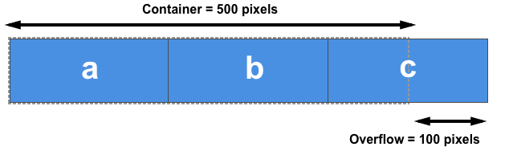

{{CSSRef}}

In this guide we will be exploring the three properties that are applied to flex items, which enable us to control the size and flexibility of the items along the main axis — {{CSSxRef("flex-grow")}}, {{CSSxRef("flex-shrink")}}, and {{CSSxRef("flex-basis")}}. Fully understanding how these properties work with growing and shrinking items is the real key to mastering flexbox.

<h2 id="A_first_look">A first look</h2>

Our three properties control the following aspects of a flex item's flexibility:

<ul>
 <li><code>flex-grow</code>: How much of the positive free space does this item get?</li>
 <li><code>flex-shrink</code>: How much negative free space can be removed from this item?</li>
 <li><code>flex-basis</code>: What is the size of the item before growing and shrinking happens?</li>
</ul>

The properties are usually expressed as the shorthand {{CSSxRef("flex")}} property. The following code would set the <code>flex-grow</code> property to <code>2</code>, <code>flex-shrink</code> to <code>1</code> and <code>flex-basis</code> to <code>auto</code>.

<pre class="brush: css no-line-numbers">.item {
  flex: 2 1 auto;
}</pre>

If you have read the article <a href="/en-US/docs/Web/CSS/CSS_Flexible_Box_Layout/Basic_Concepts_of_Flexbox">Basic Concepts of Flexbox</a>, then you will have already had an introduction to the properties. Here we will explore them in depth in order that you can fully understand what the browser is doing when you use them.

<h2 id="Important_concepts_when_working_on_the_main_axis">Important concepts when working on the main axis</h2>

There are a few concepts worth digging into before looking at how the flex properties work to control ratios along the main axis. These relate to the <em>natural</em> size of flex items before any growing or shrinking takes place, and to the concept of free space.

<h3 id="Flex_item_sizing">Flex item sizing</h3>

In order to work out how much space there is available to lay out flex items, the browser needs to know how big the item is to start with. How is this worked out for items that don’t have a width or a height applied using an absolute length unit?

There is a concept in CSS of {{CSSxRef('width','min-content','#min-content')}} and {{CSSxRef('width','max-content','#max-content')}} — these keywords are <a href="https://drafts.csswg.org/css-sizing-3/#width-height-keywords">defined in the CSS Intrinsic and Extrinsic Sizing Specification</a>, and can be used in place of a <a href="/en-US/docs/Web/CSS/length">length unit</a>.

In the live example below for instance I have two paragraph elements that contain a string of text. The first paragraph has a width of <code>min-content</code>. In a browser that supports this keyword you should be able to see that the text has taken all of the soft wrapping opportunities available to it, becoming as small as it can be without overflowing. This then, is the <code>min-content</code> size of that string. Essentially, the longest word in the string is dictating the size.

The second paragraph has a value of <code>max-content</code> and so it does the opposite. It gets as big as it possibly can be, taking no soft-wrapping opportunities. It would overflow the box it is in if that container was too narrow.

{{EmbedGHLiveSample("css-examples/flexbox/ratios/min-max-content.html", '100%', 750)}}

If your browser does not yet support these keywords both paragraphs will be rendered as normal paragraphs in block flow; the below screenshots show the expected rendering.

Remember this behavior and what effects <code>min-content</code> and <code>max-content</code> have as we explore <code>flex-grow</code> and <code>flex-shrink</code> later in this article.

<h3 id="Positive_and_negative_free_space">Positive and negative free space</h3>

To talk about these properties we need to understand the concept of <strong>positive and negative free space</strong>. When a flex container has positive free space, it has more space than is required to display the flex items inside the container. For example, if I have a 500 pixel-wide container, {{CSSxRef("flex-direction")}} is <code>row</code>, and I have three flex items each 100 pixels wide, then I have 200 pixels of positive free space, which could be distributed between the items if I wanted them to fill the container.

We have negative free space when the natural size of the items adds up to larger than the available space in the flex container. If I have a 500 pixel-wide container like the one above, but the three flex items are each 200 pixels wide, the total space I need will be 600 pixels, so I have 100 pixels of negative free space. This could be removed from the items in order to make them fit the container.

It is this distribution of positive free space and removal of negative free space that we need to understand in order to understand the flex properties.

In the following examples I am working with {{CSSxRef("flex-direction")}} set to row, therefore the size of items will always come from their width. We will be calculating the positive and negative free space created by comparing the total width of all the items with the container width. You could equally try out each example with <code>flex-direction: column</code>. The main axis would then be the column, and you would then need to compare the height of the items and that of the container they are in to work out the positive and negative free space.

<h2 id="The_flex-basis_property">The flex-basis property</h2>

The {{CSSxRef("flex-basis")}} property specifies the initial size of the flex item before any space distribution happens. The initial value for this property is <code>auto</code>. If <code>flex-basis</code> is set to <code>auto</code> then to work out the initial size of the item the browser first checks if the main size of the item has an absolute size set. This would be the case if you had given your item a width of 200 pixels. In that case <code>200px</code> would be the <code>flex-basis</code> for this item.

If your item is instead auto-sized, then <code>auto</code> resolves to the size of its content. At this point your knowledge of <code>min-</code> and <code>max-content</code> sizing becomes useful, as flexbox will take the <code>max-content</code> size of the item as the <code>flex-basis</code>. The following live example can help to demonstrate this.

In this example I have created a series of inflexible boxes, with both <code>flex-grow</code> and <code>flex-shrink</code> set to <code>0</code>. Here we can see how the first item — which has an explicit width of 150 pixels set as the main size — takes a <code>flex-basis</code> of <code>150px</code>, whereas the other two items have no width and so are sized according to their content width.

{{EmbedGHLiveSample("css-examples/flexbox/ratios/flex-basis.html", '100%', 500)}}

In addition to the <code>auto</code> keyword, you can use the <code>content</code> keyword as the <code>flex-basis</code>. This will result in the <code>flex-basis</code> being taken from the content size even if there is a width set on the item. This is a newer keyword and has less browser support, however you can always get the same effect by using <code>auto</code> as the flex-basis and ensuring that your item does not have a width set, in order that it will be auto-sized.

If you want flexbox to completely ignore the size of the item when doing space distribution then set <code>flex-basis</code> to <code>0</code>. This essentially tells flexbox that all the space is up for grabs, and to share it out in proportion. We will see examples of this as we move on to look at <code>flex-grow</code>.

<h2 id="The_flex-grow_property">The flex-grow property</h2>

The {{CSSxRef("flex-grow")}} property specifies the <strong>flex grow factor</strong>, which determines how much the flex item will grow relative to the rest of the flex items in the flex container when the positive free space is distributed.

If all of your items have the same <code>flex-grow</code> factor then space will be distributed evenly between all of them. If this is the situation that you want then typically you would use <code>1</code> as the value, however you could give them all a <code>flex-grow</code> of <code>88</code>, or <code>100</code>, or <code>1.2</code> if you like — it is a ratio. If the factor is the same for all, and there is positive free space in the flex container then it will be distributed equally to all.

<h3 id="Combining_flex-grow_and_flex-basis">Combining <code>flex-grow</code> and <code>flex-basis</code></h3>

Things can get confusing in terms of how <code>flex-grow</code> and <code>flex-basis</code> interact. Let's consider the case of three flex items of differing content lengths and the following <code>flex</code> rules applied to them:

<code>flex: 1 1 auto;</code>

In this case the <code>flex-basis</code> value is <code>auto</code> and the items don’t have a width set, and so are auto-sized. This means that flexbox is looking at the <code>max-content</code> size of the items. After laying the items out we have some positive free space in the flex container, shown in this image as the hatched area:

We are working with a <code>flex-basis</code> equal to the content size so the available space to distribute is subtracted from the total available space (the width of the flex container), and the leftover space is then shared out equally among each item. Our bigger item ends up bigger because it started from a bigger size, even though it has the same amount of spare space assigned to it as the others:

If what you actually want is three equally-sized items, even if they start out at different sizes, you should use this:

<code>flex: 1 1 0;</code>

Here we are saying that the size of the item for the purposes of our space distribution calculation is <code>0</code> — all the space is up for grabs and as all of the items have the same <code>flex-grow</code> factor, they each get an equal amount of space distributed. The end result is three equal width, flexible items.

Try changing the <code>flex-grow</code> factor from 1 to 0 in this live example to see the different behavior:

{{EmbedGHLiveSample("css-examples/flexbox/ratios/flex-grow.html", '100%', 520)}}

<h3 id="Giving_items_different_flex-grow_factors">Giving items different flex-grow factors</h3>

Our understanding of how <code>flex-grow</code> works with <code>flex-basis</code> allows us to have further control over our individual item sizes by assigning items different <code>flex-grow</code> factors. If we keep our <code>flex-basis</code> at <code>0</code> so all of the space can be distributed, we could assign each of the three flex items a different <code>flex-grow</code> factor. In the example below I am using the following values:

<ul>
 <li><code>1</code> for the first item.</li>
 <li><code>1</code> for the second item.</li>
 <li><code>2</code> for the third item.</li>
</ul>

Working from a <code>flex-basis</code> of <code>0</code> this means that the available space is distributed as follows. We need to add up the flex grow factors, then divide the total amount of positive free space in the flex container by that number, which in this case is 4. We then share out the space according to the individual values — the first item gets one part, the second one part, the third two parts. This means that the third item is twice the size of the first and second items.

{{EmbedGHLiveSample("css-examples/flexbox/ratios/flex-grow-ratios.html", '100%', 520)}}

Remember that you can use any positive value here. It is the ratio between one item and the others that matters. You can use large numbers, or decimals — it is up to you. To test that out change the values assigned in the above example to <code>.25</code>, <code>.25</code>, and <code>.50</code> — you should see the same result.

<h2 id="The_flex-shrink_property">The <code>flex-shrink</code> property</h2>

The {{CSSxRef("flex-shrink")}} property specifies the <strong>flex shrink factor</strong>, which determines how much the flex item will shrink relative to the rest of the flex items in the flex container when negative free space is distributed.

This property deals with situations where the browser calculates the <code>flex-basis</code> values of the flex items, and finds that they are too large to fit into the flex container. As long as <code>flex-shrink</code> has a positive value the items will shrink in order that they do not overflow the container.

So where <code>flex-grow</code> deals with adding available space, <code>flex-shrink</code> manages taking away space to make boxes fit into their container without overflowing.

In the next live example I have three items in a flex container; I’ve given each a width of 200 pixels, and the container is 500 pixels wide. With <code>flex-shrink</code> set to <code>0</code> the items are not allowed to shrink and so they overflow the box.

{{EmbedGHLiveSample("css-examples/flexbox/ratios/flex-shrink.html", '100%', 500)}}

Change the <code>flex-shrink</code> value to <code>1</code> and you will see each item shrink by the same amount, in order that all of the items now fit in the box. They have become smaller than their initial width in order to do so.

<h3 id="Combining_flex-shrink_and_flex-basis">Combining <code>flex-shrink</code> and <code>flex-basis</code></h3>

You could say that <code>flex-shrink</code> works in pretty much the same way as <code>flex-grow</code>. However there are two reasons why it isn’t <em>quite</em> the same.

While it is usually subtle, defined in the specification is one reason why <code>flex-shrink</code> isn’t quite the same for negative space as <code>flex-grow</code> is for positive space:

<blockquote>

“Note: The flex shrink factor is multiplied by the flex base size when distributing negative space. This distributes negative space in proportion to how much the item is able to shrink, so that e.g. a small item won’t shrink to zero before a larger item has been noticeably reduced.”

</blockquote>

The second reason is that flexbox prevents small items from shrinking to zero size during this removal of negative free space. The items will be floored at their <code>min-content</code> size — the size that they become if they take advantage of any soft wrapping opportunities available to them.

You can see this <code>min-content</code> flooring happen in the below example, where the <code>flex-basis</code> is resolving to the size of the content. If you change the width on the flex container — increasing it to 700px for example — and then reduce the flex item width, you can see that the first two items will wrap, however they will never become smaller than that <code>min-content</code> size. As the box gets smaller space is then just removed from the third item.

{{EmbedGHLiveSample("css-examples/flexbox/ratios/flex-shrink-min-content.html", '100%', 500)}}

In practice the shrinking behavior does tend to give you reasonable results. You don’t usually want your content to disappear completely or for boxes to get smaller than their minimum content, so the above rules make sense in terms of sensible behavior for content that needs to be shrunk in order to fit into a container.

<h3 id="Giving_items_different_flex-shrink_factors">Giving items different <code>flex-shrink</code> factors</h3>

In the same way as <code>flex-grow</code>, you can give flex-items different <code>flex-shrink</code> factors. This can help change the default behavior if, for example, you want an item to shrink more or less rapidly than its siblings or not shrink at all.

In the following live example the first item has a <code>flex-shrink</code> factor of 1, the second <code>0</code> (so it won’t shrink at all), and the third <code>4</code>. The third item therefore shrinks more rapidly than the first. Play around with the different values — as for <code>flex-grow</code> you can use decimals or larger numbers here. Choose whatever makes most sense to you.

{{EmbedGHLiveSample("css-examples/flexbox/ratios/flex-shrink-ratios.html", '100%', 570)}}

<h2 id="Mastering_sizing_of_flex_items">Mastering sizing of flex items</h2>

The key to really understanding how flex item sizing works is in understanding the number of things that come into play. Consider the following aspects, which we have already discussed in these guides:

<h3 id="What_sets_the_base_size_of_the_item">What sets the base size of the item?</h3>

<ol>
 <li>Is <code>flex-basis</code> set to <code>auto</code>, and does the item have a width set? If so, the size will be based on that width.</li>
 <li>Is <code>flex-basis</code> set to <code>auto</code> or <code>content</code> (in a supporting browser)? If so, the size is based on the item size.</li>
 <li>Is <code>flex-basis</code> a length unit, but not zero? If so this is the size of the item.</li>
 <li>Is <code>flex-basis</code> set to <code>0</code>? if so then the item size is not taken into consideration for the space-sharing calculation.</li>
</ol>

<h3 id="Do_we_have_available_space">Do we have available space?</h3>

Items can’t grow with no positive free space, and they won’t shrink unless there is negative free space.

<ol>
 <li>If we took all of the items and added up their widths (or heights if working in a column), is that total <strong>less</strong> than the total width (or height) of the container? If so, then you have positive free space and <code>flex-grow</code> comes into play.</li>
 <li>If we took all of the items and added up their widths (or heights if working in a column), is that total <strong>more</strong> than the total width (or height) of the container? If so, you have negative free space and <code>flex-shrink</code> comes into play.</li>
</ol>

<h3 id="Other_ways_to_distribute_space">Other ways to distribute space</h3>

If you do not want space added to the items, remember that you can deal with free space between or around items using the alignment properties described in the guide to aligning items in a flex container. The {{CSSxRef("justify-content")}} property will enable the distribution of free space between or around items. You can also use auto margins on flex items to absorb space and create gaps between items.

With all the flex tools at your disposal you will find that most tasks can be achieved, although it might take a little bit of experimentation at first.

