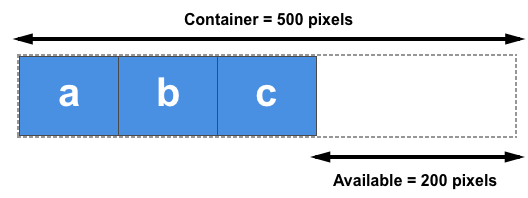
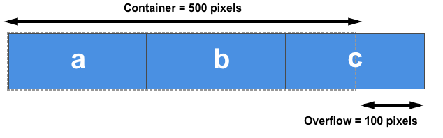

{{CSSRef}}

In this guide, we explore the three properties that control the size and flexibility of flex items along the main axis: {{CSSxRef("flex-grow")}}, {{CSSxRef("flex-shrink")}}, and {{CSSxRef("flex-basis")}}. Fully understanding how these properties work with growing and shrinking items is the key to mastering [CSS flexible box layout](/en-US/docs/Web/CSS/CSS_flexible_box_layout).

## A first look

Our three properties control the following aspects of a flex item's flexibility:

- `flex-grow`: How much of the positive free space does this item get?
- `flex-shrink`: How much negative free space can be removed from this item?
- `flex-basis`: What is the size of the item before growing and shrinking happens?

The properties are usually expressed using the shorthand {{CSSxRef("flex")}} property. The following code would set the `flex-grow` property to `2`, `flex-shrink` to `1` and `flex-basis` to `auto`.

```css
.item {
  flex: 2 1 auto;
}
```

## Important concepts when working on the main axis

To understand the `flex` properties, it is helpful to know the _natural size_ of flex items before any growing or shrinking takes place. Additionally, it is important to understand the concept of _free space_, which is the difference between the combined natural size of all the flex items along the main axis and the size of the main axis itself.

### Flex item sizing

To determine how much space is available to lay out flex items, the browser needs to know how big the item is to start with. How is this calculated for items that don't have a width or a height applied using an absolute length unit?

In CSS, the {{CSSxRef("min-content")}} and {{CSSxRef("max-content")}} keywords can be used in place of a {{cssxref("length")}} unit. Generally, `min-content` is the smallest size an element can be while still fitting the longest word, and `max-content` is the size the element would need to be to fit all the content without wrapping.

The example below contains two paragraph elements with different strings of text. The first paragraph has a width of `min-content`. Notice that the text has used all of the soft wrapping opportunities available to it, becoming as small as possible without overflowing. This is the `min-content` size of that string. Essentially, the longest word in the string is dictating the size.

The second paragraph, with a value of `max-content`, does the opposite. It grows as large as it needs to be to fit the content without taking soft-wrapping opportunities. It will overflow the box it is in if that container is too narrow.

{{EmbedGHLiveSample("css-examples/flexbox/ratios/min-max-content.html", '100%', 750)}}

Remember this behavior and what effects `min-content` and `max-content` have as we explore `flex-grow` and `flex-shrink` later in this article.

### Positive and negative free space

We also need to understand the concept of **positive and negative free space**. When a flex container has _positive free space_, it has more space than required to display the flex items inside the container. For example, a `500px`-wide container, with {{CSSxRef("flex-direction")}} set to `row` and containing three `100px`-wide flex items has `200px` of positive free space. This positive free space can be distributed between the items if filling the container is desired.



A flex container has _negative free space_ when the combined value of the natural sizes of the flex items is larger than the available space in the flex container. If the three flex items in the `500px`-wide container example above are each `200px` wide instead of `100px`, their combined natural width is `600px`, resulting in `100px` of negative free space. This space can be removed from the items to make them fit the container, or the items will overflow.



We need to understand this distribution of positive free space and removal of negative free space to learn about the property components of the `flex` shorthand.

In the following examples, the {{CSSxRef("flex-direction")}} is set to `row`, so the size of items will be determined by their width. We will be calculating the positive and negative free space by comparing the total width of all the items with the container's width. You could also try out each example with `flex-direction: column`. The main axis would then be the column, and you would then compare the height of the items and their container to calculate the positive and negative free space.

## The `flex-basis` property

The {{CSSxRef("flex-basis")}} property specifies the initial size of a flex item before any distribution of the positive or negative free space happens. The initial value for this property is `auto`. This property accepts the same values as the {{cssxref("width")}} and {{cssxref("height")}} properties, and it also accepts the `content` keyword.

If `flex-basis` is set to `auto`, the initial size of the item is the {{cssxref("length-percentage")}} size of the main size, if any was set. For example, if the item has `width: 200px` set, then `200px` would be the `flex-basis` for this item. Percentage values are relative to the flex container's inner main size. If `width: 50%` were set, the `flex-basis` for this item would be half of the container's content-box width. If no such size is set, meaning the item is auto-sized, then `auto` resolves to the size of its content (see the [`min-` and `max-content` sizing](#flex_item_sizing) discussion above), meaning the `flex-basis` is the item's `max-content` size.

This example contains three inflexible flex items, with both `flex-grow` and `flex-shrink` set to `0`. The first item, which has an explicit width of `150px`, takes a `flex-basis` of `150px`, whereas the other two items have no width set and so are sized according to their content width or `max-content`.

{{EmbedGHLiveSample("css-examples/flexbox/ratios/flex-basis.html", '100%', 500)}}

In addition to the `auto` keyword and any other valid {{cssxref("width")}} value, you can use the `content` keyword as the `flex-basis`. This results in the `flex-basis` being based on the content size, even if there is a `width` set on the item. This creates the same effect as removing any width set and using `auto` as the `flex-basis`. While similar to setting `max-content`, the `content` value enables any {{cssxref("aspect-ratio")}} to be calculated based on the cross-axis size.

To completely ignore the size of the flex item during space distribution, set `flex-basis` to `0` and set a non-zero `flex-grow` value. Let's learn `flex-grow` before looking at this value in action.

## The `flex-grow` property

The {{CSSxRef("flex-grow")}} property specifies the **flex grow factor**, which determines how much a flex item will grow relative to the other flex items in the flex container when positive free space is distributed.

If all items have the same `flex-grow` factor, the positive free space will be distributed evenly among them. For this scenario, common practice is to set `flex-grow: 1`, but you could give them any value, such as `88`, `100`, or `1.2`; it is a ratio. If the factor is the same for all the flex items in the container and there is positive free space, that space will be distributed equally.

### Combining `flex-grow` and `flex-basis`

Things can get confusing in terms of how `flex-grow` and `flex-basis` interact. Let's consider the case of three flex items of differing content lengths and the following `flex` rules applied to them:

`flex: 1 1 auto;`

In this case, the `flex-basis` value is `auto` and the items don't have a width set, so they are auto-sized. This means the `flex-basis` used is the `max-content` size of each item. After laying out the items, there is some positive free space in the flex container, which is shown in the image below as the hatched area; the hatched area is the positive free space that will be distributed between the three items based on their `flex-grow` factors:


We are working with a `flex-basis` equal to the content size. This means the available space to distribute is subtracted from the total available space (the width of the flex container), and the remaining space is then shared equally between the three items. The biggest item remains the largest because it started from a bigger size, even though it has the same amount of spare space as the others:


To create three equally-sized items, even if the original elements have different sizes, set the `flex-basis` component to `0`:

`flex: 1 1 0;`

Here, for the purpose of space distribution calculation, we are setting the size of each item to `0`. This means all the space is available for distribution. Since all the items have the same `flex-grow` factor, they each get an equal amount of space. This results in three equal-width flex items.

Try changing the `flex-grow` factor from 1 to 0 in this live example to see the different behavior:

{{EmbedGHLiveSample("css-examples/flexbox/ratios/flex-grow.html", '100%', 520)}}

### Giving items different flex-grow factors

Using `flex-grow` and `flex-basis` together enables us to control individual item sizes by setting different `flex-grow` factors. If we keep the `flex-basis` at `0` so that all the space can be distributed, we can create differently sized flex items by assigning each item a different `flex-grow` factor.

In the example below, we use `1` as the `flex-grow` factor for the first two items and double it to `2` for the third item. With `flex-basis: 0` set on all the items, the available space is distributed as follows:

1. The `flex-grow` factor values of all the sibling flex items are added together (the total is 4 in this case).
2. The positive free space in the flex container is divided by this total value.
3. The free space is distributed according to the individual values. In this case, the first item gets one part, the second one part, and the third two parts. This means that the third item is twice the size of the first and second items.

{{EmbedGHLiveSample("css-examples/flexbox/ratios/flex-grow-ratios.html", '100%', 520)}}

Remember that you can use any positive value here. It is the ratio between the items that matters. You can use large numbers or decimals; it's up to you. To test this, change the `flex-grow` values in the above example to `.25`, `.25`, and `.50`. You should see the same result.

## The `flex-shrink` property

The {{CSSxRef("flex-shrink")}} property specifies the **flex shrink factor**, which determines how much the flex item will shrink relative to the rest of the flex items in the flex container when negative free space is distributed.

This property deals with situations where the combined `flex-basis` value of the flex items is too large to fit in the flex container and would otherwise overflow. As long as an item's `flex-shrink` is a positive value, the item will shrink to not overflow the container.

While `flex-grow` is used to add available space to items that can grow, `flex-shrink` is used to remove space to ensure items fit in their container without overflowing.

In this example, there are three `200px`-wide flex items in a `500px`-wide container. With `flex-shrink` set to `0`, the items are not allowed to shrink, causing them to overflow the container.

{{EmbedGHLiveSample("css-examples/flexbox/ratios/flex-shrink.html", '100%', 500)}}

Change the `flex-shrink` value to `1`; each item will shrink by the same amount, fitting all the items into the container. The negative free space has been proportionally removed from each item, making each flex item smaller than its initial width.

### Combining `flex-shrink` and `flex-basis`

It may appear that `flex-shrink` works in the same way as `flex-grow`, by shrinking rather than growing elements. However, there are some important differences to note.

The concept of [flex base size](#what_determines_the_base_size_of_an_item) affects how negative space is distributed across flex items. The flex shrink factor is multiplied by the flex base size when distributing negative space. This distributes negative space in proportion to how much the item is able to shrink. So, for example, a small item won't shrink to zero before a larger item has been noticeably reduced.

Small items will not shrink to less than their `min-content` size, which is the smallest size the element can be if it used all the available soft wrapping opportunities.

This example demonstrates `min-content` flooring, with the `flex-basis` resolving to the size of the content. If you change the width on the flex container, such as increasing it to `700px`, and then reduce the flex item width, you can see that the first two items will wrap. However, they will never become smaller than their `min-content` size. When the container gets small, the space is only removed from the third item when shrunken further.

{{EmbedGHLiveSample("css-examples/flexbox/ratios/flex-shrink-min-content.html", '100%', 500)}}

In practice, this shrinking behavior provides reasonable results. It prevents content from disappearing completely and from becoming smaller than its minimum content size. The above rules are sensible for content that needs to shrink to fit its container.

### Giving items different `flex-shrink` factors

In the same way as `flex-grow`, you can give flex items different `flex-shrink` factors. This can help change the default behavior if, for example, you want an item to shrink more or less rapidly than its siblings or to not shrink at all.

In this example, the first item has a `flex-shrink` factor of `1`, the second item `0` (so it won't shrink at all), and the third item `4`, making a total of `5` shrink factors. The third item, therefore, shrinks approximately four times more rapidly than the first, but neither will shrink below their `min-content` width. Play around with the different values: as with `flex-grow`, you can use decimals or larger numbers here as well.

{{EmbedGHLiveSample("css-examples/flexbox/ratios/flex-shrink-ratios.html", '100%', 570)}}

## Mastering sizing of flex items

To understand how flex item sizing works, you need to consider the factors below, which we've discussed in these guides:

### What determines the base size of an item?

- Is `flex-basis` set to `auto`, and does the item have a width set? If so, the size will be based on that width.
- Is `flex-basis` set to `auto`, but the item doesn't have a width set? If so, the size will be based on the item's content size.
- Is `flex-basis` a length or a percentage, but not zero? If so, this will be the size of the item (floored at `min-content`).
- Is `flex-basis` set to `0`? If so, the item's size will not be taken into consideration for the space-sharing calculation.

### Is there available space?

Items can grow only if there is positive free space, and they won't shrink unless there is negative free space.

- If we add up the widths of all the items (or heights if working in a column), is that total **less** than the total width (or height) of the container? If so, there will be positive free space, and `flex-grow` will come into play.
- If we add up the widths of all the items (or heights if working in a column), is that total **more** than the total width (or height) of the container? If so, there will be negative free space, and `flex-shrink` will come into play.

### What are the other ways to distribute space?

If you do not want space added to the items, remember that you can manage free space between or around items using the alignment properties described in the guide for aligning items in a flex container. The {{CSSxRef("justify-content")}} property will enable the distribution of free space between or around items. You can also use auto margins on flex items to absorb space and create gaps between items.

With all these flex properties available to you, you will find that most layout tasks are possible, although it might take a little bit of experimentation at first.
