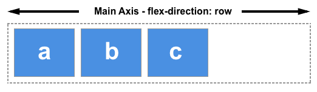
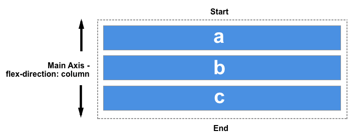
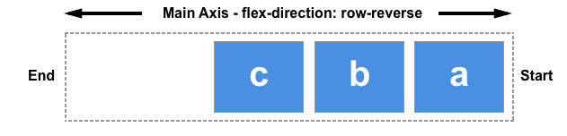
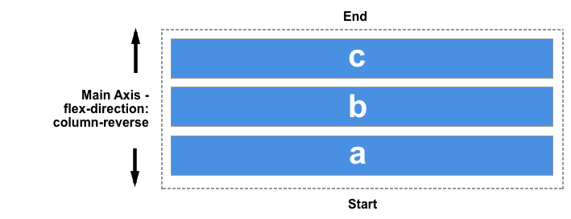
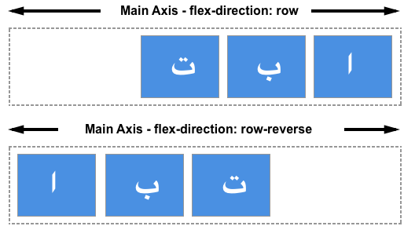
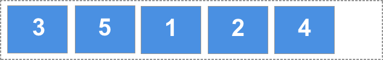
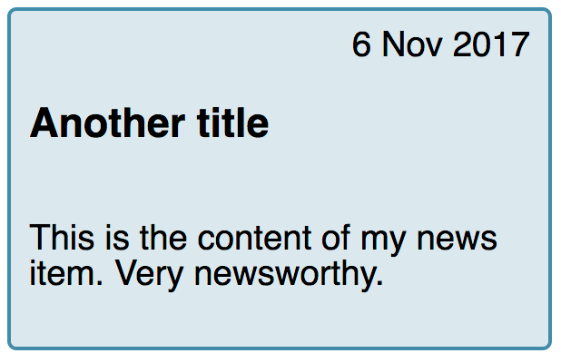

{{CSSRef}}

New layout methods such as Flexbox and Grid bring with them the possibility of controlling the order of content. In this article, we will take a look at ways in which you can change the visual order of your content when using Flexbox. We will also consider the implications of reordering items from an accessibility point of view.

## Reverse the display of the items

the {{cssxref("flex-direction")}} property can take one of four values:

- `row`
- `column`
- `row-reverse`
- `column-reverse`

The first two values keep the items in the same order that they appear in the document source order and display them sequentially from the start line.

The second two values reverse the items by switching the start and end lines.

Remember that the start line relates to writing modes. The row-related examples above demonstrate how `row` and `row-reverse` work in a left-to-right language such as English. If you are working in a right-to-left language like Arabic then `row` would start on the right, `row-reverse` on the left.

This can seem like a neat way to display things in reverse order however you should be mindful that the items are only _visually_ displayed in reverse order. The specification says the following on this matter:

> "Note: The reordering capabilities of flex layout intentionally affect only the visual rendering, leaving speech order and navigation based on the source order. This allows authors to manipulate the visual presentation while leaving the source order intact for non-CSS UAs and for linear models such as speech and sequential navigation." - [Ordering and Orientation](https://www.w3.org/TR/css-flexbox-1/#flow-order)

If your items were links or some other element that the user could tab to, then the tabbing order would be the order that these items appear in the document source — not your visual order.

If you are using a reverse value, or otherwise reordering your items, you should consider whether you actually need to change the logical order in the source. The specification continues with a warning not to use reordering to fix issues in your source:

> "Authors _must not_ use order or the \*-reverse values of flex-flow/flex-direction as a substitute for correct source ordering, as that can ruin the accessibility of the document."

> **Note:** For some years Firefox had a bug whereby it would attempt to follow the visual order and not the source order, making it behave differently from other browsers. This has now been fixed. You should always take the source order as the logical order of the document as all up-to-date user agents will be following the specification and doing so.

In the live example below I have added a focus style in order that as you tab from link to link you can see which is highlighted. If you change the order using `flex-direction` you can see how the tab order continues to follow the order that the items are listed in the source.

{{EmbedGHLiveSample("css-examples/flexbox/order/flex-direction.html", '100%', 440)}}

In the same way that changing the value of `flex-direction` does not change the order in which items are navigated to, changing this value does not change paint order. It is a visual reversal of the items only.

## The order property

In addition to reversing the order in which flex items are visually displayed, you can target individual items and change where they appear in the visual order with the {{cssxref("order")}} property.

The `order` property is designed to lay the items out in _ordinal groups_. What this means is that items are assigned an integer that represents their group. The items are then placed in the visual order according to that integer, lowest values first. If more than one item has the same integer value, then within that group the items are laid out as per source order.

As an example, I have 5 flex items, and assign `order` values as follows:

- Source item 1: `order: 2`
- Source item 2: `order: 3`
- Source item 3: `order: 1`
- Source item 4: `order: 3`
- Source item 5: `order: 1`

These items would be displayed on the page in the following order:

- Source item 3: `order: 1`
- Source item 5: `order: 1`
- Source item 1: `order: 2`
- Source item 2: `order: 3`
- Source item 4: `order: 3`

You can play around with the values in this live example below and see how that changes the order. Also, try changing `flex-direction` to `row-reverse` and see what happens — the start line is switched so the ordering begins from the opposite side.

{{EmbedGHLiveSample("css-examples/flexbox/order/order.html", '100%', 500)}}

Flex items have a default `order` value of `0`, therefore items with an integer value greater than 0 will be displayed after any items that have not been given an explicit `order` value.

You can also use negative values with `order`, which can be quite useful. If you want to make one item display first and leave the order of all other items unchanged, you can give that item order of `-1`. As this is lower than 0 the item will always be displayed first.

In the live code example below I have items laid out using Flexbox. By changing which item has the class `active` assigned to it in the HTML, you can change which item displays first and therefore becomes full width at the top of the layout, with the other items displaying below it.

{{EmbedGHLiveSample("css-examples/flexbox/order/negative-order.html", '100%', 520)}}

The items are displayed in what is described in the specification as _order-modified document order_. The value of the order property is taken into account before the items are displayed.

Order also changes the paint order of the items; items with a lower value for `order` will be painted first and those with a higher value for `order` painted afterwards.

## The order property and accessibility

Use of the `order` property has exactly the same implications for accessibility as changing the direction with `flex-direction`. Using `order` changes the order in which items are painted, and the order in which they appear visually. It does not change the sequential navigation order of the items. Therefore if a user is tabbing between the items, they could find themselves jumping around your layout in a very confusing way.

By tabbing around any of the live examples on this page, you can see how `order` is potentially creating a strange experience for anyone not using a pointing device of some kind. To read more about this disconnect of visual order and logical order and some of the potential problems it raises for accessibility, see the following resources.

- [Flexbox and the keyboard navigation disconnect](https://tink.uk/flexbox-the-keyboard-navigation-disconnect/)
- [HTML Source Order vs CSS Display Order](https://adrianroselli.com/2015/10/html-source-order-vs-css-display-order.html)
- [The Responsive Order Conflict for Keyboard Focus](https://alastairc.uk/2017/06/the-responsive-order-conflict/)

## Use cases for order

There are sometimes places where the fact that the logical and therefore reading order of flex items is separate from the visual order, is helpful. Used carefully the `order` property can allow for some useful common patterns to be easily implemented.

You might have a design, perhaps a card that will display a news item. The heading of the news item is the key thing to highlight and would be the element that a user might jump to if they were tabbing between headings to find the content they wanted to read. The card also has a date; the finished design we want to create is something like this.

Visually the date appears above the heading, in the source. However, if the card was read out by a screen reader I would prefer that the title was announced first and then the publication date. We can make this so using the `order` property.

The card is going to be our flex container, with `flex-direction` set to column. I then give the date an `order` of `-1`. This pulls it up above the heading.

{{EmbedGHLiveSample("css-examples/flexbox/order/usecase-order.html", '100%', 730)}}

These small tweaks are the sort of cases where the `order` property makes sense. Keep the logical order as the reading and tab order of the document, and maintain that in the most accessible and structured fashion. Then use `order` for purely visual design tweaks. When doing so take care that you are not reordering items that could be accessed by the keyboard as a user is tabbing around. Especially when using newer layout methods you should ensure that your browser testing includes testing the site using only a keyboard, rather than a mouse or a touchscreen. You will quickly see if your development choices make getting around the content difficult.
